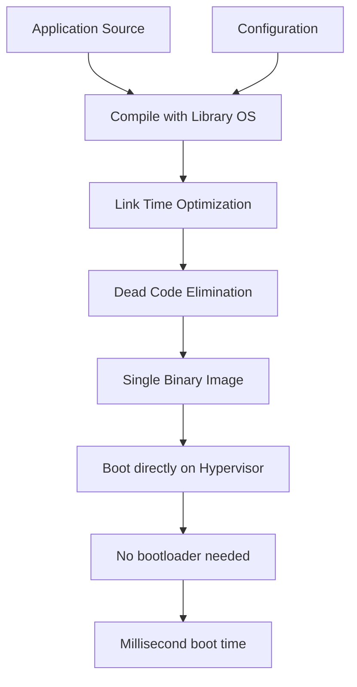

# Unikernel Architecture - Single-Address-Space OS & Library OS

## 1. Mục tiêu của Task

Hiểu sâu bản chất Unikernel - kiến trúc hệ điều hành "một không gian địa chỉ duy nhất" (single-address-space), khác biệt căn bản so với container và microVM, các trade-off quan trọng trong production, và khi nào nên (hoặc không nên) áp dụng.

---

## 2. Bản chất và Cơ chế Hoạt động

### 2.1. Unikernel là gì?

Unikernel là **ứng dụng được biên dịch cùng với kernel** thành một image duy nhất, chạy trực tiếp trên hypervisor mà không cần hệ điều hành trung gian.

```
┌─────────────────────────────────────────────────────────────────┐
│                    TRADITIONAL STACK                            │
├─────────────────────────────────────────────────────────────────┤
│  Application → Runtime → OS Kernel → Hypervisor → Hardware      │
│  (User space)   (Ring 3)   (Ring 0)   (Ring -1)                  │
└─────────────────────────────────────────────────────────────────┘

┌─────────────────────────────────────────────────────────────────┐
│                    UNIKERNEL STACK                              │\n├─────────────────────────────────────────────────────────────────┤
│  Application + Library OS → Hypervisor → Hardware               │
│  (Single Ring)              (Ring -1)                           │
└─────────────────────────────────────────────────────────────────┘
```

### 2.2. Cơ chế Single-Address-Space

**Bản chất vật lý:**
- Không có phân biệt **kernel space** vs **user space**
- Một không gian địa chỉ duy nhất chứa cả ứng dụng và các thư viện OS
- Không có context switch giữa user mode và kernel mode
- Không cần system call interface (int 0x80, syscall, sysenter)

**Ý nghĩa hiệu năng:**
| Thao tác | Traditional OS | Unikernel | Tiết kiệm |
|----------|----------------|-----------|-----------|
| System call | ~100-300ns | 0ns (function call) | 100% |
| Context switch | ~1-3μs | Không có | 100% |
| TLB miss | Thường xuyên | Ít hơn | ~30-50% |
| Memory footprint | GBs | MBs | 90-99% |

### 2.3. Library OS Pattern

**Cách tiếp cận:**
- Chỉ include các thành phần OS **thực sự cần thiết** cho ứng dụng
- Mỗi unikernel chỉ chứa: network stack (nếu cần), filesystem driver (nếu cần), scheduler tối thiểu
- **Link-time dead code elimination** tự động loại bỏ code không dùng

```
Traditional Linux Kernel:           Unikernel Library OS:
├─ 30M+ lines of code               ├─ Ứng dụng Java/Go/Rust
├─ Cần thiết + Không cần            ├─ + Network stack (lwIP/mTCP)
├─ Drivers cho mọi hardware         ├─ + Memory allocator
└─ Subsystems đa năng               └─ + Thread scheduler (tùy chọn)
                                     = 50K-500K lines
```

### 2.4. Các loại Unikernel

| Loại | Đặc điểm | Ví dụ |
|------|----------|-------|
| **Clean-slate** | Viết từ đầu, language-specific | MirageOS (OCaml), IncludeOS (C++) |
| **POSIX-compatible** | Hỗ trợ ứng dụng existing | Rumprun, OSv |
| **Language-specific** | Tích hợp sâu với runtime | HermitCore (Rust), LING (Erlang) |

---

## 3. Kiến trúc & Luồng Xử lý

### 3.1. Build & Boot Process



**Boot time comparison:**
- Linux VM: 10-30 giây
- Container: 100-500ms
- Unikernel: **5-50ms**

### 3.2. Memory Model

**Kiến trúc phẳng (Flat Memory):**
```
┌─────────────────────────────┐ High Address
│       Stack (grows down)    │
├─────────────────────────────┤
│          Heap               │
├─────────────────────────────┤
│      Application Code       │
├─────────────────────────────┤
│    Library OS Functions     │
├─────────────────────────────┤
│   Device Drivers (linked)   │
├─────────────────────────────┤
│       Boot code             │
└─────────────────────────────┘ Low Address (0x0)
```

**Không có:**
- Page table hierarchy phức tạp
- Copy-on-write
- Memory mapping files qua kernel
- Swap/page fault handling phức tạp

### 3.3. I/O và Networking

**Zero-Copy Networking:**
```
Traditional:
NIC → Driver (kernel) → Socket buffer → Copy to user space → Application

Unikernel:
NIC → Driver (linked) → Direct access → Application
      (shared memory)
```

**Batching và Poll-mode:**
- DPDK-style: Polling thay vì interrupts
- Batching: Xử lý nhiều packets một lần
- Lock-free: Single-threaded hoặc per-core queues

---

## 4. So sánh các Lựa chọn

### 4.1. Unikernel vs Container vs MicroVM

| Tiêu chí | Container | MicroVM (Firecracker) | Unikernel |
|----------|-----------|----------------------|-----------|
| **Boot time** | ~100ms | ~125ms | **~5-20ms** |
| **Memory** | Shared kernel | ~15-20MB | **~1-5MB** |
| **Attack surface** | Large (shared kernel) | Medium | **Minimal** |
| **Portability** | High | Medium | **Low** |
| **Existing apps** | Full compatibility | High compatibility | **Requires port** |
| **Debuggability** | Excellent | Good | **Hard** |
| **Tooling** | Rich ecosystem | Growing | **Limited** |
| **Use case** | General purpose | Serverless/edge | **Specialized** |

### 4.2. Khi nào dùng Unikernel?

**✅ NÊN DÙNG khi:**
- **High-frequency trading**: <1ms latency requirement
- **NFV (Network Function Virtualization)**: 10M+ packets/second
- **IoT/Edge devices**: Extreme resource constraints (MB RAM)
- **Security-critical**: Minimal attack surface quan trọng hơn debuggability
- **Auto-scaling nhanh**: Cần boot 1000 instances trong giây
- **Serverless cold start**: Giảm thủng lĩnh cold start từ 100ms xuống 5ms

**❌ KHÔNG NÊN DÙNG khi:**
- Ứng dụng monolithic legacy không thể refactor
- Cần debugging phức tạp (strace, gdb multi-process)
- Dynamic loading plugins/modules
- Multi-tenancy với resource sharing phức tạp
- Team chưa có expertise low-level systems

### 4.3. Các Unikernel Framework phổ biến

| Framework | Ngôn ngữ | POSIX? | Mục tiêu | Trạng thái |
|-----------|----------|--------|----------|------------|
| **MirageOS** | OCaml | No | Research/security | Active |
| **IncludeOS** | C++ | Partial | Production cloud | Active |
| **Rumprun** | C | Yes | Legacy apps | Maintenance |
| **OSv** | C++ | Partial | Java/Python apps | Active |
| **HermitCore** | Rust | Partial | HPC/Cloud | Active |
| **NanoOS** | Go | No | Cloud-native | Experimental |

---

## 5. Rủi ro, Anti-patterns, Lỗi thường gặp

### 5.1. Security Concerns

**❌ Single-address-space = Double-edged sword:**
- Không có hardware isolation giữa app và OS
- Buffer overflow trong app → compromise entire system
- **Không có ASLR** (Address Space Layout Randomization) hiệu quả
- Không ring protection

> ⚠️ **CRITICAL**: Unikernel security dựa trên **minimal code** và **compile-time safety**, không phải runtime isolation.

### 5.2. Debugging Hell

**Vấn đề:**
- Không có `/proc`, `/sys`
- Không có `dmesg`, `strace`, `tcpdump` truyền thống
- Stack trace khó interpret (optimized builds)
- Không core dump quen thuộc

**Giải pháp:**
- Remote GDB stub (chậm)
- Structured logging ra serial/console
- Dedicated debug builds với symbols
- Tracing từ hypervisor level

### 5.3. Anti-patterns

**❌ Anti-pattern #1: "Unikernel mọi thứ"**
- Không phải thay thế container cho app thông thường
- Chi phí porting cao, ROI không đáng

**❌ Anti-pattern #2: Bỏ qua monitoring**
- Không có node_exporter, cAdvisor
- Phải implement metrics endpoint tự tay
- Không integration sẵn với Prometheus/DataDog

**❌ Anti-pattern #3: Dynamic configuration**
- Unikernel là immutable image
- Config qua environment variables → rebuild
- Giải pháp: Config qua virtio-fs hoặc network

### 5.4. Production Failures

| Lỗi | Nguyên nhân | Phát hiện | Khắc phục |
|-----|-------------|-----------|-----------|
| Memory leak crash | Không có OOM killer | Instance die silently | External health checks |
| Deadlock | Custom scheduler bug | No response | Watchdog timer |
| Network stall | Polling loop issue | Timeout | External orchestrator kill |
| Boot failure | Link-time error | Hypervisor log | CI/CD validation |

---

## 6. Khuyến nghị Thực chiến trong Production

### 6.1. Architecture Pattern

```
┌─────────────────────────────────────────────┐
│           Load Balancer (nginx/envoy)       │
└─────────────────┬───────────────────────────┘
                  │
    ┌─────────────┼─────────────┐
    ▼             ▼             ▼
┌───────┐    ┌───────┐    ┌───────┐
│Uni-A  │    │Uni-B  │    │Uni-C  │  Unikernel Instances
│(app)  │    │(app)  │    │(app)  │  (ephemeral, fast-boot)
└───┬───┘    └───┬───┘    └───┬───┘
    │            │            │
    └────────────┼────────────┘
                 ▼
    ┌─────────────────────────────┐
    │    Shared Services           │
    │    (Redis, DB - containers) │
    └─────────────────────────────┘
```

### 6.2. Deployment Strategy

**Phased rollout:**
1. **Phase 1**: Stateless, read-only services (API gateways, proxies)
2. **Phase 2**: High-throughput data processing (ETL, stream processing)
3. **Phase 3**: Business logic nếu ROI đủ cao

### 6.3. Observability Stack

```
Unikernel                          External
├─ In-app metrics ───────────────→ Prometheus
├─ Structured logs  ─────────────→ Loki/ELK
└─ Health endpoint  ←───────────── Kubernetes checks
      (simple HTTP)
```

**Metrics nên collect:**
- Request latency (p50, p99)
- Throughput (requests/sec)
- Memory usage
- Boot time
- Crash frequency

### 6.4. Tooling & CI/CD

**Build pipeline:**
```yaml
stages:
  - compile: language-specific → object files
  - link: with library OS → unikernel binary
  - package: binary → bootable image (ISO/kernel)
  - test: boot in firecracker/qemu
  - deploy: push to registry
```

**Recommended tools:**
- **UKL** (Unikernel Linux): Hybrid approach cho gradual migration
- **Solo5**: Sandbox ABI cho unikernels
- **Firecracker**: MicroVM hypervisor tối ưu cho unikernel

---

## 7. Kết luận

### Bản chất cốt lõi:

Unikernel là sự **trade-off cực đoan**: đánh đổi **flexibility và debuggability** lấy **hiệu năng và security** ở mức tối đa.

**Đúng khi:**
- Bạn cần millisecond-level boot time
- Bạn cần process millions of requests/core
- Attack surface minimization là critical
- Resource constraints là hard limit (edge/IoT)

**Sai khi:**
- Bạn cần debug phức tạp
- Bạn có legacy codebase lớn
- Team chưa sẵn sàng cho low-level troubleshooting
- Tính năng > hiệu năng

### Tương lai:

Unikernel không thay thế container - chúng **bổ sung** cho use cases cực đoan. Xu hướng "Hybrid Unikernel" (như UKL) cho phép dùng Linux kernel khi cần và unikernel mode khi muốn tối ưu, là hướng đi khả thi nhất cho doanh nghiệp.

> **Chốt lại**: Unikernel là " Formula 1 của backend" - không phải cho mọi người, không phải cho mọi ngày, nhưng khi cần tốc độ tối đa, đó là lựa chọn duy nhất.

---

## 8. Tài liệu Tham khảo (Đọc thêm)

- "Unikernels: Library Operating Systems for the Cloud" (ACM, 2013)
- IncludeOS Documentation: https://www.includeos.org/
- MirageOS: https://mirage.io/
- Solo5 ABI Spec: https://github.com/Solo5/solo5
- "My VM is Lighter (and Safer) than your Container" (USENIX ATC 17)
