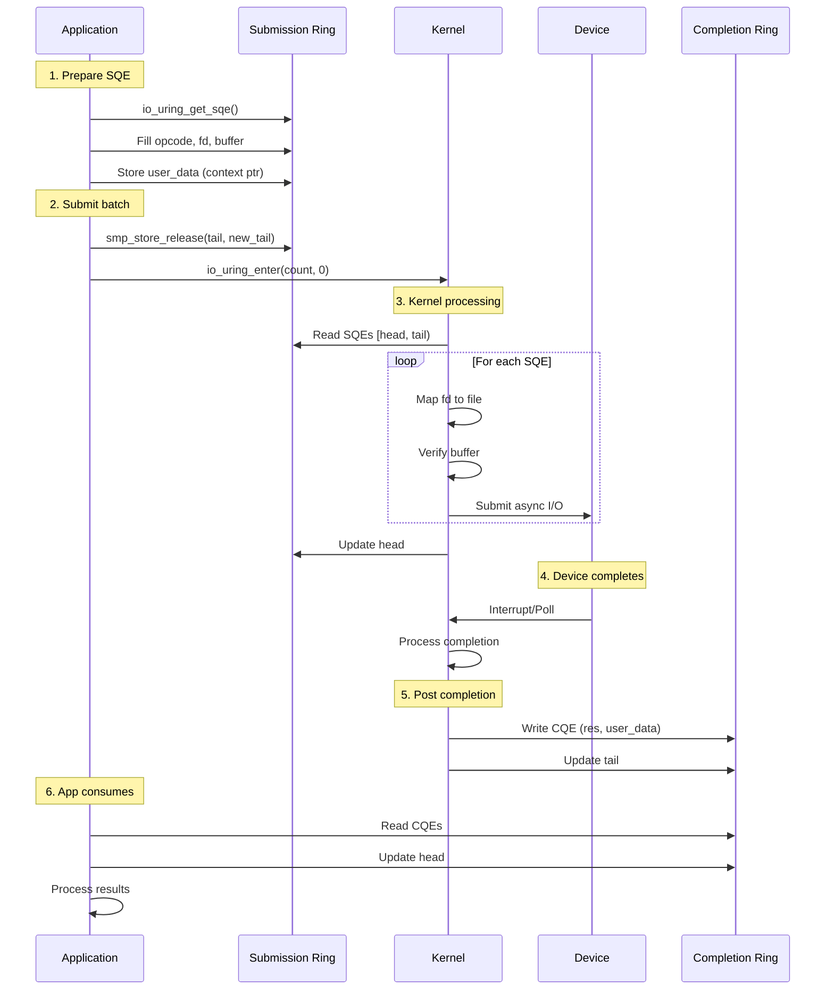

# io_uring & Async I/O Evolution

## 1. Mục tiêu của task

Nghiên cứu bản chất cơ chế io_uring - kiến trúc async I/O thế hệ mới của Linux, phân tích sự khác biệt so với các cơ chế truyền thống (epoll, aio, blocking I/O), và các trade-off khi áp dụng trong production.

---

## 2. Bản chất và cơ chế hoạt động

### 2.1. Vấn đề của các cơ chế I/O truyền thống

#### Blocking I/O (Pre-2000s)
```
┌─────────────┐     ┌─────────────┐     ┌─────────────┐
│  App Code   │────▶│ read/write  │────▶│   Blocked   │
└─────────────┘     └─────────────┘     └─────────────┘
                                              │
                                              ▼
                                       [Context Switch]
                                              │
┌─────────────┐     ┌─────────────┐     ┌─────────────┐
│  Continue   │◀────│ Data Ready  │◀────│   Wake Up   │
└─────────────┘     └─────────────┘     └─────────────┘
```

**Giới hạn chết ngườI:**
- Thread bị block hoàn toàn trong kernel space
- Context switch cost: ~1-2μs (trên modern CPUs)
- Không scalable với connection count cao
- Memory overhead: mỗi thread ~1-8MB stack

#### select/poll/epoll (1990s-2010s)

| Cơ chế | Giới hạn | Use case phù hợp |
|--------|----------|------------------|
| select | FD_SETSIZE (1024), scan O(n) | Legacy compatibility |
| poll | Scan O(n), copy fds mỗi lần | Moderate connections |
| epoll | Chỉ hoạt động với sockets/pipes | Network I/O only |

**Vấn đề cốt lõi của epoll:**
- Chỉ hoạt động với network sockets và pipes
- **KHÔNG hỗ trợ file I/O thông thường** - đây là intentional design limitation
- Giải pháp cho storage I/O: thread pool → lại quay về vấn đề blocking

#### Linux AIO (linux-aio, 2002-2019)

```c
// Interface của linux-aio - cumbersome và hạn chế
struct iocb cb;
io_prep_pread(&cb, fd, buf, count, offset);
io_submit(ctx, 1, &cb);  // Submit work
io_getevents(ctx, 1, 1, &events, &timeout);  // Poll for completion
```

**Các vấn đề nghiêm trọng:**

1. **Chỉ hoạt động với O_DIRECT files** - bypass page cache hoàn toàn
2. **Interface không extensible** - mỗi operation mới đều phức tạp
3. **Vẫn có thể block** - metadata operations (open, stat) vẫn block
4. **Không unified** - phải dùng kết hợp epoll + aio cho network + storage

> *"AIO is a horrible ad-hoc design, with the main excuse being 'other, less gifted people, made that design, and we are implementing it for compatibility because database people — who seldom have any shred of taste — actually use it'."* — Linus Torvalds

### 2.2. io_uring: Thiết kế từ first principles

#### Core Architecture: Shared-Memory Ring Buffers

```
┌─────────────────────────────────────────────────────────────────┐
│                         USER SPACE                              │
│  ┌─────────────────┐                ┌──────────────────────┐   │
│  │ Submission Ring │                │  Completion Ring     │   │
│  │  (SQE Array)    │                │  (CQE Array)         │   │
│  │                 │                │                      │   │
│  │ ┌─────────────┐ │                │ ┌─────────────────┐  │   │
│  │ │ SQE[0]      │ │                │ │ CQE[0]          │  │   │
│  │ │ - opcode    │ │     mmap()     │ │ - result        │  │   │
│  │ │ - fd        │ │◀──────────────▶│ │ - flags         │  │   │
│  │ │ - offset    │ │    SHARED      │ │ - user_data     │  │   │
│  │ │ - addr      │ │    MEMORY      │ └─────────────────┘  │   │
│  │ │ - len       │ │                │                      │   │
│  │ └─────────────┘ │                │ ┌─────────────────┐  │   │
│  │ ┌─────────────┐ │                │ │ CQE[1]          │  │   │
│  │ │ SQE[1]      │ │                │ │ ...             │  │   │
│  │ │ ...         │ │                │ └─────────────────┘  │   │
│  │ └─────────────┘ │                └──────────────────────┘   │
│  │     Tail ───────┼──▶ (atomic increment)                     │
│  │     Head ◀──────┘   (kernel consumes)                       │
│  └─────────────────┘                                           │
└─────────────────────────────────────────────────────────────────┘
                              │
                    ┌─────────┴─────────┐
                    ▼                   ▼
           ┌─────────────────┐  ┌─────────────────┐
           │ io_uring_enter  │  │    KERNEL       │
           │   (syscall)     │  │                 │
           │                 │  │ ┌─────────────┐ │
           │ - Tell kernel   │  │ │ Work Queue  │ │
           │   to process SQ │  │ │             │ │
           │                 │  │ │ Async work  │ │
           │                 │  │ │ execution   │ │
           └─────────────────┘  │ └─────────────┘ │
                                 └─────────────────┘
```

**Bản chất của ring buffer design:**

| Aspect | Traditional syscall | io_uring approach |
|--------|---------------------|-------------------|
| Communication | Kernel boundary crossing | Shared memory (zero-copy) |
| Batchability | 1 syscall = 1 operation | 1 syscall = N operations |
| Consumer model | Pull (ask kernel) | Push (kernel notifies) |
| State tracking | Kernel maintains | Application maintains indices |

#### Submission Queue Entry (SQE) Structure

```c
// Đơn giản hóa từ include/uapi/linux/io_uring.h
struct io_uring_sqe {
    __u8    opcode;         // IORING_OP_READV, IORING_OP_WRITEV, etc.
    __u8    flags;          // IOSQE_FIXED_FILE, IOSQE_IO_LINK, etc.
    __u16   ioprio;         // I/O priority
    __s32   fd;             // File descriptor
    __u64   off;            // Offset (or high bits for 128-bit)
    __u64   addr;           // Buffer address or iovec
    __u32   len;            // Buffer length or iovec count
    union {
        __kernel_rwf_t  rw_flags;
        __u32           fsync_flags;
        __u16           poll_events;
        __u32           sync_range_flags;
        __u32           msg_flags;
    };
    __u64   user_data;      // Opaque data - returned in CQE
    union {
        __u16   buf_index;  // For registered buffers
        __u64   __pad2[3];
    };
};
```

**Ý nghĩa của user_data:**
- Cầu nối stateless giữa submission và completion
- Thường là pointer đến request context hoặc correlation ID
- Kernel không đụng đến - chỉ echo back

#### Completion Queue Entry (CQE)

```c
struct io_uring_cqe {
    __u64   user_data;      // Echo from SQE
    __s32   res;            // Result (bytes read/written, or -errno)
    __u32   flags;          // Completion flags
};
```

### 2.3. Single-Producer-Single-Consumer (SPSC) Semantics

```
                    SUBMISSION RING
    ┌──────────────────────────────────────────┐
    │                                          │
    │   Head (kernel)     Tail (app)           │
    │      │                │                  │
    │      ▼                ▼                  │
    │   ┌────┐  ┌────┐  ┌────┐  ┌────┐        │
    │   │Free│  │Free│  │Used│  │Used│        │
    │   └────┘  └────┘  └────┘  └────┘        │
    │                        ▲                 │
    └────────────────────────┘                 │
         App submits SQEs here                 │
                                             │
    Invariants:                              │
    - Tail never overtakes Head (mod ring size)│
    - Kernel owns [Head, Tail)               │
    - App owns [Tail, Head) in circular sense│
```

**Memory ordering requirements:**
- Tail update: memory barrier (release) before updating
- Head read: memory barrier (acquire) after reading
- Kernel và app có thể operate locklessly nhờ memory barriers

---

## 3. Kiến trúc và luồng xử lý

### 3.1. Operation Lifecycle



### 3.2. Kernel Internals: io_uring workqueue

```
┌──────────────────────────────────────────────────────────────┐
│                      KERNEL SPACE                            │
│                                                              │
│  ┌─────────────┐    ┌─────────────┐    ┌─────────────────┐  │
│  │ io_uring    │───▶│ Request     │───▶│ io-worker       │  │
│  │ syscall     │    │ Queue       │    │ threads (per-CPU)│  │
│  │ handler     │    │ (per-ring)  │    │                 │  │
│  └─────────────┘    └─────────────┘    └────────┬────────┘  │
│        │                                        │           │
│        │        ┌───────────────────────────────┘           │
│        │        ▼                                           │
│        │   ┌─────────────┐    ┌─────────────┐              │
│        └──▶│ Async       │───▶│ Block Layer │              │
│            │ Execution   │    │ (bio queue) │              │
│            └─────────────┘    └──────┬──────┘              │
│                                      │                      │
│                                      ▼                      │
│                               ┌─────────────┐              │
│                               │ Device      │              │
│                               │ Driver      │              │
│                               └─────────────┘              │
└──────────────────────────────────────────────────────────────┘
```

**Two execution modes:**

| Mode | Flag | Behavior | Use case |
|------|------|----------|----------|
| Interrupt-driven | Default | Device interrupts on completion | General purpose |
| Polling | IORING_SETUP_IOPOLL | CPU polls for completion | Ultra-low latency NVMe |

### 3.3. io_uring vs epoll: Architectural comparison

```
epoll model (readiness-based):
┌─────────┐     ┌─────────┐     ┌─────────┐
│ epoll_wait│◀───│ Kernel  │◀───│ FD ready│
└────┬────┘     └─────────┘     └─────────┘
     │
     ▼
┌─────────┐     ┌─────────┐     ┌─────────┐
│ read()  │────▶│ Kernel  │────▶│ Block?  │
└─────────┘     └─────────┘     └─────────┘
                                    │
                    ┌───────────────┴───────┐
                    ▼                       ▼
              [Data in cache]         [Disk/network]
                    │                       │
                    ▼                       ▼
              [Return immediately]      [Block thread]

io_uring model (completion-based):
┌─────────┐     ┌─────────┐     ┌─────────┐
│ Submit  │────▶│ Kernel  │────▶│ Queue   │
│ read    │     │         │     │ work    │
└─────────┘     └─────────┘     └────┬────┘
                                     │
                                     ▼
                              ┌─────────────┐
                              │ Async exec  │
                              │ (never block│
                              │  caller)    │
                              └──────┬──────┘
                                     │
                    ┌────────────────┼────────────────┐
                    ▼                ▼                ▼
              [Completion]    [Completion]      [Completion]
                    │                │                │
                    └────────────────┴────────────────┘
                                     │
                                     ▼
                              ┌─────────────┐
                              │ CQE posted  │
                              │ App polls   │
                              └─────────────┘
```

**Key insight:**
- epoll: "Tell me when FD is ready, then I'll read"
- io_uring: "Read this when you can, tell me when done"

---

## 4. So sánh các lựa chọn

### 4.1. Performance Benchmark (ScyllaDB fio tests)

**Test setup:** NVMe capable of 3.5M IOPS, 8 CPUs, 72 fio jobs, iodepth=8

| Backend | IOPS | Context Switches | vs io_uring |
|---------|------|------------------|-------------|
| sync (blocking) | 814,000 | 27.6M | -42.6% |
| posix-aio (thread pool) | 433,000 | 64.1M | -69.4% |
| linux-aio | 1,322,000 | 10.1M | -6.7% |
| **io_uring (basic)** | **1,417,000** | 11.3M | baseline |
| **io_uring (enhanced)** | **1,486,000** | 11.5M | +4.9% |

**Phân tích:**

1. **posix-aio thảm họa:** Thread pool tạo quá nhiều context switches (64M!), hiệu năng chỉ 30% so với io_uring
2. **linux-aio gần ngang:** Khác biệt chỉ ~7% khi dùng O_DIRECT - chứng minh io_uring không magic, mà là unified
3. **io_uring enhanced:** Buffer/file registration + poll mode tăng thêm 5%

### 4.2. Feature Matrix

| Feature | Blocking | epoll | linux-aio | io_uring |
|---------|----------|-------|-----------|----------|
| Network I/O | ✅ | ✅ | ✅* | ✅ |
| File I/O (cached) | ✅ | ❌ | ❌ | ✅ |
| File I/O (O_DIRECT) | ✅ | ❌ | ✅ | ✅ |
| Batch submissions | ❌ | ❌ | ⚠️ | ✅ |
| Zero syscall completion | ❌ | ❌ | ❌ | ✅ |
| Linked operations | ❌ | ❌ | ❌ | ✅ |
| Async open/close/stat | ❌ | ❌ | ❌ | ✅ |

*linux-aio với epoll integration

### 4.3. Khi nào dùng cái gì?

| Scenario | Recommendation | Lý do |
|----------|----------------|-------|
| Simple file copy | Blocking I/O | Complexity không đáng |
| HTTP server (connections < 1000) | epoll | Mature, đủ tốt |
| HTTP server (connections > 10k) | io_uring | Batch + unified |
| Database (storage engine) | io_uring | O_DIRECT + async metadata |
| Microservice HTTP client | io_uring | Async connect/send/recv |
| File server (NFS/SMB) | io_uring | Async open/read/write/stat |

---

## 5. Rủi ro, anti-patterns, lỗi thường gặp

### 5.1. Completion Ordering

```c
// ANTI-PATTERN: Giả định completions đến theo thứ tự submission
sqe1 = get_sqe();  // Read file A
sqe2 = get_sqe();  // Read file B
submit();

// NGUY HIỂM: CQE của B có thể đến trước A!
cqe = wait_cqe();
// Không thể assume cqe này là của sqe1
```

**Giải pháp:** Luôn dùng `user_data` để correlate:
```c
sqe1->user_data = (uint64_t)request_a;
sqe2->user_data = (uint64_t)request_b;
// In completion handler:
Request *req = (Request *)cqe->user_data;
```

### 5.2. SQPOLL Mode Risk

```c
// IORING_SETUP_SQPOLL: Kernel thread poll submission ring
// NHANH nhưng NGUY HIỂM nếu dùng sai

params.flags = IORING_SETUP_SQPOLL;
io_uring_setup(QUEUE_DEPTH, &params);

// RỦI RO:
// 1. CPU core bị chiếm dụng 100% (busy-wait)
// 2. Nếu app crash: kernel thread vẫn chạy → zombie I/O
// 3. Required CAP_SYS_ADMIN hoặc elevated privileges
```

### 5.3. Buffer Lifetime

```c
// ANTI-PATTERN: Buffer freed before completion
void bad_read(int fd) {
    char buffer[4096];  // Stack buffer!
    
    sqe = io_uring_get_sqe(&ring);
    io_uring_prep_read(sqe, fd, buffer, 4096, 0);
    io_uring_submit(&ring);
    
    // buffer goes out of scope!
    // Kernel writes to freed memory = UB
}
```

**Giải pháp:**
- Registered buffers (pinned memory)
- Pool-based allocation
- Reference counting until CQE received

### 5.4. Ring Size Selection

| Ring Size | Pros | Cons |
|-----------|------|------|
| Small (< 128) | Low memory | Frequent submission syscalls |
| Medium (256-1024) | Balanced | May stall under burst |
| Large (> 4096) | Batch efficiency | Higher memory, latency variance |

**Recommendation:** Bắt đầu với 256-512, tune dựa trên workload.

### 5.5. Error Handling Subtlety

```c
// CQE result interpretation
cqe = get_cqe();
if (cqe->res < 0) {
    // This is -errno from the operation
    // NOT from io_uring itself
    if (cqe->res == -EAGAIN) {
        // File not ready (for non-blocking)
    } else if (cqe->res == -EIO) {
        // Actual I/O error
    }
} else {
    // cqe->res = bytes transferred
    // Check against expected!
    if ((size_t)cqe->res < expected_bytes) {
        // Short read/write - need retry
    }
}
```

---

## 6. Khuyến nghị thực chiến trong production

### 6.1. Java Integration (Project Loom + io_uring)

Java không có native io_uring support cho đến gần đây:

| Approach | Status | Recommendation |
|----------|--------|----------------|
| JNI to liburing | Working | Cần maintain native code |
| Netty io_uring transport | Mature (4.1.50+) | Dùng cho network I/O |
| Project Loom (Virtual Threads) | Java 21+ | Giảm blocking cost, không thay thế io_uring |

**Trade-off khi dùng Java:**
- Netty io_uring transport: Chỉ hỗ trợ network I/O (sockets)
- Storage I/O vẫn qua blocking FileChannel hoặc AsynchronousFileChannel (which uses thread pool)

### 6.2. Monitoring và Observability

```c
// io_uring cung cấp các ring metrics qua io_uring_queue_init_params

struct io_uring_params params;
memset(&params, 0, sizeof(params));
io_uring_queue_init(QUEUE_DEPTH, &ring, IORING_SETUP_CQSIZE);

// Metrics cần theo dõi:
// - sq_entries: Số SQE đã submit
// - cq_entries: Số CQE đã complete  
// - sq_thread_cpu: CPU của SQPOLL thread
// - sq_thread_idle: Idle time của SQ thread
```

**Production metrics:**
- Submission/completion rate (IOPS)
- Queue depth (backlog)
- Batch size distribution
- Error rate by error code
- Latency histogram (submit → completion)

### 6.3. Deployment Considerations

**Kernel version requirements:**

| Kernel | Features Available |
|--------|-------------------|
| 5.1+ | Basic readv/writev |
| 5.4+ | Timeout, poll |
| 5.5+ | Accept, connect, cancel |
| 5.6+ | Open, close, stat, splice |
| 5.10+ | Direct descriptor registration |
| 6.0+ | Multishot accept, recv |

**Resource limits:**
```bash
# io_uring dùng locked memory cho rings
# Default 64KB có thể không đủ
ulimit -l 256  # 256KB locked memory

# Hoặc trong /etc/security/limits.conf
* soft memlock 262144
* hard memlock 262144
```

### 6.4. Security Considerations

| Risk | Mitigation |
|------|------------|
| Resource exhaustion | Set ring size limits, monitor queue depth |
| Denial of service | IORING_SETUP_CQSIZE to bound completions |
| Privilege escalation | Không dùng SQPOLL mode với untrusted code |
| Information leak | Zero-fill buffers trước khi reuse |

---

## 7. Kết luận

### Bản chất cốt lõi

io_uring không chỉ là "async I/O nhanh hơn" - nó là **paradigm shift** trong cách application tương tác với kernel:

1. **From syscall-per-op to batch submission:** Shared memory rings cho phép submit hàng loạt operation mà không cần context switch
2. **From readiness to completion:** Model "submit work, get notification" thay vì "check ready, then do work"
3. **Unified interface:** Một API cho tất cả I/O types (network, storage, timers, signals)

### Trade-off quan trọng nhất

| Pros | Cons |
|------|------|
| Best performance cho high-IOPS | Complexity đáng kể |
| Unified async model | Kernel version dependency |
| Zero syscall completion | Learning curve |
| Extensible (new opcodes) | Debug khó hơn (async) |

### Khi nào KHÔNG nên dùng io_uring

- Applications simple, I/O volume thấp
- Legacy systems với kernel < 5.1
- Cases where blocking model đủ tốt (cron jobs, batch processing)
- Khi team chưa có kinh nghiệm với async programming

### Tương lai

io_uring đang tiến đến **"universal syscall interface"**:
- ~30 opcodes hiện tại, hướng đến 256 limit
- BPF integration để chain operations
- Có thể thay thế hầu hết syscalls trong tương lai

> **Bottom line:** io_uring là công nghệ must-know cho senior backend engineer, đặc biệt khi làm việc với high-performance I/O systems. Không phải silver bullet, nhưng là tool quan trọng trong toolkit.

---

## 8. Tài liệu tham khảo

1. Axboe, J. (2019). *Efficient IO with io_uring*. kernel.dk
2. LWN.net (2020). *The rapid growth of io_uring*
3. ScyllaDB (2020). *How io_uring and eBPF Will Revolutionize Programming in Linux*
4. Hussain, S. *Lord of the io_uring* - unixism.net/loti/
5. Linux kernel source: fs/io_uring.c
