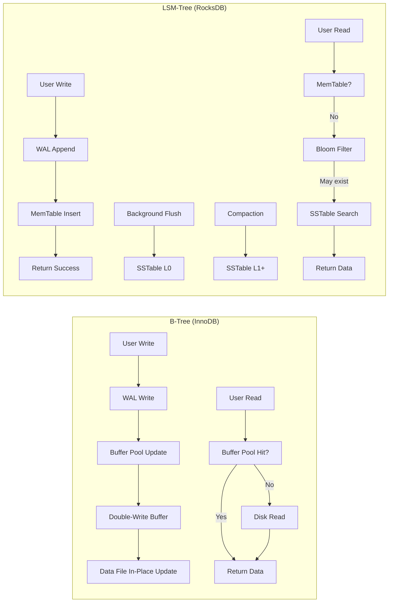

# B-Tree vs LSM-Tree: Storage Engine Internals

## 1. Mục tiêu của task

Hiểu sâu cơ chế hoạt động của hai họ storage engine phổ biến nhất trong database systems: **B-Tree** (dùng trong MySQL InnoDB, PostgreSQL, SQL Server) và **LSM-Tree** (dùng trong RocksDB, Cassandra, ScyllaDB, LevelDB). Phân tích trade-off về write amplification, read amplification, và lựa chọn phù hợp cho từng workload (OLTP vs OLAP).

---

## 2. Bản chất và cơ chế hoạt động

### 2.1 B-Tree: Cấu trúc cân bằng, đọc tối ưu

#### Cấu trúc cơ bản

```
                    [10 | 30 | 50]
                   /     |      \
            [3|7|9]  [20|25]  [40|45]  [60|70|80]
```

**Đặc điểm cốt lõi:**
- **Mỗi node** chứa nhiều keys (order = m, m/2 ≤ keys ≤ m-1)
- **Tất cả leaf nodes** nằm ở cùng độ sâu (perfectly balanced)
- **Leaf nodes** được liên kết thành linked list (B+ Tree) để range scan hiệu quả
- **Fan-out cao**: Với page size 16KB, có thể chứa ~1000 keys/node → tree height chỉ 3-4 levels cho billions of rows

#### Cơ chế ghi (Write Path)

Khi INSERT/UPDATE/DELETE xảy ra:

1. **Tìm leaf node**: O(log N) - duyệt từ root xuống
2. **Cập nhật in-place**: Ghi đè trực tiếp vào page trên disk
3. **Nếu node đầy** (overflow):
   - **Split node** thành 2 nodes
   - **Promote middle key** lên parent
   - **Cascading split** nếu parent cũng đầy

> **Bản chất của B-Tree write:** Mỗi write đều là **random I/O** vì phải đọc page, sửa đổi, ghi lại. Dù chỉ thay đổi 1 byte, vẫn phải ghi lại toàn bộ page (16KB).

#### Write Amplification trong B-Tree

```
Công thức đơn giản:
Write Amplification = (Pages read + Pages written) / User data size

Ví dụ thực tế:
- INSERT 1 row (100 bytes)
- Cần đọc 3 pages để tìm leaf (root → internal → leaf)
- Cần ghi lại 1 page (16KB)
- Write Amplification ≈ 16KB / 100B = 160x
```

**WAL (Write-Ahead Logging) bắt buộc:**
Vì B-Tree sửa đổi in-place trên disk, crash giữa chừng sẽ corrupt data. Do đó mọi thay đổi phải ghi vào WAL trước → thêm 1 lần write nữa.

**Double-Write Buffer (InnoDB):**
Khi page bị partial write do crash, cần backup để recover. InnoDB ghi page mới vào double-write buffer trước, sau đó mới ghi vào data file → thêm 1 lần write nữa.

> **Tổng write amplification thực tế của InnoDB:** ~10-50x tùy workload.

---

### 2.2 LSM-Tree: Ghi tuần tự, merge sau

#### Cấu trúc cơ bản

```
MemTable (in-memory, sorted structure - thường là skip list/red-black tree)
    │
    │ flush khi đầy (thường 4-64MB)
    ▼
Immutable MemTable → SSTable Level 0 (unsorted, overlapping ranges)
                           │
                           │ compaction
                           ▼
SSTable Level 1 (sorted, non-overlapping, size ~10× Level 0)
                           │
                           ▼
SSTable Level 2 (sorted, non-overlapping, size ~10× Level 1)
                           │
                           ▼
                    Level N (larger, older data)
```

**SSTable (Sorted String Table) Structure:**
```
[Data Block] [Data Block] [Data Block] [Index Block] [Bloom Filter] [Footer]
     ↑                                              ↑
     └─ Sorted key-value pairs                     └─ Key range + offset để binary search
```

#### Cơ chế ghi (Write Path)

1. **Ghi vào WAL** (append-only, sequential I/O)
2. **Ghi vào MemTable** (in-memory sorted structure)
3. **Trả về success** cho client ngay lập tức
4. **Background flush**: Khi MemTable đầy → immutable → flush thành SSTable Level 0
5. **Compaction**: Background thread merge SSTables để giảm overlapping

> **Bản chất của LSM-Tree write:** Luôn là **sequential append** - tối ưu cho SSD và HDD. Không cần random read trước khi write.

#### Cơ chế đọc (Read Path)

```
1. Tìm trong MemTable (O(log N) hoặc O(1) nếu hash index)
2. Nếu không có → tìm trong Immutable MemTables
3. Nếu không có → tìm trong SSTables từ Level 0 → Level N
   - Level 0: Linear search qua tất cả files (vì overlapping)
   - Level 1+: Binary search trong index của từng file
4. Trả về kết quả đầu tiên tìm thấy (newest value)
```

**Tối ưu đọc:**
- **Bloom Filter**: Check "có thể có key này không" trước khi đọc file → giảm 90% unnecessary disk reads
- **Block Cache**: Cache frequently accessed blocks
- **Index Block**: Giữ key range + offset trong memory để binary search

#### Write Amplification trong LSM-Tree

```
Công thức đơn giản (Leveled Compaction):
Write Amplification ≈ (T + 1) / (T - 1) × number_of_levels

Với T = 10 (size ratio giữa các levels), 4 levels:
Write Amplification ≈ (11/9) × 4 ≈ 4.9x

Nhưng trong thực tế với update-heavy workload:
- Mỗi key được rewrite nhiều lần qua các levels
- Write Amplification thực tế: 10-30x
```

**Compaction Strategies:**

| Strategy | Đặc điểm | Write Amp | Read Amp | Space Amp |
|----------|----------|-----------|----------|-----------|
| **Leveled** (LevelDB, RocksDB) | Mỗi level có kích thước cố định, merge vào level trên khi đầy | Cao | Thấp | Thấp |
| **Tiered** (Cassandra) | Nhiều files cùng level, merge khi đủ số lượng | Thấp | Cao | Cao |
| **Hybrid** (RocksDB Universal) | Kết hợp cả hai | Trung bình | Trung bình | Trung bình |

---

## 3. Kiến trúc và luồng xử lý

### 3.1 So sánh tổng quan



### 3.2 Bảng so sánh chi tiết

| Khía cạnh | B-Tree | LSM-Tree | Ý nghĩa Production |
|-----------|--------|----------|-------------------|
| **Write Pattern** | Random I/O | Sequential I/O | B-Tree tệ trên HDD, tốt trên SSD có DRAM cache. LSM luôn tốt. |
| **Write Latency** | Thấp, predictable (O(log N)) | Cao hơn, có tail latency do compaction | B-Tree phù hợp latency-sensitive. LSM cần tuning compaction. |
| **Read Latency** | Thấp, predictable (1-4 disk seeks) | Cao hơn, depends on levels | B-Tree tốt cho point lookup. LSM cần bloom filters + caching. |
| **Range Scan** | Rất tốt (sequential leaf scan) | Tốt (merge iterator) | B-Tree vẫn nhỉnh hơn cho large range scans. |
| **Write Amplification** | 10-50× | 10-30× | Tùy workload, LSM có thể tốt hơn với write-heavy. |
| **Read Amplification** | 1× (point lookup) | 1-10× (depends on levels) | LSM đọc nhiều files hơn. |
| **Space Amplification** | 1× (có thể fragmentation) | 1.1-1.5× (do multi-version) | LSM cần extra space cho compaction. |
| **Concurrency** | Row-level locking (phức tạp) | MVCC tự nhiên, optimistic locking | LSM dễ implement MVCC hơn. |
| **Crash Recovery** | Complex (redo/undo log) | Simple (replay WAL) | LSM recovery nhanh hơn. |
| **Update/Delete** | In-place, immediate | Tombstone + asynchronous | LSM delete chỉ là mark, space reclaim sau. |

---

## 4. Trade-off: OLTP vs OLAP

### 4.1 OLTP (Online Transaction Processing)

**Đặc điểm workload:**
- High concurrency (thousands of QPS)
- Small transactions (few rows)
- Read/Write mixed (thường 80/20 hoặc 90/10)
- Point lookups nhiều hơn range scans
- Yêu cầu low latency, predictable performance

**Lựa chọn:**

> **B-Tree là mặc định cho OLTP** vì:
> - Predictable read latency (không bị ảnh hưởng bởi background compaction)
> - Row-level locking hiệu quả
> - Foreign key constraints, secondary indexes tự nhiên
> - MySQL InnoDB, PostgreSQL đều dùng B-Tree

**Khi nào LSM cho OLTP:**
- Write-heavy workload (logging, time-series data)
- Cần high write throughput hơn là read latency
- RocksDB/MyRocks cho MySQL khi write là bottleneck

### 4.2 OLAP (Online Analytical Processing)

**Đặc điểm workload:**
- Large scans (millions-billions rows)
- Complex aggregations
- Append-only hoặc batch updates
- Column-oriented thường tốt hơn row-oriented

**Lựa chọn:**

> **LSM-Tree phù hợp hơn cho OLAP** vì:
> - Sequential scan hiệu quả qua các levels
> - Dễ implement columnar format trên SSTable
> - Time-series data (metrics, logs) rất phù hợp
> - ClickHouse, Druid dùng variants của LSM

**Column Store vs Row Store:**
- **Row Store (B-Tree/LSM)**: Tốt cho point lookups, insert/update
- **Column Store**: Tốt cho analytical queries, compression
- Một số hệ thống hybrid: TiDB (TiFlash columnar), MySQL HeatWave

---

## 5. Rủi ro, Anti-patterns, và Lỗi thường gặp

### 5.1 B-Tree Pitfalls

**1. Page Fragmentation**
```
Vấn đề: Sau nhiều INSERT/DELETE, pages không đầy nữa
Hệ quả: Space wasted, more I/O for same data
Fix: OPTIMIZE TABLE (MySQL), VACUUM (PostgreSQL) - expensive!
```

**2. Write Skew với Secondary Indexes**
```
- Mỗi secondary index là một B-Tree riêng
- INSERT 1 row với 3 secondary indexes = ghi vào 4 B-Trees
- Write amplification nhân lên
```

**3. Hot Row Contention**
```
- Nhiều transactions update cùng row → lock contention
- InnoDB: gap locks, next-key locks phức tạp, dễ deadlock
- Solution: Application-level sharding, queue-based updates
```

**4. Bloom Filter cho B-Tree? Không cần**
```
Anti-pattern: Đừng implement bloom filter cho B-Tree
Lý do: B-Tree đã có exact location, bloom filter chỉ là overhead
```

### 5.2 LSM-Tree Pitfalls

**1. Write Stall / Compaction Stall**
```
Vấn đề: Khi write rate > compaction rate, L0 pile up
Hệ quả: Read phải scan quá nhiều files, latency tăng vọt
RocksDB symptoms: "L0 stall", "pending compaction bytes"
Fix: 
- Tăng compaction threads
- Giảm write rate (backpressure)
- Tune level0_file_num_compaction_trigger
```

**2. Space Amplification bất ngờ**
```
Vấn đề: Delete trong LSM chỉ là tombstone
Hệ quả: Disk usage không giảm ngay, có thể tăng tạm thời
Monitoring: Theo dõi "live data size" vs "total SST size"
Fix: 
- force compaction nếu cần
- TTL cho data tự động expire
```

**3. Read Amplification với Range Scan**
```
Vấn đề: Range scan phải merge iterators từ nhiều levels
Hệ quả: CPU overhead, cache thrashing
Fix:
- Prefix bloom filters
- Partitioned indexes
- Consider B-Tree nếu range scan là primary workload
```

**4. Bloom Filter Configuration**
```
Anti-pattern: Bloom filter bits_per_key quá thấp
Hệ quả: False positive cao → nhiều unnecessary disk reads
Recommendation: 10 bits/key cho 1% false positive
```

**5. Large Values trong LSM**
```
Vấn đề: LSM không tốt cho values > few KB
Hệ quả: Write amplification cao (rewrite large values qua compaction)
Solution: 
- Separate large values (RocksDB's BlobDB, Titan)
- Use file system cho blobs, LSM cho metadata
```

### 5.3 Operational Nightmares

| Vấn đề | B-Tree | LSM-Tree |
|--------|--------|----------|
| **Sudden latency spike** | Buffer pool eviction, lock contention | Compaction burst, L0 stall |
| **Disk space growth** | Table bloat, fragmentation | Uncompacted tombstones, snapshots |
| **Backup consistency** | Requires consistent snapshot | Point-in-time recovery từ WAL |
| **Replication lag** | Binary log replay | WAL shipping thường ổn định hơn |

---

## 6. Khuyến nghị thực chiến trong Production

### 6.1 Khi nào chọn B-Tree

✅ **Chọn B-Tree khi:**
- Workload read-heavy với point lookups
- Cần strong consistency, ACID transactions
- Cần secondary indexes, foreign keys
- Query patterns đa dạng, ad-hoc queries
- Team đã quen với relational databases

**Tuning B-Tree (InnoDB):**
```sql
-- Page size (default 16KB, ít khi cần đổi)
-- Buffer pool size (70-80% RAM)
SET GLOBAL innodb_buffer_pool_size = 8589934592; -- 8GB

-- Change buffering (tối ưu writes)
SET GLOBAL innodb_change_buffering = 'all';

-- Flush behavior
SET GLOBAL innodb_flush_log_at_trx_commit = 2; -- Balance durability/perf
SET GLOBAL innodb_flush_method = O_DIRECT; -- Bypass OS cache
```

### 6.2 Khi nào chọn LSM-Tree

✅ **Chọn LSM-Tree khi:**
- Write-heavy workload (metrics, logs, IoT data)
- Time-series data với chronological writes
- Cần high write throughput
- Có thể chấp nhận eventual consistency cho reads
- Storage là SSD (sequential write friendly)

**Tuning LSM-Tree (RocksDB):**
```cpp
// MemTable size
options.write_buffer_size = 64 * 1024 * 1024; // 64MB
options.max_write_buffer_number = 3;

// Leveling
options.level0_file_num_compaction_trigger = 4;
options.level0_slowdown_writes_trigger = 20;
options.level0_stop_writes_trigger = 36;
options.target_file_size_base = 64 * 1024 * 1024;
options.max_bytes_for_level_base = 512 * 1024 * 1024;

// Compaction threads
options.max_background_compactions = 4;
options.max_background_flushes = 2;

// Bloom filter
table_options.filter_policy.reset(rocksdb::NewBloomFilterPolicy(10));
```

### 6.3 Monitoring Essentials

**B-Tree (InnoDB):**
```sql
-- Buffer pool hit ratio
SHOW STATUS LIKE 'Innodb_buffer_pool_read_requests';
SHOW STATUS LIKE 'Innodb_buffer_pool_reads';
-- Hit ratio = 1 - (reads / read_requests)

-- Lock waits
SHOW STATUS LIKE 'Innodb_row_lock_waits';
SHOW STATUS LIKE 'Innodb_row_lock_time_avg';

-- Checkpoint age (không vượt quá log file size)
SHOW ENGINE INNODB STATUS; -- xem Log sequence number - Last checkpoint
```

**LSM-Tree (RocksDB):**
```cpp
// Statistics
options.statistics = rocksdb::CreateDBStatistics();

// Key metrics via GetProperty:
// "rocksdb.stats" - compaction stats
// "rocksdb.num-files-at-level<N>" - file count per level
// "rocksdb.size-all-levels" - total SST size
// "rocksdb.estimate-pending-compaction-bytes" - compaction pressure
// "rocksdb.mem-table-flush-pending" - flush queue
```

### 6.4 Migration Considerations

**Từ B-Tree sang LSM:**
- Expect higher read latency initially
- Disk space usage pattern khác biệt
- Backup/restore process khác
- May need application changes (eventual consistency)

**MyRocks (MySQL + RocksDB) Migration:**
```sql
-- Không hỗ trợ một số features
-- No foreign keys
-- Limited secondary index types
-- Different replication considerations
```

---

## 7. Kết luận

### Bản chất vấn đề

**B-Tree** và **LSM-Tree** đại diện cho hai triết lý đối lập:

| Triết lý | B-Tree | LSM-Tree |
|----------|--------|----------|
| **Trade-off** | Pay cost on write để read nhanh | Pay cost on read để write nhanh |
| **I/O Pattern** | Random I/O | Sequential I/O |
| **Complexity** | In-tree state management | Out-of-tree merge process |

### Quyết định thiết kế

> **Không có "cái nào tốt hơn" - chỉ có "cái nào phù hợp hơn".**

**Quy tắc thumb:**
- OLTP + Read-heavy + Low latency requirements → **B-Tree**
- Time-series + Write-heavy + Throughput priority → **LSM-Tree**
- Mixed workload → **Hybrid** (TiDB, CockroachDB) hoặc **separate systems** (HTAP)

### Xu hướng hiện đại

**Java 21+ & Modern Databases:**
- **Virtual Threads** giúp hide latency của cả B-Tree và LSM I/O
- **Foreign Function & Memory API** cho zero-copy access đến native storage engines
- **Project Panama** cho tích hợp RocksDB/Java hiệu quả hơn

**Storage Engine Evolution:**
- **RocksDB** v7+ có **ribbon filters** (better than bloom)
- **TerarkDB** (by Bytedance): LSM với compressed indexes
- **Speedb** (RocksDB fork): Better memory management
- **Pebble** (CockroachDB): Go-based LSM, designed for distributed systems

**Hybrids:**
- **MyRocks**: MySQL + RocksDB cho write-heavy OLTP
- **MariaDB ColumnStore**: Columnar trên LSM
- **TiDB**: TiKV (LSM) + TiFlash (columnar) cho HTAP

### Final Thought

Việc hiểu sâu storage engine internals không chỉ giúp chọn database đúng, mà còn giúp:
- Debug performance issues hiệu quả
- Tune đúng chỗ thay vì đoán mò
- Thiết kế schema và query patterns phù hợp với storage engine characteristics
- Dự đoán và tránh operational issues trước khi chúng xảy ra

> **Senior Engineer không phải là người biết nhiều database, mà là người biết tại sao một database hoạt động như vậy và khi nào nên dùng nó.**
