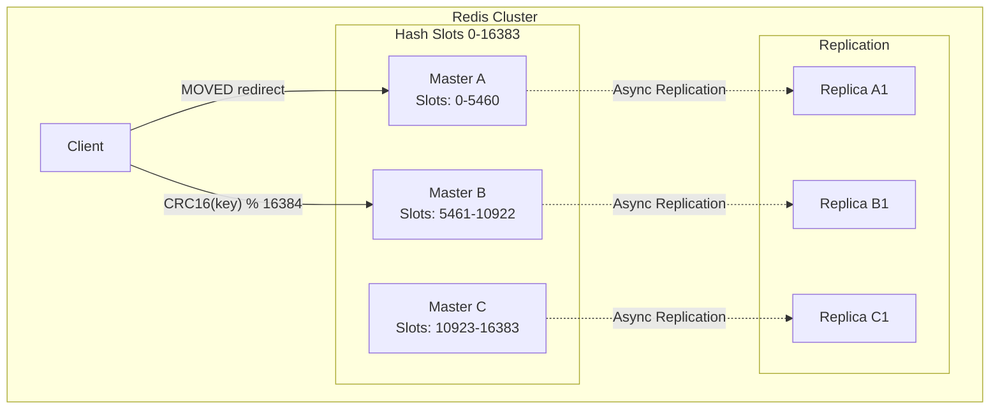
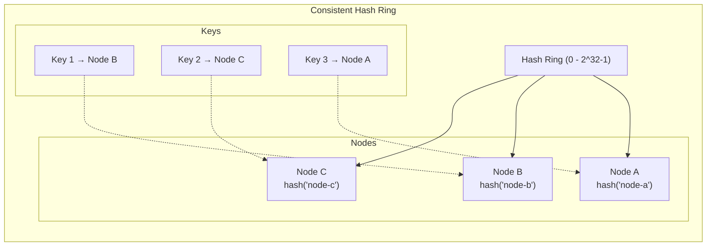

# Distributed Cache: Redis Cluster Internals, Consistent Hashing & Production Realities

> **Bản chất:** Distributed cache là việc phân tán dữ liệu cache qua nhiều node để đạt khả năng scale và availability, nhưng việc này đưa ra bài toán routing, rebalancing, và failure handling ở quy mô lớn.

---

## 1. Mục Tiêu Nghiên Cứu

Hiểu sâu các cơ chế cốt lõi của distributed caching:
- **Redis Cluster Architecture:** Cách Redis tổ chức dữ liệu, routing, failover
- **Consistent Hashing:** Thuật toán phân phối key, giảm thiểu rehashing khi cluster thay đổi
- **Cache Warming:** Chiến lược khởi tạo cache mà không gây stampede
- **Thundering Herd Problem:** Cơ chế phòng tránh cascade failure khi cache miss đồng loạt

Mục tiêu cuối cùng: **Biết khi nào dùng, khi nào không, và làm thế nào để không bị "cache làm sập production".**

---

## 2. Bản Chất Cơ Chế

### 2.1 Redis Cluster Internals

#### Data Sharding Mechanism

Redis Cluster không dùng consistent hashing thuần túy. Thay vào đó, nó sử dụng **hash slots**:

- **16384 hash slots** (0-16383) được chia cho các master nodes
- Mỗi key được ánh xạ vào một slot: `slot = CRC16(key) % 16384`
- Các master nodes "sở hữu" một phạm vi slots cụ thể
- Khi cluster thay đổi (add/remove node), chỉ có slots bị ảnh hưởng cần migrate



#### Request Routing Flow

1. **Client-side hashing:** Client biết slot-to-node mapping (có được qua `CLUSTER SLOTS` hoặc `CLUSTER NODES`)
2. **Direct routing:** Client tính slot, gửi request đến đúng node sở hữu slot đó
3. **MOVED redirect:** Nếu slot đã migrate, server trả về `-MOVED slot endpoint`, client cập nhật mapping
4. **ASK redirect:** Trong quá trình migration, dùng `-ASK` cho slot đang chuyển đổi

> **Quan trọng:** Redis Cluster không hỗ trợ multi-key operations cross-slot (không thể `MGET key1 key2` nếu 2 key ở 2 slot khác nhau). Đây là giới hạn thiết kế cốt lõi.

#### Failover & High Availability

- **Node Failure Detection:** Cluster nodes gửi `PING/PONG` với tần suất configurable
- **PFAIL (Probably Fail):** Node không phản hồi trong `cluster-node-timeout`
- **FAIL:** Đa số master nodes xác nhận PFAIL → promote replica
- **Replica Promotion:** Replica với offset replication lớn nhất được bầu làm master mới

**Trade-off:** 
- Async replication → có thể mất data trong failover (split-brain trong cluster)
- Minimum 3 masters để đạt quorum → cluster nhỏ tốn tài nguyên

---

### 2.2 Consistent Hashing: Từ Lý Thuyết Đến Thực Tiễn

#### Vấn Đề Cổ Điển: Modular Hashing

```
Node = hash(key) % N
```

Khi N thay đổi → **(N-1)/N** keys cần remap → cache miss massive → DB overload.

#### Giải Pháp: Consistent Hashing

**Cơ chế:**
- Hash space hình thành vòng tròn (0 → 2^32-1 → 0)
- Cả keys và nodes đều map vào vòng tròn này
- Key được ánh xạ đến node **đầu tiên theo chiều kim đồng hồ**



**Đặc tính cốt lõi:**
- Thêm/Xóa 1 node → chỉ **1/N** keys bị remap (xác suất)
- Monotonicity: Khi thêm node, chỉ có keys từ node mới bị chuyển, không keys nào chuyển giữa các node cũ

#### Virtual Nodes (Replicas)

**Vấn đề:** Data không đều khi số node nhỏ → "hot spots"

**Giải pháp:** Mỗi physical node có **K virtual nodes** trên vòng

| Virtual Nodes | Load Distribution | Memory Overhead |
|---------------|-------------------|-----------------|
| 100/node | ±10% variance | High metadata |
| 150/node | ±5% variance | Medium |
| 256/node | ±3% variance | Higher |

```
Physical Node A → Virtual: A-1, A-2, A-3, ..., A-K
```

**Trade-off:** 
- Nhiều virtual nodes → phân phối đều hơn nhưng tăng metadata routing table
- Ít virtual nodes → dễ bị unbalanced load

#### Implementation Thực Tế

Redis Cluster **không dùng consistent hashing** mà dùng **hash slots** vì:

| Consistent Hashing | Hash Slots |
|-------------------|------------|
| Migration phức tạp, partial key range | Migration đơn giản theo slot |
| Khó track progress | Slot-level tracking dễ dàng |
| Rebalancing tự động khó kiểm soát | Manual/automatic migration có thể predict |

Tuy nhiên, các client libraries (Jedis, Lettuce, Redisson) cho Redis Standalone thường implement consistent hashing.

---

### 2.3 Cache Warming: Không Để Cache "Lạnh"

#### Vấn Đề

Cache cold start sau deploy, restart, hoặc expiry hàng loạt → **spike DB load** → service degradation.

#### Chiến Lược Warming

**1. Pre-computation Warming**
```
Pre-deploy:
  1. Query top-N hot keys từ analytics
  2. Pre-populate cache trước khi switch traffic
  3. Verify hit rate > threshold trước go-live
```

**2. Lazy Warming với Protection**
- Cache miss → query DB → populate cache **only if** system load < threshold
- Dùng circuit breaker: nếu DB load cao → return stale data hoặc default

**3. Background Warming Thread**
- Dedicated thread/process chạy song song
- Lấy keys từ DB theo batch → populate cache
- Không block user-facing requests

**4. Dual-Write Strategy**
```
Write Path:
  1. Write to DB (transaction)
  2. Async write to cache (best-effort)
  3. Mark as "warm" in metadata

Read Path:
  1. Check cache
  2. Miss → check "warm list"
  3. If in warm list but cache miss → prioritize loading
```

> **Anti-pattern:** Warming bằng cách gửi request giả lập user để populate cache → tạo fake traffic, không kiểm soát được.

---

### 2.4 Thundering Herd Problem

#### Cơ Chế Gây Ra

```
T1: Cache expires
T2: 1000 requests đến đồng thời
T3: Tất cả đều cache miss
T4: Cả 1000 request query cùng 1 DB row
T5: DB overload → cascade failure
```

#### Giải Pháp

**1. Lock/Lease-Based Deduplication (Mutex)**

```
Algorithm:
  1. Cache miss → try acquire lock("compute:key")
  2. If acquired:
       - Query DB
       - Populate cache
       - Release lock
       - Return data
  3. If not acquired (another thread đang compute):
       - Wait (backoff/retry)
       - Check cache again
       - Timeout → return default/error
```

**Trade-off:** Lock contention → latency tăng, nhưng DB được bảo vệ.

**2. Stale-While-Revalidate**

```
TTL Design:
  - Soft TTL: 5 minutes (data có thể stale)
  - Hard TTL: 10 minutes (data phải được refresh)

Logic:
  - Soft TTL expired → return stale data + trigger async refresh
  - Hard TTL expired → synchronous refresh (có mutex)
```

**3. Probabilistic Early Expiration**

```
Java implementation concept:
  ttl_remaining = expire_time - now()
  jitter = random(0, ttl_remaining * beta)  // beta = 0.1 typically
  
  if (ttl_remaining < jitter):
      // 10% chance to refresh before actual expiry
      trigger_async_refresh()
```

Phân tán thời điểm refresh → không có spike đồng thời.

**4. Singleflight Pattern (Request Coalescing)**

```
Concept:
  - Cùng 1 key, cùng 1 thời điểm → chỉ 1 request đến DB
  - Các request khác wait cho kết quả

Go's singleflight package là implementation reference.
  
Java equivalent: Caffeine's AsyncCacheLoader với coalescing
```

---

## 3. So Sánh Kiến Trúc & Lựa Chọn

### Redis Cluster vs Redis Sentinel vs Redis Standalone

| Aspect | Standalone | Sentinel | Cluster |
|--------|-----------|----------|---------|
| **Data Size** | < RAM 1 node | < RAM 1 node | > RAM 1 node |
| **Write Throughput** | Single node limit | Single node limit | Scale horizontally |
| **Memory Limit** | Hardware limit | Hardware limit | 16384 slots → multiple masters |
| **Failover** | Manual | Automatic | Automatic + resharding |
| **Complexity** | Low | Medium | High |
| **Use Case** | Cache nhỏ, dev | HA cho cache medium | Large scale, high write |
| **Multi-key Ops** | Full support | Full support | Same-slot only |

### Caching Patterns So Sánh

| Pattern | Consistency | Complexity | Use Case |
|---------|-------------|------------|----------|
| **Cache-aside** | Eventual | Low | Read-heavy, cache failures acceptable |
| **Read-through** | Stronger | Medium | Cache là source of truth |
| **Write-through** | Strong | Medium | Write-heavy, consistency quan trọng |
| **Write-behind** | Eventual | High | Write burst, tolerate delay |

---

## 4. Rủi Ro, Anti-Patterns & Pitfalls

### Critical Anti-Patterns

**1. Cache-as-Primary-Storage**
```java
// ❌ SAI: Không persist, không backup
data = redis.get("critical:data");
if (data == null) {
    panic("Data lost!");  // Cache không phải database
}
```

**2. Thundering Herd Không Protection**
- Không dùng mutex/singleflight
- Không stale-while-revalidate
- Không probabilistic early expiration

**3. Big Key Problem**
```
- Key chứa object lớn (> 1MB)
- Redis single-threaded → deserialization blocking
- Network overhead khi replicate
- Solution: Hash mapping, chunking
```

**4. Hot Key Concentration**
- Một key được truy cập quá nhiều (e.g., config global)
- Solution: Local cache (Caffeine) + Redis, key sharding

**5. Cache Stampede trên Expiry Mass**
```
// ❌ SAI: Set cùng TTL cho batch keys
for (key in keys) {
    redis.setex(key, 3600, value);  // All expire cùng lúc
}

// ✅ ĐÚNG: Jitter TTL
redis.setex(key, 3600 + random(0, 300), value);
```

### Production Failures Thực Tế

| Scenario | Root Cause | Detection | Mitigation |
|----------|-----------|-----------|------------|
| Redis OOM | Memory limit + no eviction | `used_memory` metric | `allkeys-lru`, monitor fragmentation |
| High latency | Big keys, slow commands | `slowlog get 10` | Audit commands, compress values |
| Split brain | Network partition | `cluster info` | Proper `cluster-require-full-coverage` |
| Cascade failure | Thundering herd | DB connection pool spike | Mutex, circuit breaker, stale-while-revalidate |

---

## 5. Khuyến Nghị Thực Chiến Production

### Redis Cluster Deployment

```yaml
# docker-compose.yml pattern cho dev/test
version: '3.8'
services:
  redis-node-1:
    image: redis:7-alpine
    command: >
      redis-server 
      --port 7000
      --cluster-enabled yes
      --cluster-config-file nodes.conf
      --cluster-node-timeout 5000
      --appendonly yes
      --maxmemory 256mb
      --maxmemory-policy allkeys-lru
```

### Monitoring Checklist

```
1. Memory Usage:
   - used_memory / maxmemory ratio
   - mem_fragmentation_ratio (> 1.5 = problem)

2. Performance:
   - instantaneous_ops_per_sec
   - latency (p50, p99, p999)
   - slowlog length

3. Cluster Health:
   - cluster_state (ok/fail)
   - cluster_slots_assigned (must be 16384)
   - cluster_known_nodes vs expected

4. Replication:
   - master_link_status
   - master_last_io_seconds_ago
   - slave_repl_offset lag

5. Clients:
   - connected_clients (check near limit)
   - blocked_clients (BLPOP, etc.)
```

### Java Client Best Practices

**Lettuce (Recommended cho high-throughput):**
```java
// Async, reactive, auto-reconnection
RedisClusterClient client = RedisClusterClient.create(
    RedisURI.create("redis://node1:7000")
);

// Connection pooling cho sync operations
GenericObjectPool<StatefulRedisClusterConnection<String, String>> pool = 
    ConnectionPoolSupport.createGenericObjectPool(
        () -> client.connect(),
        new GenericObjectPoolConfig<>()
    );
```

**Jedis (Đơn giản hơn, blocking):**
```java
// Cluster-aware client
Set<HostAndPort> nodes = new HashSet<>();
nodes.add(new HostAndPort("node1", 7000));
nodes.add(new HostAndPort("node2", 7000));

JedisCluster cluster = new JedisCluster(nodes, 
    2000,  // connectionTimeout
    2000,  // soTimeout
    5,     // maxAttempts
    poolConfig
);
```

### Circuit Breaker Integration

```java
// Resilience4j với cache
CircuitBreakerConfig config = CircuitBreakerConfig.custom()
    .failureRateThreshold(50)
    .waitDurationInOpenState(Duration.ofMillis(1000))
    .permittedNumberOfCallsInHalfOpenState(10)
    .build();

CircuitBreaker cb = CircuitBreaker.of("redis", config);

// Khi Redis fail → fallback to DB hoặc default
Supplier<String> decorated = CircuitBreaker.decorateSupplier(cb, 
    () -> redis.get(key)
);

String result = Try.ofSupplier(decorated)
    .recover(throwable -> fetchFromDatabase(key))
    .get();
```

---

## 6. Kết Luận

**Bản chất của Distributed Cache:**
> Là sự đánh đổi giữa **consistency** và **availability** ở quy mô lớn, sử dụng sharding để scale và replication để survive failures.

**Những điểm cốt lõi cần nhớ:**

1. **Redis Cluster dùng hash slots (0-16383)**, không phải consistent hashing. Đây là lựa chọn thiết kế để migration và rebalancing dễ dự đoán.

2. **Consistent hashing** vẫn hữu ích trong client-side sharding hoặc proxy layers (Twemproxy), nhưng không phải native Redis Cluster mechanism.

3. **Thundering herd** là kẻ thù số 1 của cache high-load. Phải có mutex, singleflight, hoặc stale-while-revalidate.

4. **Cache warming** không phải optional cho systems yêu cầu predictable latency. Cold cache = unpredictable DB load.

5. **Không bao giờ** dùng cache làm primary storage. Cache là optimization layer, không phải source of truth.

**Khi nào nên dùng:**
- Read-heavy workloads (cache hit rate > 80%)
- Data có thể tolerate eventual consistency
- Có khả năng handle cache failure (graceful degradation)

**Khi nào KHÔNG nên dùng:**
- Write-heavy, strong consistency required
- Data size nhỏ, DB có thể handle trực tiếp
- Không có resource để monitor và maintain cluster

---

## Tài Liệu Tham Khảo

1. Redis Cluster Specification: https://redis.io/docs/reference/cluster-spec/
2. Consistent Hashing Paper: Karger et al., "Consistent Hashing and Random Trees"
3. Caffeine Cache Documentation: https://github.com/ben-manes/caffeine/wiki
4. Netflix Blog: "Caching at Netflix" (Cache warming strategies)
5. Google SRE Book: "Addressing Cascading Failures"
