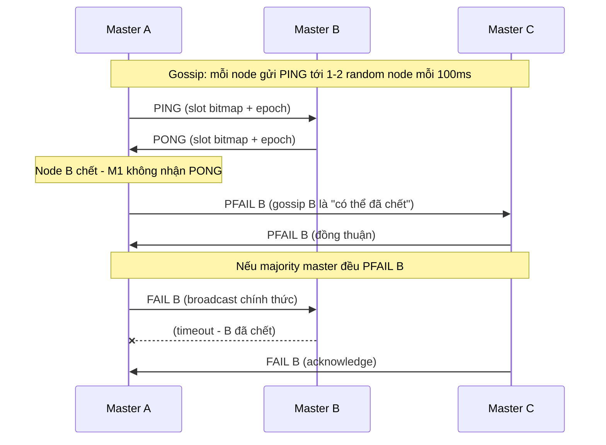
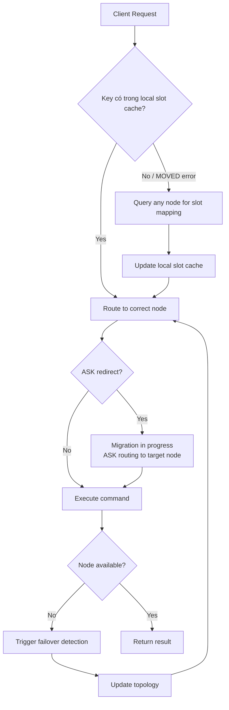

# Distributed Cache: Redis Cluster Internals & Production Deep Dive

## 1. Mục tiêu của Task

Hiểu sâu cơ chế vận hành của distributed cache trong production, tập trung vào:
- **Redis Cluster** - Kiến trúc phân tán, cách dữ liệu được phân chia và quản lý
- **Consistent Hashing** - Thuật toán phân phối dữ liệu và khả năng chịu lỗi khi node thay đổi
- **Cache Warming** - Chiến lược khởi tạo cache mà không gây sập hệ thống
- **Thundering Herd** - Hiện tượng cascade khi cache miss đồng loạt và cách phòng tránh

> **Bối cảnh quan trọng:** Distributed cache không chỉ là "Redis trên nhiều server". Đó là hệ thống phân tán phải đảm bảo tính nhất quán, khả dụng và hiệu năng trong môi trường production khắc nghiệt.

---

## 2. Bản chất và Cơ chế Hoạt động

### 2.1 Redis Cluster Architecture

#### Kiến trúc tổng thể

```
┌─────────────────────────────────────────────────────────────────┐
│                    Redis Cluster (6 nodes)                       │
│  ┌─────────────┐    ┌─────────────┐    ┌─────────────┐          │
│  │  Master A   │◄──►│  Master B   │◄──►│  Master C   │          │
│  │  (Slots     │    │  (Slots     │    │  (Slots     │          │
│  │   0-5460)   │    │  5461-10922)│    │  10923-16383)│          │
│  └──────┬──────┘    └──────┬──────┘    └──────┬──────┘          │
│         │                  │                  │                  │
│  ┌──────▼──────┐    ┌──────▼──────┐    ┌──────▼──────┐          │
│  │  Replica A' │    │  Replica B' │    │  Replica C' │          │
│  │  (Slave of) │    │  (Slave of) │    │  (Slave of) │          │
│  │    A        │    │    B        │    │    C        │          │
│  └─────────────┘    └─────────────┘    └─────────────┘          │
└─────────────────────────────────────────────────────────────────┘
           │                  │                  │
           └──────────────────┼──────────────────┘
                              │
                    ┌─────────▼──────────┐
                    │   Gossip Protocol   │
                    │  (Cluster Bus:     │
                    │   Port + 10000)    │
                    └────────────────────┘
```

#### Cơ chế Hash Slot (16384 slots)

Redis Cluster không dùng consistent hashing truyền thống mà dùng **Hash Slot**:

```
CRC16(key) % 16384 = Slot number (0-16383)
```

**Tại sao là 16384 slots?**

| Lý do | Giải thích |
|-------|------------|
| **Bitmap size** | 16384 bits = 2KB, vừa đủ nhỏ để trao đổi trong heartbeat |
| **Node limit** | Tối đa ~1000 nodes là đủ cho 99.9% use cases |
| **Migration efficiency** | Đủ nhỏ để migrate nhanh, đủ lớn để phân phối đều |
| **Protocol design** | `CLUSTER SLOTS` command trả về trong 1 TCP packet |

> **Quan trọng:** Slot migration là atomic operation - dữ liệu được chuyển theo từng slot, không phải từng key. Điều này tránh split-brain trong quá trình rebalance.

#### Gossip Protocol & Failure Detection



**Epoch mechanism - "Phiếu bầu cử" cho sự kiện cluster:**

```
Config Epoch: Version number của slot-to-node mapping
    ↳ Tăng khi failover hoặc slot migration
    ↳ Node có epoch cao hơn "thắng" khi có xung đột

Current Epoch: Epoch cao nhất mà node biết
    ↳ Đảm bảo tính toàn cục của quyết định
```

> **Trade-off của Gossip:**
> - **Ưu điểm:** Decentralized, không có single point of failure, scalable
> - **Nhược điểm:** Eventual consistency - có thể mất vài giây để failure được detect

#### Replication & Failover

**Replication flow:**

```
Master B ghi data ──► Replication buffer ( backlog ) ◄── Replica B' đọc
                             │
                             ▼
                    Circular buffer ~ 1MB (mặc định)
                    
Nếu Replica disconnect > repl-backlog-ttl:
    └── Full resynchronization (expensive)
Nếu Replica reconnect nhanh:
    └── Partial resynchronization (delta từ buffer)
```

**Auto-failover conditions:**
1. Master được majority master đánh dấu `FAIL`
2. Replica có replication offset mới nhất được ưu tiên
3. Replica tự promote thành master (gửi `CLUSTER FAILOVER TAKEOVER`)
4. Các node cập nhật slot mapping

> **Rủi ro:** Nếu 2 replicas cùng promote (split-brain), config epoch sẽ quyết định. Node có epoch cao hơn "thắng", node thua phải drop data.

---

### 2.2 Consistent Hashing Deep Dive

#### Bản chất vấn đề: Tại sao cần Consistent Hashing?

**Hash thông thường:** `hash(key) % N`

```
Problem: Khi N thay đổi, hầu hết key đều remap

N=3: key "user:1" → hash % 3 = 1 → Node 1
N=4: key "user:1" → hash % 4 = 2 → Node 2 (MISMATCH!)

Cache hit rate drop từ 90% → 25% khi thêm 1 node
```

**Consistent Hashing solution:**

```
Không hash vào [0, N-1], mà hash vào một không gian lớn và cố định:
- Hash space: [0, 2^32-1] (virtual ring)
- Nodes và keys đều được map vào cùng không gian
- Key được gán cho node đầu tiên theo chiều kim đồng hồ

    0° (0)
    │
    │     Node A (45°)
    │          ●
    │     Key X (60°) ─────► A (node đầu tiên sau X)
    │
270°├──────────────┤90°
    │
    │     Node B (180°)
    │          ●
    │
    │     Node C (315°)
    │          ●
    │
   180°
```

#### Virtual Nodes (vnodes) - Giải pháp cho unbalanced distribution

```
Thực tế: Nếu mỗi node chỉ có 1 điểm trên ring, phân phối sẽ không đều

Solution: Mỗi physical node = n virtual nodes (thường 100-200)

Physical Node A ──► A#1(12°), A#2(89°), A#3(156°), A#4(234°), ...
Physical Node B ──► B#1(34°), B#2(112°), B#3(178°), B#4(267°), ...

Kết quả: Standard deviation giảm từ ~50% → ~5%
```

**So sánh các thuật toán Hash Ring:**

| Thuật toán | Đặc điểm | Khi nào dùng |
|------------|----------|--------------|
| **Ketama** (Memcached) | MD5-based, đơn giản | Legacy systems, memcached clients |
| **Jump Consistent Hash** | O(1) space, O(log n) time, **no metadata** | Google Spanner, Ceph - khi cần lightweight |
| **HRW (Rendezvous)** | Max hash(node, key), O(n) lookup | Khi cluster nhỏ (<100 nodes), cần weighted routing |
| **Maglev** (Google) | Permutation table, O(1) lookup | Load balancer (Google Cloud), extreme performance |

> **Quan trọng:** Redis Cluster **KHÔNG dùng consistent hashing**. Nó dùng fixed 16384 slots. Đây là sự khác biệt cốt lõi - Redis trade flexibility lấy predictability.

**Jump Consistent Hash - Thuật toán "không trạng thái":**

```
// Chỉ cần key và số bucket, không cần hash ring metadata
function jumpConsistentHash(key, numBuckets):
    b = -1
    j = 0
    while j < numBuckets:
        b = j
        key = random(key)  // Linear congruential generator
        j = floor((b + 1) / randomDouble(key))
    return b

// Tính chất quan trọng:
// 1. Khi numBuckets tăng 1, chỉ ~1/N key thay đổi bucket
// 2. Không cần lưu trạng thái hash ring
// 3. Deterministic - cùng key luôn ra cùng bucket
```

---

### 2.3 Cache Warming Strategies

#### Bản chất vấn đề

Cold cache = Cache hit rate ~0% = Database bị "bombard" khi khởi động hoặc sau khi clear.

```
Scenario: Cache clear sau deploy

T0: Cache clear
T1: 1000 requests đến → Cache miss × 1000 → DB query × 1000
T2: Database overload → Response time tăng → Timeout cascade
T3: Service degradation hoặc outage
```

#### Chiến lược Warming

**1. Lazy Loading (On-demand)**

```
Client ──► Cache miss? ──Yes──► Query DB ──► Populate cache ──► Return
              │
              No
              ▼
         Return cached
         
Vấn đề: Stampede vào DB khi cold start
```

**2. Pre-warming (Proactive)**

```
// Double-write pattern
1. Background job scan hot keys từ analytics
2. Pre-populate cache trước khi switch traffic
3. Gradual traffic shift (10% → 50% → 100%)

// Warmup script
for key in hot_keys:
    data = db.query(key)
    cache.set(key, data, ttl=3600)
    sleep(0.01)  // Rate limit để tránh overwhelm DB
```

**3. Cache-aside với Background Refresh**

```
┌─────────────────────────────────────────────────────────┐
│                    Read Flow                            │
├─────────────────────────────────────────────────────────┤
│                                                         │
│   Client ──► Cache.get(key)                             │
│                  │                                      │
│        ┌────────┴────────┐                              │
│        ▼                 ▼                              │
│    [Hit]              [Miss]                            │
│        │                 │                              │
│        │                 ▼                              │
│        │            Query DB                            │
│        │                 │                              │
│        │                 ▼                              │
│        │            Set cache                          │
│        │            + Trigger async refresh            │
│        │                 if TTL < threshold            │
│        │                 │                              │
│        └────────┬────────┘                              │
│                 ▼                                       │
│            Return data                                  │
│                                                         │
└─────────────────────────────────────────────────────────┘
```

**4. Warm Replica Pattern (Redis-specific)**

```
// Redis 6.0+: Replica-serve-stale-data
// Khi warm new cache cluster:

1. Setup new cluster với replicas
2. Replicate từ old cluster (Redis replication)
3. Switch read traffic sang replicas (đã warm)
4. Gradually switch writes
```

---

### 2.4 Thundering Herd Problem

#### Cơ chế gây ra

```
Timeline (tính bằng ms):

T=0:   Cache entry "user:1001" expire
T=1:   Request A → Cache miss → Query DB (100ms)
T=2:   Request B → Cache miss → Query DB
T=3:   Request C → Cache miss → Query DB
...
T=100: Request Z → Cache miss → Query DB

Kết quả: 1000 queries cùng lúc cho cùng 1 key!
```

#### Giải pháp

**1. Lock/Lease Pattern (Mutex)**

```
┌────────────────────────────────────────────────────────┐
│              Get Cache với Lock                       │
├────────────────────────────────────────────────────────┤
│                                                        │
│  1. cache.get(key)                                     │
│     └───► null? (expired)                              │
│                                                        │
│  2. SET lock:{key} <request_id> NX EX 10              │
│     └───► Success?                                      │
│         ├── YES: Tiếp tục query DB                     │
│         │      Populate cache                          │
│         │      DEL lock:{key}                          │
│         │                                              │
│         └── NO: Sleep 100ms → Retry từ bước 1         │
│                                                        │
└────────────────────────────────────────────────────────┘

// Chỉ 1 request được quyền query DB, các request khác wait
```

**2. Stale-While-Revalidate**

```
// Logic: Trả về stale data trong khi background refresh

TTL logic:
┌─────────────────────────────────────────────────────┐
│ soft_ttl = 300s  │  hard_ttl = 360s                │
│ (bắt đầu refresh)│  (evict khỏi cache)             │
└─────────────────────────────────────────────────────┘

T=0:    Set cache với TTL=360s
T=300:  soft_ttl hit → Mark as "stale" but keep
        Trigger background refresh
T=300-360: Requests vẫn nhận stale data (0ms latency)
T=360:  Nếu refresh fail → hard_ttl hit → Cache miss

Trade-off: Có thể trả về data stale tối đa 60s
```

**3. Probabilistic Early Expiration**

```
// Redis/memcached không hỗ trợ native, cần implement client-side

// Thay vì fixed TTL, dùng random offset
function getTTL():
    base_ttl = 300
    // 5% keys sẽ expire sớm hơn 0-30s
    if random() < 0.05:
        return base_ttl - random(0, 30)
    return base_ttl

// Kết quả: Staggered expiration, giảm xác suất thundering herd
```

**4. Single-Flight (Golang pattern, áp dụng cho Java)**

```
// Đảm bảo chỉ 1 request thực hiện operation cho cùng 1 key
// Các request concurrent cùng key sẽ share kết quả

class CacheLoader<K, V> {
    private final ConcurrentHashMap<K, CompletableFuture<V>> inProgress;
    
    public V load(K key, Function<K, V> loader) {
        CompletableFuture<V> future = inProgress.computeIfAbsent(key, k -> 
            CompletableFuture.supplyAsync(() -> {
                try {
                    return loader.apply(k);
                } finally {
                    inProgress.remove(k);
                }
            })
        );
        return future.join();
    }
}
```

---

## 3. Kiến trúc và Luồng Xử lý

### 3.1 Redis Cluster Request Flow



### 3.2 Cache Layer Architecture (Production)

```
┌─────────────────────────────────────────────────────────────────────┐
│                         Application Layer                            │
│  ┌─────────────┐  ┌─────────────┐  ┌─────────────┐                  │
│  │   Service   │  │   Service   │  │   Service   │                  │
│  │     A       │  │     B       │  │     C       │                  │
│  └──────┬──────┘  └──────┬──────┘  └──────┬──────┘                  │
└─────────┼────────────────┼────────────────┼──────────────────────────┘
          │                │                │
          ▼                ▼                ▼
┌─────────────────────────────────────────────────────────────────────┐
│                     Local Cache (Caffeine/Guava)                     │
│  ┌─────────────┐  ┌─────────────┐  ┌─────────────┐                  │
│  │    L1       │  │    L1       │  │    L1       │                  │
│  │   ~100MB    │  │   ~100MB    │  │   ~100MB    │                  │
│  │  Caffeine   │  │  Caffeine   │  │  Caffeine   │                  │
│  └──────┬──────┘  └──────┬──────┘  └──────┬──────┘                  │
└─────────┼────────────────┼────────────────┼──────────────────────────┘
          │                │                │
          └────────────────┼────────────────┘
                           │
                           ▼
┌─────────────────────────────────────────────────────────────────────┐
│                    Distributed Cache (Redis Cluster)                 │
│  ┌─────────────┐    ┌─────────────┐    ┌─────────────┐              │
│  │  Master A   │◄──►│  Master B   │◄──►│  Master C   │              │
│  │  + Replica  │    │  + Replica  │    │  + Replica  │              │
│  │   (L2)      │    │   (L2)      │    │   (L2)      │              │
│  └─────────────┘    └─────────────┘    └─────────────┘              │
│                                                                      │
│  Sentinel: Auto-failover monitoring                                  │
└─────────────────────────────────────────────────────────────────────┘
                           │
                           ▼ (Cache miss only)
┌─────────────────────────────────────────────────────────────────────┐
│                         Database Layer                               │
│                    (PostgreSQL / MySQL / MongoDB)                    │
└─────────────────────────────────────────────────────────────────────┘
```

---

## 4. So sánh Các Lựa chọn

### 4.1 Redis Cluster vs Alternatives

| Feature | Redis Cluster | Memcached | Hazelcast | Caffeine (Local) |
|---------|---------------|-----------|-----------|------------------|
| **Data size** | TB (sharded) | TB (sharded) | TB (sharded) | GB (single node) |
| **Replication** | Yes (async) | No | Yes (sync/async) | N/A |
| **Persistence** | Optional RDB/AOF | No | Yes | No |
| **Data types** | Rich (5 types) | String only | Rich | Object references |
| **Query capability** | Limited | None | SQL-like | None |
| **Client complexity** | High | Low | Medium | None |
| **Network hop** | 1-2 | 1 | 1-2 | 0 (in-process) |
| **Use case** | General cache, session | Simple object cache | Compute cache | Ultra-hot data |

### 4.2 Consistent Hashing vs Hash Slots

| Aspect | Consistent Hashing | Redis Hash Slots |
|--------|-------------------|------------------|
| **Rebalance cost** | Low (chỉ affected keys) | Medium (entire slot migration) |
| **Rebalance speed** | Instant (metadata change) | Slow (data transfer) |
| **Load balancing** | Good (vnodes) | Perfect (fixed slots) |
| **Operational complexity** | High (client-side routing) | Low (server-side routing) |
| **Multi-key operations** | Hard (keys may be on different nodes) | Easy (if same slot - hash tags) |
| **Best for** | Dynamic clusters, CDN | Stable clusters, predictable sharding |

---

## 5. Rủi ro, Anti-patterns, Lỗi thường gặp

### 5.1 Redis Cluster Anti-patterns

| Anti-pattern | Hệ quả | Giải pháp |
|--------------|--------|-----------|
| **Big Key** (>1MB) | Block replication, slow migration, high latency | Chunk large objects, use compression |
| **Hot Key** (millions QPS trên 1 key) | Single node bottleneck, uneven load | Local cache, read replicas, key sharding |
| **Keys không có TTL** | Memory leak, OOM kill | Enforce TTL policy, memory max + eviction |
| **MULTI/EXEC cross-slot** | CROSSSLOT error | Use hash tags {user:1}:profile, {user:1}:settings |
| **Full table scan** (KEYS *) | Block entire node | Use SCAN command |
| **Lua script with writes** | Hard to debug, can block | Limit complexity, use EVALSHA |

### 5.2 Thundering Herd Scenarios

```
1. Cache cold start sau deploy
   └── Giải pháp: Pre-warming, staggered cache population

2. Cache stampede trên hot key
   └── Giải pháp: Mutex lock, stale-while-revalidate

3. Simultaneous expiration (TTL cùng lúc)
   └── Giải pháp: Probabilistic TTL, jitter

4. Retry storm khi cache service unavailable
   └── Giải pháp: Circuit breaker, exponential backoff
```

### 5.3 Split-Brain và Data Loss

```
Scenario: Network partition giữa 2 datacenters

DC1: Master A, Replica B (isolated)
DC2: Replica A, Master B (isolated)

Sau partition:
- Cả 2 bên đều nghĩ mình là majority (nếu không có proper quorum)
- Cả 2 master đều accept writes
- Khi partition heal: Data conflict

Prevention:
1. Redis Cluster: min-slaves-to-write + min-slaves-max-lag
2. Sentinel: quora chỉ count từ cùng 1 network partition
3. Application: Write to DC1 only, DC2 read-only
```

---

## 6. Khuyến nghị Thực chiến trong Production

### 6.1 Redis Cluster Configuration

```
# redis.conf cho production

# Memory
maxmemory 8gb
maxmemory-policy allkeys-lru  # Hoặc allkeys-lfu cho better hit rate

# Persistence (nếu cần)
appendonly yes
appendfsync everysec  # Hoặc no nếu cache-only

# Replication
repl-backlog-size 256mb  # Tăng cho high-write workload
repl-diskless-sync yes    # Cho initial sync nhanh hơn
min-slaves-to-write 1
min-slaves-max-lag 10

# Cluster
cluster-require-full-coverage no  # Cho phép partial operation khi có node down
cluster-node-timeout 5000
```

### 6.2 Client Configuration (Lettuce - Java)

```java
// Lettuce client configuration
RedisClusterClient client = RedisClusterClient.create(
    RedisURI.builder()
        .withHost("redis-cluster")
        .withPort(6379)
        .build()
);

ClusterTopologyRefreshOptions topologyRefreshOptions = 
    ClusterTopologyRefreshOptions.builder()
        .enablePeriodicRefresh(Duration.ofSeconds(30))
        .enableAllAdaptiveRefreshTriggers()
        .build();

client.setOptions(ClusterClientOptions.builder()
    .topologyRefreshOptions(topologyRefreshOptions)
    .autoReconnect(true)
    .disconnectedBehavior(ClientOptions.DisconnectedBehavior.REJECT_COMMANDS)
    // Quan trọng: Không để command đi vào "void" khi disconnect
    .build()
);
```

### 6.3 Monitoring Metrics

| Metric | Warning Threshold | Critical Threshold | Ý nghĩa |
|--------|------------------|-------------------|---------|
| `used_memory` | >80% maxmemory | >95% maxmemory | Memory pressure |
| `instantaneous_ops_per_sec` | Baseline + 50% | Baseline + 100% | Load spike |
| `keyspace_hits / (hits + misses)` | <90% | <80% | Cache efficiency |
| `connected_clients` | >10,000 | >15,000 | Connection limit |
| `rejected_connections` | >0 | >100 | Backlog full |
| `cluster_slots_fail` | >0 | >5461 (1/3) | Partial outage |
| `slowlog_len` | >100 | >1000 | Query performance |

### 6.4 Cache Warming Checklist

```
Pre-deployment:
□ Identify hot keys từ production logs
□ Script warmup với rate limiting
□ Test warmup trên staging
□ Verify TTL settings cho tất cả keys

During deployment:
□ Blue-green hoặc canary deployment
□ Warm new cluster trước khi switch traffic
□ Monitor cache hit rate real-time
□ Sẵn sàng rollback nếu hit rate < 80%

Post-deployment:
□ Monitor thundering herd indicators
□ Alert nếu DB QPS spike > 200%
□ Verify all critical paths có cache
```

---

## 7. Kết luận

### Bản chất cốt lõi

**Distributed Cache không phải là "cache nhanh hơn" - đó là hệ thống phân tán có trade-offs:**

1. **Redis Cluster** trade operational simplicity lấy scalability và high availability. Hash slot architecture cho predictability nhưng giảm flexibility so với consistent hashing.

2. **Consistent Hashing** là nền tảng của nhiều distributed systems, nhưng Redis chứng minh rằng fixed partitioning có thể tốt hơn cho use case cụ thể.

3. **Thundering Herd** là vấn đề coordination, không phải cache problem. Các giải pháp (locks, stale-while-revalidate) đều là distributed coordination patterns.

4. **Cache Warming** là operational procedure, không phải technical feature. Thành công phụ thuộc vào monitoring và gradual rollout.

### Trade-off quan trọng nhất

> **Consistency vs Availability trong Cache:** Cache by definition là eventually consistent. Quyết định quan trọng không phải "làm sao để cache luôn đúng" mà là "chấp nhận stale data trong bao lâu" và "fallback strategy khi cache miss".

### Rủi ro lớn nhất

1. **Hot Key** - Single point of failure trong distributed system
2. **Split-brain trong failover** - Data loss silent, khó phát hiện
3. **Thundering herd sau deploy** - Có thể gây cascade failure toàn hệ thống

### Khi nào nên dùng Redis Cluster

- Cache data size > 50GB (vượt quá single node capacity)
- QPS > 100k/sec (cần horizontal scale)
- Yêu cầu 99.9%+ availability (cần auto-failover)
- Team có operational capacity để manage cluster

### Khi nào KHÔNG nên dùng

- Data < 10GB (single instance đơn giản hơn)
- Cache hit rate thấp (<80% - có thể cache không phù hợp)
- Không có proper monitoring/alerting
- Cần complex query beyond key-value (consider ElasticSearch, ClickHouse)

---

*Document version: 1.0*  
*Last updated: 2025-03-27*  
*Research scope: Redis Cluster internals, Consistent Hashing, Cache Warming, Thundering Herd mitigation*
