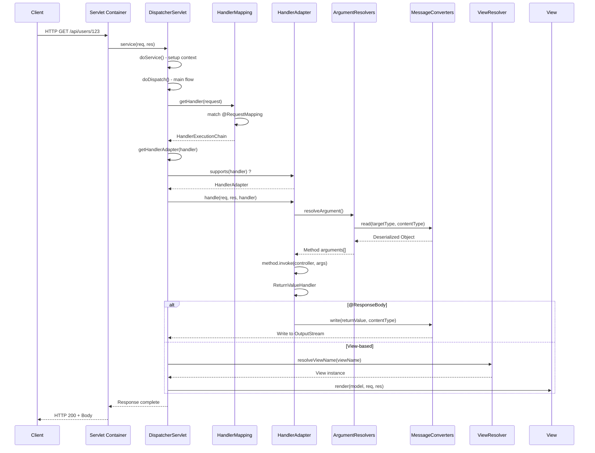
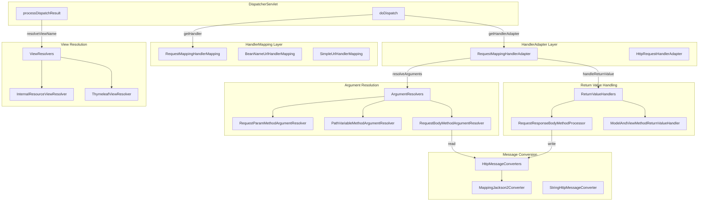

# Spring MVC Internals: DispatcherServlet, HandlerMapping, HandlerAdapter, ViewResolver

## 1. Mục tiêu của Task

Hiểu sâu kiến trúc bên trong của Spring MVC Framework - cách framework xử lý HTTP request từ khi đến server đến khi trả về response. Tập trung vào:
- **DispatcherServlet** - Front Controller pattern implementation
- **HandlerMapping** - Request-to-handler resolution strategy
- **HandlerAdapter** - Handler execution abstraction
- **ViewResolver** - View resolution và rendering pipeline
- **Content Negotiation** - Accept header parsing và format selection
- **Message Converters** - Request/response body serialization

> **Điểm quan trọng:** Spring MVC không chỉ là "@RequestMapping và trả về String" - đó là abstraction. Bản chất là một state machine phức tạp xử lý request lifecycle qua nhiều extension points.

---

## 2. Bản Chất và Cơ Chế Hoạt Động

### 2.1 DispatcherServlet: The Front Controller

**Bản chất:** DispatcherServlet là một **Servlet bình thường** kế thừa từ `HttpServlet`, nhưng đóng vai trò **Facade** cho toàn bộ request processing pipeline.

**Vì sao thiết kế như vậy:**
- **Single Entry Point:** Mọi request đi qua một cổng duy nhất → centralized control, consistent preprocessing
- **Decoupling:** Controllers không cần biết về Servlet API → testability, portability
- **Extensibility:** Plugin architecture qua SPI (HandlerMapping, HandlerAdapter, ViewResolver)

```
┌─────────────────────────────────────────────────────────────┐
│                     HTTP Request                            │
└──────────────────────┬──────────────────────────────────────┘
                       │
                       ▼
┌─────────────────────────────────────────────────────────────┐
│              Servlet Container (Tomcat/Jetty)               │
│  ┌─────────────────────────────────────────────────────┐    │
│  │         Filter Chain (Security, Logging)            │    │
│  └──────────────────────┬──────────────────────────────┘    │
└─────────────────────────┼───────────────────────────────────┘
                          │
                          ▼
┌─────────────────────────────────────────────────────────────┐
│                   DispatcherServlet                         │
│  ┌─────────────┐ ┌─────────────┐ ┌─────────────────────┐   │
│  │doService()  │→│doDispatch() │→│ HandlerExecutionChain│   │
│  └─────────────┘ └─────────────┘ └─────────────────────┘   │
└─────────────────────────────────────────────────────────────┘
```

**Cơ chế hoạt động tầng thấp:**

1. **doService()** - Thiết lập context: LocaleContext, RequestAttributes, exposes context beans
2. **doDispatch()** - Core state machine xử lý request
3. **getHandler()** - Querry tất cả HandlerMapping beans theo thứ tự
4. **getHandlerAdapter()** - Tìm adapter phù hợp cho handler
5. **applyPreHandle()** - Interceptors pre-processing
6. **handle()** - Thực thi handler method
7. **applyDefaultViewName()** - Fallback view nếu handler trả về null
8. **applyPostHandle()** - Interceptors post-processing
9. **processDispatchResult()** - Xử lý exception, view rendering

### 2.2 HandlerMapping: Request-to-Handler Resolution

**Bản chất:** HandlerMapping là **Strategy Pattern** - định nghĩa interface để ánh xạ request đến handler, cho phép nhiều implementation khác nhau.

**Các implementation chính:**

| Implementation | Use Case | Complexity |
|----------------|----------|------------|
| `RequestMappingHandlerMapping` | @RequestMapping methods | High - parses annotations, patterns |
| `BeanNameUrlHandlerMapping` | Bean name = URL pattern | Low - simple string match |
| `SimpleUrlHandlerMapping` | Explicit URL → bean mapping | Medium - configuration-based |
| `RouterFunctionMapping` | Functional routing (WebFlux style) | Medium - lambda-based |

**Cơ chế RequestMappingHandlerMapping:**

```
Request → Parse @RequestMapping từ tất cả beans
        → Tạo RequestMappingInfo (path, method, params, headers, produces, consumes)
        → Pattern matching với AntPathMatcher hoặc PathPatternParser
        → Sort theo specificity (path → method → params → headers)
        → Trả về HandlerMethod (bean + method reference)
```

**Matching Priority (Specificity):**
1. Path pattern specificity: `/user/{id}` < `/user/me` (literal > template)
2. HTTP method match: `GET` > `*` (any method)
3. Params match: `?format=json` > không có
4. Consumes/Produces: `application/json` > `*/*`

> **Lưu ý quan trọng:** Nếu có 2 patterns cùng match và cùng specificity → `IllegalStateException` (ambiguous mapping). Đây là lỗi startup, không phải runtime.

### 2.3 HandlerAdapter: Handler Execution Abstraction

**Bản chất:** HandlerAdapter là **Adapter Pattern** - cho phép DispatcherServlet làm việc với các loại handler khác nhau mà không cần biết chi tiết implementation.

**Vì sao cần Adapter:**
- Spring MVC hỗ trợ nhiều kiểu handler: `@Controller` methods, `HttpRequestHandler`, `Servlet`, `Callable`, `DeferredResult`
- Mỗi loại có cách thực thi khác nhau
- DispatcherServlet chỉ gọi `adapter.handle()` → polymorphism

**Các HandlerAdapter implementations:**

| Adapter | Handler Type | Execution Model |
|---------|-------------|-----------------|
| `RequestMappingHandlerAdapter` | `@RequestMapping` methods | Direct method invocation |
| `HttpRequestHandlerAdapter` | `HttpRequestHandler` | `handler.handleRequest()` |
| `SimpleControllerHandlerAdapter` | `Controller` interface (legacy) | `handler.handleRequest()` |
| `SimpleServletHandlerAdapter` | `Servlet` | `servlet.service()` |
| `HandlerFunctionAdapter` | `HandlerFunction` (WebFlux fn) | Lambda execution |

**RequestMappingHandlerAdapter Deep Dive:**

```
handle(request, response, handler)
    ↓
invokeHandlerMethod(request, response, handlerMethod)
    ↓
ServletInvocableHandlerMethod.invokeAndHandle(webRequest, mavContainer)
    ↓
invokeForRequest(webRequest, mavContainer, providedArgs)
    ├── resolveArguments() ← ArgumentResolvers
    ├── doInvoke(args[])    ← Reflection method.invoke()
    └── returnValueHandlers.handleReturnValue() ← ReturnValueHandlers
```

**Extension Points trong HandlerAdapter:**

1. **ArgumentResolvers** - Resolve method parameters từ request
2. **ReturnValueHandlers** - Xử lý giá trị trả về của method
3. **MessageConverters** - Body serialization/deserialization

### 2.4 ViewResolver: View Resolution Pipeline

**Bản chất:** ViewResolver là **Factory Pattern** - tạo View instance từ logical view name.

**Flow trong processDispatchResult():**

```
Handler trả về: String viewName hoặc View object hoặc @ResponseBody
                ↓
Nếu có exception → HandlerExceptionResolver xử lý
                ↓
Nếu là @ResponseBody → MessageConverter viết trực tiếp, bỏ qua View
                ↓
Nếu là String viewName → resolveViewName() qua tất cả ViewResolver
                ↓
View.render() → Viết response output
```

**ViewResolver implementations:**

| Resolver | Template Technology | Use Case |
|----------|---------------------|----------|
| `InternalResourceViewResolver` | JSP | Legacy, server-side rendering |
| `ThymeleafViewResolver` | Thymeleaf | Modern server-side rendering |
| `FreeMarkerViewResolver` | FreeMarker | Template-based rendering |
| `BeanNameViewResolver` | Custom View beans | Programmatic view creation |
| `ContentNegotiatingViewResolver` | Delegates to others | Content negotiation fallback |

### 2.5 Content Negotiation: Format Selection Strategy

**Bản chất:** ContentNegotiationManager là **Strategy Pattern** - xác định format response dựa trên multiple input sources.

**ContentNegotiationStrategy implementations:**

```
1. HeaderContentNegotiationStrategy
   → Parse Accept header (application/json, text/html, etc.)
   
2. ParameterContentNegotiationStrategy  
   → Query parameter ?format=json or ?mediaType=xml
   
3. PathExtensionContentNegotiationStrategy
   → URL suffix /user.json or /user.xml (deprecated, security risk)
   
4. FixedContentNegotiationStrategy
   → Always return same media type (testing)
```

**MediaType resolution priority:**
1. Path extension (nếu enabled)
2. Request parameter (nếu configured)
3. Accept header (default)
4. Default content type fallback

### 2.6 Message Converters: Serialization Pipeline

**Bản chất:** HttpMessageConverter là **Strategy Pattern** cho request/response body serialization.

**Converter implementations:**

| Converter | Direction | Formats | Notes |
|-----------|-----------|---------|-------|
| `MappingJackson2HttpMessageConverter` | Read/Write | JSON | Default, most common |
| `MappingJackson2XmlHttpMessageConverter` | Read/Write | XML | Jackson XML extension |
| `StringHttpMessageConverter` | Read/Write | text/plain | Default for String |
| `ByteArrayHttpMessageConverter` | Read/Write | application/octet-stream | Binary data |
| `ResourceHttpMessageConverter` | Read/Write | */* | Spring Resources |
| `FormHttpMessageConverter` | Read/Write | form data | application/x-www-form-urlencoded |
| `ProtobufHttpMessageConverter` | Read/Write | protobuf | gRPC ecosystem |

**Converter selection algorithm:**

```
Request:
  Content-Type header → canRead(targetClass, contentType)
  → First matching converter read() được gọi

Response:
  Accept header + Return type → canWrite(returnClass, mediaType)
  → First matching converter write() được gọi
```

**Converter ordering:** Spring MVC sắp xếp theo `Ordered` interface hoặc registration order. JSON converter thường đăng ký sau String converter nhưng trước generic converters.

---

## 3. Kiến Trúc và Luồng Xử Lý

### 3.1 Sequence Diagram: Full Request Lifecycle



### 3.2 Component Interaction Diagram



### 3.3 Data Flow: Request/Response Processing

```
┌─────────────────────────────────────────────────────────────────┐
│                        REQUEST PHASE                             │
└─────────────────────────────────────────────────────────────────┘

HTTP Request
    │
    ├──► Path: /api/users/{id}
    ├──► Method: GET
    ├──► Headers: Accept: application/json
    │            Content-Type: application/json
    └──► Body: (optional)
         │
         ▼
┌────────────────────────────────────────────────────────────────┐
│ HandlerMapping Resolution                                       │
│ • Parse URL pattern                                             │
│ • Match @RequestMapping annotations                             │
│ • Select HandlerMethod (Controller class + Method)              │
└────────────────────────────────────────────────────────────────┘
         │
         ▼
┌────────────────────────────────────────────────────────────────┐
│ HandlerAdapter Execution                                        │
│ • Resolve @PathVariable → extract from URL                      │
│ • Resolve @RequestParam → extract from query string             │
│ • Resolve @RequestHeader → extract from headers                 │
│ • Resolve @RequestBody → deserialize JSON → Object              │
└────────────────────────────────────────────────────────────────┘
         │
         ▼
    Method Invocation: userService.findById(id)
         │
         ▼
┌─────────────────────────────────────────────────────────────────┐
│                       RESPONSE PHASE                             │
└─────────────────────────────────────────────────────────────────┘

Return Value Processing
    │
    ├──► @ResponseBody → Serialize to JSON/XML → OutputStream
    │
    ├──► String viewName → ViewResolver → View.render()
    │
    └──► ModelAndView → Thymeleaf/JSP template rendering
         │
         ▼
HTTP Response
    ├──► Status: 200 OK
    ├──► Headers: Content-Type: application/json
    └──► Body: {"id": 123, "name": "John"}
```

---

## 4. So Sánh Các Lựa Chọn

### 4.1 Spring MVC vs Spring WebFlux

| Aspect | Spring MVC | Spring WebFlux |
|--------|------------|----------------|
| **Thread Model** | Thread-per-request (blocking) | Event-loop (non-blocking) |
| **Servlet API** | Yes (Servlet 3.1+) | No (Netty, Undertow) |
| **Concurrency** | 1 thread/request, thread pool limits | Few threads handle many requests |
| **Memory** | Higher stack memory per thread | Lower memory, reactive streams |
| **Latency** | Good for CPU-bound | Better for I/O-bound, high concurrency |
| **Learning Curve** | Lower | Higher (Reactive programming) |
| **Ecosystem** | Mature, extensive | Growing, limited in some areas |
| **Use Case** | Traditional web apps, CRUD APIs | Streaming, real-time, high throughput |

**Quyết định khi nào dùng cái nào:**

> **Dùng Spring MVC khi:**
> - Ứng dụng truyền thống, không yêu cầu extreme concurrency
> - Team chưa quen reactive programming
> - Cần tích hợp nhiều blocking libraries (JDBC, JPA)
> - Latency requirements không quá khắt khe (< 100ms acceptable)

> **Dùng WebFlux khi:**
> - Cần xử lý 10K+ concurrent connections
> - Nhiều downstream I/O calls (microservices, external APIs)
> - Streaming data, real-time updates (SSE, WebSocket)
> - Đã có expertise về reactive programming

### 4.2 HandlerMapping Strategies Comparison

| Strategy | Pros | Cons | Best For |
|----------|------|------|----------|
| **@RequestMapping** | Declarative, type-safe, flexible | Annotation-heavy, compile-time only | Standard REST APIs |
| **BeanNameUrl** | Simple, no annotations | Limited flexibility, magic strings | Simple routing |
| **SimpleUrl** | Explicit mapping, configurable | XML/Java config verbose | Legacy apps |
| **RouterFunction** | Functional, composable, testable | Learning curve, less discoverable | Complex routing logic |

### 4.3 View Technology Comparison

| Technology | Server-side | Caching | Performance | Use Case |
|------------|-------------|---------|-------------|----------|
| **JSP** | Yes | Limited | Moderate | Legacy enterprise |
| **Thymeleaf** | Yes | Good | Good | Modern SSR, natural templates |
| **FreeMarker** | Yes | Good | Good | Complex templates, macros |
| **React/Vue SSR** | Hybrid | Varies | Varies | SPA with SSR requirements |
| **No View (API only)** | N/A | N/A | Best | REST APIs, @ResponseBody |

---

## 5. Rủi Ro, Anti-patterns, Lỗi Thường Gặp

### 5.1 HandlerMapping Issues

**1. Ambiguous Mapping Exception**
```java
// BAD: Cả 2 đều match /users/1
@GetMapping("/users/{id}")
public User getUser(@PathVariable Long id) { }

@GetMapping("/users/{name}")  
public User getUserByName(@PathVariable String name) { }
```
> **Lỗi:** `IllegalStateException: Ambiguous handler methods mapped`
> **Fix:** Dùng path cụ thể hơn (`/users/id/{id}`, `/users/name/{name}`) hoặc query params

**2. Trailing Slash Mismatch**
```java
@GetMapping("/users")  // Match /users, không match /users/
```
> **Vấn đề:** `/users/` trả về 404 dù logic giống hệt
> **Fix:** Cấu hình `setUseTrailingSlashMatch(true)` hoặc chuẩn hóa URL ở proxy level

### 5.2 HandlerAdapter Pitfalls

**1. Blocking in Async Context**
```java
@GetMapping("/slow")
public String slowEndpoint() {
    Thread.sleep(10000);  // BLOCKING TOMCAT THREAD!
    return "done";
}
```
> **Rủi ro:** Thread pool exhaustion, request queue buildup
> **Fix:** Dùng `Callable<String>`, `CompletableFuture`, hoặc `@Async`

**2. MessageConverter Not Registered**
```java
@PostMapping(value = "/users", consumes = "application/xml")
public User createUser(@RequestBody User user) { }
```
> **Lỗi:** 415 Unsupported Media Type nếu Jackson XML không có trong classpath
> **Fix:** Thêm `jackson-dataformat-xml` dependency

### 5.3 Content Negotiation Problems

**1. Path Extension Security Risk (CVE-2013-4152)**
```
GET /user.json  → Accept: application/json
GET /user.html  → RCE vulnerability (old Spring versions)
```
> **Rủi ro:** Path extension có thể bypass security filters
> **Fix:** `spring.mvc.pathmatch.use-suffix-pattern=false` (default từ Spring 5.3+)

**2. Ambiguous Accept Header**
```
Accept: */*
```
> **Vấn đề:** Converter nào cũng match, order quyết định
> **Fix:** Luôn specify Accept header cụ thể, hoặc cấu hình default content type

### 5.4 MessageConverter Anti-patterns

**1. Deserialization without Validation**
```java
@PostMapping("/users")
public User create(@RequestBody User user) {  // No @Valid!
    return service.save(user);  // Save invalid data
}
```
> **Rủi ro:** Invalid data persistence, security issues
> **Fix:** Dùng `@Valid` hoặc `@Validated` với Bean Validation

**2. Large Payload without Limits**
```java
@PostMapping("/upload")
public String upload(@RequestBody byte[] data) { }
```
> **Rủi ro:** OOM nếu upload file lớn
> **Fix:** Cấu hình `spring.servlet.multipart.max-file-size`, dùng streaming

**3. Circular References in JSON**
```java
@Entity
public class User {
    @ManyToOne
    private Department department;  // Department has List<User>
}
```
> **Lỗi:** `JsonMappingException: Infinite recursion`
> **Fix:** Dùng `@JsonIgnore`, `@JsonManagedReference/@JsonBackReference`, hoặc DTOs

### 5.5 ViewResolver Issues

**1. View Name Collision**
```java
@Controller
public class UserController {
    @GetMapping("/users")
    public String list() { return "list"; }  // resolves to list.jsp
}

@Controller  
public class ProductController {
    @GetMapping("/products")
    public String list() { return "list"; }  // SAME VIEW NAME!
}
```
> **Vấn đề:** Naming collision, maintenance nightmare
> **Fix:** Prefix view names: `"user/list"`, `"product/list"`

**2. Missing ViewResolver**
```java
@GetMapping("/page")
public String page() { return "myPage"; }
// Không có ViewResolver nào match "myPage"
```
> **Lỗi:** `ServletException: Could not resolve view with name 'myPage'`
> **Fix:** Đảm bảo ViewResolver được cấu hình đúng prefix/suffix

---

## 6. Khuyến Nghị Thực Chiến trong Production

### 6.1 Performance Optimization

**1. PathPatternParser (Spring 5.3+)**
```java
@Configuration
public class WebConfig implements WebMvcConfigurer {
    @Override
    public void configurePathMatch(PathMatchConfigurer configurer) {
        configurer.setPatternParser(new PathPatternParser());  // Nhanh hơn AntPathMatcher
    }
}
```
> **Lợi ích:** PathPatternParser nhanh hơn 20-30% cho path matching

**2. MessageConverter Ordering**
```java
@Configuration
public class WebConfig implements WebMvcConfigurer {
    @Override
    public void configureMessageConverters(List<HttpMessageConverter<?>> converters) {
        // Đưa JSON converter lên đầu cho API endpoints
        converters.add(0, new MappingJackson2HttpMessageConverter());
    }
}
```

**3. Disable Unnecessary Features**
```properties
# Nếu chỉ làm API, tắt view resolution
spring.web.resources.add-mappings=false
spring.mvc.view.prefix=
spring.mvc.view.suffix=

# Tắt path extension content negotiation (security + performance)
spring.mvc.pathmatch.use-suffix-pattern=false
spring.mvc.contentnegotiation.favor-path-extension=false
```

### 6.2 Observability và Monitoring

**1. HandlerInterceptor for Metrics**
```java
@Component
public class MetricsInterceptor implements HandlerInterceptor {
    private final MeterRegistry registry;
    
    @Override
    public boolean preHandle(HttpServletRequest req, HttpServletResponse res, Object handler) {
        req.setAttribute("startTime", System.currentTimeMillis());
        return true;
    }
    
    @Override
    public void afterCompletion(HttpServletRequest req, HttpServletResponse res, Object handler, Exception ex) {
        long duration = System.currentTimeMillis() - (Long) req.getAttribute("startTime");
        String handlerName = handler instanceof HandlerMethod 
            ? ((HandlerMethod) handler).getMethod().getName() 
            : "unknown";
        
        registry.timer("http.request", "handler", handlerName)
                .record(duration, TimeUnit.MILLISECONDS);
    }
}
```

**2. Enable Debug Logging (chỉ trong troubleshooting)**
```properties
logging.level.org.springframework.web.servlet.DispatcherServlet=DEBUG
logging.level.org.springframework.web.servlet.mvc.method.annotation=TRACE
```

### 6.3 Error Handling Best Practices

**1. Global Exception Handler**
```java
@RestControllerAdvice
public class GlobalExceptionHandler {
    
    @ExceptionHandler(MethodArgumentNotValidException.class)
    public ResponseEntity<ErrorResponse> handleValidation(MethodArgumentNotValidException ex) {
        List<String> errors = ex.getBindingResult().getFieldErrors().stream()
            .map(e -> e.getField() + ": " + e.getDefaultMessage())
            .collect(Collectors.toList());
        
        return ResponseEntity.badRequest()
            .body(new ErrorResponse("VALIDATION_ERROR", errors));
    }
    
    @ExceptionHandler(HttpMessageNotReadableException.class)
    public ResponseEntity<ErrorResponse> handleInvalidJson(HttpMessageNotReadableException ex) {
        return ResponseEntity.badRequest()
            .body(new ErrorResponse("INVALID_JSON", "Request body is not valid JSON"));
    }
}
```

### 6.4 Security Considerations

**1. Disable Path Extension**
```properties
# Tránh RCE và security bypass
spring.mvc.pathmatch.use-suffix-pattern=false
spring.mvc.contentnegotiation.favor-path-extension=false
spring.mvc.contentnegotiation.favor-parameter=false
```

**2. Size Limits**
```properties
spring.servlet.multipart.max-file-size=10MB
spring.servlet.multipart.max-request-size=10MB
server.tomcat.max-swallow-size=10MB
server.tomcat.max-http-form-post-size=2MB
```

**3. Secure Headers**
```java
@Configuration
public class SecurityConfig {
    @Bean
    public FilterRegistrationBean<Filter> securityHeadersFilter() {
        FilterRegistrationBean<Filter> registration = new FilterRegistrationBean<>();
        registration.setFilter((req, res, chain) -> {
            HttpServletResponse response = (HttpServletResponse) res;
            response.setHeader("X-Content-Type-Options", "nosniff");
            response.setHeader("X-Frame-Options", "DENY");
            chain.doFilter(req, res);
        });
        return registration;
    }
}
```

---

## 7. Kết Luận

**Bản chất cốt lõi của Spring MVC:**

Spring MVC là một **pipeline xử lý request dựa trên Strategy Pattern**, không phải một framework monolithic. Điểm mạnh nằm ở:

1. **Decoupling:** DispatcherServlet là facade, tất cả components còn lại đều pluggable
2. **Convention over Configuration:** Auto-configuration hoạt động tốt, nhưng customization vẫn dễ dàng
3. **Extensibility:** Mọi extension point (HandlerMapping, HandlerAdapter, ViewResolver, ArgumentResolver, ReturnValueHandler) đều là interface → dễ thay thế

**Trade-off quan trọng nhất:**

- **Flexibility vs Complexity:** Spring MVC cung cấp nhiều cách làm cùng một việc (@RequestMapping vs RouterFunction, JSP vs Thymeleaf) → team cần conventions rõ ràng
- **Abstraction vs Control:** Mặc định hoạt động tốt 80% cases, nhưng 20% cases phức tạp đòi hỏi hiểu sâu internals

**Rủi ro lớn nhất trong production:**

1. **Thread pool exhaustion** do blocking operations trong async contexts
2. **MessageConverter misconfiguration** dẫn đến 415/406 errors khó debug
3. **Ambiguous handler mappings** không catch được ở startup (nếu dùng @RequestMapping dynamic)
4. **Memory leaks** trong View rendering hoặc MessageConverter caching

**Khuyến nghị cuối cùng:**

> Spring MVC là công cụ mạnh mẽ cho đa số web applications. Hiểu internals giúp bạn không chỉ "dùng" mà còn "vận hành" đúng - điều phân biệt Senior Engineer với Developer thông thường. Tập trung vào **observability**, **proper error handling**, và **performance monitoring** khi triển khai production.
