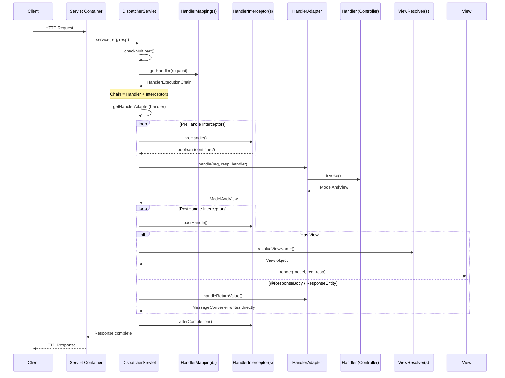

# Spring MVC Internals: Kiến Trúc Request Processing Pipeline

## 1. Mục tiêu của Task

Hiểu sâu cơ chế xử lý request trong Spring MVC từ tầng Servlet container đến controller layer, phân tích:
- Luồng xử lý request thực tế trong `DispatcherServlet`
- Cơ chế routing và adapter pattern giúp Spring MVC linh hoạt với nhiều loại controller
- Content negotiation và message conversion
- Performance implications và production tuning

> **Tư duy cốt lõi:** Spring MVC không phải là một framework "magic" - nó là một **pipeline có cấu trúc chặt chẽ** dựa trên **Chain of Responsibility** và **Adapter Pattern**, cho phép mở rộng tại mọi điểm mà không cần sửa code core.

---

## 2. Bản Chất và Cơ Chế Hoạt Động

### 2.1 DispatcherServlet: Front Controller Pattern

`DispatcherServlet` không phải là một Servlet thông thường - nó implement **Front Controller Pattern**, tập trung mọi request vào một điểm và điều phối đến các handler phù hợp.

```
┌─────────────────────────────────────────────────────────────────┐
│                    HTTP Request (Client)                        │
└──────────────────────────┬──────────────────────────────────────┘
                           │
                           ▼
┌─────────────────────────────────────────────────────────────────┐
│  Servlet Container (Tomcat/Jetty/Undertow)                      │
│  ┌─────────────────────────────────────────────────────────────┐│
│  │  ServletContext - Web Application Context                   ││
│  │  ┌─────────────────────────────────────────────────────────┐││
│  │  │  DispatcherServlet (mapped to "/" or specific pattern)  │││
│  │  │  ┌───────────────────────────────────────────────────┐  │││
│  │  │  │  doDispatch(HttpServletRequest, HttpServletResponse)│  │││
│  │  │  └───────────────────────────────────────────────────┘  │││
│  │  └─────────────────────────────────────────────────────────┘││
│  └─────────────────────────────────────────────────────────────┘│
└─────────────────────────────────────────────────────────────────┘
```

#### Bản chất cấu trúc:

| Thành phần | Vai trò | Lifecycle |
|-----------|---------|-----------|
| `DispatcherServlet` | Entry point, orchestration | Singleton per mapping |
| `WebApplicationContext` | Root context + Servlet context | Servlet init |
| `FrameworkServlet` | Base class, context management | Inheritance |
| `HttpServletBean` | Property injection from web.xml | Initialization |

#### Cơ chế khởi tạo (Quan trọng cho Production):

```
ServletContainerInitializer (Servlet 3.0+)
           │
           ▼
SpringServletContainerInitializer
    └─> scans @HandlesTypes(WebApplicationInitializer.class)
           │
           ▼
AbstractAnnotationConfigDispatcherServletInitializer
    ┌─> createRootApplicationContext()  [Parent Context - Services, Repos]
    └─> createServletApplicationContext() [Child Context - Controllers, View]
```

> **Parent-Child Context Hierarchy** là điểm then chốt:
> - **Root Context:** Chứa business logic (Services, Repositories, Security) - shared across all servlets
> - **Servlet Context:** Chứa web layer (Controllers, View resolvers) - specific cho từng servlet
> - Child context **có thể nhìn thấy** beans từ parent, nhưng **không ngược lại**
> - Điều này cho phép **multiple DispatcherServlets** trong cùng ứng dụng (ví dụ: một cho API, một cho web)

---

### 2.2 Request Processing Pipeline (doDispatch)

Đây là ** lõi của Spring MVC** - method `doDispatch()` trong `DispatcherServlet.java`:

```java
// Pseudo-code từ source Spring Framework (simplified)
protected void doDispatch(HttpServletRequest request, HttpServletResponse response) {
    HttpServletRequest processedRequest = request;
    HandlerExecutionChain mappedHandler = null;
    
    try {
        ModelAndView mv = null;
        Exception dispatchException = null;
        
        // 1. Check multipart request
        processedRequest = checkMultipart(request);
        
        // 2. Determine handler (Controller method)
        mappedHandler = getHandler(processedRequest);  // HandlerMapping chain
        
        // 3. Determine handler adapter
        HandlerAdapter ha = getHandlerAdapter(mappedHandler.getHandler());
        
        // 4. Apply preHandle interceptors
        if (!mappedHandler.applyPreHandle(processedRequest, response)) {
            return;  // Interceptor returned false - stop processing
        }
        
        // 5. Actually invoke the handler
        mv = ha.handle(processedRequest, response, mappedHandler.getHandler());
        
        // 6. Apply default view name if necessary
        applyDefaultViewName(processedRequest, mv);
        
        // 7. Apply postHandle interceptors
        mappedHandler.applyPostHandle(processedRequest, response, mv);
        
        // 8. Process the result (render view or handle exception)
        processDispatchResult(processedRequest, response, mappedHandler, mv, dispatchException);
        
    } catch (Exception ex) {
        triggerAfterCompletion(processedRequest, response, mappedHandler, ex);
    }
}
```

#### Mermaid Sequence Diagram:



---

### 2.3 HandlerMapping: Strategy Pattern cho Routing

Spring MVC hỗ trợ **nhiều HandlerMapping đồng thờI**, được xếp theo **order** (priority). Request được xử lý bởi mapping **đầu tiên** tìm thấy match.

```
┌──────────────────────────────────────────────────────────────┐
│              HandlerMapping Chain (ordered)                  │
├──────────────────────────────────────────────────────────────┤
│  Order 0: RequestMappingHandlerMapping                       │
│           └─> @RequestMapping, @GetMapping, @PostMapping...  │
│                                                              │
│  Order 1: BeanNameUrlHandlerMapping                          │
│           └─> Bean name starts with "/"                      │
│                                                              │
│  Order 2: RouterFunctionMapping (Spring 5+)                  │
│           └─> Functional routing: route(GET("/"), handler)   │
│                                                              │
│  Order Integer.MAX_VALUE-1: SimpleUrlHandlerMapping          │
│           └─> Static resources, explicit URL mappings        │
│                                                              │
│  Order Integer.MAX_VALUE: WelcomePageHandlerMapping          │
│           └─> index.html fallback                            │
└──────────────────────────────────────────────────────────────┘
```

#### RequestMappingHandlerMapping - Bản chất:

Khi application startup, `RequestMappingHandlerMapping` **quét toàn bộ beans** và tìm các method annotated với `@RequestMapping` (hoặc meta-annotations như `@GetMapping`):

```java
// Cơ chế registration tại startup
class RequestMappingHandlerMapping {
    
    @Override
    protected boolean isHandler(Class<?> beanType) {
        return AnnotatedElementUtils.hasAnnotation(beanType, Controller.class) ||
               AnnotatedElementUtils.hasAnnotation(beanType, RequestMapping.class);
    }
    
    @Override
    protected RequestMappingInfo getMappingForMethod(Method method, Class<?> handlerType) {
        // 1. Đọc annotation @RequestMapping từ method
        RequestMappingInfo info = createRequestMappingInfo(method);
        
        // 2. Merge với @RequestMapping ở class level
        RequestMappingInfo typeInfo = createRequestMappingInfo(handlerType);
        if (typeInfo != null) {
            info = typeInfo.combine(info);
        }
        
        // 3. Tạo mapping key từ: path + method + params + headers + consumes + produces
        return info;
    }
}
```

**Mapping Registration Data Structure:**

```
Map<RequestMappingInfo, HandlerMethod> handlerMethods

RequestMappingInfo chứa:
├── patterns: "/users", "/users/{id}", "/api/**"
├── methods: GET, POST, PUT
├── params: "action=create", "!deleted"
├── headers: "X-API-VERSION=2"
├── consumes: "application/json"
├── produces: "application/json"
└── condition (custom)
```

#### Request Matching Algorithm:

```java
// Simplified matching logic
boolean matches(RequestMappingInfo info, HttpServletRequest request) {
    // 1. Check HTTP method
    if (!info.getMethodsCondition().getMatchingCondition(request)) return false;
    
    // 2. Check URL pattern (AntPathMatcher or PathPatternParser - Spring 5.3+)
    if (!info.getPathPatternsCondition().getMatchingCondition(request)) return false;
    
    // 3. Check params
    if (!info.getParamsCondition().getMatchingCondition(request)) return false;
    
    // 4. Check headers
    if (!info.getHeadersCondition().getMatchingCondition(request)) return false;
    
    // 5. Check consumes (Content-Type)
    if (!info.getConsumesCondition().getMatchingCondition(request)) return false;
    
    // 6. Check produces (Accept)
    if (!info.getProducesCondition().getMatchingCondition(request)) return false;
    
    return true;
}
```

> **Trade-off: PathPatternParser (Spring 5.3+) vs AntPathMatcher:**
> 
> | Tiêu chí | AntPathMatcher | PathPatternParser |
> |----------|---------------|-------------------|
> | Syntax | `/**`, `/*`, `?` | Thêm `{*path}` (catch-all), `{param:regex}` |
> | Performance | Chậm hơn với pattern phức tạp | Nhanh hơn, pre-parse thành chain |
> | Memory | Lưu raw string | Parse thành PathPattern object |
> | Default | Pre-Spring 5.3 | Spring 5.3+ (WebFlux-only trước 5.3) |

---

### 2.4 HandlerAdapter: Adapter Pattern đa hình

Spring MVC cần hỗ trợ nhiều loại handler:
- `@Controller` annotated methods (HandlerMethod)
- `Controller` interface implementations
- `HttpRequestHandler` implementations
- `Servlet` implementations
- Functional endpoints (RouterFunction)

**HandlerAdapter** giải quyết bài toán này bằng **Adapter Pattern**:

```
┌─────────────────────────────────────────────────────────────┐
│                    HandlerAdapter Chain                     │
├─────────────────────────────────────────────────────────────┤
│  1. RequestMappingHandlerAdapter                            │
│     └─> HandlerMethod (@Controller methods)                 │
│     └─> Hỗ trợ @RequestBody, @ResponseBody, @ModelAttribute │
│     └─> Method arguments resolution, return value handling  │
│                                                             │
│  2. HandlerFunctionAdapter (Spring 5+)                      │
│     └─> RouterFunction functional endpoints                 │
│                                                             │
│  3. HttpRequestHandlerAdapter                               │
│     └─> HttpRequestHandler interface                        │
│                                                             │
│  4. SimpleControllerHandlerAdapter                          │
│     └─> Controller interface (legacy)                       │
│                                                             │
│  5. SimpleServletHandlerAdapter                             │
│     └─> Servlet instances                                   │
└─────────────────────────────────────────────────────────────┘
```

#### RequestMappingHandlerAdapter - Kiến trúc sâu:

```java
// Cấu trúc của RequestMappingHandlerAdapter
class RequestMappingHandlerAdapter {
    
    // Argument resolvers - quyết định cách binding parameter
    private List<HandlerMethodArgumentResolver> customArgumentResolvers;
    private HandlerMethodArgumentResolverComposite argumentResolvers;
    
    // Return value handlers - quyết định cách xử lý return
    private List<HandlerMethodReturnValueHandler> customReturnValueHandlers;
    private HandlerMethodReturnValueHandlerComposite returnValueHandlers;
    
    // Message converters - chuyển đổi HTTP body
    private List<HttpMessageConverter<?>> messageConverters;
    
    // Web binding initializer - custom data binding
    private WebBindingInitializer webBindingInitializer;
    
    public ModelAndView handle(HttpServletRequest request, 
                               HttpServletResponse response, 
                               Object handler) {
        
        HandlerMethod handlerMethod = (HandlerMethod) handler;
        
        // 1. Tạo invocable method với argument resolvers
        ServletInvocableHandlerMethod invocable = 
            new ServletInvocableHandlerMethod(handlerMethod);
        invocable.setArgumentResolvers(this.argumentResolvers);
        invocable.setReturnValueHandlers(this.returnValueHandlers);
        
        // 2. Resolve arguments
        Object[] args = resolveArguments(request, response, handlerMethod);
        
        // 3. Invoke method
        Object returnValue = invocable.invokeAndHandle(args);
        
        // 4. Xử lý return value (có thể viết trực tiếp response)
        if (returnValueHandlers.handleReturnValue(...)) {
            return null;  // Đã xử lý, không cần view
        }
        
        return getModelAndView(...);
    }
}
```

#### Argument Resolution Flow:

```
Request → ArgumentResolver Chain (30+ built-in resolvers):

┌─────────────────────────────────────────────────────────────┐
│ Priority    Resolver                    Annotation/Target   │
├─────────────────────────────────────────────────────────────┤
│ 1           RequestParamMethodArgumentResolver    @RequestParam│
│ 2           RequestHeaderMethodArgumentResolver   @RequestHeader│
│ 3           PathVariableMethodArgumentResolver    @PathVariable│
│ 4           ModelMethodProcessor                    Model/ModelMap│
│ 5           RequestResponseBodyMethodProcessor    @RequestBody│
│ 6           ServletModelAttributeMethodProcessor  @ModelAttribute│
│ 7           SessionAttributeMethodArgumentResolver @SessionAttribute│
│ 8           RequestAttributeMethodArgumentResolver @RequestAttribute│
│ 9           PrincipalMethodArgumentResolver       Principal│
│ 10          HttpEntityMethodProcessor             HttpEntity/RequestEntity│
│ ...         ...                                   ...│
└─────────────────────────────────────────────────────────────┘
```

---

### 2.5 View Resolution Flow

```
ModelAndView
    ├── viewName: "user/detail"  (hoặc null)
    ├── model: {user: UserObject, timestamp: Date}
    └── reference: true (là view name, không phải View object)
           │
           ▼
    ViewResolver Chain:
    ┌────────────────────────────────────────────────────────┐
    │ 1. ContentNegotiatingViewResolver                      │
    │    └─> Dựa trên Accept header hoặc path extension      │
    │        chọn ViewResolver phù hợp                       │
    │                                                        │
    │ 2. ThymeleafViewResolver (nếu dùng Thymeleaf)          │
    │    └─> Tìm template: templates/user/detail.html        │
    │                                                        │
    │ 3. InternalResourceViewResolver (JSP)                  │
    │    └─> Forward đến: /WEB-INF/views/user/detail.jsp     │
    │                                                        │
    │ 4. BeanNameViewResolver                                │
    │    └─> Tìm bean tên "user/detail" trong context        │
    └────────────────────────────────────────────────────────┘
           │
           ▼
    View object (ThymeleafView / JstlView / ...)
           │
           ▼
    view.render(model, request, response)
           │
           ▼
    HTML Response
```

---

## 3. Content Negotiation & Message Conversion

### 3.1 Content Negotiation Strategy

Content negotiation là quá trình **client và server thỏa thuận format dữ liệu** cho request/response.

```
Client                                           Server
   │                                                │
   │ POST /users HTTP/1.1                          │
   │ Content-Type: application/json    ───────────►│  ┌─────────────────────┐
   │ Accept: application/xml, application/json     │  │ ContentNegotiation  │
   │                                                │  │ Manager             │
   │◄───────────  HTTP/200                         │  │                     │
   │              Content-Type: application/json    │  │ Resolves:           │
   │              {"id": 1, "name": "John"}         │  │ - Request format    │
   │                                                │  │   (Content-Type)    │
   │                                                │  │ - Response format   │
   │                                                │  │   (Accept header)   │
   │                                                │  └─────────────────────┘
```

#### Strategies (ContentNegotiationConfigurer):

| Strategy | Mô tả | Use Case |
|----------|-------|----------|
| `HeaderContentNegotiationStrategy` | Đọc `Accept` header | API thuần, clients có thể set header |
| `ParameterContentNegotiationStrategy` | Đọc `?format=json` | Browsers, legacy clients |
| `PathExtensionContentNegotiationStrategy` | `/users.json`, `/users.xml` | Cũ, không khuyến khích (security concern) |
| `FixedContentNegotiationStrategy` | Luôn trả về format cố định | Internal APIs |

> **Security Warning (Spring 5.2.4+):** Path extension negotiation bị **disable by default** vì:
> - RCE vulnerabilities qua content type spoofing
> - Tấn công qua double extension (`user.pdf.jsp`)

### 3.2 HttpMessageConverter Chain

```
HTTP Request Body
       │
       ▼
┌─────────────────────────────────────────────────────────────┐
│              HttpMessageConverter Chain                     │
│                    (ordered list)                           │
├─────────────────────────────────────────────────────────────┤
│  0. ByteArrayHttpMessageConverter        application/octet-stream│
│  1. StringHttpMessageConverter           text/plain, */*     │
│  2. MappingJackson2HttpMessageConverter  application/json   │
│  3. MappingJackson2XmlHttpMessageConverter application/xml  │
│  4. GsonHttpMessageConverter             application/json   │
│  5. ProtobufHttpMessageConverter         application/x-protobuf│
│  ...                                                        │
└─────────────────────────────────────────────────────────────┘
       │
       ▼
Java Object (POJO)
```

#### Custom MessageConverter Registration:

```java
@Configuration
public class WebConfig implements WebMvcConfigurer {
    
    @Override
    public void configureMessageConverters(List<HttpMessageConverter<?>> converters) {
        // Thêm trước Jackson (priority cao hơn)
        converters.add(0, new ProtobufHttpMessageConverter());
        
        // Hoặc replace toàn bộ
        // converters.clear();
        // converters.add(new MyCustomConverter());
    }
}
```

---

## 4. So Sánh Các Lựa Chọn

### 4.1 Spring MVC vs Spring WebFlux

| Tiêu chí | Spring MVC | Spring WebFlux |
|----------|-----------|----------------|
| **Programming Model** | Annotation-driven (`@Controller`) | Annotation-driven + Functional (`RouterFunction`) |
| **Thread Model** | Thread-per-request (blocking I/O) | Event-loop (non-blocking I/O) |
| **Servlet API** | Required | Optional (can run on Netty) |
| **Performance** | Good for blocking workloads | Better for high concurrency, I/O-bound |
| **Learning Curve** | Lower | Higher (requires reactive mindset) |
| **Ecosystem Maturity** | Very mature | Good, but smaller |
| **Debugging** | Easier (stack traces clearer) | Harder (async chains) |
| **Use Case** | Traditional CRUD, blocking DB | Streaming, high concurrency, real-time |

### 4.2 @Controller vs @RestController

```java
@Controller
public class UserController {
    @GetMapping("/user/{id}")
    public String getUser(@PathVariable Long id, Model model) {
        model.addAttribute("user", userService.findById(id));
        return "user/detail";  // View name
    }
    
    @ResponseBody  // Cần explicit annotation
    @GetMapping("/api/user/{id}")
    public User getUserApi(@PathVariable Long id) {
        return userService.findById(id);  // JSON via HttpMessageConverter
    }
}

@RestController  // = @Controller + @ResponseBody ở class level
public class ApiController {
    @GetMapping("/api/users/{id}")
    public User getUser(@PathVariable Long id) {
        return userService.findById(id);  // Tự động @ResponseBody
    }
}
```

### 4.3 PathPatternParser vs AntPathMatcher

| Feature | AntPathMatcher | PathPatternParser |
|---------|---------------|-------------------|
| Performance | Linear scan | Pre-compiled tree |
| Memory | Lower | Higher (cache patterns) |
| Syntax | Basic wildcards | Regex support trong pattern |
| Catch-all | `/**` | `{*path}` (semantic rõ ràng hơn) |
| URI vars | `{id}` | `{id}` + constraint `{id:\d+}` |

---

## 5. Rủi Ro, Anti-patterns, Lỗi Thường Gặp

### 5.1 Common Pitfalls

| Pitfall | Nguyên nhân | Giải pháp |
|---------|-------------|-----------|
| **Circular View Path** | Controller trả về view name trùng với request path | Dùng `@ResponseBody` hoặc redirect prefix |
| **Handler Not Found** | URL pattern không khớp | Debug `HandlerMapping` chain, check order |
| **Content-Type Mismatch** | `consumes`/`produces` không khớp | Kiểm tra headers, dùng `produces = MediaType.ALL_VALUE` |
| **406 Not Acceptable** | Không tìm thấy MessageConverter phù hợp | Đảm bảo Jackson trên classpath |
| **Ambiguous Handler** | Nhiều method cùng match một request | Dùng `params`, `headers`, `consumes` để phân biệt |
| **Interceptor Not Firing** | Interceptor chưa register | Implement `WebMvcConfigurer.addInterceptors()` |

### 5.2 Anti-patterns

```java
// ❌ ANTI-PATTERN: Controller quá lớn (God Controller)
@RestController
@RequestMapping("/api")
public class ApiController {  // 50+ methods
    @GetMapping("/users") ...
    @PostMapping("/users") ...
    @GetMapping("/orders") ...
    @PostMapping("/orders") ...
    // ... 50 methods nữa
}

// ✅ SOLUTION: Single Responsibility
@RestController
@RequestMapping("/api/users")
public class UserController { ... }

@RestController
@RequestMapping("/api/orders")
public class OrderController { ... }
```

```java
// ❌ ANTI-PATTERN: Business logic trong Controller
@RestController
public class UserController {
    @PostMapping("/users")
    public User createUser(@RequestBody UserDto dto) {
        // Validation logic
        if (dto.getEmail() == null || !dto.getEmail().contains("@")) {
            throw new IllegalArgumentException();
        }
        // Database logic
        User user = new User();
        user.setEmail(dto.getEmail());
        // ... 20 dòng nữa
        return userRepository.save(user);
    }
}

// ✅ SOLUTION: Delegate to Service layer
@RestController
@RequiredArgsConstructor
public class UserController {
    private final UserService userService;
    
    @PostMapping("/users")
    public User createUser(@Valid @RequestBody UserDto dto) {
        return userService.create(dto);  // Clean, testable
    }
}
```

### 5.3 Thread Safety Issues

```java
// ❌ DANGER: Stateful controller
@RestController
public class CounterController {
    private int counter = 0;  // Shared state!
    
    @GetMapping("/count")
    public int increment() {
        return ++counter;  // Race condition!
    }
}

// ✅ SOLUTION: Stateless hoặc thread-safe
@RestController
public class CounterController {
    private final AtomicInteger counter = new AtomicInteger(0);
    
    @GetMapping("/count")
    public int increment() {
        return counter.incrementAndGet();
    }
}
```

---

## 6. Khuyến Nghị Thực Chiến Production

### 6.1 Performance Tuning

| Cấu hình | Giá trị đề xuất | Lý do |
|----------|----------------|-------|
| `spring.mvc.pathmatch.matching-strategy` | `PATH_PATTERN_PARSER` | Performance tốt hơn với pattern phức tạp |
| `spring.mvc.async.request-timeout` | `30000` (ms) | Tránh thread leak với async requests |
| `server.tomcat.threads.max` | `200` | Tùy workload, monitor actual usage |
| `server.tomcat.threads.min-spare` | `10` | Warm threads để giảm latency |
| `spring.jackson.serialization.indent_output` | `false` (prod) | Giảm payload size |

### 6.2 Monitoring & Observability

```java
@Component
public class MetricsInterceptor implements HandlerInterceptor {
    private final MeterRegistry meterRegistry;
    
    @Override
    public boolean preHandle(HttpServletRequest req, HttpServletResponse res, Object handler) {
        req.setAttribute("startTime", System.currentTimeMillis());
        return true;
    }
    
    @Override
    public void afterCompletion(HttpServletRequest req, HttpServletResponse res, 
                                Object handler, Exception ex) {
        long duration = System.currentTimeMillis() - (Long) req.getAttribute("startTime");
        String path = req.getRequestURI();
        String status = String.valueOf(res.getStatus());
        
        meterRegistry.timer("http.request", "path", path, "status", status)
                     .record(duration, TimeUnit.MILLISECONDS);
    }
}
```

### 6.3 Security Best Practices

```java
@Configuration
public class SecurityConfig {
    
    @Bean
    public SecurityFilterChain filterChain(HttpSecurity http) throws Exception {
        http
            // Disable path extension content negotiation (security)
            .mvcContentNegotiation(content -> 
                content.useAcceptHeader(true)
                       .parameterName(null))  // Disable format parameter nếu không cần
            
            // CORS cấu hình explicit
            .cors(cors -> cors.configurationSource(corsConfigurationSource()))
            
            // CSRF cho stateless API
            .csrf(csrf -> csrf.disable());  // Chỉ cho API pure, không session
        
        return http.build();
    }
}
```

### 6.4 Testing Strategy

```java
@WebMvcTest(UserController.class)
class UserControllerTest {
    
    @Autowired
    private MockMvc mockMvc;
    
    @MockBean
    private UserService userService;
    
    @Test
    void shouldReturnUser() throws Exception {
        when(userService.findById(1L)).thenReturn(new User(1L, "John"));
        
        mockMvc.perform(get("/api/users/1")
                .accept(MediaType.APPLICATION_JSON))
            .andExpect(status().isOk())
            .andExpect(jsonPath("$.name").value("John"));
    }
}
```

---

## 7. Kết Luận

Spring MVC là một **pipeline architecture** tinh vi dựa trên các pattern cổ điển:

1. **Front Controller** (`DispatcherServlet`) - Entry point duy nhất
2. **Chain of Responsibility** (`HandlerMapping`, `HandlerAdapter`) - Flexible routing
3. **Adapter Pattern** (`HandlerAdapter`) - Hỗ trợ đa dạng handler types
4. **Strategy Pattern** (`ViewResolver`, `ContentNegotiation`) - Pluggable resolution

**Bản chất cốt lõi:**
- Spring MVC **không phải magic** - nó là composition của các components đơn giản, mỗi component có responsibility rõ ràng
- **Extensibility** là first-class concern - mọi điểm trong pipeline đều có thể customize
- **Convention over Configuration** nhưng không ép buộc - có thể override bất kỳ đâu

**Trade-off quan trọng nhất:**
- Spring MVC chọn **simplicity và debuggability** over **raw performance**
- Thread-per-request model dễ hiểu nhưng có giới hạn scalability
- Với high-concurrency I/O-bound workloads, cân nhắc WebFlux hoặc virtual threads (Java 21+)

**Rủi ro lớn nhất trong production:**
- Thread pool exhaustion với blocking operations
- Memory leak từ stateful controllers
- Security vulnerabilities từ misconfigured content negotiation

---

## 8. Tài Liệu Tham Khảo

- Spring Framework Documentation: Web Servlet
- Spring MVC Source Code: `DispatcherServlet.java`, `RequestMappingHandlerMapping.java`
- "Pro Spring 6" - Apress
- Spring Boot 3.0+ Reference Documentation