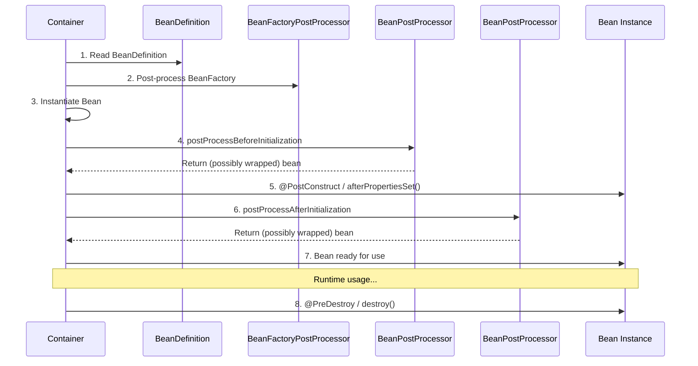
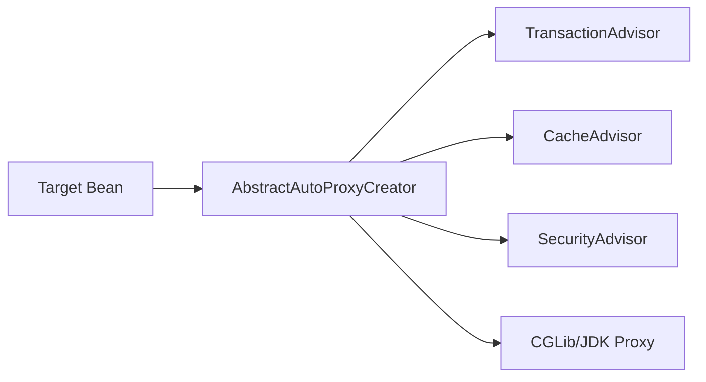

# Spring IoC Container - Deep Dive

## 1. Mục tiêu của Task

Hiểu sâu cơ chế **Inversion of Control (IoC)** trong Spring Framework - nền tảng kiến trúc làm nên sự khác biệt của Spring so với các framework truyền thống. Mục tiêu là nắm vững:

- Bản chất của IoC và cách Spring Container quản lý vòng đỏi đối tượng
- Sự khác biệt giữa BeanFactory và ApplicationContext ở tầng kiến trúc
- Cơ chế Dependency Injection (DI) và các chiến lược inject
- Cách Spring xử lý circular dependencies - một vấn đề thực tế thường gặp
- Mở rộng container behavior qua BeanPostProcessor và BeanDefinition

> **Tại sao điều này quan trọng?** IoC Container là trái tim của Spring. Không hiểu sâu nó, bạn sẽ liên tục gặp khó khăn với: transaction không hoạt động đúng, proxy không được tạo, circular dependency lỗi runtime, memory leak trong container, và không thể debug khi có vấn đề.

---

## 2. Bản Chất và Cơ Chế Hoạt Động

### 2.1 IoC Không Chỉ Là "Đảo Ngược Control"

**IoC thực sự là gì?**

Trước Spring, code Java truyền thống tuân theo pattern:

```
Class A cần B → A tự new B() → A quản lý lifecycle của B
```

Vấn đề: **Tight coupling**, khó test, khó thay đổi implementation.

**IoC chuyển đổi thành:**

```
Container tạo và quản lý tất cả objects → Inject dependencies vào objects khi cần
```

> **Bản chất sâu:** IoC Container là một **registry + factory + lifecycle manager** kết hợp. Nó không chỉ "tạo object" - nó quản lý toàn bộ vòng đồi, relationships, configuration, và mở rộng behavior.

### 2.2 Container Architecture

```mermaid
graph TB
    subgraph "Spring IoC Container"
        BD[BeanDefinition Registry]
        BF[Bean Factory]
        AC[Application Context]
        BPP[BeanPostProcessors]
        BR[Bean Registry - Singleton Pool]
    end
    
    subgraph "Configuration Sources"
        XML[XML Config]
        ANN[@Configuration Classes]
        SCAN[Component Scanning]
        PROP[Properties/YAML]
    end
    
    XML --> BD
    ANN --> BD
    SCAN --> BD
    PROP --> BD
    
    BD --> BF
    BF --> BPP
    BPP --> BR
    AC --> BF
```

**Luồng hoạt động từ startup đến runtime:**

1. **Configuration Parsing**: Container đọc config (XML/Java/Annotations) → tạo BeanDefinition objects
2. **BeanDefinition Registration**: Lưu metadata vào registry (không tạo instance yet)
3. **BeanFactory Post-Processing**: Mở rộng/modify BeanDefinitions trước khi instantiate
4. **Bean Instantiation**: Tạo instances theo scope (singleton, prototype, etc.)
5. **Dependency Injection**: Resolve và inject dependencies
6. **Bean Post-Processing**: Gọi BeanPostProcessors để wrap/modify beans
7. **Initialization**: Gọi @PostConstruct, InitializingBean.afterPropertiesSet()
8. **Ready for use**: Beans được lấy ra qua getBean()
9. **Destruction**: @PreDestroy, DisposableBean.destroy() khi context close

---

## 3. BeanFactory vs ApplicationContext

### 3.1 Phân Biệt Kiến Trúc

| Aspect | BeanFactory | ApplicationContext |
|--------|-------------|-------------------|
| **Interface** | `org.springframework.beans.factory.BeanFactory` | `org.springframework.context.ApplicationContext` |
| **Extend** | Basic interface | extends BeanFactory, adds enterprise features |
| **Eager Loading** | Lazy by default | Eager singleton instantiation |
| **MessageSource** | Không hỗ trợ | i18n message resolution |
| **Event Publishing** | Không | ApplicationEvent multicasting |
| **Resource Loading** | Limited | Unified resource loading |
| **AOP Integration** | Manual | Built-in integration |
| **Use Case** | Memory-constrained, lazy loading | Enterprise applications |

### 3.2 Khi Nào Dùng BeanFactory?

> **Rare case:** Embedded systems, mobile apps (Spring on Android), hoặc khi bạn cần kiểm soát tuyệt đối memory footprint và muốn lazy loading 100%.

```java
// BeanFactory - lazy, minimal footprint
DefaultListableBeanFactory factory = new DefaultListableBeanFactory();
XmlBeanDefinitionReader reader = new XmlBeanDefinitionReader(factory);
reader.loadBeanDefinitions(new FileSystemResource("beans.xml"));

// Bean chỉ được tạo khi gọi getBean()
MyService service = factory.getBean(MyService.class);
```

**Trade-off của BeanFactory:**
- ✅ Tiết kiệm memory startup (không tạo beans cho đến khi cần)
- ✅ Linh hoạt hơn trong việc kiểm soát lifecycle
- ❌ Không tự động post-process beans
- ❌ Không hỗ trợ AOP auto-proxying
- ❌ Không có event mechanism
- ❌ Phải manual gọi BeanFactoryPostProcessors

### 3.3 ApplicationContext - Production Standard

```java
// Eager instantiation, full enterprise features
AnnotationConfigApplicationContext context = 
    new AnnotationConfigApplicationContext(AppConfig.class);
```

**Tại sao ApplicationContext được khuyến nghị cho production:**

1. **Pre-instantiates singletons**: Detect lỗi configuration sớm (fail-fast)
2. **Auto-detects BeanPostProcessors**: AOP proxy tự động được tạo
3. **Event system**: Publish-subscribe giữa components
4. **Resource abstraction**: Load file từ classpath, filesystem, URL thống nhất
5. **MessageSource**: i18n không cần external libraries

> **Key Insight:** ApplicationContext không chỉ "nhiều feature hơn" - nó đảm bảo **correctness** qua eager instantiation và auto-configuration.

---

## 4. BeanDefinition - Metadata Core

### 4.1 BeanDefinition là gì?

**BeanDefinition = Blueprint để tạo bean instance**

Nó chứa:
- Bean class name
- Scope (singleton, prototype, request, session, etc.)
- Constructor arguments
- Property values
- Initialization/destruction methods
- Dependency flags (autowire candidates, primary)

```mermaid
graph LR
    Config[Config Source] --> BD[BeanDefinition]
    BD --> BF[BeanFactory]
    BF --> Instance[Bean Instance]
    
    BD -->|contains| Class[Bean Class]
    BD -->|contains| Scope[Scope: singleton/prototype]
    BD -->|contains| Props[Property Values]
    BD -->|contains| Cons[Constructor Args]
    BD -->|contains| Init[@PostConstruct Method]
    BD -->|contains| Destroy[@PreDestroy Method]
```

### 4.2 BeanDefinition Hierarchy

```
BeanDefinition (interface)
    ├── AbstractBeanDefinition (abstract)
    │       ├── RootBeanDefinition
    │       └── ChildBeanDefinition (legacy, rare)
    ├── AnnotatedBeanDefinition (interface)
    │       └── AnnotatedGenericBeanDefinition
    └── ScannedGenericBeanDefinition
```

**RootBeanDefinition:** Merged definition, không có parent. Được dùng để tạo instance thực tế.

**AnnotatedGenericBeanDefinition:** Tạo từ @Configuration classes hoặc @Bean methods.

**ScannedGenericBeanDefinition:** Tạo từ component scanning (@Component, @Service, etc.).

### 4.3 BeanDefinitionRegistry

Container implements `BeanDefinitionRegistry` để quản lý các BeanDefinition:

```java
// Ví dụ: Programmatically register bean
defaultListableBeanFactory.registerBeanDefinition(
    "myService", 
    BeanDefinitionBuilder
        .genericBeanDefinition(MyService.class)
        .setScope(ConfigurableBeanFactory.SCOPE_PROTOTYPE)
        .addPropertyValue("dependency", new RuntimeBeanReference("otherBean"))
        .getBeanDefinition()
);
```

> **Production Concern:** Số lượng BeanDefinition ảnh hưởng trực tiếp đến **startup time**. Trong microservices lớn, thấy 1000+ BeanDefinitions là bình thường. Profile startup để tối ưu.

---

## 5. Bean Lifecycle và Extension Points

### 5.1 Complete Lifecycle Flow



### 5.2 Các Extension Points Quan Trọng

**1. BeanFactoryPostProcessor**
- Chạy **trước** khi bất kỳ bean nào được tạo
- Modify BeanDefinitions (không phải instances)
- Ví dụ: PropertySourcesPlaceholderConfigurer để resolve ${...}

**2. BeanPostProcessor**
- Chạy **sau** instantiation, **trước/sau** initialization
- Có thể wrap/replace bean instance
- Ví dụ: AutowiredAnnotationBeanPostProcessor (xử lý @Autowired), AbstractAutoProxyCreator (tạo AOP proxies)

**3. InitializingBean / @PostConstruct**
- Logic initialization sau khi properties được set
- @PostConstruct được khuyến nghị hơn InitializingBean (không couple với Spring)

**4. DisposableBean / @PreDestroy**
- Cleanup logic trước khi bean bị destroy
- Release resources: database connections, file handles, threads

### 5.3 Thứ Tự Thực Thi

```
1. BeanFactoryPostProcessor#postProcessBeanFactory
2. Instantiation (constructor)
3. Property population (setter injection)
4. BeanNameAware#setBeanName
5. BeanClassLoaderAware#setBeanClassLoader
6. BeanFactoryAware#setBeanFactory
7. EnvironmentAware#setEnvironment (ApplicationContext only)
8. ResourceLoaderAware#setResourceLoader (ApplicationContext only)
9. ApplicationEventPublisherAware#setApplicationEventPublisher
10. MessageSourceAware#setMessageSource
11. ApplicationContextAware#setApplicationContext
12. ServletContextAware#setServletContext (web apps)
13. BeanPostProcessor#postProcessBeforeInitialization
14. @PostConstruct
15. InitializingBean#afterPropertiesSet
16. Custom init-method
17. BeanPostProcessor#postProcessAfterInitialization
18. Bean ready
19. @PreDestroy
20. DisposableBean#destroy
21. Custom destroy-method
```

---

## 6. Dependency Injection Mechanisms

### 6.1 Ba Loại Injection

| Loại | Ưu điểm | Nhược điểm | Khi nào dùng |
|------|---------|-----------|--------------|
| **Constructor** | Immutable, required dependencies, dễ test | Nhiều dependencies → constructor dài | Mặc định khuyến nghị từ Spring 4.3+ |
| **Setter** | Optional dependencies, có thể reconfigure | Object có thể ở inconsistent state | Optional dependencies, circular refs |
| **Field** | Ngắn gọn, clean | Khó test (không thể mock), không immutable | Prototype, testing, demo |

### 6.2 Constructor Injection - Best Practice

```java
@Service
public class OrderService {
    private final PaymentGateway paymentGateway;
    private final InventoryService inventoryService;
    
    // Spring 4.3+: Không cần @Autowired nếu chỉ có 1 constructor
    public OrderService(PaymentGateway paymentGateway, 
                        InventoryService inventoryService) {
        this.paymentGateway = paymentGateway;
        this.inventoryService = inventoryService;
    }
}
```

**Tại sao Constructor Injection được khuyến nghị:**

1. **Fail-fast**: Thiếu dependency → lỗi startup, không phải runtime
2. **Immutability**: Dependencies có thể là final
3. **No circular dependencies**: Spring báo lỗi rõ ràng (trừ khi dùng setter)
4. **Testability**: Dễ dàng mock dependencies trong unit test

### 6.3 Autowiring Strategies

**byType (mặc định):** Tìm bean có type phù hợp.

**byName:** Match theo property name.

**@Qualifier:** Phân biệt khi có nhiều bean cùng type.

```java
@Service
public class NotificationService {
    private final MessageSender emailSender;
    private final MessageSender smsSender;
    
    public NotificationService(
        @Qualifier("emailSender") MessageSender emailSender,
        @Qualifier("smsSender") MessageSender smsSender) {
        this.emailSender = emailSender;
        this.smsSender = smsSender;
    }
}
```

**@Primary:** Đánh dấu bean mặc định khi có ambiguity.

> **Trade-off:** @Primary tiện lợi nhưng ẩn intent. @Qualifier explicit hơn, dễ đọc code hơn, nhưng verbose. Dùng @Primary cho bean "main implementation", @Qualifier cho special cases.

---

## 7. Circular Dependencies - Vấn Đề Thực Tế

### 7.1 Circular Dependency là gì?

```java
// Ví dụ: Circular dependency qua constructor
@Service
public class ServiceA {
    private final ServiceB serviceB;
    public ServiceA(ServiceB serviceB) { this.serviceB = serviceB; }
}

@Service
public class ServiceB {
    private final ServiceA serviceA;  
    public ServiceB(ServiceA serviceA) { this.serviceA = serviceA; }
}
```

**Kết quả:** `BeanCurrentlyInCreationException`

### 7.2 Cách Spring Xử Lý

**Constructor Injection:** Spring **không thể** resolve. Bắt buộc phải refactor.

**Setter/Field Injection:** Spring có thể resolve bằng 3-phase approach:

```
Phase 1: Instantiate A (gọi constructor, chưa inject)
Phase 2: Instantiate B (gọi constructor, chưa inject)  
Phase 3: Populate properties - inject B vào A, inject A vào B
```

### 7.3 Giải Pháp Thực Tế

**1. Refactor để loại bỏ circular dependency (Best)**

Tách shared logic vào third class:

```java
@Service
public class ServiceA {
    private final SharedLogic sharedLogic;
}

@Service
public class ServiceB {
    private final SharedLogic sharedLogic;
}
```

**2. Dùng @Lazy**

```java
@Service
public class ServiceA {
    private final ServiceB serviceB;
    
    public ServiceA(@Lazy ServiceB serviceB) {
        this.serviceB = serviceB;
    }
}
```

@Lazy tạo proxy, delay actual resolution đến lần đầu sử dụng.

**3. Dùng Setter Injection**

```java
@Service
public class ServiceA {
    private ServiceB serviceB;
    
    @Autowired
    public void setServiceB(ServiceB serviceB) {
        this.serviceB = serviceB;
    }
}
```

> **Anti-pattern warning:** Setter injection cho circular dependency chỉ là workaround. Nó làm cho code khó hiểu, khó test, và che giấu architectural problem.

### 7.4 Detect Circular Dependencies Sớm

```properties
# Bật báo cáo circular dependencies
spring.main.allow-circular-references=false
spring.main.allow-bean-definition-overriding=false
```

Hoặc dùng BeanFactoryPostProcessor tùy chỉnh để analyze dependency graph.

---

## 8. BeanPostProcessor Deep Dive

### 8.1 Cơ Chế Proxy Creation

BeanPostProcessor là nơi Spring tạo **AOP proxies**:



**Quy trình:**

1. Container tạo target bean instance
2. AbstractAutoProxyCreator (BeanPostProcessor) kiểm tra advisors
3. Nếu có advisors match → wrap bean trong proxy
4. Proxy intercepts method calls → chạy advice chain → delegate to target

### 8.2 Custom BeanPostProcessor

```java
@Component
public class MetricsBeanPostProcessor implements BeanPostProcessor {
    
    @Override
    public Object postProcessAfterInitialization(Object bean, String beanName) {
        if (bean instanceof ServiceMetrics) {
            return Proxy.newProxyInstance(
                bean.getClass().getClassLoader(),
                bean.getClass().getInterfaces(),
                new MetricsInvocationHandler(bean)
            );
        }
        return bean;
    }
}
```

> **Caution:** BeanPostProcessor ảnh hưởng đến **tất cả beans** trong container. Logic phải lightweight, tránh expensive operations.

### 8.3 Thứ Tự BeanPostProcessors

Spring sắp xếp BPP theo `Ordered` interface hoặc `@Order`:

```java
@Component
@Order(Ordered.HIGHEST_PRECEDENCE)  // Chạy đầu tiên
public class SecurityBPP implements BeanPostProcessor { }

@Component  
@Order(Ordered.LOWEST_PRECEDENCE)   // Chạy cuối cùng
public class MetricsBPP implements BeanPostProcessor { }
```

**Thứ tự mặc định quan trọng:**
1. AutowiredAnnotationBeanPostProcessor (resolution dependencies)
2. CommonAnnotationBeanPostProcessor (@PostConstruct, @PreDestroy)
3. AbstractAutoProxyCreator (AOP proxying)

---

## 9. Trade-offs và Production Concerns

### 9.1 Startup Time vs Runtime Performance

| Approach | Startup | Runtime | Memory |
|----------|---------|---------|--------|
| Eager singletons (default) | Chậm (tạo tất cả) | Nhanh (sẵn sàng) | Cao |
| Lazy initialization | Nhanh | Chậm (lần đầu dùng) | Thấp |
| @Scope("prototype") | Nhanh | Chậm (tạo mới mỗi lần) | Thấp |

**@Lazy strategy:**

```java
@Configuration
public class Config {
    
    @Bean
    @Lazy  // Chỉ tạo khi được inject hoặc getBean()
    public HeavyService heavyService() {
        return new HeavyService();
    }
}
```

### 9.2 Memory Considerations

**Singleton Pool:** Mặc định không giới hạn. Trong ứng dụng lớn, có thể có 1000+ singletons.

**Prototype Beans:** Container không quản lý lifecycle. Nếu prototype chứa resources (connections, threads), phải tự cleanup hoặc dùng custom scope.

### 9.3 Monitoring và Debugging

**Actuator endpoints:**

```
/actuator/beans          - Liệt kê tất cả beans
/actuator/conditions     - Tại sao bean được/không được tạo
/actuator/configprops    - Configuration properties
```

**Debug logging:**

```properties
logging.level.org.springframework.beans.factory=DEBUG
```

### 9.4 Common Pitfalls

| Pitfall | Tại sao xảy ra | Cách tránh |
|---------|---------------|------------|
| **@Transactional không hoạt động** | Gọi method internal, bypass proxy | Dùng AopContext, tách ra bean khác |
| **@Async gây deadlock** | Circular call trong cùng class | Tách async logic ra bean riêng |
| **Memory leak với @Schedule** | Bean đã destroy nhưng task còn chạy | Implement DisposableBean để cancel |
| **Non-unique bean names** | Component scan trùng class name | Đặt tên rõ ràng, dùng @Qualifier |
| **Wrong proxy type** | Final class với CGLib | Không đánh final, hoặc dùng interface |

---

## 10. So Sánh với Các Framework Khác

| Feature | Spring IoC | Google Guice | CDI (Weld) | Micronaut |
|---------|------------|--------------|------------|-----------|
| Configuration | XML/Annotation/Java | Annotation/Module | Annotation | Annotation |
| Compile-time DI | No | No | No | **Yes** |
| Startup time | Medium | Fast | Medium | **Fast** |
| AOP Integration | Excellent | Good | Good | Good |
| Learning curve | Steep | Medium | Medium | Medium |
| Ecosystem | Massive | Small | Medium | Growing |

**Micronaut's advantage:** Compile-time DI → no reflection at runtime → faster startup, lower memory.

**Spring's response:** Spring AOT (Ahead-of-Time) processing in Spring Boot 3.x.

---

## 11. Kết Luận

**Bản chất Spring IoC Container:**

1. **Registry + Factory + Lifecycle Manager** - không chỉ là "dependency injector"
2. **Convention over Configuration** - nhưng cho phép override mọi nơi
3. **Extension via BeanPostProcessor** - kiến trúc mở cho AOP, monitoring, custom logic

**Key Takeaways cho Production:**

> - **Constructor injection là mặc định** - immutable, fail-fast, testable
> - **Tránh circular dependencies** - refactor architecture, đừng dùng @Lazy như workaround
> - **Hiểu proxy mechanism** - @Transactional/@Async không hoạt động với internal calls
> - **Startup time matters** - profile và optimize khi có 500+ beans
> - **Actuator là bạn** - dùng /beans và /conditions để debug configuration

**Khi nào KHÔNG nên dùng Spring IoC:**
- Command-line tools đơn giản (dùng pure Java hoặc Picocli)
- Serverless functions yêu cầu cold start < 100ms (xem xét Micronaut/Quarkus)
- Library/framework để publish (tránh couple với Spring)

---

*Research completed: Spring IoC Container - From BeanDefinition to Production*
