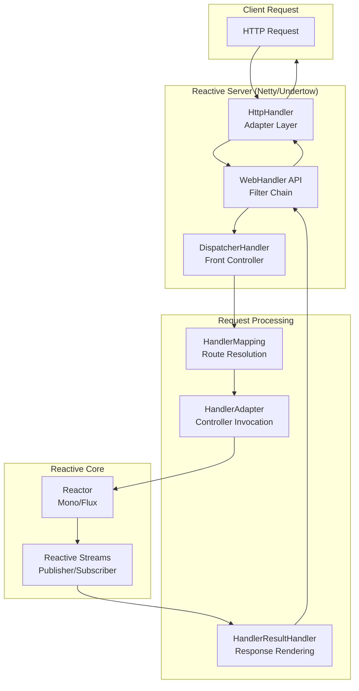

# Spring WebFlux & Project Reactor: Kiến trúc Reactive Stack

## 1. Mục tiêu của Task

Nghiên cứu sâu về Spring WebFlux - reactive web framework của Spring và Project Reactor - thư viện reactive cơ sở. Tập trung vào:
- Bản chất của lập trình reactive và sự khác biệt với mô hình thread-per-request truyền thống
- Cơ chế backpressure - yếu tố then chốt trong reactive streams
- Kiến trúc event loop và cách xử lý concurrency
- Chiến lược migration từ Spring MVC sang WebFlux

---

## 2. Bản chất và Cơ chế Hoạt động

### 2.1. Reactive Programming: Định nghĩa và Bản chất

> **Reactive programming** là paradigm lập trình không đồng bộ (asynchronous) tập trung vào data streams và sự lan truyền của thay đổi (propagation of change).

**Bản chất cốt lõi:**
- **Push-based**: Dữ liệu được "đẩy" từ Publisher đến Subscriber khi có sẵn, thay vì Subscriber phải "kéo" (pull) như Iterator pattern
- **Non-blocking**: Thread không bị block khi chờ I/O, có thể xử lý request khác
- **Declarative**: Lập trình viên mô tả "logic tính toán" thay vì "luồng điều khiển"

**Signal trong Reactive Streams:**
```
onNext x 0..N [onError | onComplete]
```

Mọi stream đều có thể phát ra N giá trị (onNext), sau đó kết thúc thành công (onComplete) hoặc lỗi (onError).

### 2.2. Project Reactor: Mono vs Flux

Reactor cung cấp 2 kiểu dữ liệu reactive chính:

| Aspect | `Mono<T>` | `Flux<T>` |
|--------|-----------|-----------|
| **Cardinality** | 0..1 items | 0..N items |
| **Use case** | Single result (HTTP response, DB query single row) | Stream of data (real-time events, list processing) |
| **Ví dụ** | `Mono<User>`, `Mono<Void>` | `Flux<User>`, `Flux<StockPrice>` |
| **Termination** | onNext + onComplete hoặc onError | N x onNext + (onComplete \| onError) |

**Tại sao cần phân biệt Mono/Flux?**
- **Semantic clarity**: Type system thể hiện rõ cardinality của operation
- **Operator availability**: Mono không có operators như `buffer()`, `window()` - vô nghĩa với single value
- **Performance optimization**: Implementation có thể optimize dựa trên cardinality known at compile time

### 2.3. Backpressure: Cơ chế Kiểm soát Tốc độ

> **Backpressure** là cơ chế cho phép Subscriber kiểm soát tốc độ mà Publisher phát dữ liệu.

**Bản chất vấn đề:**
- Trong hệ thống synchronous: Blocking tự nhiên tạo backpressure (caller phải đợi)
- Trong hệ thống non-blocking: Fast producer có thể overwhelm slow consumer → OOM, mất dữ liệu

**Reactive Streams Backpressure Protocol:**

```
Publisher → onSubscribe(Subscription) → Subscriber
                ↓
Subscriber → request(n) → Publisher  (demand signaling)
                ↓
Publisher → onNext(data) → Subscriber (max n items)
```

**Các chiến lược xử lý khi Producer nhanh hơn Consumer:**

| Strategy | Behavior | Use Case |
|----------|----------|----------|
| **BUFFER** | Lưu vào buffer (có giới hạn) | Burst handling, tolerate temporary lag |
| **DROP** | Bỏ qua items mới nhất | Real-time metrics, only care about latest |
| **LATEST** | Giữ item mới nhất, bỏ cũ | Stock prices, sensor readings |
| **ERROR** | Phát lỗi khi overflow | Strict reliability requirements |

### 2.4. Threading Model: Event Loop vs Thread-per-Request

**Spring MVC (Thread-per-Request):**
- Mỗi request → 1 thread được allocate
- Thread bị block khi gọi I/O (DB, HTTP client)
- Servlet container cần large thread pool (hundreds) để absorb blocking

**Spring WebFlux (Event Loop):**
```
┌─────────────────────────────────────────────────────────────┐
│  Event Loop Thread Pool (CPU cores x 2, typically)         │
│  ┌──────────────┐  ┌──────────────┐  ┌──────────────┐      │
│  │ Event Loop 1 │  │ Event Loop 2 │  │ Event Loop N │      │
│  │              │  │              │  │              │      │
│  │ • Accept     │  │ • Accept     │  │ • Accept     │      │
│  │ • Read       │  │ • Read       │  │ • Read       │      │
│  │ • Dispatch   │  │ • Dispatch   │  │ • Dispatch   │      │
│  │ • Callback   │  │ • Callback   │  │ • Callback   │      │
│  └──────────────┘  └──────────────┘  └──────────────┘      │
└─────────────────────────────────────────────────────────────┘
                        ↓
              Không bao giờ block event loop!
```

**Quy tắc sống còn:**
> **"Never block the event loop"** - Nếu block, toàn bộ server ngừng nhận request mới trên thread đó.

**Scheduler trong Reactor:**
- `Schedulers.immediate()`: Current thread
- `Schedulers.single()`: Single dedicated thread
- `Schedulers.parallel()`: Fixed pool (CPU cores)
- `Schedulers.boundedElastic()`: Growing pool cho blocking operations
- `Schedulers.fromExecutor()`: Custom Executor

---

## 3. Kiến trúc và Luồng Xử lý

### 3.1. WebFlux Architecture Overview



### 3.2. DispatcherHandler Flow

DispatcherHandler trong WebFlux tương đương DispatcherServlet trong MVC:

```
Request → HttpHandler → WebHandler (Filters) → DispatcherHandler
                                              ↓
                    ┌─────────────────────────┼─────────────────────────┐
                    ↓                         ↓                         ↓
            HandlerMapping 1          HandlerMapping 2         HandlerMapping N
            (@RequestMapping)         (RouterFunction)         (SimpleUrl)
                    ↓                         ↓                         ↓
            HandlerAdapter 1          HandlerAdapter 2         HandlerAdapter N
            (InvocableHandler)        (HandlerFunction)        (WebHandler)
                    ↓                         ↓                         ↓
            HandlerResultHandler  (ResponseEntity/View/ResponseBody)
                    ↓
            ServerResponse
```

### 3.3. Request Processing Pipeline

**Annotated Controller (Quen thuộc với MVC developer):**
```java
@RestController
public class UserController {
    @GetMapping("/users/{id}")
    public Mono<User> getUser(@PathVariable String id) {
        return userService.findById(id);  // Non-blocking DB call
    }
    
    @GetMapping("/users")
    public Flux<User> listUsers() {
        return userService.findAll();  // Stream of users
    }
}
```

**Functional Endpoints (Router Functions):**
```java
@Bean
public RouterFunction<ServerResponse> routes(UserHandler handler) {
    return route()
        .GET("/users/{id}", accept(APPLICATION_JSON), handler::getUser)
        .GET("/users", accept(APPLICATION_JSON), handler::listUsers)
        .POST("/users", handler::createUser)
        .build();
}
```

**So sánh Programming Models:**

| Aspect | Annotated Controllers | Functional Endpoints |
|--------|----------------------|---------------------|
| **Abstraction** | High-level, declarative | Low-level, explicit |
| **Control** | Framework calls you | You control flow |
| **Testing** | MockMvc, @WebFluxTest | Direct function testing |
| **Composition** | Annotation inheritance | Function composition |
| **Use case** | Standard REST APIs | Complex routing, filters |

---

## 4. So sánh Spring MVC vs Spring WebFlux

### 4.1. Concurrency Model

| Characteristic | Spring MVC | Spring WebFlux |
|---------------|------------|----------------|
| **Default Thread Model** | Thread-per-request | Event loop (few threads) |
| **Thread Pool Size** | Large (100s) | Small (CPU cores x 2) |
| **Blocking I/O** | Native support | Must avoid or offload |
| **Servlet API** | Full support | Adapter only (hidden) |
| **Programming Style** | Imperative | Declarative/Reactive |

### 4.2. Performance Characteristics

**WebFlux KHÔNG nhanh hơn MVC cho mọi use case:**

> Reactive và non-blocking **không làm ứng dụng chạy nhanh hơn** trong mọi trường hợp. Thậm chí, xử lý non-blocking cần nhiều công sức hơn, có thể làm tăng thời gian xử lý của một request đơn lẻ.

**WebFlux vượt trội khi:**
- High latency operations (network calls, DB queries)
- Mixed fast/slow request patterns
- Streaming data (SSE, NDJSON)
- Resource-constrained environments (fewer threads, less memory)

**WebFlux không phù hợp khi:**
- Compute-intensive tasks (block event loop)
- Simple CRUD với low latency
- Team chưa sẵn sàng cho paradigm shift

### 4.3. Migration Strategies

**Incremental Migration Path:**

```
Phase 1: Spring MVC + Reactive WebClient
    ↓
Phase 2: MVC Controllers return Mono/Flux
    ↓  
Phase 3: Mixed MVC/WebFlux in microservices
    ↓
Phase 4: Full WebFlux (where appropriate)
```

**Step 1: Reactive WebClient trong MVC**
```java
// MVC Controller using reactive WebClient
@GetMapping("/aggregate")
public List<Data> aggregate() {
    return webClient.get()
        .uri("/service1")
        .retrieve()
        .bodyToMono(Data.class)
        .zipWith(
            webClient.get().uri("/service2").retrieve().bodyToMono(Data.class),
            this::merge
        )
        .block(); // Blocking at the edge - acceptable for transition
}
```

**Step 2: Return Reactive Types từ MVC**
```java
// Spring MVC hỗ trợ return Mono/Flux
@RestController
public class HybridController {
    @GetMapping("/data")
    public Mono<Data> getData() {  // Works in MVC!
        return reactiveRepository.findById(id);
    }
}
```

---

## 5. Rủi ro, Anti-patterns, và Lỗi Thường Gặp

### 5.1. Blocking trong Non-blocking Context

**DEADLY ANTI-PATTERN:**
```java
@GetMapping("/wrong")
public Mono<User> wrong() {
    return Mono.just(
        jpaRepository.findById(id)  // BLOCKING! - Deadlock risk
    );
}
```

**Solutions:**
```java
// Option 1: Offload to boundedElastic scheduler
@GetMapping("/correct1")
public Mono<User> correct1() {
    return Mono.fromCallable(() -> jpaRepository.findById(id))
        .subscribeOn(Schedulers.boundedElastic());
}

// Option 2: Use reactive repository
@GetMapping("/correct2")
public Mono<User> correct2() {
    return reactiveMongoRepository.findById(id);  // Non-blocking native
}
```

### 5.2. Calling block() trong Reactive Chain

```java
// DANGEROUS - trong event loop
dataMono.block();  // Throws BlockingOperationException

// Acceptable - trong test hoặc @PostConstruct
dataMono.block(Duration.ofSeconds(5));
```

### 5.3. Ignoring Errors

```java
// BAD - Error silently dropped
flux.subscribe();

// GOOD - Explicit error handling
flux.subscribe(
    data -> process(data),
    error -> log.error("Failed", error),
    () -> log.info("Completed")
);

// BETTER - Reactive error handling
flux
    .doOnError(error -> log.error("Failed", error))
    .onErrorResume(error -> fallbackFlux)
    .subscribe();
```

### 5.4. Memory Leaks với ByteBuf

Khi dùng Netty, DataBuffer (ByteBuf) là reference-counted:
```java
// RISK - Not releasing buffer
dataBuffer.read();

// SAFE - Let codecs handle it or use doOnDiscard
```

### 5.5. Common Production Issues

| Issue | Symptom | Solution |
|-------|---------|----------|
| Event loop blocked | Latency spikes, thread starvation | Identify blocking calls, use `publishOn(boundedElastic)` |
| Missing backpressure | OOM, OutOfDirectMemoryError | Apply `onBackpressureBuffer/Drop/Latest` |
| Subscription leak | Memory leak, resource exhaustion | Always subscribe, use `takeUntil`, dispose subscriptions |
| Blocking WebClient | Thread pool exhaustion | Use reactive WebClient, not RestTemplate |

---

## 6. Khuyến nghị Thực chiến trong Production

### 6.1. Khi nào nên dùng WebFlux?

**NÊN DÙNG khi:**
- Microservices gọi nhau qua network (high latency)
- Real-time streaming (SSE, WebSocket)
- Resource constraints (container với limited memory/threads)
- Gateway/API Proxy layer

**KHÔNG NÊN DÙNG khi:**
- Heavy blocking I/O không thể tránh (JDBC without R2DBC)
- Team chưa có kinh nghiệm reactive
- Simple CRUD với low latency (< 100ms)

### 6.2. Monitoring và Observability

**Metrics quan trọng:**
```java
// Micrometer integration
Mono<User> userMono = userService.findById(id)
    .name("user.findById")  
    .metrics()  // Tự động publish metrics
    .tap(Micrometer.observation(registry));
```

**Theo dõi:**
- Event loop utilization (should be < 50%)
- Queue depth và wait time
- Backpressure drops
- Reactive stream completion/error rates

### 6.3. Database Access

| Technology | Reactive Support | Notes |
|------------|-----------------|-------|
| **R2DBC** | ✅ Native | Reactive alternative to JDBC |
| **MongoDB Reactive Driver** | ✅ Native | Direct driver support |
| **Redis (Lettuce)** | ✅ Native | Async driver |
| **JPA/Hibernate** | ❌ Blocking | Use `boundedElastic` hoặc avoid |
| **JDBC** | ❌ Blocking | R2DBC là replacement |

### 6.4. Testing Strategies

```java
// Unit test với StepVerifier
@Test
void testFlux() {
    Flux<String> flux = service.getData();
    
    StepVerifier.create(flux)
        .expectNext("A", "B", "C")
        .expectComplete()
        .verify();
}

// Virtual time testing
@Test
void testWithTime() {
    StepVerifier.withVirtualTime(() -> service.intervalData())
        .thenAwait(Duration.ofSeconds(3))
        .expectNextCount(3)
        .thenCancel()
        .verify();
}
```

---

## 7. Kết luận

**Bản chất của Spring WebFlux:**
WebFlux là sự đánh đổi (trade-off) giữa **complexity** và **scalability**. Nó không làm code nhanh hơn, nhưng giúp hệ thống **scale tốt hơn với ít resources hơn** trong môi trường có latency cao.

**Những điểm then chốt cần nhớ:**

1. **Backpressure là tính năng then chốt** - điều phân biệt reactive streams với async/await đơn thuần
2. **"Never block the event loop"** - quy tắc sống còn
3. **Mono/Flux là semantic types** - thể hiện cardinality, không chỉ là wrapper
4. **Migration có thể incremental** - bắt đầu với WebClient trong MVC
5. **Không phải silver bullet** - dùng đúng use case, không phải vì hype

**Quyết định kiến trúc:**
- Nếu có blocking dependencies (JPA), ở lại MVC hoặc dùng hybrid approach
- Nếu làm gateway/microservices communication, WebFlux là lựa chọn tốt
- Nếu team sẵn sàng learning curve, WebFlux mang lại operational benefits

---

## 8. Tài liệu Tham khảo

- [Spring WebFlux Documentation](https://docs.spring.io/spring-framework/reference/web/webflux.html)
- [Project Reactor Reference](https://projectreactor.io/docs/core/release/reference/)
- [Reactive Streams Specification](https://www.reactive-streams.org/)
- "Reactive Programming with RxJava" - Tomasz Nurkiewicz
- "Learning Reactive Programming with Java 8" - Nickolay Tsvetinov
