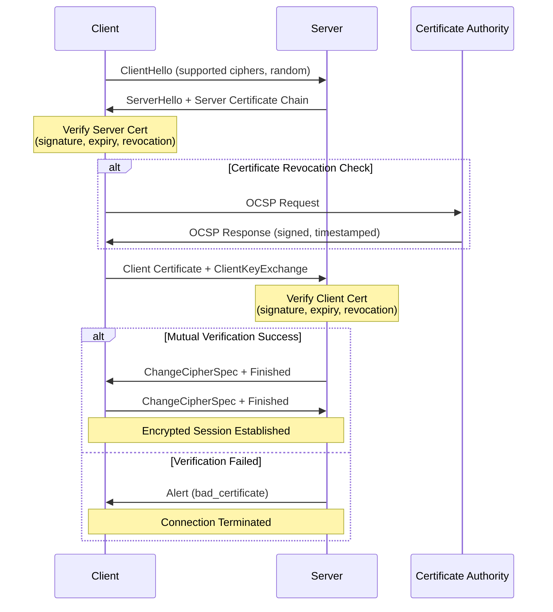
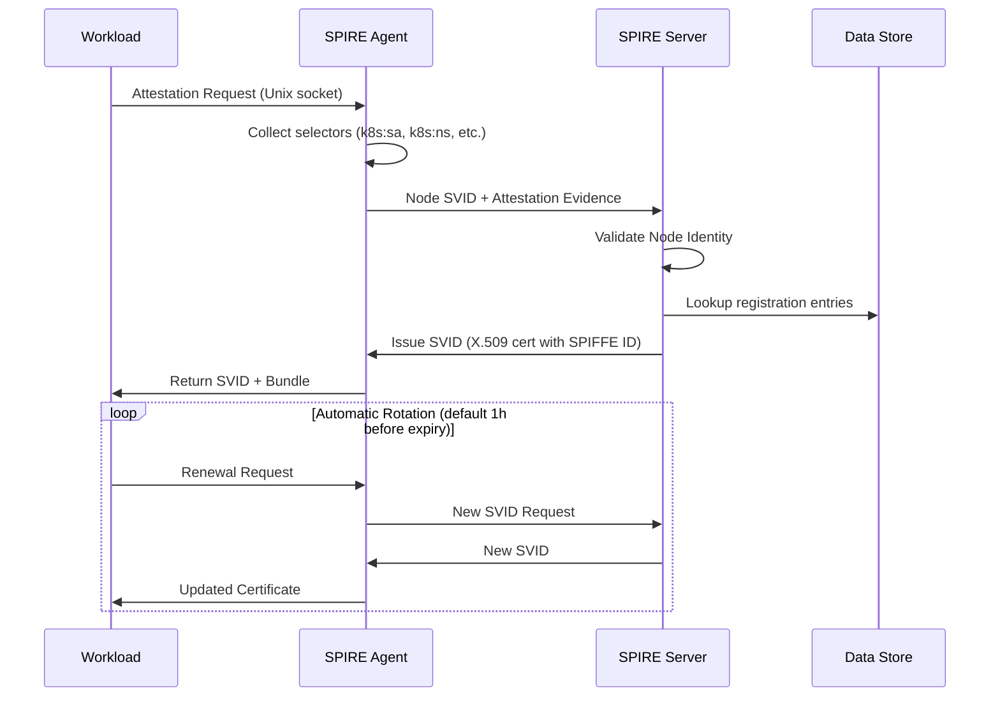
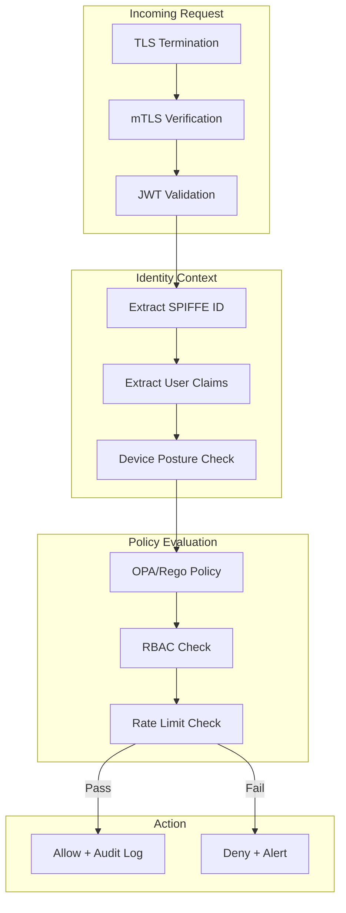

# Transport & Infrastructure Security

> Nghiên cứu chuyên sâu về bảo mật tầng transport và kiến trúc hạ tầng: mTLS, TLS 1.3, SPIFFE/SPIRE, Zero Trust và các cơ chế xác thực service-to-service trong môi trường microservices.

---

## 1. Mục tiêu của task

Hiểu sâu các cơ chế bảo mật tầng transport và hạ tầng trong hệ thống phân tán:
- **mTLS (Mutual TLS):** Cơ chế xác thực hai chiều giữa client và server, khác biệt so với TLS thông thường
- **TLS 1.3:** Cải tiến trong handshake, zero-round-trip (0-RTT), và các vấn đề bảo mật liên quan
- **Service-to-service authentication:** Các mô hình xác thực trong microservices mesh
- **SPIFFE/SPIRE:** Tiêu chuẩn workload identity và automatic certificate rotation
- **Zero Trust:** Nguyên tắc "không bao giờ tin tưởng, luôn xác minh" trong thiết kế hệ thống

---

## 2. Bản chất và cơ chế hoạt động

### 2.1 TLS vs mTLS: Sự khác biệt bản chất

**TLS thông thường (One-way TLS):**
```
Client                                Server
   | ----------- ClientHello ----------> |
   | <---------- ServerHello + Cert ---- |
   | ----------- Key Exchange ---------> |
   | <----------- Finished ------------- |
   | ========== Encrypted Data =========> |
```

- Server gửi certificate cho client xác thực
- Client **không** cần chứng minh danh tính
- Phù hợp: Public websites (banking, e-commerce)

**mTLS (Mutual TLS):**
```
Client                                Server
   | ----------- ClientHello ----------> |
   | <--- ServerHello + Server Cert ---- |
   | ----------- Client Cert ----------> |  ← Điểm khác biệt
   | <----------- Cert Verify ---------- |
   | ========== Encrypted Data =========> |
```

- **Bản chất:** Cả hai bên đều phải chứng minh danh tính qua X.509 certificates
- **Certificate chain:** Root CA → Intermediate CA → Leaf certificate
- **Verification:** Mỗi bên validate certificate của đối phương (signature, expiry, revocation)

> **Trade-off quan trọng:** mTLS tăng độ trễ (1-2 RTT thêm cho handshake) và operational complexity (certificate lifecycle management) để đổi lấy mutual authentication.

### 2.2 Certificate Pinning: Bảo vệ khỏi Rogue CA

**Bản chất:** Hardcode public key hash hoặc certificate của server trong client thay vì dựa hoàn toàn vào CA system.

**Các dạng pinning:**
| Loại | Mô tả | Rủi ro |
|------|-------|--------|
| **Public Key Pinning** | Pin SPKI hash (Subject Public Key Info) | Key rotation phức tạp |
| **Certificate Pinning** | Pin toàn bộ certificate | Expiry handling |
| **CA Pinning** | Pin intermediate/root CA | Ít an toàn hơn |

**Cơ chế HPKP (HTTP Public Key Pinning) - Deprecated:**
- Browser cache pin hashes trong `Public-Key-Pins` header
- Rủi ro: "Pin suicide" - nếu mất private key, users bị lockout

**Alternative hiện đại - Certificate Transparency (CT):**
- Tất cả certificates được log vào public append-only logs
- Monitors phát hiện rogue certificates
- Chrome yêu cầu CT proof cho all EV certificates

> **Bài học production:** Pinning tăng security nhưng tạo operational risk. Pin ở mức public key (cho phép renew với cùng key) thay vì full certificate.

### 2.3 TLS 1.3: Cải tiến kiến trúc

**Handshake 1-RTT (so với 2-RTT trong TLS 1.2):**
```
TLS 1.2:              TLS 1.3:
C → S: ClientHello    C → S: ClientHello + KeyShare + {early_data}
S → C: ServerHello    S → C: ServerHello + KeyShare + {EncryptedExtensions}
      + Cert               + Cert + CertVerify + Finished
      + ServerKeyEx
C → S: ClientKeyEx    C → S: Finished
      + Finished
```

**Các cải tiến bản chất:**

1. **Loại bỏ các algorithm yếu:**
   - MD5, SHA-1, RC4, DES, 3DES, AES-CBC (các ciphers dễ bị padding oracle)
   - Chỉ còn AEAD ciphers: AES-GCM, ChaCha20-Poly1305

2. **0-RTT (Zero Round Trip Time):**
   - Client gửi data ngay trong ClientHello (dựa trên PSK - Pre-Shared Key)
   - **Rủi ro bảo mật:** Replay attacks - attacker capture và replay 0-RTT data
   - **Mitigation:** Server implement anti-replay (single-use tickets, bloom filters)

3. **Perfect Forward Secrecy (PFS) mandatory:**
   - TLS 1.2: RSA key exchange cho phép decrypt sau này nếu private key bị lộ
   - TLS 1.3: Chỉ hỗ trợ ephemeral key exchange (ECDHE) - mỗi session có key riêng

4. **Encrypted handshake:**
   - Sau `ServerHello`, toàn bộ handshake messages được encrypt
   - Cải thiện privacy (che giấu certificate, SNI)

> **ESNI/ECH (Encrypted Client Hello):** Encrypt cả SNI (Server Name Indication) trong ClientHello để tránh censorship và tracking. Đang được triển khai rộng rãi.

### 2.4 Service-to-Service Authentication Patterns

#### Pattern 1: Shared Secret (API Keys)
```
Service A → Header: X-API-Key: secret123 → Service B
```
- **Vấn đề:** Secret rotation khó khăn, không có identity (chỉ biết "ai đó có secret")

#### Pattern 2: JWT with Shared Secret
```
Service A → Header: Authorization: Bearer <JWT> → Service B
```
- **Vấn đề:** Symmetric key (HS256) - tất cả services biết secret = blast radius lớn

#### Pattern 3: JWT with Asymmetric Keys (RS256)
```
Service A (signs with private key) → JWT → Service B (verify with public key)
```
- **Ưu điểm:** Public key có thể publish, private key giữ ở issuer
- **Vấn đề:** Key distribution, rotation, revocation

#### Pattern 4: mTLS (Recommended for microservices)
```
Service A (presents cert) ←→ Service B (validates cert)
Service B (presents cert) ←→ Service A (validates cert)
```
- **Ưu điểm:** Strong identity (X.509 Subject), automatic encryption, no shared secrets
- **Operational cost:** Certificate lifecycle (issue, rotate, revoke)

#### Pattern 5: SPIFFE/SPIRE (Workload Identity)

**Bản chất:** Standardize workload identity thay vì network-based identity (IP, hostname).

```
┌─────────────────────────────────────────────────────┐
│                    Kubernetes                        │
│  ┌─────────┐      ┌─────────┐      ┌─────────┐     │
│  │ Pod A   │      │ Pod B   │      │ Pod C   │     │
│  │ (app-1) │      │ (app-2) │      │ (app-3) │     │
│  └────┬────┘      └────┬────┘      └────┬────┘     │
│       │                │                │           │
│       └────────────────┼────────────────┘           │
│                        ↓                            │
│               ┌───────────────┐                     │
│               │ SPIRE Agent   │ ←── Unix Domain Socket
│               │ (on each node)│                     │
│               └───────┬───────┘                     │
│                       │ gRPC/mTLS                   │
│               ┌───────▼───────┐                     │
│               │ SPIRE Server  │                     │
│               │ (root of trust)│                    │
│               └───────────────┘                     │
└─────────────────────────────────────────────────────┘
```

**SPIFFE ID Format:** `spiffe://trust-domain/workload-identifier`
- Ví dụ: `spiffe://production.example.com/payments/api`

**Cơ chế hoạt động:**
1. Workload (container) kết nối với SPIRE Agent qua Unix Domain Socket
2. SPIRE Agent attests workload (xác minh identity qua Kubernetes, AWS, etc.)
3. SPIRE Server issues X.509-SVID (SPIFFE Verifiable Identity Document)
4. SVID có short TTL (tự động rotate), chứa SPIFFE ID trong URI SAN

**Ưu điểm:**
- **Platform agnostic:** Kubernetes, VMs, AWS Lambda, etc.
- **Automatic rotation:** Certificate tự động renew trước expiry
- **No shared secrets:** Each workload có identity riêng

> **Trade-off:** SPIRE adds infrastructure complexity (HA setup, database backend, key management). Phù hợp cho large-scale microservices, có thể overkill cho nhỏ.

### 2.5 Network Policies: Segmentation trong Kubernetes

**Bản chất:** L4 firewall rules enforced bởi CNI plugin (Calico, Cilium, etc.).

```yaml
apiVersion: networking.k8s.io/v1
kind: NetworkPolicy
metadata:
  name: payment-service-policy
spec:
  podSelector:
    matchLabels:
      app: payment-service
  policyTypes:
  - Ingress
  - Egress
  ingress:
  - from:
    - podSelector:
        matchLabels:
          app: order-service  # Chỉ cho phép từ order-service
    ports:
    - protocol: TCP
      port: 8080
  egress:
  - to:
    - podSelector:
        matchLabels:
          app: postgres  # Chỉ cho phép đến database
    ports:
    - protocol: TCP
      port: 5432
```

**Các mô hình segmentation:**
| Mô hình | Mô tả | Use case |
|---------|-------|----------|
| **Default Deny All** | Block tất cả, whitelist từng flow | High security environments |
| **Namespace Isolation** | Chỉ allow intra-namespace traffic | Multi-tenant clusters |
| **Label-based** | Allow dựa trên pod labels | Dynamic microservices |

**Hạn chế của NetworkPolicy:**
- Chỉ hoạt động ở L3/L4 (IP, port) - không inspect HTTP path, headers
- Enforce bởi CNI - nếu CNI không hỗ trợ, policy bị bỏ qua
- Không bảo vệ khỏi compromised pod trong cùng allow-list

> **Layered defense:** NetworkPolicy là perimeter defense, cần kết hợp với mTLS/authz ở application layer.

### 2.6 WAF (Web Application Firewall)

**Vị trí trong architecture:**
```
Internet → CDN/WAF → Load Balancer → Ingress → Service Mesh → Application
         (Layer 7 filtering)
```

**Các loại WAF:**
1. **Cloud WAF:** AWS WAF, Cloudflare, Akamai
   - Managed rules, automatic updates
   - DDoS protection integration

2. **Self-hosted:** ModSecurity, Coraza
   - Full control over rules
   - Higher operational burden

3. **Sidecar WAF:** Enforce ở service mesh level
   - Envoy WAF filters
   - Fine-grained per-service policies

**Rule categories:**
- OWASP Top 10 (SQLi, XSS, CSRF)
- Bot detection (rate limiting, CAPTCHA)
- Geo-blocking
- Custom business logic rules

**False positive management:**
- **Rule tuning:** Disable rules causing FP cho specific paths
- **IP allowlisting:** Bypass WAF cho trusted IPs
- **Request sampling:** Log-only mode trước khi block

> **Trade-off:** WAF adds latency (1-5ms cho cloud, 5-20ms cho self-hosted) và operational overhead (rule tuning, FP handling).

### 2.7 Zero Trust Architecture

**Bản chất:** "Never trust, always verify" - Không tin tưởng bất kỳ request nào, dù đến từ internal network.

**3 core principles:**

1. **Explicit Verification:** Xác thực và authorize mọi request
   - Identity-based access (user/service identity)
   - Device health checks
   - Continuous authentication (short-lived tokens)

2. **Least Privilege Access:** Chỉ cấp quyền tối thiểu cần thiết
   - Just-in-Time (JIT) access
   - Just-Enough-Access (JEA)
   - Time-bound permissions

3. **Assume Breach:** Thiết kế như thể attacker đã ở trong network
   - Micro-segmentation
   - Encryption everywhere (mTLS)
   - Comprehensive logging/audit

**Zero Trust implementation stack:**
```
┌──────────────────────────────────────────┐
│         Identity Provider (IdP)          │
│    (Okta, Azure AD, Keycloak)            │
└──────────────┬───────────────────────────┘
               │
┌──────────────▼───────────────────────────┐
│         Policy Decision Point            │
│    (OPA, Istio AuthorizationPolicy)      │
└──────────────┬───────────────────────────┘
               │
┌──────────────▼───────────────────────────┐
│         Service Mesh/Data Plane          │
│    (mTLS, JWT validation, rate limit)    │
└──────────────┬───────────────────────────┘
               │
┌──────────────▼───────────────────────────┐
│         Application Layer                │
│    (RBAC, ABAC, audit logging)           │
└──────────────────────────────────────────┘
```

---

## 3. Kiến trúc và Luồng xử lý

### 3.1 mTLS Handshake chi tiết



**Certificate validation steps:**
1. **Signature validation:** Verify cert được ký bởi trusted CA
2. **Expiry check:** NotBefore ≤ CurrentTime ≤ NotAfter
3. **Revocation check:** OCSP hoặc CRL (Certificate Revocation List)
4. **Purpose validation:** Extended Key Usage (EKU) khớp với intended use
5. **Hostname verification:** Subject/SAN khớp với target hostname

### 3.2 SPIFFE/SPIRE Certificate Lifecycle



### 3.3 Zero Trust Request Flow



---

## 4. So sánh các lựa chọn

### 4.1 Service-to-Service Authentication

| Phương án | Security | Complexity | Performance | Scalability |
|-----------|----------|------------|-------------|-------------|
| **Shared Secret** | ⭐ Low | ⭐ Low | ⭐⭐⭐ High | ⭐ Low |
| **JWT (HS256)** | ⭐⭐ Medium | ⭐⭐ Medium | ⭐⭐⭐ High | ⭐⭐ Medium |
| **JWT (RS256)** | ⭐⭐⭐ High | ⭐⭐ Medium | ⭐⭐ Medium | ⭐⭐⭐ High |
| **mTLS** | ⭐⭐⭐⭐ Very High | ⭐⭐⭐ High | ⭐⭐ Medium | ⭐⭐⭐ High |
| **SPIFFE/SPIRE** | ⭐⭐⭐⭐⭐ Max | ⭐⭐⭐⭐ Very High | ⭐⭐ Medium | ⭐⭐⭐⭐⭐ Max |

**Khi nào dùng gì:**
- **Shared Secret:** Prototype, internal tools không critical
- **JWT RS256:** Stateless auth, external API consumers
- **mTLS:** Internal microservices, high security requirements
- **SPIFFE/SPIRE:** Large-scale K8s, multi-cloud, strict compliance

### 4.2 Certificate Rotation Strategies

| Strategy | Zero Downtime | Complexity | Risk |
|----------|---------------|------------|------|
| **Rolling Update** | ✅ Yes | ⭐⭐ Medium | Window where old+new coexist |
| **Hot Reload** | ✅ Yes | ⭐⭐⭐ High | Requires app support |
| **Sidecar Pattern** | ✅ Yes | ⭐⭐⭐⭐ High | Envoy/Istio handles rotation |
| **SPIRE Auto-Rotation** | ✅ Yes | ⭐⭐⭐⭐ High | Best for long-lived workloads |

---

## 5. Rủi ro, Anti-patterns, và Lỗi thường gặp

### 5.1 mTLS Anti-patterns

**❌ Không verify hostname:**
```java
// SAI: Chỉ verify cert chain, không check hostname
SSLSocketFactory factory = ...;
// Missing: setHostnameVerifier()
```

**❌ Skip certificate validation (DEV only leak):**
```java
// SAI: TrustManager accept all certs
TrustManager[] trustAllCerts = new TrustManager[]{
    new X509TrustManager() {
        public void checkClientTrusted(X509Certificate[] certs, String authType) {}
        public void checkServerTrusted(X509Certificate[] certs, String authType) {}
        public X509Certificate[] getAcceptedIssuers() { return new X509Certificate[0]; }
    }
};
```

**❌ Hardcode CA certificates:**
- Khó rotate CA khi compromise
- Thay vào đó: Mount CA bundle từ ConfigMap/Secret

### 5.2 TLS 1.3 0-RTT Pitfalls

**❌ Enable 0-RTT cho sensitive operations:**
```
GET /balance → Safe for 0-RTT (idempotent, no side effects)
POST /transfer → NEVER use 0-RTT (replay attack risk)
```

**Mitigation:** Server implement `early_data` rejection cho non-safe methods.

### 5.3 SPIRE Operational Risks

| Rủi ro | Hệ quả | Mitigation |
|--------|--------|------------|
| **SPIRE Server outage** | New workloads cannot get identity | HA deployment (3+ replicas), SQLite → PostgreSQL/MySQL |
| **Root key compromise** | All trust broken | HSM integration, offline root CA ceremony |
| **Attestation bypass** | Unauthorized workload gets valid SVID | Multiple attestors, continuous attestation |

### 5.4 NetworkPolicy Blind Spots

**❌ Assume default deny:**
```yaml
# Nếu không có NetworkPolicy, mặc định là ALLOW ALL
# Cần explicit deny-all policy
```

**❌ Outbound không restrict:**
```yaml
# Chỉ restrict ingress, egress wide open
# Compromised pod có thể exfiltrate data
```

### 5.5 WAF Evasion Techniques

Attackers bypass WAF bằng:
- **Encoding:** Unicode normalization, double URL encoding
- **Fragmentation:** Chia payload across multiple requests
- **Protocol smuggling:** HTTP request splitting
- **Case variation:** `SeLeCt` thay vì `SELECT`

**Mitigation:** Defense in depth - WAF + input validation + prepared statements.

---

## 6. Khuyến nghị thực chiến trong Production

### 6.1 Certificate Lifecycle Management

**Certificate validity periods:**
- **Public-facing:** 90 days (Let's Encrypt standard)
- **Internal mTLS:** 24-48 hours (SPIRE default: 1 hour)
- **Root CA:** 10-20 years (offline, air-gapped)

**Monitoring alerts:**
```
ALERT CertificateExpiringSoon
  IF (certificate_expiry_timestamp - time()) / 86400 < 7
  LABELS severity = warning
  
ALERT CertificateExpired
  IF certificate_expiry_timestamp < time()
  LABELS severity = critical
```

### 6.2 mTLS Implementation Checklist

```
□ Enforce TLS 1.3 (disable 1.0, 1.1, 1.2 nếu có thể)
□ Enable OCSP stapling (reduce latency, privacy)
□ Configure cipher suites (chỉ AEAD: AES-GCM, ChaCha20)
□ Set appropriate timeouts (handshake, session cache)
□ Implement certificate rotation (hot reload)
□ Log all TLS handshake failures (security monitoring)
□ Test with tools: testssl.sh, sslyze, openssl s_client
```

### 6.3 Zero Trust Rollout Strategy

**Phase 1: Visibility (Month 1-2)**
- Deploy service mesh (Istio/Linkerd) ở permissive mode
- Collect traffic patterns, identify all service dependencies

**Phase 2: Identity (Month 3-4)**
- Enable mTLS (mesh handles automatically)
- Deploy SPIRE cho workload identity

**Phase 3: Policy (Month 5-6)**
- Implement default-deny network policies
- Deploy OPA/Gatekeeper cho admission control
- Define RBAC policies

**Phase 4: Verification (Ongoing)**
- Continuous compliance scanning
- Penetration testing
- Tabletop exercises (simulate breach)

### 6.4 Performance Optimization

**TLS Session Resumption:**
- **Session IDs:** Server cache (memory cost)
- **Session Tickets:** Stateless (cryptographic cost)
- **PSK (TLS 1.3):** Best of both worlds

**OCSP Stapling:**
- Server fetch OCSP response và "staple" vào certificate
- Client không cần gọi OCSP responder
- Giảm latency, tăng privacy

**Connection Pooling:**
- Reuse TLS connections (HTTP keep-alive)
- Consider connection pool sizing (HikariCP, OkHttp)

---

## 7. Kết luận

**Bản chất vấn đề:**

Bảo mật transport và infrastructure không chỉ là "bật TLS lên". Đó là việc thiết kế **hệ thống tin cậy** (trust system) dựa trên cryptographic identity thay vì network location.

**Các chốt lại:**

1. **mTLS là bắt buộc** cho microservices security - không chỉ encrypt, mà còn mutual authentication. Chi phí operational (certificate management) là đáng để đổi lấy security posture vững chắc.

2. **TLS 1.3** cải thiện đáng kể hiệu năng (1-RTT) và bảo mật (loại bỏ legacy algorithms), nhưng cần hiểu rõ trade-off của 0-RTT (replay risk).

3. **SPIFFE/SPIRE** giải quyết bài toán identity ở scale - tự động hóa certificate lifecycle, platform-agnostic, enable true zero trust.

4. **Zero Trust** là mindset, không phải sản phẩm. "Never trust, always verify" áp dụng cho mọi layer: network, transport, application.

5. **Layered defense:** Không dựa vào một cơ chế. NetworkPolicy + mTLS + WAF + application authz = defense in depth.

**Trade-off quan trọng nhất:** Security vs Operational Complexity vs Performance. Mỗi layer security thêm vào đều có cost - cần balance dựa trên threat model và compliance requirements.

---

## 8. Tài liệu tham khảo

- [SPIFFE Specification](https://github.com/spiffe/spiffe)
- [SPIRE Documentation](https://spiffe.io/docs/latest/spire-about/)
- [TLS 1.3 RFC 8446](https://datatracker.ietf.org/doc/html/rfc8446)
- [NIST Zero Trust Architecture](https://www.nist.gov/publications/zero-trust-architecture)
- [OWASP TLS Cheat Sheet](https://cheatsheetseries.owasp.org/cheatsheets/Transport_Layer_Protection_Cheat_Sheet.html)
- [Istio Security Architecture](https://istio.io/latest/docs/concepts/security/)
