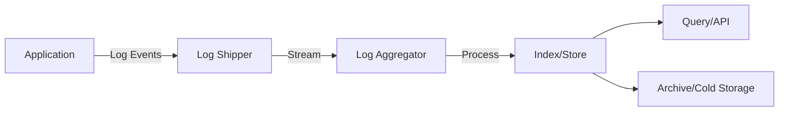
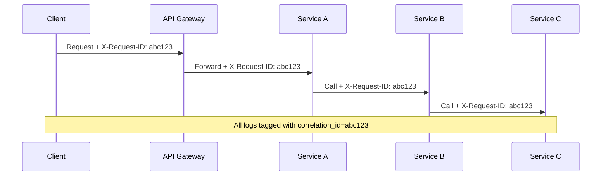
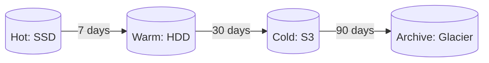

# Log Management & Analysis - Nghiên Cứu Chuyên Sâu

## 1. Mục tiêu của Task

Hiểu bản chất hệ thống log trong distributed systems ở quy mô enterprise: từ cách ứng dụng sinh ra log, quá trình aggregation, storage, indexing đến khai thác dữ liệu phục vụ observability và troubleshooting.

> **Tầm quan trọng:** Log là nguồn dữ liệu duy nhất cho phép "time travel" - tái hiện chính xác những gì đã xảy ra tại một thởi điểm cụ thể trong quá khứ.

---

## 2. Bản Chất và Cơ Chế Hoạt Động

### 2.1 Log là gì? Bản chất dữ liệu

Log thực chất là **append-only, time-ordered sequence of immutable events**. Ba đặc tính cốt lõi:

| Đặc tính | Ý nghĩa | Hệ quả kiến trúc |
|----------|---------|------------------|
| **Append-only** | Chỉ ghi thêm, không sửa/xóa | LSM-Tree, columnar storage phù hợp |
| **Time-ordered** | Mỗi entry có timestamp | Partitioning theo time range tối ưu |
| **Immutable** | Nội dung không đổi sau khi ghi | Caching aggressive, compression hiệu quả |

**Trade-off cơ bản:** Log là "cold" data - hiếm khi đọc nhưng phải giữ lâu. Storage cost chiếm 60-80% tổng chi phí hệ thống logging.

### 2.2 Log Pipeline Architecture



**Các tầng và vai trò:**

| Tầng | Responsibility | Key Concerns |
|------|---------------|--------------|
| **Generation** | Ứng dụng sinh log | Structured vs unstructured, cardinality |
| **Collection** | Thu thập từ nguồn | Reliability, backpressure, resource usage |
| **Transport** | Di chuyển log events | Ordering, delivery guarantees, latency |
| **Processing** | Transform, enrich, filter | CPU cost, schema evolution |
| **Storage** | Persist và index | Retention, compression, query patterns |
| **Query** | Tìm kiếm, analyze | Latency, concurrency, cost |

### 2.3 Log Shipping Patterns

#### Pattern 1: Direct Write (Anti-pattern)
Ứng dụng ghi trực tiếp vào centralized storage.

```
Nhược điểm:
- Tight coupling với log backend
- Network failures ảnh hưởng ứng dụng
- Khó thay đổi format/destination
- Backpressure không được handle
```

#### Pattern 2: Local Buffer + Shipper (Recommended)
```mermaid
flowchart LR
    App -->|Write| File[/var/log/app.log]
    File -->|Tail| Agent[Fluentd/Filebeat]
    Agent -->|Batch| Backend[Log Backend]
```

**Bản chất:** Decoupling thông qua local filesystem (hoặc memory buffer). Agent chịu trách nhiệm reliability.

**Trade-off:** 
- (+) Ứng dụng không bị ảnh hưởng bởi network issues
- (+) Có thể buffer khi backend down
- (-) Disk I/O thêm, disk space cần monitor
- (-) Potential log loss nếu disk full/corrupted

#### Pattern 3: Sidecar Pattern (Kubernetes-native)
Mỗi pod có container chính + sidecar log agent.

```yaml
# Conceptual pod structure
containers:
  - name: app
    volumeMounts:
      - name: logs
        mountPath: /app/logs
  - name: fluent-bit
    volumeMounts:
      - name: logs
        mountPath: /app/logs  # Shared volume
```

**Khi nào dùng:** Khi không thể modify ứng dụng để ghi stdout (legacy apps, third-party).

---

## 3. Kiến Trúc và Luồng Xử Lý

### 3.1 Log Format: Text vs Structured

| Aspect | Unstructured (Text) | Structured (JSON) |
|--------|---------------------|-------------------|
| **Human readability** | ✅ Tốt | ❌ Cần pretty-print |
| **Machine parsing** | ❌ Regex/regex - fragile | ✅ Native parse |
| **Query performance** | ❌ Full-text scan | ✅ Field indexing |
| **Storage size** | ✅ Nhỏ hơn ~30% | ❌ Verbose |
| **Schema evolution** | ❌ Không có schema | ⚠️ Cần versioning |

**Recommendation:** Luôn dùng structured logging cho production systems. Chi phí storage thêm được đền bù bởi query efficiency và debugging speed.

### 3.2 Log Levels: Semantics và Cardinality Impact

```
ERROR  - System cannot continue current operation
WARN   - Unexpected nhưng system recovered
INFO   - Significant business events
DEBUG  - Development detail (high volume)
TRACE  - Execution flow (highest volume)
```

**Anti-pattern:** INFO log mọi method entry/exit trong production → Volume tăng 10-100x, query chậm, cost cao.

**Best practice:** 
```
Production default: INFO
Debug sessions: DYNAMIC - enable DEBUG per request/user
```

### 3.3 Correlation ID Flow



**Implementation:**
- Gateway sinh UUID nếu client không cung cấp
- Propagate qua HTTP headers, message queue metadata
- Store trong MDC (Mapped Diagnostic Context) của logging framework
- **Critical:** Log correlation_id ở MỌI log line của request

### 3.4 Log Aggregation Solutions: ELK vs Loki vs Cloud-native

#### Elasticsearch (ELK Stack)
**Kiến trúc:**
- Inverted index cho full-text search
- Document-oriented, schema flexible
- Horizontal scaling qua sharding

**Trade-off:**
| Ưu điểm | Nhược điểm |
|---------|-----------|
| Query mạnh, aggregation phức tạp | Resource hungry (RAM, CPU) |
| Mature ecosystem | Operational complexity cao |
| Full-text search nhanh | Storage cost cao |

**When to use:** Cần complex queries, aggregations, text analysis.

#### Grafana Loki
**Kiến trúc:**
- Chỉ index **labels** (metadata), không index log content
- Log content lưu trong object storage (S3, GCS, etc.)
- Query: Tìm labels → Fetch log chunks → Grepline filter

```
Log Line: "user=alice action=login status=success"
Labels: {app="auth-service", level="info", env="prod"}
```

**Trade-off:**
| Ưu điểm | Nhược điểm |
|---------|-----------|
| Storage cost thấp (~1/10 của ES) | Query chậm hơn với ad-hoc search |
| Operational đơn giản | Không có full-text index |
| Native integration với Grafana | Regex search trên large datasets chậm |

**When to use:** Cloud-native, cost-sensitive, query patterns predictable (biết trước labels để filter).

#### Cloud-native (CloudWatch, Stackdriver, Azure Monitor)
**Trade-off:** Managed service vs vendor lock-in. Tính phí theo ingestion volume và query scan.

### 3.5 Partitioning và Retention Strategy

**Time-based partitioning (cơ bản):**
```
logs-2024-01-01
logs-2024-01-02
logs-2024-01-03
```

**Hot-Warm-Cold Architecture:**


**Strategy:**
| Tier | Retention | Use Case |
|------|-----------|----------|
| Hot | 1-7 days | Real-time debugging, alerting |
| Warm | 7-30 days | Recent investigation |
| Cold | 30-90 days | Compliance, security audit |
| Archive | 1-7 years | Legal requirements |

---

## 4. Rủi Ro, Anti-patterns, và Lỗi Thường Gặp

### 4.1 High Cardinality Fields

**Problem:** Index fields có quá nhiều unique values.

```json
// ❌ BAD - user_id có cardinality cao
{"timestamp": "...", "level": "INFO", "user_id": "uuid-12345", "message": "..."}

// ✅ GOOD - user_id là label nhưng không index nếu cardinality quá cao
// Hoặc dùng low-cardinality field để group
{"timestamp": "...", "level": "INFO", "user_tier": "premium", "message": "..."}
```

**Impact:** 
- Index explosion → Storage tăng vọt
- Query performance degradation
- Memory pressure trên log backend

### 4.2 Logging Sensitive Data

**Rủi ro:**
- PII (Personally Identifiable Information) trong logs
- Credentials, tokens, API keys
- Financial data, health records

**Mitigation:**
```java
// ❌ BAD
log.info("User login: password={}", user.getPassword());

// ✅ GOOD - Structured masking
log.info("User login event", kv("user_id", user.getId()), 
         kv("has_password", user.hasPassword()));
```

**Production concern:** Audit logs để detect PII leakage.

### 4.3 Thundering Herd trên Log Query

**Scenario:** Production incident → Nhiều engineers query logs cùng lúc → Log backend overwhelmed.

**Solutions:**
1. Query rate limiting
2. Cached dashboards cho common queries
3. Query result caching (short TTL)
4. Dedicated read replicas cho ad-hoc queries

### 4.4 Log Loss Scenarios

| Cause | Prevention |
|-------|-----------|
| Buffer overflow | Monitor buffer size, alert trên saturation |
| Network partition | Persistent local buffer, retry with backoff |
| Disk full | Log rotation, disk monitoring |
| Application crash | Sync write cho critical logs (trade-off perf) |
| Log backend outage | Multiple outputs, dead letter queue |

### 4.5 Clock Skew trong Distributed Logs

**Problem:** Services có clock khác nhau → Log order không chính xác.

**Solutions:**
- NTP synchronization (basic)
- Logical clocks (vector clocks) cho ordering guarantee
- Accept timestamp uncertainty trong query

---

## 5. Khuyến Nghị Thực Chiến Production

### 5.1 Structured Logging Implementation

```java
// Java với SLF4J + Logstash encoder
import static net.logstash.logback.argument.StructuredArguments.*;

log.info("Payment processed",
    kv("order_id", orderId),
    kv("amount", amount),
    kv("currency", currency),
    kv("payment_method", method),
    kv("latency_ms", duration)
);
```

**Output:**
```json
{
  "@timestamp": "2024-01-15T10:30:00.123Z",
  "level": "INFO",
  "logger": "com.example.PaymentService",
  "message": "Payment processed",
  "order_id": "ORD-12345",
  "amount": 99.99,
  "currency": "USD",
  "payment_method": "credit_card",
  "latency_ms": 245
}
```

### 5.2 Alerting trên Logs (Critical)

**Log-based alerts cho những gì metrics không bắt được:**

| Alert | Condition | Severity |
|-------|-----------|----------|
| Error spike | ERROR count > threshold/5min | P1 |
| Security event | Login failure > 10/user/1min | P1 |
| Business anomaly | Payment failure rate > 5% | P2 |
| Pattern detection | Stack trace chứa "OutOfMemory" | P1 |

**Anti-pattern:** Alert trên mọi ERROR log → Alert fatigue.

**Best practice:** 
- ERROR log phải actionable
- Group similar errors
- Sử dụng anomaly detection cho baseline alerts

### 5.3 Log Volume Control

**Sampling strategies:**
```
1. Head-based: Log 1% của mọi request (consistent)
2. Tail-based: Log 100% nhưng chỉ keep khi error xảy ra
3. Dynamic: Tăng sampling khi incident detected
```

**Java implementation (OpenTelemetry):**
```yaml
# Log sampling configuration
otel.logs.exporter: otlp
otel.logs.sampler: parentbased_always_on
otel.logs.sampler.arg: 0.01  # 1% sampling
```

### 5.4 Monitoring the Monitoring

**Metrics cần track cho log pipeline:**

```
log_pipeline:
  ingestion_rate_bytes_per_sec
  ingestion_rate_logs_per_sec
  dropped_logs_count
  buffer_utilization_percent
  flush_latency_ms
  query_latency_p99
  storage_usage_bytes
  index_rate_docs_per_sec
```

**Golden signals của log pipeline:**
- **Latency:** Time từ log generation đến queryable
- **Errors:** Dropped logs, parse failures
- **Traffic:** Ingestion rate
- **Saturation:** Buffer full, disk full

### 5.5 Cost Optimization Checklist

- [ ] Set appropriate retention periods per log type
- [ ] Exclude DEBUG/TRACE logs từ production
- [ ] Filter health check logs tại edge
- [ ] Compress old logs (gzip, zstd)
- [ ] Use object storage cho cold tier
- [ ] Sample high-volume, low-value logs
- [ ] Regular audit cho unused dashboards/alerts

---

## 6. Kết Luận

**Bản chất của Log Management:**

1. **Log là immutable event stream** - Thiết kế xoay quanh append-only, time-ordered data. LSM-tree và columnar storage phù hợp hơn B-tree truyền thống.

2. **Trade-off chính là Query Speed vs Storage Cost** - Elasticsearch cho query phức tạp, Loki cho cost-efficiency. Không có silver bullet.

3. **Structured logging là non-negotiable** - JSON format với consistent schema cho phép efficient query và correlation.

4. **Correlation ID là backbone của distributed debugging** - Một request đi qua 10 services phải trace được bằng single ID.

5. **Log pipeline cần được monitor như production service** - Dropped logs, latency, buffer saturation phải có alerting.

**Quyết định kiến trúc quan trọng nhất:**
- Chọn structured logging từ day one
- Invest vào correlation ID propagation
- Thiết kế retention strategy theo log type (ERROR giữ lâu hơn INFO)
- Plan cho log volume growth (10x trong incident)

---

## Tài Liệu Tham Khảo

1. Grafana Loki Architecture: https://grafana.com/docs/loki/latest/fundamentals/architecture/
2. Elasticsearch Indexing Strategy: https://www.elastic.co/guide/en/elasticsearch/reference/current/index-modules.html
3. OpenTelemetry Logging: https://opentelemetry.io/docs/concepts/signals/logs/
4. Google Cloud Logging Best Practices: https://cloud.google.com/logging/docs/best-practices
5. SRE Book - Monitoring Distributed Systems: https://sre.google/sre-book/monitoring-distributed-systems/
