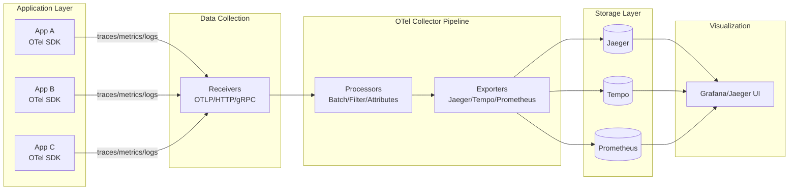
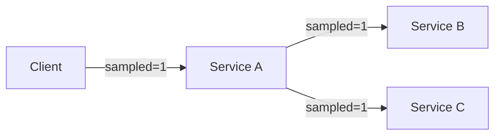
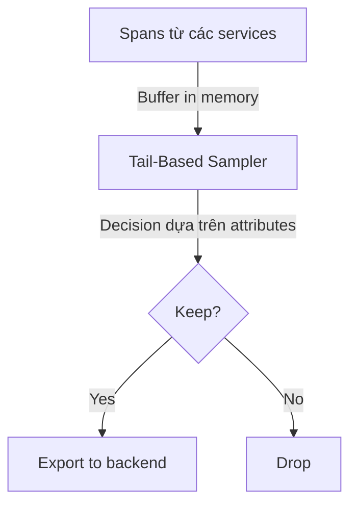
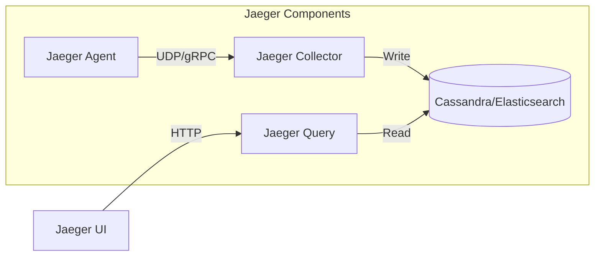
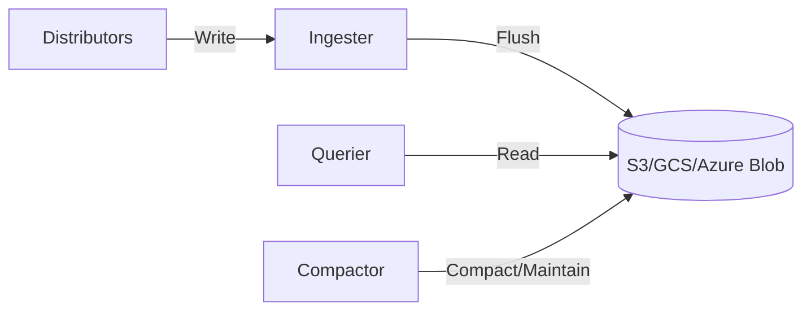
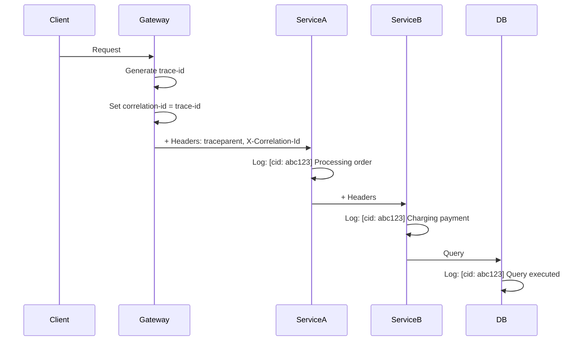

# Distributed Tracing - Nghiên Cứu Chuyên Sâu

## 1. Mục tiêu của Task

Hiểu sâu cơ chế distributed tracing trong hệ thống phân tán: kiến trúc OpenTelemetry, cách truyền context qua các service, chiến lược sampling, lưu trữ trace và tương quan với log. Tập trung vào trade-off giữa observability và overhead, đặc biệt trong production systems với high throughput.

---

## 2. Bản Chất và Cơ Chế Hoạt Động

### 2.1 Bản Chất của Distributed Tracing

Distributed tracing giải quyết bài toán **observability trong hệ thống phân tán**, nơi một request đi qua nhiều services. Khác với log (point-in-time events) và metrics (aggregated data), trace cung cấp **end-to-end visibility** với **temporal causality**.

#### Core Concepts

| Concept | Định nghĩa | Vai trò |
|---------|-----------|---------|
| **Trace** | Một request đi qua hệ thống | Đơn vị top-level, có trace-id duy nhất |
| **Span** | Một operation đơn lẻ trong trace | Đơn vị công việc có duration, có span-id |
| **Span Context** | Metadata đi kèm span | Propagation giữa các services |
| **Baggage** | Key-value pairs đi theo trace | Cross-cutting concerns |

#### Cấu trúc Span

```
Span = {
  trace_id: 16-byte hex (W3C) hoặc 8-byte (Jaeger)
  span_id: 8-byte hex
  parent_span_id: 8-byte hex (null nếu root)
  name: operation name
  start_time: timestamp nanoseconds
  end_time: timestamp nanoseconds
  status: UNSET | OK | ERROR
  attributes: {key: value}
  events: [timestamped annotations]
  links: [spans from other traces]
}
```

> **Quan trọng:** Một span không phải là log entry. Nó là **time interval** có thứ tự tạo thành **directed acyclic graph (DAG)**. Thứ tự parent-child thể hiện **happens-before relationship**.

---

## 3. Kiến Trúc và Luồng Xử Lý

### 3.1 OpenTelemetry Collector Architecture

OpenTelemetry Collector (OTel Collector) là component trung tâm, thiết kế theo kiểu **pipeline-based**.



#### Pipeline Components

| Component | Chức năng | Production Concern |
|-----------|-----------|-------------------|
| **Receivers** | Nhận data từ apps (OTLP, Jaeger, Zipkin) | Buffering, backpressure handling |
| **Processors** | Transform/batch/enrich data | Memory limits, timeout settings |
| **Exporters** | Gửi đến backends | Retry logic, queue size |

#### Collector Deployment Modes

1. **Agent Mode**: Chạy cùng host với app (sidecar hoặc DaemonSet)
   - Ưu điểm: Low latency, local buffering
   - Nhược điểm: Resource overhead trên mỗi node

2. **Gateway Mode**: Central collector cluster
   - Ưu điểm: Centralized config, economies of scale
   - Nhược điểm: Network hop thêm, single point of failure risk

> **Khuyến nghị Production:** Dùng **hybrid approach** - agent local để buffer, gateway cluster để aggregate và route.

---

### 3.2 Span Context Propagation

Propagation là cơ chế **thread-safe** để truyền trace context qua service boundaries. Hai standards phổ biến:

#### W3C Trace Context (Chuẩn hiện đại)

```
Headers:
  traceparent: 00-0af7651916cd43dd8448eb211c80319c-b7ad6b7169203331-01
               ↑  ↑______________________________↑ ↑______________↑ ↑
               │           trace-id                  parent-id    flags
               version

  tracestate: key1=value1,key2=value2 (vendor-specific)
```

| Field | Ý nghĩa |
|-------|---------|
| `version` | Hiện tại là `00` |
| `trace-id` | 32 hex chars, globally unique |
| `parent-id` | 16 hex chars, span gọi hiện tại |
| `flags` | Bit 0 = sampled (1 = trace này được sample) |

#### B3 Propagation (Legacy từ Zipkin)

```
Headers (multi-header format):
  X-B3-TraceId: 0af7651916cd43dd8448eb211c80319c
  X-B3-SpanId: b7ad6b7169203331
  X-B3-ParentSpanId: 5b4185666d50f68b
  X-B3-Sampled: 1
  X-B3-Flags: 1 (debug flag)
```

#### Propagation Trong Message Queues

Khác với HTTP headers, message queues cần **carrier abstraction**:

```
Kafka Message:
  Headers:
    traceparent: 00-...
    tracestate: ...
  Key: order-123
  Value: {...}
```

> **Pitfall:** Một số message broker cũ không hỗ trợ headers. Trong trường hợp này, phải embed context vào message payload, gây **tight coupling** giữa business logic và observability.

#### Context Propagation Code Pattern

```java
// Extract context từ incoming request
Context extractedContext = propagator.extract(
    Context.current(), 
    httpHeaders, 
    getter
);

// Create span mới với extracted context làm parent
try (Scope scope = extractedContext.makeCurrent()) {
    Span span = tracer.spanBuilder("process-order")
        .setParent(extractedContext)
        .startSpan();
    
    // Business logic ở đây
    
    span.end();
}

// Propagate đến downstream service
propagator.inject(Context.current(), outgoingHeaders, setter);
```

---

### 3.3 Sampling Strategies

Sampling quyết định **trace nào được thu thập** - trade-off quan trọng nhất trong distributed tracing.

#### Head-Based Sampling

Quyết định **tại root span**, propagate decision đến toàn bộ trace.



| Loại | Cơ chế | Ưu/Nhược điểm |
|------|--------|---------------|
| **Fixed Rate** | Sample 1/N requests | Đơn giản, không bias |
| **Probability** | Sample với probability p | Linh hoạt, có thể adjust |
| **Rate Limiting** | Max N traces/second | Protect backend từ spikes |

**Trade-off Head-Based:**
- ✅ **Ưu:** Simple, consistent (toàn bộ trace hoặc không), low overhead
- ❌ **Nhược:** Có thể miss rare errors (nếu error xảy ra ở request không được sample)

#### Tail-Based Sampling

Thu thập **toàn bộ spans**, quyết định **sau khi trace complete**.



**Conditions để keep trace:**
- Error status (status = ERROR)
- Latency > threshold (e.g., > 500ms)
- Specific attributes (e.g., user_type = "premium")
- Specific operations (e.g., /payment/charge)

**Trade-off Tail-Based:**
- ✅ **Ưu:** 100% capture errors, smart filtering
- ❌ **Nhược:** **Memory overhead cao** (phải buffer toàn bộ trace), **complexity cao**

> **Production Reality:** Head-based cho **high-throughput services**, tail-based cho **critical paths** (payment, order processing).

---

## 4. Storage Backends

### 4.1 Jaeger Architecture



| Component | Storage Options | Trade-off |
|-----------|-----------------|-----------|
| **Cassandra** | Time-series optimized | Write-heavy, eventual consistency |
| **Elasticsearch** | Full-text search | Query flexibility, higher resource |
| **Badger** | Embedded (single node) | Dev only, không scalable |

#### Storage Schema (Cassandra)

```sql
-- Traces stored by trace_id
CREATE TABLE traces (
    trace_id blob,
    span_id bigint,
    span_hash bigint,
    parent_id bigint,
    operation_name text,
    flags int,
    start_time bigint,
    duration bigint,
    tags list<frozen<key_value>>,
    logs list<frozen<log>>,
    PRIMARY KEY (trace_id, span_id, span_hash)
);

-- Indexes cho query patterns
CREATE TABLE service_names (
    service_name text PRIMARY KEY
);

CREATE TABLE operation_names (
    service_name text,
    operation_name text,
    PRIMARY KEY (service_name, operation_name)
);
```

### 4.2 Grafana Tempo

Tempo khác biệt ở **object storage focus** và **trace-only design**.



| Feature | Tempo | Jaeger |
|---------|-------|--------|
| **Storage** | Object storage (cheap) | Cassandra/ES (expensive) |
| **Cost** | $0.023/GB (S3) | $$$ (dedicated cluster) |
| **Query pattern** | TraceID lookup | Complex search |
| **Retention** | Infinite (S3 lifecycle) | TTL-limited |

> **Khuyến nghị:** Tempo cho **long-term storage**, Jaeger/ES cho **real-time debugging**.

---

## 5. Trace-to-Log Correlation

### 5.1 Correlation ID Pattern



#### Implementation

```java
// Logback configuration
<appender name="JSON" class="ch.qos.logback.core.ConsoleAppender">
    <encoder class="net.logstash.logback.encoder.LogstashEncoder">
        <includeContext>true</includeContext>
        <includeMdc>true</includeMdc>
        <fieldNames>
            <timestamp>timestamp</timestamp>
            <message>message</message>
        </fieldNames>
    </encoder>
</appender>

// Java code
import org.slf4j.MDC;

// Trong filter/interceptor
String traceId = Span.current().getSpanContext().getTraceId();
MDC.put("trace_id", traceId);
MDC.put("span_id", Span.current().getSpanContext().getSpanId());

// Log sẽ tự động include trace_id
logger.info("Processing payment for order {}", orderId);
// Output: {"timestamp":"...","message":"Processing...","trace_id":"abc123","span_id":"def456"}
```

### 5.2 Query Patterns

| Use Case | Query | Tools |
|----------|-------|-------|
| Find trace từ error log | `trace_id:abc123` | Jaeger UI, Tempo |
| Find logs từ trace | `trace_id:abc123` | Kibana, Loki |
| Error rate by operation | `status:error GROUP BY operation` | Prometheus |
| Latency percentile | `histogram_quantile(0.99, duration)` | Grafana |

---

## 6. Performance Overhead và Optimization

### 6.1 Overhead Sources

```
┌─────────────────────────────────────────────────────────┐
│                    REQUEST LIFECYCLE                     │
├─────────────────────────────────────────────────────────┤
│  1. Context Extraction     ~0.1-0.5µs  (Header parse)   │
│  2. Span Creation          ~1-5µs       (Allocation)     │
│  3. Attribute Recording    ~0.1-1µs     (Per attribute)  │
│  4. Context Propagation    ~0.5-2µs     (Header inject)  │
│  5. Export                 ~Async       (Background)     │
└─────────────────────────────────────────────────────────┘
```

#### Benchmark (OpenTelemetry Java)

| Scenario | Latency Impact | Memory Impact |
|----------|---------------|---------------|
| No tracing | Baseline | Baseline |
| Tracing disabled | +0.1% | +0% |
| Tracing enabled, sampled | +2-5% | +5-10% |
| Tracing enabled, 100% sample | +10-20% | +50-100% |

### 6.2 Optimization Strategies

#### 1. Sampling Optimization

```yaml
# collector config
processors:
  tail_sampling:
    decision_wait: 10s  # Buffer traces for 10s
    num_traces: 100000  # Max traces in memory
    expected_new_traces_per_sec: 1000
    policies:
      - name: errors
        type: status_code
        status_code: {status_codes: [ERROR]}
      - name: slow_requests
        type: latency
        latency: {threshold_ms: 500}
```

#### 2. Batch Processing

```yaml
processors:
  batch:
    timeout: 1s          # Flush every 1s
    send_batch_size: 1024  # Or every 1024 spans
    send_batch_max_size: 2048
```

#### 3. Attribute Limits

```java
// SDK configuration
OpenTelemetrySdk.builder()
    .setTracerProvider(
        SdkTracerProvider.builder()
            .setResource(resource)
            .setSpanLimits(
                SpanLimits.getDefault().toBuilder()
                    .setMaxNumberOfAttributes(128)
                    .setMaxAttributeValueLength(1024)
                    .build()
            )
            .build()
    )
    .build();
```

> **Rule of Thumb:** Mỗi span không nên có quá 50 attributes, mỗi attribute không nên vượt quá 1KB.

---

## 7. Rủi Ro, Anti-Patterns, và Lỗi Thường Gặp

### 7.1 Broken Trace

**Nguyên nhân:** Context không được propagate đúng cách qua async boundaries.

```java
// ❌ Anti-pattern: Context lost
CompletableFuture.runAsync(() -> {
    // Span.current() sẽ trả về INVALID span!
    processOrder();
});

// ✅ Fixed: Explicit context propagation
Context context = Context.current();
CompletableFuture.runAsync(() -> {
    try (Scope scope = context.makeCurrent()) {
        processOrder();
    }
}, executor);
```

### 7.2 Span Leak

**Nguyên nhân:** Span được tạo nhưng không được end(), dẫn đến memory leak.

```java
// ❌ Anti-pattern
Span span = tracer.spanBuilder("operation").startSpan();
if (condition) {
    return;  // Span never ended!
}
span.end();

// ✅ Fixed: try-with-resources
Span span = tracer.spanBuilder("operation").startSpan();
try (Scope scope = span.makeCurrent()) {
    // ... logic
} finally {
    span.end();
}
```

### 7.3 Sensitive Data in Attributes

```java
// ❌ Anti-pattern
span.setAttribute("user.password", password);
span.setAttribute("credit_card", cardNumber);

// ✅ Fixed: Only non-sensitive identifiers
span.setAttribute("user.id", userId);
span.setAttribute("payment.transaction_id", txnId);
```

### 7.4 N+1 Query không thấy

Tracing chỉ thấy **service boundaries**, không thấy **database queries bên trong**.

```java
// ❌ Problem: N+1 ẩn
for (Order order : orders) {
    // Mỗi loop là 1 DB query nhưng trace không show
    orderService.enrich(order); 
}

// ✅ Fixed: Create spans for internal operations
for (Order order : orders) {
    Span childSpan = tracer.spanBuilder("enrich-order")
        .setParent(Context.current())
        .startSpan();
    try {
        orderService.enrich(order);
    } finally {
        childSpan.end();
    }
}
```

### 7.5 Cardinality Explosion

**Nguyên nhân:** Sử dụng high-cardinality values làm span names.

```java
// ❌ Anti-pattern: 1M unique span names
spanBuilder("/users/" + userId)  // Mỗi user là 1 span name khác nhau

// ✅ Fixed: Use parameterized names
spanBuilder("/users/{id}")
    .setAttribute("user.id", userId)
```

> **Impact:** High cardinality làm metrics aggregation không hoạt động, storage cost tăng vô hạn.

---

## 8. Khuyến Nghị Thực Chiến Production

### 8.1 Deployment Checklist

| Layer | Recommendation |
|-------|---------------|
| **SDK** | Use OpenTelemetry SDK (không dùng vendor-specific) |
| **Collector** | Deploy agent per-node + gateway cluster |
| **Sampling** | Head-based 1% cho normal, 100% cho errors |
| **Storage** | Tempo cho long-term, Jaeger cho real-time |
| **Retention** | 7 days hot, 30 days warm, 1 year cold (S3) |

### 8.2 Alerting Rules

```yaml
# Trace-based alerts
groups:
  - name: tracing_alerts
    rules:
      - alert: HighErrorRate
        expr: |
          sum(rate(traces_spanmetrics_calls_total{status="ERROR"}[5m]))
          /
          sum(rate(traces_spanmetrics_calls_total[5m])) > 0.05
        for: 5m
        annotations:
          summary: "Error rate > 5%"
          
      - alert: HighLatency
        expr: |
          histogram_quantile(0.99, 
            sum(rate(traces_spanmetrics_latency_bucket[5m])) by (le, operation)
          ) > 1
        for: 5m
        annotations:
          summary: "P99 latency > 1s"
```

### 8.3 Migration Path

```
Phase 1: Shadow Mode (1-2 weeks)
  - Deploy collector, không enable sampling
  - Validate overhead < 5%
  
Phase 2: Partial Rollout (2-4 weeks)
  - Enable 0.1% sampling cho non-critical services
  - Monitor backend storage growth
  
Phase 3: Full Production (ongoing)
  - 1% default, 100% cho critical paths
  - Implement tail-based sampling cho errors
```

---

## 9. Kết Luận

**Bản chất của Distributed Tracing:** Đây là **distributed context propagation system** - không chỉ là "logging nâng cao". Giá trị cốt lõi nằm ở **causal relationship** giữa các operations trong hệ thống phân tán.

**Trade-off quan trọng nhất:**
- **Head-based sampling** vs **complete observability** - phải chấp nhận mất visibility ở một số requests để đảm bảo performance.

**Rủi ro lớn nhất trong production:**
1. **Cardinality explosion** - làm sập storage backend
2. **Broken traces** qua async boundaries - mất giá trị observability
3. **Overhead không kiểm soát** - ảnh hưởng latency

**Recommendation cuối cùng:**
- Bắt đầu với **OpenTelemetry** (vendor-neutral)
- Sampling rate thấp (0.1-1%) và **tin vào statistics**
- **Always correlate với logs** (trace_id in MDC)
- Monitor **chính hệ thống tracing** như một critical dependency

---

*Research completed: 2026-03-27*
