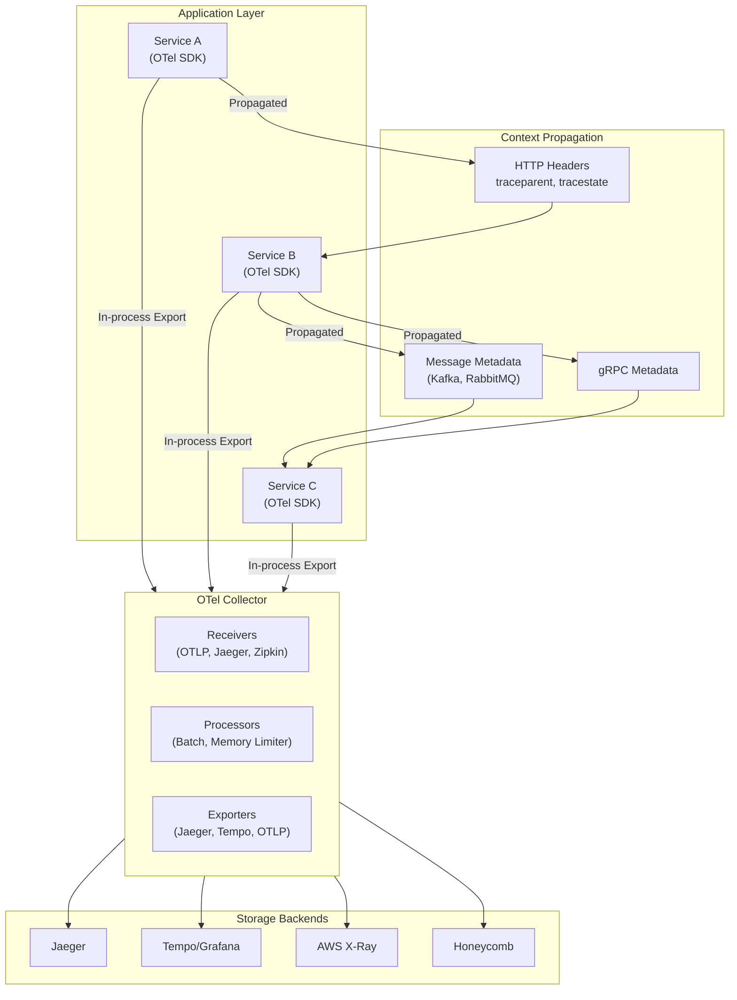
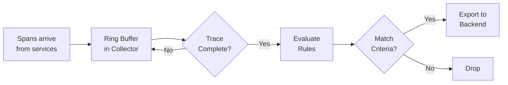

# Distributed Tracing: Kiến trúc, Cơ chế và Thực tiễn Production

## 1. Mục tiêu của Task

Hiểu sâu bản chất distributed tracing - công cụ giám sát luồng request xuyên suốt hệ thống phân tán. Nắm vững:
- Kiến trúc OpenTelemetry và cách trace context lan truyền
- Chiến lược sampling và trade-off giữa độ chính xác vs overhead
- Tích hợp với logging và metrics để tạo observability hoàn chỉnh
- Rủi ro production và cách tối ưu performance

---

## 2. Bản chất và Cơ chế Hoạt động

### 2.1 Tại sao cần Distributed Tracing?

> **Bài toán gốc:** Trong hệ thống monolith, một request vào và ra là atomic. Trong microservices, một request user có thể đi qua 20+ services, mỗi service lại gọi database, cache, message queue. Khi có lỗi hoặc latency cao, **không ai biết bottleneck ở đâu**.

**Giới hạn của logging truyền thống:**
- Log chỉ thấy events trong một service
- Không có correlation giữa các service
- Không thể visualize call chain
- Không đo được thờ gian chờ (wait time) giữa các bước

**Giới hạn của metrics:**
- Chỉ thấy aggregated data (P99 latency của service A)
- Không thấy journey của một request cụ thể
- Không phân tích được "con voi trong phòng" - request outliers

**Tracing giải quyết:**
- Capture end-to-end journey của từng request
- Measure time spent ở mỗi hop
- Show dependencies và call graph
- Enable drill-down vào specific problematic requests

### 2.2 Core Concepts

#### Trace, Span, và Context

```
┌─────────────────────────────────────────────────────────────┐
│                        TRACE                                │
│  (Một luồng xử lý hoàn chỉnh - ví dụ: "Place Order")        │
│                                                             │
│  ┌──────────┐    ┌──────────┐    ┌──────────┐              │
│  │ Span A   │───▶│ Span B   │───▶│ Span C   │              │
│  │ 50ms     │    │ 120ms    │    │ 30ms     │              │
│  │ Gateway  │    │ Service  │    │ Database │              │
│  └──────────┘    └──────────┘    └──────────┘              │
│                      │                                      │
│                      ▼                                      │
│                 ┌──────────┐                                │
│                 │ Span D   │  (Child Span - async)         │
│                 │ 80ms     │                                │
│                 │ Cache    │                                │
│                 └──────────┘                                │
└─────────────────────────────────────────────────────────────┘
```

**Trace:** Một directed acyclic graph (DAG) của spans đại diện cho một end-to-end request. Mỗi trace có duy nhất một `trace_id` (16 bytes, hex-encoded = 32 chars).

**Span:** Một đơn vị công việc trong trace. Span bao gồm:
- `span_id` (8 bytes): ID duy nhất trong trace
- `parent_span_id`: Reference đến span cha
- `start_time`, `end_time`: Để calculate duration
- `name`: Operation name (e.g., "GET /api/users")
- `kind`: SERVER, CLIENT, PRODUCER, CONSUMER, INTERNAL
- `attributes`: Key-value pairs (e.g., `http.method=GET`, `db.statement=SELECT...`)
- `events`: Timestamped annotations (logs trong span)
- `status`: OK, ERROR, UNSET
- `links`: References đến spans khác (không phải parent-child, e.g., batch processing)

**Context Propagation:** Cơ chế lan truyền trace context qua service boundaries. Bản chất là truyền `trace_id`, `span_id`, và `trace_flags` (để mark sampled hay không) qua các protocol khác nhau.

### 2.3 Kiến trúc OpenTelemetry

OpenTelemetry (OTel) là open-source observability framework, tiêu chuẩn de-facto cho tracing, metrics, và logging.



#### OTel Collector Components

**Receivers:** Nhận data từ các sources
- OTLP (OpenTelemetry Protocol): Default, gRPC/HTTP
- Jaeger: Thrift, gRPC
- Zipkin: JSON/Thrift over HTTP
- Prometheus: Pull-based metrics

**Processors:** Transform/enrich data trước khi export
- **Batch:** Gom nhiều spans thành batches để giảm network overhead
- **Memory Limiter:** Reject data khi memory cao để tránh OOM
- **Resource:** Add resource attributes (service.name, k8s.pod.name, etc.)
- **Attributes:** Add/remove/modify attributes
- **Span:** Rename spans, filter spans theo criteria
- **Tail-based Sampling:** Quyết định sample sau khi thấy toàn bộ trace

**Exporters:** Gửi data đến backends
- OTLP (to another collector or vendor)
- Jaeger, Zipkin
- Prometheus (for metrics)
- Kafka (buffer trước khi process)

### 2.4 Context Propagation Deep Dive

#### W3C Trace Context (tiêu chuẩn chính thức)

**Header: `traceparent`**
```
traceparent: 00-4bf92f3577b34da6a3ce929d0e0e4736-00f067aa0ba902b7-01
           │  │  └─ trace_id (32 hex) ─┘  └─span_id─┘  │
           │  │                                      flags
           │  version (00)
```

Format: `{version}-{trace_id}-{parent_span_id}-{flags}`
- `version`: 00 (current), ff (reserved)
- `trace_id`: 16 bytes, hex-encoded
- `parent_span_id`: 8 bytes, span ID của caller (current span context)
- `flags`: 1 byte bitmap
  - Bit 0 (LSB): **sampled flag** - 1 = recorded, 0 = not recorded

**Header: `tracestate`**
Vendor-specific metadata, format: `vendor1=value1,vendor2=value2`
Ví dụ: `rojo=00f067aa0ba902b7,congo=t61rcWkgMzE`

> **Tại sao cần cả hai headers?** `traceparent` là standard format, `tracestate` là vendor-specific baggage. Khi trace đi qua nhiều vendors/systems, `traceparent` đảm bảo interoperability, `tracestate` giữ vendor-specific context.

#### B3 Propagation (Legacy - Zipkin/Jaeger)

Developed bởi Twitter/Zipkin team, vẫn phổ biến trong legacy systems.

**Multi-header format:**
```
X-B3-TraceId: 4bf92f3577b34da6a3ce929d0e0e4736
X-B3-SpanId: 00f067aa0ba902b7
X-B3-ParentSpanId: 5b4185666d50d68d
X-B3-Sampled: 1
X-B3-Flags: 1
```

**Single-header format:**
```
B3: 4bf92f3577b34da6a3ce929d0e0e4736-00f067aa0ba902b7-1-5b4185666d50d68d
```

Format: `{trace_id}-{span_id}-{sampled}-{parent_span_id}`

#### Trong-code: Context Storage

**Java (OTel SDK):**
```java
// Current Span được lưu trong ThreadLocal (hoặc Virtual Thread-local)
Span currentSpan = Span.current();

// Khi gọi downstream service, inject context vào headers
openTelemetry.getPropagators().getTextMapPropagator()
    .inject(Context.current(), httpRequest, setter);
```

**Bản chất của Context Storage:**
- Thread-local storage: Mỗi thread có context stack riêng
- Context là immutable: Mỗi operation tạo context mới, không mutate context cũ
- Parent-child relationship: Child span holds reference đến parent context
- Cross-thread propagation: Với async operations, context phải được explicit propagate

**Async Context Propagation (Critical):**
```java
// Lấy context từ thread hiện tại
Context context = Context.current();

// Chạy async task với context
executor.submit(Context.current().wrap(() -> {
    // Trong này, Span.current() vẫn trả về đúng span
    return asyncOperation();
}));
```

> **Pitfall phổ biến:** Quên propagate context trong async code (CompletableFuture, reactive streams) dẫn đến broken traces - spans bị tách rời thành orphan spans.

---

## 3. Sampling Strategies: Trade-off giữa Accuracy và Cost

### 3.1 Head-based Sampling

Quyết định sample ngay tại span đầu tiên (root span), sau đó propagate decision xuống toàn bộ trace.

**Cơ chế:**
1. Request đến Gateway, tạo root span
2. Sampler chạy algorithm, quyết định sample or drop
3. Nếu sample → đặt `sampled=1` trong traceparent
4. Tất cả downstream services thấy `sampled=1` → cũng sample spans của họ

**Algorithms:**

| Algorithm | Mô tả | Use Case |
|-----------|-------|----------|
| **AlwaysOn** | Sample 100% | Development, low-traffic systems |
| **AlwaysOff** | Sample 0% | Disable tracing |
| **TraceIdRatioBased** | Sample dựa trên hash(trace_id) < threshold | Production, predictable rate |
| **ParentBased** | Theo decision của parent span | Composable với other samplers |

**TraceIdRatioBased chi tiết:**
```java
// Sample rate = 0.01 (1%)
// Hash trace_id thành số từ 0-1
// Nếu hash < 0.01 → sample

// Ví dụ: trace_id = "4bf92f3577b34da6a3ce929d0e0e4736"
// hash("4bf92f3577b34da6a3ce929d0e0e4736") = 0.0047
// 0.0047 < 0.01 → SAMPLE
```

**Ưu điểm:**
- Simple, predictable sampling rate
- No overhead tính toán phức tạp
- Deterministic: Same trace_id luôn có cùng decision (important for reproducibility)

**Nhược điểm:**
- Không biết trace có interesting behavior (lỗi, slow) cho đến khi hoàn thành
- Có thể miss important outliers
- Không adaptive với traffic patterns

### 3.2 Tail-based Sampling

Quyết định sample **sau khi** trace hoàn thành, dựa trên characteristics của toàn bộ trace.

**Cơ chế:**
1. Tất cả spans được buffered trong collector
2. Khi trace complete (hoặc timeout), collector evaluate rules
3. Nếu match criteria → export, else → drop



**Sampling Criteria:**

| Criteria | Description |
|----------|-------------|
| `latency > threshold` | Slow traces (e.g., > 500ms) |
| `has_error` | Traces with errors |
| `http.status_code >= 500` | Server errors |
| `service_name in [critical_services]` | Specific services |
| `attribute_match` | Custom attributes (e.g., `user.tier=premium`) |
| `probabilistic` | Still sample X% even if không match other criteria |

**Cấu hình OTel Collector:**
```yaml
processors:
  tail_sampling:
    decision_wait: 10s  # Buffer spans trong 10s để đợi complete
    num_traces: 100000  # Max traces in memory
    expected_new_traces_per_sec: 1000
    policies:
      - name: slow_requests
        type: latency
        latency: { threshold_ms: 500 }
      - name: errors
        type: status_code
        status_code: { status_codes: [ERROR] }
      - name: probabilistic
        type: probabilistic
        probabilistic: { sampling_percentage: 10 }
```

**Trade-offs:**

| Aspect | Head-based | Tail-based |
|--------|------------|------------|
| **Memory** | Low (no buffering) | High (buffer all spans) |
| **Latency** | None | Decision_wait delay |
| **Accuracy** | May miss outliers | Captures all interesting traces |
| **Complexity** | Simple | Complex, needs collector config |
| **Cost** | Predictable | Variable |

> **Recommendation:** Use head-based cho high-volume systems (> 1000 req/s per instance), tail-based cho critical paths hoặc khi cần 100% capture của error/slow traces.

### 3.3 Adaptive Sampling

Thuật toán tự động điều chỉnh sample rate dựa trên actual traffic và target throughput.

**Algorithm (simplified):**
```
mỗi N giây:
  target_sample_rate = target_spans_per_sec / actual_spans_per_sec
  adjust_current_rate_toward(target_sample_rate)
```

**Ví dụ implementation (AWS X-Ray):**
- Target: 1 trace/second per instance
- Nếu đang nhận 100 req/s → sample rate = 1%
- Nếu traffic giảm xuống 10 req/s → sample rate tăng lên 10%

---

## 4. Storage Backends và Query

### 4.1 Jaeger

**Kiến trúc:**
```
┌─────────────┐     ┌─────────────┐     ┌─────────────────┐
│   Agent     │────▶│  Collector  │────▶│  Storage        │
│  (UDP/HTTP) │     │  (gRPC/HTTP)│     │  (Cassandra/    │
└─────────────┘     └─────────────┘     │   Elasticsearch/│
                                        │   Badger/Kafka) │
                                        └─────────────────┘
```

**Storage options:**

| Storage | Use Case | Trade-off |
|---------|----------|-----------|
| **Elasticsearch** | Production, large scale | High resource usage, powerful query |
| **Cassandra** | Write-heavy workloads | Eventually consistent, good for high throughput |
| **Badger** | Single-node, dev/testing | Embedded, no external dependency |
| **Kafka** | Buffering, stream processing | Intermediate, không phải final storage |

**Data Model:**
- Spans được index theo: service name, operation name, tags, duration, timestamps
- Query pattern: Time range → Service → Operation → Tags → Trace IDs

### 4.2 Grafana Tempo

**Design philosophy:** Object storage (S3/GCS/Azure Blob) làm primary storage, minimal indexing.

**Kiến trúc:**
```
                    ┌─────────────────┐
                    │  Object Store   │
                    │  (S3/GCS/Azure) │
                    └─────────────────┘
                           ▲
┌─────────────┐    ┌───────┴───────┐    ┌─────────────┐
│   Distributor│───▶│    Ingester   │────▶│   Compactor │
│  (Receive)  │    │  (Write ahead │    │  (Compact & │
└─────────────┘    │   log, flush) │    │   index)    │
                   └───────────────┘    └─────────────┘
                           │
                    ┌──────┴──────┐
                    │   Query Frontend │
                    │   (Query S3)     │
                    └─────────────┘
```

**Key differences từ Jaeger:**
- Trace lookup chỉ cần **trace_id** → Query trực tiếp object storage
- Không index tags/attributes (trừ khi dùng với Loki/Mimir)
- **TraceQL:** Query language riêng cho traces
  ```
  {service.name="order-service" && duration > 500ms}
  ```
- Cost-effective cho large scale: Object storage rẻ hơn rất nhiều so với ES

**Trade-off:** Không thể search bằng arbitrary tags nếu không biết trace_id. Solution: Dùng Loki cho log → trace correlation.

### 4.3 Trace-to-Log Correlation

**Vấn đề:** Tracing thấy request flow, logging thấy detailed errors. Làm sao kết nối?

**Solution 1: Inject trace context vào logs**
```java
// Trong MDC (Mapped Diagnostic Context)
MDC.put("trace_id", span.getSpanContext().getTraceId());
MDC.put("span_id", span.getSpanContext().getSpanId());

// Log output: {"message": "DB query failed", "trace_id": "abc123", "span_id": "def456"}
```

**Solution 2: Log trong Span Events**
```java
span.addEvent("cache_miss", Attributes.of(
    AttributeKey.stringKey("cache.key"), userId,
    AttributeKey.longKey("cache.ttl_ms"), 300000
));
```

**Solution 3: Exemplars (Metrics → Traces)**
```
Metric: http_request_duration_seconds{path="/api/users"}
  - Count: 10000
  - P99: 0.5s
  - Exemplar: trace_id="abc123", value=0.48s
```

Trong Grafana: Click vào exemplar → Jump đến trace tương ứng.

---

## 5. Performance Overhead và Tối ưu

### 5.1 Sources của Overhead

| Component | Overhead | Mitigation |
|-----------|----------|------------|
| **Context propagation** | ~microseconds | Sử dụng efficient serialization (binary > text) |
| **Span creation** | ~10-50μs | Batch span creation, reuse objects |
| **Sampling decision** | ~1μs | Head-based để tránh evaluate mỗi span |
| **Export** | Network I/O | Batch spans, async export, compression |
| **Storage** | Disk I/O | Dedicated collector, efficient encoding |

### 5.2 Thực tế Benchmarks

**Ngữ cảnh:** Java service, 1000 spans/trace, 1% sample rate

| Metric | Baseline | With Tracing | Overhead |
|--------|----------|--------------|----------|
| Latency (p50) | 10ms | 10.1ms | +1% |
| Latency (p99) | 50ms | 52ms | +4% |
| Throughput | 10,000 RPS | 9,800 RPS | -2% |
| Memory | 512MB | 550MB | +7% |

### 5.3 Production Optimization

**1. Sampling Rate Tuning:**
- Development: 100%
- Staging: 100%
- Production low-traffic: 10-50%
- Production high-traffic: 0.1-1%
- Critical paths: Tail-based cho errors/slow requests

**2. Batch Configuration:**
```yaml
# OTel Collector batch processor
processors:
  batch:
    timeout: 1s        # Export sau 1s hoặc
    send_batch_size: 1024  # khi đủ 1024 spans
    send_batch_max_size: 2048  # Maximum batch size
```

**3. Attribute Limits:**
```yaml
# Tránh spans quá lớn
traces:
  span_limits:
    attribute_count_limit: 128
    attribute_value_length_limit: 1024
    event_count_limit: 128
    link_count_limit: 128
```

**4. Collector Resource Limits:**
```yaml
processors:
  memory_limiter:
    limit_mib: 512        # Hard limit
    spike_limit_mib: 128  # Allow spike
    check_interval: 5s
```

**5. p95/p99 Tail Latency Consideration:**
```
Problem: Collector queue đầy → Backpressure → Application blocked
Solution: 
  - Drop data khi queue full (không block app)
  - Circuit breaker trong exporter
  - Dedicated collector fleet với auto-scaling
```

---

## 6. Rủi ro, Anti-patterns và Lỗi thường gặp

### 6.1 Anti-patterns nghiêm trọng

| Anti-pattern | Hậu quả | Giải pháp |
|--------------|---------|-----------|
| **Quên propagate context trong async** | Broken traces, orphan spans | Luôn wrap async operations với context |
| **High-cardinality attributes** | Storage explosion, query chậm | Tránh user_id, request_id làm tag; dùng low-cardinality values |
| **Infinite recursion trong instrumentation** | Stack overflow, OOM | Exclude health check endpoints, tracer's own calls |
| **Blocking trong exporter** | Application latency spike | Always async export, bounded queues |
| **No sampling trong high-traffic** | Cost explosion, collector OOM | Implement sampling ngay từ đầu |
| **Sensitive data trong attributes** | Data leak, compliance violation | PII/sensitive data trong logs, không phải trace attributes |

### 6.2 High-Cardinality Trap

**Ví dụ sai:**
```java
span.setAttribute("user.id", userId);  // 1M+ unique values
span.setAttribute("request.id", requestId);  // Mỗi request unique
```

**Vấn đề:**
- Storage backend (ES/Cassandra) phải index mỗi unique value
- Index size tăng exponentially
- Query performance degrade
- Cost tăng

**Solution:**
```java
// Chỉ set low-cardinality attributes
span.setAttribute("user.tier", tier);  // free|pro|enterprise
span.setAttribute("error.type", errorType);  // timeout|connection|validation
```

### 6.3 Context Leak trong Thread Pools

**Vấn đề:** Thread pool reuse threads → Context từ request trước leak sang request sau.

```java
// SAI: Không clear context
executor.submit(() -> {
    // Context từ request trước vẫn còn!
    process(request);
});

// ĐÚNG: Luôn tạo fresh context hoặc explicit context
executor.submit(Context.root().with(currentSpan).wrap(() -> {
    process(request);
}));
```

### 6.4 Thiếu Error Handling

**Vấn đề:** Exception trong span processing crash application hoặc silent drop spans.

```java
// SAI: Không bắt exception
try (Scope scope = span.makeCurrent()) {
    process();  // Nếu throw → span không end, không export
}

// ĐÚNG: Always end span trong finally
try (Scope scope = span.makeCurrent()) {
    process();
    span.setStatus(StatusCode.OK);
} catch (Exception e) {
    span.setStatus(StatusCode.ERROR, e.getMessage());
    span.recordException(e);
    throw e;
} finally {
    span.end();  // LUÔN gọi end()
}
```

---

## 7. Khuyến nghị Thực chiến trong Production

### 7.1 Deployment Strategy

**Phase 1: Enable tracing (Week 1-2)**
- Deploy OTel Collector as DaemonSet (K8s) hoặc sidecar
- Enable head-based sampling (10% hoặc 1% tùy traffic)
- Export đến Jaeger/Tempo backend
- Monitor collector metrics (queue size, dropped spans)

**Phase 2: Context propagation (Week 3-4)**
- Ensure W3C trace context propagate qua tất cả services
- Add correlation IDs vào logs
- Validate traces end-to-end qua critical user journeys

**Phase 3: Tail-based sampling (Week 5-8)**
- Configure tail sampling cho errors và slow requests
- Implement custom attributes cho business logic
- Set up alerts trên trace-derived metrics

**Phase 4: Advanced correlation (Week 9-12)**
- Exemplars cho metrics-to-trace correlation
- Log-to-trace correlation
- Custom dashboards và SLO monitoring

### 7.2 SLO cho Tracing Infrastructure

| Metric | Target | Alert Threshold |
|--------|--------|-----------------|
| Collector CPU | < 70% | 80% |
| Collector Memory | < 80% | 90% |
| Span drop rate | < 0.1% | 1% |
| Export latency (p99) | < 5s | 10s |
| Queue utilization | < 50% | 80% |
| Trace completeness | > 95% | 90% |

### 7.3 Tooling và Automation

**Required dashboards:**
1. Collector health: Ingestion rate, export rate, dropped spans, queue depth
2. Trace quality: Root span rate, orphaned spans, sampling rate
3. Application impact: Tracing overhead latency, memory usage

**Alerts:**
```yaml
# Example Prometheus alerts
- alert: HighSpanDropRate
  expr: rate(otelcol_exporter_send_failed_spans[5m]) > 0.01
  
- alert: CollectorQueueBackpressure
  expr: otelcol_processor_batch_batch_send_size > 0.9 * limit
  
- alert: OrphanSpanRate
  expr: rate(traces_orphan_spans[5m]) > 0.05
```

### 7.4 Testing Strategy

**Unit tests:**
```java
@Test
void shouldPropagateContext() {
    // Verify span created và context propagated
    try (Scope scope = span.makeCurrent()) {
        // Call method under test
        // Verify child span created with correct parent
    }
}
```

**Integration tests:**
- End-to-end trace validation qua multiple services
- Verify sampling behavior ở different rates
- Load test collector với production-like traffic

**Chaos testing:**
- Kill collector instances → Verify graceful degradation
- Network partition → Verify buffer và retry behavior
- Memory pressure → Verify memory limiter

---

## 8. Kết luận

### Bản chất của Distributed Tracing

Distributed tracing là **time-series graph của execution flow** - biến hệ thống phân tán thành observable, debuggable. Không phải magic, mà là **propagation của correlation context** qua service boundaries kết hợp với **time-based event recording**.

### Core Trade-offs cần nhớ

| Decision | Trade-off |
|----------|-----------|
| Head-based vs Tail-based | Memory overhead vs Capture accuracy |
| Sampling rate | Cost vs Observability completeness |
| Collector placement | Latency vs Resource isolation |
| Backend choice | Query flexibility vs Storage cost |
| Attribute cardinality | Debuggability vs Performance |

### Khi nào dùng, khi nào không

**Nên dùng:**
- Microservices có > 3 services trong critical path
- Latency debugging là critical requirement
- Cần understand dependencies và call patterns
- SLO monitoring dựa trên user-facing latency

**Không nên (hoặc delay):**
- Prototype/MVP phase (logging đủ)
- Throughput cực cao (> 100K RPS) mà không có budget cho infrastructure
- Team chưa có culture của observability
- Chưa có automated deployment của collector

### Rủi ro lớn nhất trong Production

1. **Broken context propagation** → Orphan spans, incomplete traces, misleading data
2. **High-cardinality attributes** → Storage explosion, cost spike
3. **Missing sampling strategy** → Overwhelmed collector, dropped data
4. **Synchronous export** → Application latency degradation
5. **PII in trace attributes** → Compliance violation

### Cập nhật Modern (Java 21+, Cloud-Native)

- **Virtual Threads support:** OTel Java agent 1.30+ hỗ trợ virtual threads, context propagation hoạt động đúng với Project Loom
- **eBPF-based tracing:** Cilium Hubble, Pixy cung cấp zero-instrumentation tracing ở kernel level
- **OpenTelemetry Log support:** Unified telemetry (trace + metric + log) trong một pipeline
- **W3C Trace Context v2:** Hỗ trợ additional trace flags và improved interoperability

> **Chốt lại:** Distributed tracing là công cụ powerful nhưng expensive. Success requires disciplined implementation: proper context propagation, thoughtful sampling, and continuous monitoring of the monitoring system itself.
