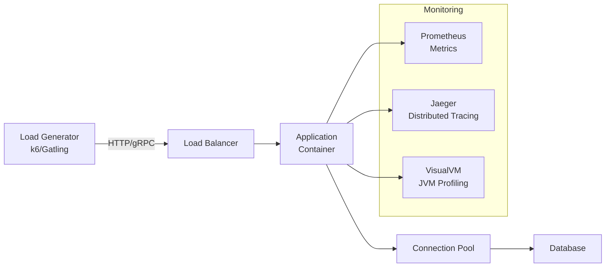
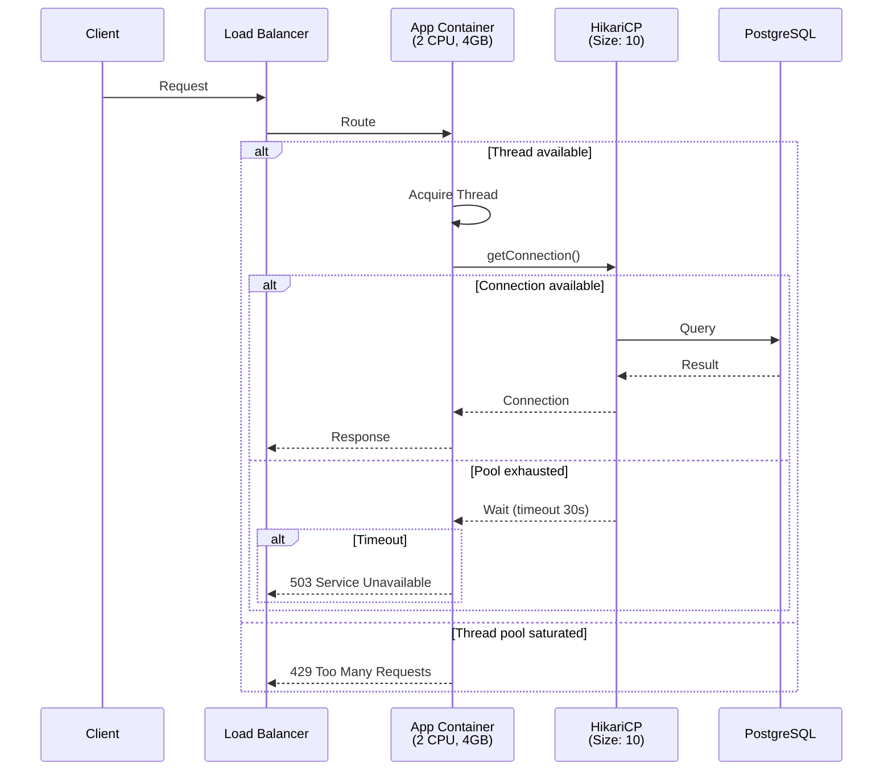
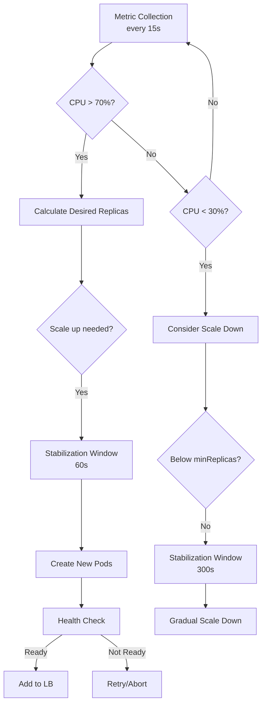

# Performance Tuning & Capacity Planning

> **Mục tiêu:** Làm chủ nghệ thuật tối ưu hiệu năng hệ thống và lập kế hoạch năng lực vận hành ở quy mô enterprise.

---

## 1. Mục Tiêu Củ Task

Task này đòi hỏi hiểu sâu về:
- **Load Testing Methodology**: Cách đo lường hiệu năng thực tế, không phải theory
- **JVM trong Container**: Những cạm bẫy khi chạy Java trong Docker/K8s
- **Resource Pool Sizing**: Khoa học đằng sau sizing connection pool, thread pool
- **Scaling Decisions**: Khi nào scale up, khi nào scale out
- **Autoscaling Intelligence**: Từ reactive scaling đến predictive scaling

---

## 2. Bản Chất Và Cơ Chế Hoạt Động

### 2.1 Load Testing: Không Phải Chỉ Là "Bắn Request"

#### Little's Law - Nền Tảng Toán Học

```
L = λ × W
```

Trong đó:
- **L**: Số request đang xử lý trong hệ thống (concurrency)
- **λ**: Tốc độ request đến (throughput)
- **W**: Thờigian xử lý trung bình (latency)

> **Insight quan trọng**: Nếu latency tăng 2x mà throughput giữ nguyên, concurrency cũng tăng 2x → hệ thống có thể collapse.

#### Phân Biệt Các Loại Test

| Loại Test | Mục Đích | Thờigian Chạy | Metric Chính |
|-----------|----------|---------------|--------------|
| **Load Test** | Xác định hành vi dưới tải kỳ vọng | 30-60 phút | Throughput, p99 latency |
| **Stress Test** | Tìm điểm gãy (breaking point) | Cho đến khi crash | Error rate, recovery time |
| **Spike Test** | Đánh giá khả năng chịu tải đột biến | 5-15 phút | Response time degradation |
| **Soak Test** | Phát hiện memory leak, connection leak | 8-24 giờ | Memory growth, connection count |
| **Breakpoint Test** | Xác định capacity tối đa | Tăng dần đến failure | Max throughput trước khi collapse |

#### Throughput vs Latency Trade-off

Mối quan hệ không tuyến tính:

```
Latency
    │
    │      ╭───── Saturation Point
    │     ╱
    │    ╱
    │   ╱  Linear Region
    │  ╱
    │ ╱
    │╱
    └───────────────────── Throughput
```

- **Linear Region**: Tăng throughput → latency tăng chậm (hệ thống còn idle capacity)
- **Saturation Point**: Bắt đầu queueing, latency tăng đột biến
- **Collapse Region**: Throughput giảm dù vẫn nhận thêm request (thrashing)

> **Nguyên tắc Production**: Luôn vận hành dưới Saturation Point ít nhất 30% để có headroom.

---

### 2.2 JVM trong Container: Cạm Bẫy "Invisible Walls"

#### Vấn Đề Gốc Rễ: JVM Không "Nhìn Thấy" Container Limits

Java 8u131 trở về trước:
- JVM nhìn thấy toàn bộ RAM/CPU của host
- `-Xmx` mặc định = 1/4 physical memory
- **Kết quả**: OOM Killer từ kernel khi container vượt limit

```
Container (limit 2GB)
├─ JVM heap: 4GB (tưởng host có 16GB)
├─ Metaspace: growing
└─ Native memory: growing
    ↓
[OOM Killed by Kernel] ← Container bị kill, không có OutOfMemoryError
```

#### Giải Pháp: Container-Aware JVM

**Java 8u191+ / Java 11+ / Java 17+:**

```bash
# Experimental flags (Java 8)
-XX:+UnlockExperimentalVMOptions
-XX:+UseCGroupMemoryLimitForHeap
-XX:MaxRAMFraction=1  # Heap = 1/1 container limit (risky)

# Modern approach (Java 11+)
-XX:+UseContainerSupport  # Enabled by default
-XX:MaxRAMPercentage=75.0  # Heap = 75% container memory
-XX:InitialRAMPercentage=50.0
```

#### CGroup v2 và Ergonomics Mới (Java 17+)

```
Container Limit: 2GB
├─ JVM Heap: ~1.2GB (60% with container awareness)
├─ Metaspace: 128MB default (unlimited trước Java 8)
├─ Direct Buffers: limited by -XX:MaxDirectMemorySize
├─ Thread Stacks: ~1MB/thread × thread count
├─ Code Cache: 240MB default
├─ GC overhead
└─ Native memory for JVM internals
```

> **Lưu ý quan trọng**: `-XX:MaxRAMPercentage` chỉ tính trên **heap**, không phải toàn bộ JVM memory. Phải chừa ~25-30% cho non-heap.

#### CPU Quota vs CPU Shares

**CFS Quota (Kubernetes limits):**
```bash
# Container: 2 CPU limit
-XX:ActiveProcessorCount=2  # Force JVM thấy 2 CPU
-XX:+UseParallelGC  # Hoặc G1GC tự động scale threads
```

**Vấn đề:** Default GC threads = cores detected
- Container limit 2 CPU, host có 64 cores
- G1 GC tạo 64 concurrent marking threads → throttling, high latency

**Giải pháp:**
```bash
-XX:ParallelGCThreads=2
-XX:ConcGCThreads=1  # Concurrent marking threads
```

---

### 2.3 Connection Pool Sizing: Khoa Học Củng Cứ

#### Queuing Theory: Mô Hình M/M/c

Hệ thống connection pool được mô hình hóa như:
- **Arrival rate (λ)**: Request đến pool
- **Service rate (μ)**: 1/average query time
- **Servers (c)**: Pool size

**Little's Law áp dụng cho pool:**
```
Average connections in use = λ × average query time
```

#### Formula: Pool Size Tối Ưu

Theo PostgreSQL Wiki và HikariCP authors:

```
connections = ((core_count × 2) + effective_spindle_count)
```

Trong cloud/container context:
```
connections = ((vCPU × 2) + 1)
```

| vCPU | Recommended Pool Size | Max (với disk I/O cao) |
|------|----------------------|------------------------|
| 2 | 5 | 10 |
| 4 | 9 | 20 |
| 8 | 17 | 40 |
| 16 | 33 | 80 |

#### Vấn Đề: "Too Many Connections"

**Hiện tượng:**
- Context switching overhead tăng
- Database lock contention tăng
- Memory pressure trên DB
- **Kết quả**: Throughput giảm dù resource dư

**Bằng chứng từ PostgreSQL:**
- 1000 connections: throughput ~50% so với 100 connections
- Latency tăng 5-10x

#### HikariCP Internals: Tại Sao Nhanh?

```
Traditional Pool (c3p0, DBCP):
┌─────────┐     ┌─────────────┐     ┌─────────┐
│ Thread  │────→│ Synchronized│────→│ Queue   │────→ DB
│ Request │     │ Block       │     │ Wait    │
└─────────┘     └─────────────┘     └─────────┘

HikariCP:
┌─────────┐     ┌─────────────────┐
│ Thread  │────→│ CAS + Lock-free │────→ DB
│ Request │     │ HandoffQueue    │
└─────────┘     └─────────────────┘
```

**Optimizations:**
- **FastList**: ArrayList custom với `removeLast()` O(1) thay vì `remove()` O(n)
- **ConcurrentBag**: Lock-free collection cho connection management
- **HouseKeeper**: Background thread dọn dẹp, không block getConnection()

**Configuration Best Practices:**
```properties
# HikariCP
hikari.maximumPoolSize=10          # Không nên > 20 trừ khi có lý do đặc biệt
hikari.minimumIdle=5               # Giữ sẵn connections
hikari.connectionTimeout=30000     # 30s max wait for connection
hikari.idleTimeout=600000          # 10m - recycle idle connections
hikari.maxLifetime=1800000         # 30m - force rotation
hikari.leakDetectionThreshold=60000 # Phát hiện connection leak
```

---

### 2.4 Thread Pool Tuning: Không Phải "Càng Nhiều Càng Tốt"

#### Mô Hình Thread Pool

```
ThreadPoolExecutor:
┌─────────────────────────────────────────┐
│  Core Pool Size: 4                      │
│  Max Pool Size: 8                       │
│  Work Queue: LinkedBlockingQueue(100)   │
│                                         │
│  [Active: 4] [Idle: 0] [Queue: 12]      │
│  [Completed: 1,240] [Rejected: 0]       │
└─────────────────────────────────────────┘
```

#### Luồng Xử Lý Task

```
1. Task submitted
   ↓
2. Active threads < core? 
   → Yes: Create new thread
   → No: Proceed
   ↓
3. Queue not full?
   → Yes: Add to queue
   → No: Proceed
   ↓
4. Active threads < max?
   → Yes: Create new thread
   → No: Reject (or caller-runs)
```

#### Formula: Sizing Thread Pool

**CPU-bound tasks:**
```
pool_size = CPU_cores × (1 + wait_time / compute_time)
```

Ví dụ:
- Task: 100ms compute + 50ms I/O wait
- 8 cores
- pool_size = 8 × (1 + 50/100) = 12 threads

**I/O-bound tasks (typical web service):**
```
pool_size = CPU_cores × target_utilization × (1 + wait_time / compute_time)
          = 8 × 0.9 × (1 + 200/20) 
          = 8 × 0.9 × 11
          = ~79 threads
```

> **Nhưng**: Con số này rất dễ sai. Thực tế: Bắt đầu với 10-20, measure, điều chỉnh.

#### ForkJoinPool: Work Stealing

```
ForkJoinPool (common pool):
┌─────────┐  ┌─────────┐  ┌─────────┐  ┌─────────┐
│ Queue 1 │  │ Queue 2 │  │ Queue 3 │  │ Queue 4 │
│ Thread 1│  │ Thread 2│  │ Thread 3│  │ Thread 4│
│ [task]  │  │ [task]  │  │  empty  │  │ [task]  │
│ [task]  │  │  empty  │  │         │  │ [task]  │
└─────────┘  └─────────┘  └─────────┘  └─────────┘
                      ↓
            Thread 3 "steals" from Thread 1
```

**Common Pool Size (Java 8+):**
```java
Runtime.getRuntime().availableProcessors() - 1
```

**Tuning:**
```java
System.setProperty("java.util.concurrent.ForkJoinPool.common.parallelism", "8");
```

---

### 2.5 Backpressure: Khi Hệ Thống "Không Chịu Nổi"

#### Cơ Chế Backpressure

```
Without Backpressure (System Collapse):
Client ──→ Service ──→ Database
  ↓         ↓            ↓
1000 RPS  1000 RPS    100 RPS capacity
            ↓
      [Queue builds up]
            ↓
      [OOM / Timeout / Cascade failure]

With Backpressure (Controlled Degradation):
Client ──→ Service ──→ Database
  ↓         ↓            ↓
1000 RPS  100 RPS      100 RPS
 (shed)   (process)    (stable)
  ↓
[Client gets 503 / retry later]
```

#### Implementation Patterns

**1. Rate Limiting (Token Bucket):**
```java
// Guava RateLimiter
RateLimiter limiter = RateLimiter.create(100); // 100 permits/second

if (limiter.tryAcquire()) {
    process(request);
} else {
    return Response.status(429).build(); // Too Many Requests
}
```

**2. Bounded Queue + Rejection:**
```java
new ThreadPoolExecutor(
    4, 8, 60, TimeUnit.SECONDS,
    new ArrayBlockingQueue<>(100),
    new ThreadPoolExecutor.CallerRunsPolicy() // Hoặc DiscardPolicy
);
```

**3. Reactive Streams Backpressure:**
```java
// Project Reactor
Flux.range(1, 1_000_000)
    .onBackpressureBuffer(1000) // Buffer 1000 items
    .onBackpressureDrop()       // Hoặc drop items
    .subscribe();
```

#### Queue Size: Magic Number?

| Queue Size | Hành Vi | Use Case |
|-----------|---------|----------|
| 0 (SynchronousQueue) | Không queue, spawn thread ngay | Burst handling, low latency |
| Bounded (100-1000) | Queue rồi reject khi full | Most production systems |
| Unbounded | Queue vô hạn | ❌ **NEVER in production** - memory leak risk |

> **Quy tắc**: Queue chỉ để absorb burst ngắn hạn, không phải lưu trữ.

---

### 2.6 Scaling: Vertical vs Horizontal

#### Vertical Scaling (Scale Up)

**Ưu điểm:**
- Đơn giản, không cần thay đổi architecture
- Không overhead network communication
- Data locality tốt hơn

**Nhược điểm:**
- Hardware ceiling (max ~2TB RAM, ~128 cores/instance)
- Single point of failure
- Cost không tuyến tính (diminishing returns)

**When to use:**
- Database (vì data consistency requirements)
- Cache layer (Redis single instance)
- Legacy applications không support distributed

#### Horizontal Scaling (Scale Out)

**Ưu điểm:**
- Near-unlimited scale
- Fault tolerance (1 node down ≠ system down)
- Cost tuyến tính với load
- Geographic distribution

**Nhược điểm:**
- Complexity: distributed state, consensus
- Overhead: network latency, serialization
- Data consistency challenges (CAP theorem)

**When to use:**
- Stateless services (most microservices)
- Read-heavy workloads (read replicas)
- Batch processing (divide and conquer)

#### Scalability Limits

```
Speedup
   │
   │        Amdahl's Law
   │       ╭──────────
   │      ╱
   │     ╱
   │    ╱   Sequential
   │   ╱    bottleneck
   │  ╱
   │ ╱
   │╱
   └────────────────────── Number of nodes
```

**Amdahl's Law:**
```
Speedup = 1 / ((1 - P) + P/N)
```
- P = % có thể parallelize
- N = number of processors

Ví dụ: Nếu 10% code là sequential:
- Speedup max = 10x (dù có 1000 cores)

---

### 2.7 Autoscaling: Từ Reactive Đến Predictive

#### HPA (Horizontal Pod Autoscaler) - Kubernetes

```yaml
apiVersion: autoscaling/v2
kind: HorizontalPodAutoscaler
spec:
  scaleTargetRef:
    apiVersion: apps/v1
    kind: Deployment
    name: api-service
  minReplicas: 2
  maxReplicas: 20
  metrics:
    - type: Resource
      resource:
        name: cpu
        target:
          type: Utilization
          averageUtilization: 70
  behavior:
    scaleUp:
      stabilizationWindowSeconds: 60  # Chờ 60s trước khi scale up
      policies:
        - type: Percent
          value: 100
          periodSeconds: 15  # Tăng 100% mỗi 15s
    scaleDown:
      stabilizationWindowSeconds: 300  # Chờ 5 phút trước khi scale down
      policies:
        - type: Percent
          value: 10
          periodSeconds: 60  # Giảm 10% mỗi phút
```

#### HPA Internals

```
Desired Replicas = ceil(
    currentReplicas × (currentMetricValue / desiredMetricValue)
)

Ví dụ:
- Current: 4 pods
- Current CPU: 80%
- Target CPU: 50%
- Desired = 4 × (80/50) = 6.4 → ceil → 7 pods
```

#### Vấn Đề: Lag Time

```
Load tăng ──→ HPA detect (15s) ──→ Scale decision ──→ Pod startup (30-60s)
    │                                              
    └──────→ [Gap: 45-75s overload] ←──────┘
```

**Giải pháp:**
- **Overprovision**: Luôn giữ 20-30% headroom
- **Custom metrics**: Scale dựa trên queue depth, request rate thay vì CPU
- **KEDA**: Event-driven autoscaling

#### KEDA (Kubernetes Event-driven Autoscaling)

```yaml
apiVersion: keda.sh/v1alpha1
kind: ScaledObject
spec:
  scaleTargetRef:
    name: order-processor
  pollingInterval: 5  # Check mỗi 5s
  cooldownPeriod: 30
  minReplicaCount: 0   # Scale to zero!
  maxReplicaCount: 100
  triggers:
    - type: kafka
      metadata:
        bootstrapServers: kafka:9092
        consumerGroup: order-group
        topic: orders
        lagThreshold: "100"  # Scale khi lag > 100 messages
    - type: prometheus
      metadata:
        serverAddress: http://prometheus:9090
        metricName: http_requests_per_second
        threshold: "1000"
```

#### Predictive Autoscaling

**Concept:** Scale trước khi load đến

```
Historical Pattern:
    ┌───┐
    │   │    ┌───┐
    │   │    │   │    ┌───┐
────┘   └────┘   └────┘   └────
  9am      12pm     3pm
  (Peak)   (Lunch)  (Peak)

Cron-based scaling:
scale up at 8:45am before traffic
```

**Machine Learning approaches:**
- Facebook Prophet
- AWS Auto Scaling with predictive scaling
- Custom models based on historical data

---

## 3. Kiến Trúc Luồng Xử Lý

### 3.1 Load Testing Architecture



### 3.2 Request Flow Với Resource Limits



### 3.3 Autoscaling Decision Flow



---

## 4. So Sánh Các Lựa Chọn

### 4.1 Load Testing Tools

| Tool | Ngôn Ngữ | Protocols | Điểm Mạnh | Điểm Yếu | Best For |
|------|----------|-----------|-----------|----------|----------|
| **k6** | JavaScript | HTTP, WebSocket, gRPC | Cloud-native, CLI tốt, code-as-config | GUI hạn chế | CI/CD integration, dev workflows |
| **Gatling** | Scala/Kotlin DSL | HTTP, MQTT, JDBC | Detailed reports, scenario complex | Learning curve | Enterprise, complex scenarios |
| **JMeter** | GUI/XML | Mọi thứ | Mature, GUI, plugins | Resource-heavy, XML | Legacy systems, non-coders |
| **Locust** | Python | HTTP | Distributed, Python | Less performant | Python teams, custom logic |
| **Artillery** | YAML/JS | HTTP, Socket.io | Simple, cloud | Less powerful | Quick tests, startups |

### 4.2 Connection Pool Libraries

| Library | Performance | Features | Maintenance | Recommendation |
|---------|-------------|----------|-------------|----------------|
| **HikariCP** | ⭐⭐⭐⭐⭐ | Medium | Active | ✅ **Default choice** |
| **c3p0** | ⭐⭐ | Medium | Stale | ❌ Legacy only |
| **DBCP2** | ⭐⭐⭐ | High | Active | Apache projects |
| **Tomcat JDBC** | ⭐⭐⭐ | High | Active | Tomcat deployments |

### 4.3 GC Algorithms cho Container

| GC | Latency | Throughput | Memory | Container Fit | Use Case |
|----|---------|------------|--------|---------------|----------|
| **G1GC** | < 100ms | Good | Medium | ⭐⭐⭐⭐ | Default choice |
| **ZGC** | < 10ms | Good | Higher | ⭐⭐⭐⭐⭐ | Large heaps, latency-sensitive |
| **Shenandoah** | < 10ms | Good | Medium | ⭐⭐⭐⭐⭐ | Similar to ZGC |
| **ParallelGC** | High pauses | Best | Low | ⭐⭐ | Batch jobs, high throughput |
| **SerialGC** | High pauses | Low | Lowest | ⭐ | Single-core containers |

### 4.4 Scaling Strategies

| Strategy | Response Time | Complexity | Cost Efficiency | Risk |
|----------|---------------|------------|-----------------|------|
| **Manual** | Hours | Low | Low | Human error |
| **HPA (CPU)** | 1-5 minutes | Low | Medium | Lag, oscillation |
| **HPA (Custom)** | 1-5 minutes | Medium | Good | Requires tuning |
| **KEDA** | 5-30 seconds | Medium | Good | Event-driven only |
| **Predictive** | Proactive | High | Best | Requires ML, data |

---

## 5. Rủi Ro, Anti-patterns, Lỗi Thường Gặp

### 5.1 Anti-patterns Nghiêm Trọng

#### ❌ Unbounded Thread Pools

```java
// TỆ: Queue vô hạn
Executors.newFixedThreadPool(100);  // Max 100, nhưng queue vô hạn

// TỆ HƠN: Cả thread lẫn queue đều vô hạn
Executors.newCachedThreadPool();  // Thread tăng không giới hạn

// TỐT: Bounded queue + rejection policy
new ThreadPoolExecutor(4, 8, 60, TimeUnit.SECONDS,
    new ArrayBlockingQueue<>(100),
    new ThreadPoolExecutor.CallerRunsPolicy()
);
```

> **Hệ quả**: OOM, thread thrashing, system unresponsive

#### ❌ Unbounded Connection Pools

```properties
# TỆ:
hikari.maximumPoolSize=100  # Quá lớn, kill database

# TỐT:
hikari.maximumPoolSize=10   # Bắt đầu nhỏ, measure, scale up nếu cần
```

> **Hệ quả**: Database overload, cascading failure

#### ❌ JVM mặc định trong Container

```dockerfile
# TỆ:
CMD ["java", "-jar", "app.jar"]
# JVM thấy 64GB host memory, heap = 16GB
# Container limit 2GB → OOM Kill

# TỐT:
CMD ["java", "-XX:MaxRAMPercentage=75.0", "-jar", "app.jar"]
```

#### ❌ Autoscaling quá nhanh

```yaml
# TỆ: Scale up/down nhanh → oscillation
behavior:
  scaleUp:
    stabilizationWindowSeconds: 0
  scaleDown:
    stabilizationWindowSeconds: 0

# TỐT: Cooldown periods
behavior:
  scaleUp:
    stabilizationWindowSeconds: 60
  scaleDown:
    stabilizationWindowSeconds: 300
```

### 5.2 Lỗi Production Thường Gặp

| Lỗi | Nguyên Nhân | Dấu Hiệu | Fix |
|-----|-------------|----------|-----|
| **OOMKilled** | JVM heap > container limit | Pod status: OOMKilled | -XX:MaxRAMPercentage |
| **Connection leak** | Không close connection | Pool exhausted, DB connections tăng | leakDetectionThreshold |
| **Thread starvation** | Pool too small | Latency tăng, queue build up | Increase pool + profile |
| **GC thrashing** | Heap quá nhỏ | High CPU, frequent GC, low throughput | Increase heap |
| **Thundering herd** | Cache expiry cùng lúc | Spike ở DB sau cache miss | Staggered TTL, cache warming |
| **Noisy neighbor** | Không set resource limits | Unpredictable performance | Set requests/limits |

### 5.3 False Assumptions

| Assumption | Reality | Test Method |
|------------|---------|-------------|
| "More threads = faster" | Context switching overhead | A/B test with different pool sizes |
| "Bigger heap = better" | Longer GC pauses | GC log analysis |
| "Load test 5 phút đủ" | Memory leak, connection leak không hiện | Soak test 8+ giờ |
| "CPU thấp = healthy" | Có thể đang wait I/O | Check CPU vs load correlation |
| "One-size-fits-all config" | Mỗi workload khác nhau | Measure, don't guess |

---

## 6. Khuyến Nghị Thực Chiến Trong Production

### 6.1 JVM Container Configuration Template

```dockerfile
FROM eclipse-temurin:17-jre

ENV JAVA_OPTS="\
  -XX:+UseContainerSupport \
  -XX:MaxRAMPercentage=75.0 \
  -XX:InitialRAMPercentage=50.0 \
  -XX:+UseG1GC \
  -XX:MaxGCPauseMillis=200 \
  -XX:+UseStringDeduplication \
  -XX:+OptimizeStringConcat \
  -Djava.security.egd=file:/dev/./urandom \
  -Dspring.backgroundpreinitializer.ignore=true \
  -Dspring.jmx.enabled=false \
  "

# Tắt CDS (Class Data Sharing) nếu không cần fast startup
# Thêm cho latency-sensitive:
# -XX:+UseLargePages
# -XX:+AlwaysPreTouch

ENTRYPOINT ["sh", "-c", "java $JAVA_OPTS -jar app.jar"]
```

### 6.2 HikariCP Production Checklist

```properties
# 1. Kích thước hợp lý
spring.datasource.hikari.maximum-pool-size=10
spring.datasource.hikari.minimum-idle=2

# 2. Timeout phù hợp
spring.datasource.hikari.connection-timeout=30000
spring.datasource.hikari.idle-timeout=600000
spring.datasource.hikari.max-lifetime=1800000

# 3. Health check
spring.datasource.hikari.connection-test-query=SELECT 1
spring.datasource.hikari.validation-timeout=5000

# 4. Leak detection (chỉ bật khi debug)
spring.datasource.hikari.leak-detection-threshold=60000

# 5. Metrics
spring.datasource.hikari.register-mbeans=true
```

### 6.3 Thread Pool Production Template

```java
@Component
public class ExecutorConfig {
    
    @Bean("ioExecutor")
    public ExecutorService ioExecutor() {
        // Cho I/O-bound tasks (HTTP calls, DB queries)
        return new ThreadPoolExecutor(
            10,                      // core
            50,                      // max
            60L, TimeUnit.SECONDS,
            new LinkedBlockingQueue<>(1000),
            new ThreadFactoryBuilder()
                .setNameFormat("io-pool-%d")
                .build(),
            new ThreadPoolExecutor.CallerRunsPolicy()
        );
    }
    
    @Bean("cpuExecutor")
    public ExecutorService cpuExecutor() {
        // Cho CPU-bound tasks (computation)
        return Executors.newFixedThreadPool(
            Runtime.getRuntime().availableProcessors(),
            new ThreadFactoryBuilder()
                .setNameFormat("cpu-pool-%d")
                .build()
        );
    }
}
```

### 6.4 HPA Production Checklist

```yaml
apiVersion: autoscaling/v2
kind: HorizontalPodAutoscaler
spec:
  # 1. Luôn có minReplicas >= 2 cho HA
  minReplicas: 2
  maxReplicas: 20
  
  metrics:
    # 2. Kết hợp nhiều metrics
    - type: Resource
      resource:
        name: cpu
        target:
          averageUtilization: 60  # Conservative
          type: Utilization
    - type: Resource
      resource:
        name: memory
        target:
          averageUtilization: 70
          type: Utilization
    # 3. Custom metric nếu có
    - type: Pods
      pods:
        metric:
          name: http_requests_per_second
        target:
          averageValue: "1000"
          type: AverageValue
  
  behavior:
    # 4. Conservative scale down
    scaleDown:
      stabilizationWindowSeconds: 300
      policies:
        - type: Percent
          value: 10
          periodSeconds: 60
    # 5. Aggressive scale up
    scaleUp:
      stabilizationWindowSeconds: 0
      policies:
        - type: Percent
          value: 100
          periodSeconds: 15
```

### 6.5 Load Testing Production Checklist

**Before Release:**
- [ ] Load test với traffic kỳ vọng + 50%
- [ ] Stress test đến điểm gãy
- [ ] Soak test 8+ giờ cho memory leak
- [ ] Spike test cho burst handling
- [ ] Test với failure scenarios (DB slow, network partition)

**Metrics cần thu thập:**
- Throughput (RPS)
- Latency: p50, p95, p99, max
- Error rate by type (4xx, 5xx, timeout)
- JVM: heap usage, GC frequency/duration, thread count
- System: CPU, memory, disk I/O, network
- Application: connection pool active/idle, queue depth

---

## 7. Kết Luận

### Bản Chất Của Performance Tuning

Performance tuning không phải là việc "tìm config magic" mà là **hiểu rõ luồng dữ liệu và bottlenecks**:

1. **Measure First**: Không đoán, dùng data
2. **Find Bottleneck**: Thường là I/O (DB, network), không phải CPU
3. **Fix One Thing**: Thay đổi một thứ, measure lại
4. **Validate Limits**: Biết điểm gãy của hệ thống

### Capacity Planning là Risk Management

> Không phải là dự đoán chính xác tương lai, mà là **đảm bảo hệ thống không gãy trong khoảng variance dự kiến**.

- Headroom 30% cho variance
- Autoscale cho burst
- Circuit breaker cho cascading failure
- Monitoring cho early warning

### Các Quyết Định Quan Trọng Nhất

| Decision | Recommendation | Why |
|----------|----------------|-----|
| JVM heap size | 75% container memory | Đủ cho heap + non-heap |
| Connection pool | 10 (start), measure, adjust | Quá nhiều = DB death |
| Thread pool | Bounded queue, CallerRunsPolicy | Backpressure tự nhiên |
| GC | G1GC default, ZGC cho large heap | Balance throughput/latency |
| Scaling | HPA + conservative scale down | Tránh oscillation |

### Tư Duy Cuối Cùng

```
"Premature optimization is the root of all evil" 
- Donald Knuth

"But proper capacity planning is just good engineering"
- Production Engineer
```

Không optimize quá sớm, nhưng luôn:
- Đặt giới hạn (bounds) cho mọi resource
- Monitor everything
- Test load trước khi release
- Plan for failure

---

## 8. Tham Khảo

### Documentation
- [HikariCP Wiki](https://github.com/brettwooldridge/HikariCP/wiki)
- [Kubernetes HPA Documentation](https://kubernetes.io/docs/tasks/run-application/horizontal-pod-autoscale/)
- [KEDA Documentation](https://keda.sh/docs/)
- [JVM in Containers Guide](https://developers.redhat.com/articles/2022/04/19/java-17-whats-new-openjdks-container-awareness)

### Tools
- **k6**: https://k6.io/
- **Gatling**: https://gatling.io/
- **KEDA**: https://keda.sh/
- **VisualVM**: https://visualvm.github.io/

### Research Papers
- "Little's Law" - John Little, 1961
- "Amdahl's Law" - Gene Amdahl, 1967
- "The Universal Scalability Law" - Neil Gunther
- "PostgreSQL Connection Pooling" - PostgreSQL Wiki
