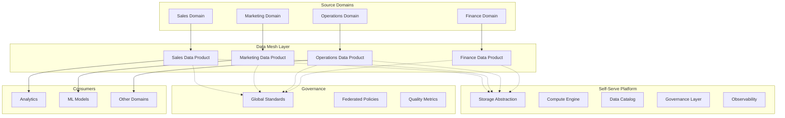

# Data Mesh & Domain-Oriented Ownership

> **Mục tiêu:** Hiểu sâu kiến trúc Data Mesh, phân biệt với Data Lake/Warehouse truyền thống, và nắm vững các nguyên tắc production.

---

## 1. Mục tiêu của Task

Data Mesh là **paradigm shift** trong quản lý dữ liệu enterprise - chuyển từ mô hình tập trung (centralized data team) sang mô hình phân tán (domain-oriented data ownership). Task này giải thích:
- Bản chất Data Mesh: vì sao nó khác biệt và khi nào cần áp dụng
- Cơ chế self-serve data infrastructure và federated governance
- Thực tiễn triển khai, rủi ro, và anti-patterns

---

## 2. Bản Chất và Cơ Chế Hoạt Động

### 2.1 Vấn đề của Centralized Data Architecture

Trước Data Mesh, doanh nghiệp thường áp dụng một trong hai mô hình:

| Mô hình | Đặc điểm | Điểm yếu chết ngườii |
|---------|----------|----------------------|
| **Data Warehouse** | Schema-on-write, ETL pipeline, dimensional modeling | Inflexible, schema changes painful, bottleneck ở data team |
| **Data Lake** | Schema-on-read, raw storage, flexibility | "Data swamp" - không ai biết data ở đâu, chất lượng kém, siloed knowledge |

**Bottleneck cố hữu:** Một data team trung tâm phải hiểu business logic của mọi domain (Sales, Marketing, Operations, Finance). Khi có 50+ domains, điều này không scalable.

### 2.2 Bản chất Data Mesh

Data Mesh được Zhamak Dehghani giới thiệu năm 2019, dựa trên **4 nguyên tắc**:

```
┌─────────────────────────────────────────────────────────────────┐
│                    DATA MESH PRINCIPLES                         │
├─────────────────────────────────────────────────────────────────┤
│ 1. Domain-Oriented Ownership                                    │
│    → Data là sản phẩm của domain, do domain team quản lý        │
│                                                                 │
│ 2. Data as a Product                                            │
│    → Đối xử data như API/product: discoverable, addressable,    │
│      trustworthy, self-describing                               │
│                                                                 │
│ 3. Self-Serve Data Infrastructure Platform                      │
│    → Platform team cung cấp tooling, không cung cấp data        │
│                                                                 │
│ 4. Federated Computational Governance                           │
│    → Governance phân tán: global standards + local autonomy     │
└─────────────────────────────────────────────────────────────────┘
```

**Insight quan trọng:** Data Mesh không phải là công nghệ mà là **organizational paradigm**. Bạn có thể implement Data Mesh với bất kỳ tech stack nào - Kafka, S3, Snowflake, Databricks, hay on-premise Hadoop.

### 2.3 Cơ chế Domain-Oriented Data Ownership

**Sự thay đổi tư duy:**

| Aspect | Traditional (Data Lake) | Data Mesh |
|--------|------------------------|-----------|
| **Organization** | Central data team | Distributed domain teams |
| **Skillset** | Data engineers know all domains | Domain engineers know their data |
| **Accountability** | "Data team chịu trách nhiệm" | "Domain team owns their data product" |
| **Priority** | Centralized optimization | Domain-driven optimization |
| **Speed** | Backlog của data team | Domain team tự phục vụ |

**Domain Data Product:**
- Input data từ operational systems (microservices, applications)
- Transform và serve dưới dạng output datasets
- Có owner rõ ràng, SLA, versioning, documentation

```
┌─────────────────────────────────────────────────────────────┐
│                    DOMAIN DATA PRODUCT                      │
├─────────────────────────────────────────────────────────────┤
│  Code        │  Data        │  Infrastructure │  Governance │
│  ────────────┼──────────────┼─────────────────┼─────────────│
│  • Pipelines │  • Datasets  │  • Storage      │  • Quality  │
│  • APIs      │  • Schemas   │  • Compute      │  • Security │
│  • Metadata  │  • Lineage   │  • Access ctrl  │  • Privacy  │
└─────────────────────────────────────────────────────────────┘
```

### 2.4 Self-Serve Data Infrastructure Platform

Đây là **enabler** của Data Mesh. Platform team không xây dựng data pipelines mà xây dựng **capabilities**:

| Capability | Mô tả | Ví dụ công nghệ |
|------------|-------|-----------------|
| **Storage** | Abstraction trên storage layer | S3, ADLS, Delta Lake, Iceberg |
| **Compute** | Query và processing engine | Spark, Trino, dbt, Flink |
| **Data Pipeline** | Orchestration và transformation | Airflow, Dagster, Prefect |
| **Data Catalog** | Discovery và lineage | DataHub, Collibra, Amundsen |
| **Governance** | Access control, quality, privacy | Apache Ranger, Privacera |
| **Observability** | Monitoring, alerting, lineage | OpenLineage, Monte Carlo |

**Nguyên tắc vàng:** Platform phải giảm **cognitive load** của domain teams. Họ không cần biết Kubernetes, Spark internals, hay Terraform. Họ chỉ cần định nghĩa "tôi muốn dataset này, với schema này, accessible bởi những ai".

### 2.5 Federated Governance

**Trade-off giữa autonomy và consistency:**

```
                    FEDERATED GOVERNANCE
                           │
        ┌──────────────────┼──────────────────┐
        ▼                  ▼                  ▼
   ┌─────────┐      ┌────────────┐      ┌──────────┐
   │ Global  │      │  Domain    │      │  Global  │
   │Standards│◄────►│  Autonomy  │◄────►│Policies  │
   └─────────┘      └────────────┘      └──────────┘
        │                  │                  │
   • Interoperability  • Local decisions  • Compliance
   • Common formats    • Optimization     • Security
   • Quality metrics   • Innovation       • Privacy
```

**Global standards (bắt buộc):**
- Interoperability formats (Parquet, Avro, Arrow)
- Identity và access management patterns
- Data quality metrics (completeness, accuracy, timeliness)
- Privacy và compliance (GDPR, CCPA)

**Domain autonomy:**
- Choice của processing engine (Spark vs Flink vs dbt)
- Internal data modeling (normalized vs denormalized)
- Release cadence và versioning
- Local optimization (partitioning, indexing)

---

## 3. Kiến Trúc và Luồng Xử Lý

### 3.1 Logical Architecture



### 3.2 Data Product Contract

Mỗi data product phải expose:

```yaml
# Data Product Specification Example
data_product:
  name: sales_orders_aggregate
  domain: sales
  owner: sales-data-team@company.com
  
  # Interface (Addressability)
  output_ports:
    - type: analytical
      format: parquet
      location: s3://mesh/sales/orders/v1/
      schema_registry: http://schema-registry/sales/orders/v1
    - type: operational
      format: kafka-avro
      topic: sales.orders.updates
      
  # Metadata (Discoverability)
  metadata:
    description: "Aggregated daily sales orders by region"
    update_frequency: daily
    sla: "Available by 6AM UTC"
    retention: 2_years
    
  # Quality (Trustworthiness)
  quality:
    completeness: "> 99.5%"
    freshness: "< 24 hours"
    schema_evolution: backward_compatible
    
  # Governance
  governance:
    classification: internal
    pii_fields: [customer_email]
    access_control: role_based
    lineage: auto_generated
```

### 3.3 Transition từ Data Lake sang Data Mesh

**Journey pattern (không phải big bang):**

1. **Phase 1: Identify Pilot Domain** (Month 1-3)
   - Chọn domain có pain point rõ ràng, team kỹ thuật tốt
   - Build self-serve platform MVP cho domain này
   - Establish data product pattern

2. **Phase 2: Platform Hardening** (Month 4-6)
   - Refine platform dựa trên feedback
   - Establish global standards (schema registry, quality metrics)
   - Build data catalog và lineage

3. **Phase 3: Domain Expansion** (Month 7-12)
   - Onboard domains một cách có hệ thống
   - Federate governance gradually
   - Migrate critical datasets từ data lake

4. **Phase 4: Mesh Maturity** (Year 2+)
   - Full domain ownership
   - Inter-domain data products
   - Advanced use cases (ML, real-time analytics)

---

## 4. So Sánh Các Lựa Chọn

### 4.1 Data Mesh vs Data Lake vs Data Warehouse

| Dimension | Data Warehouse | Data Lake | Data Mesh |
|-----------|---------------|-----------|-----------|
| **Architecture** | Centralized | Centralized | Decentralized |
| **Schema** | Schema-on-write | Schema-on-read | Schema-as-contract |
| **Ownership** | IT/Data team | IT/Data team | Domain teams |
| **Scalability** | Organizational bottleneck | Data swamp risk | Organizational scalability |
| **Agility** | Low (ETL changes slow) | Medium | High (domain-driven) |
| **Skill required** | Data engineers + SQL | Data engineers + big data | Domain + platform teams |
| **Governance** | Centralized control | Often neglected | Federated |
| **Best for** | Structured reporting, BI | Raw data exploration | Complex organizations, many domains |

### 4.2 Implementation Patterns

| Pattern | Pros | Cons | When to use |
|---------|------|------|-------------|
| **Logical Mesh** | No data movement, governance overlay | Limited performance optimization, query complexity | Existing data lake investment, start quickly |
| **Physical Mesh** | True domain isolation, optimization | Data duplication, complex lineage | Greenfield, strict domain boundaries |
| **Hybrid Mesh** | Balance flexibility và control | Complexity in implementation | Most enterprise scenarios |

---

## 5. Rủi Ro, Anti-Patterns, và Lỗi Thường Gặp

### 5.1 Critical Anti-Patterns

> **"Mesh of Mess"** - Tạo ra nhiều data silo hơn thay vì giải quyết silo

**Nguyên nhân:** Thiếu global standards, mỗi domain tự xây dựng incompatible data products.

**Phòng tránh:** Đầu tư vào interoperability standards từ ngày đầu. Schema registry bắt buộc.

---

> **"Platform as Bottleneck"** - Platform team trở thành gánh nặng mới

**Nguyên nhân:** Self-serve platform không thực sự self-serve. Domain teams vẫn phải chờ platform team.

**Phòng tránh:** Platform phải có product mindset, user research với domain teams, measure time-to-data-product.

---

> **"Governance Theater"** - Governance chỉ trên giấy

**Nguyên nhân:** Federated governance không có enforcement mechanism. Policies không tự động hóa.

**Phòng tránh:** Policy-as-code, automated compliance checking, block pipeline nếu vi phạm.

---

> **"Domain Anarchy"** - Domain teams không có khả năng/kỹ năng ownership

**Nguyên nhân:** Giả định domain engineers tự nhiên biết xây dựng data products.

**Phòng tránh:** Data platform phải giảm cognitive load tối đa. Training, embedded data engineers trong domain teams initially.

### 5.2 Technical Pitfalls

| Pitfall | Mô tả | Giải pháp |
|---------|-------|-----------|
| **Inconsistent Identities** | "Customer ID" khác nhau giữa các domain | Global identifier registry, identity mapping service |
| **Schema Drift Hell** | Breaking changes không được phát hiện | Automated contract testing, schema evolution policies |
| **Lineage Blindness** | Không biết data đến từ đâu | Mandatory lineage collection, OpenLineage integration |
| **Access Control Chaos** | Permissions scattered, audit impossible | Centralized IAM với policy-as-code |
| **Data Duplication** | Cùng data được copy nhiều nơi | Data catalog, usage tracking, deduplication policies |

### 5.3 Organizational Risks

- **Political Resistance:** Data team sợ mất quyền lực → cần change management rõ ràng
- **Skill Gap:** Domain engineers không có kỹ năng data → cần upskilling program
- **Cost Explosion:** Nhiều domain = nhiều infrastructure → cần FinOps practices
- **Vendor Lock-in:** Platform tools quá proprietary → ưu tiên open standards

---

## 6. Khuyến Nghị Thực Chiến trong Production

### 6.1 Getting Started Checklist

**Không bắt đầu bằng công nghệ. Bắt đầu bằng organization:**

```
□ Identify executive sponsor (C-level backing critical)
□ Map current data domains và pain points
□ Assess organizational readiness (skill, culture, budget)
□ Define pilot domain (high pain + capable team)
□ Establish platform team (product mindset, not IT mindset)
□ Define global standards v0.1 (minimal but enforced)
□ Build minimal self-serve platform
□ Measure baseline metrics (time-to-insight, data quality scores)
□ Execute pilot (3-6 months)
□ Evaluate và iterate
□ Plan expansion roadmap
```

### 6.2 Technology Stack Recommendations

**Data Catalog & Discovery (bắt buộc):**
- **DataHub** (LinkedIn): Open source, rich lineage, active community
- **Collibra/Alation**: Enterprise-grade, expensive nhưng comprehensive

**Self-Serve Platform:**
- **DataBricks Unity Catalog**: Good nếu đã trong DataBricks ecosystem
- **AWS DataZone / Azure Purview**: Cloud-native, integrate với cloud IAM
- **dbt + Airflow**: Lightweight, dễ bắt đầu cho SQL-focused orgs

**Governance:**
- **Apache Ranger**: Policy enforcement, audit logging
- **Apache Atlas**: Metadata, lineage, classification
- **OpenLineage**: Standard lineage collection

### 6.3 Success Metrics

| Category | Metric | Target |
|----------|--------|--------|
| **Agility** | Time from data need → data product available | < 2 weeks (vs. 2-3 months in centralized model) |
| **Quality** | Data quality score (completeness, accuracy) | > 95% |
| **Governance** | % datasets with documented lineage | > 90% |
| **Adoption** | # active data product consumers | Growing 20% MoM |
| **Efficiency** | Infrastructure cost per data product | Optimize 15% QoQ |
| **Satisfaction** | Domain team NPS về data platform | > 50 |

### 6.4 Patterns for Java/Spring Backend Teams

Khi backend team trở thành data product owners:

```java
// Anti-pattern: Direct database access
// Pattern: Expose data product via well-defined interface

@DataProduct(
    name = "order-events",
    domain = "sales",
    version = "v1",
    schema = OrderEventSchema.class
)
public class OrderDataProduct {
    
    @OutputPort(type = OutputType.KAFKA, topic = "sales.orders")
    public KafkaTemplate<String, OrderEvent> orderEvents() {
        // Configuration with schema validation
    }
    
    @QualityCheck(metric = "freshness", threshold = "5m")
    public boolean validateFreshness() {
        // Automated quality validation
    }
    
    @Lineage
    public DataLineage getLineage() {
        // Auto-generated lineage
    }
}
```

**Integration points:**
- Spring Cloud Stream cho event publishing
- Micrometer + Prometheus cho data product metrics
- Spring Security + OAuth2 cho access control
- Spring Cloud Contract cho schema testing

---

## 7. Kết Luận

Data Mesh là **organizational paradigm shift** từ centralized data ownership sang domain-oriented data ownership, enabled bởi self-serve data platform và federated governance.

**Bản chất cốt lõi:**
- Data không còn là byproduct mà là first-class product
- Ownership phân tán nhưng governance được standardize
- Platform team cung cấp capabilities, không cung cấp data

**Trade-off quan trọng nhất:** Organizational complexity vs. scalability. Data Mesh giải quyết bottleneck của centralized model nhưng tạo ra complexity mới ở governance và coordination.

**Rủi ro lớn nhất:** "Mesh of mess" - thiếu global standards dẫn đến incompatible data silos. Governance phải được automate và enforce từ ngày đầu.

**Khi nào nên dùng:** Organizations với 5+ domains, 50+ engineers, pain points về data bottleneck, và sẵn sàng đầu tư vào platform engineering. Không phải silver bullet cho mọi organization.

---

## 8. Tài Liệu Tham Khảo

1. **Original Paper:** "Data Mesh Paradigm Shift" - Zhamak Dehghani (2019)
2. **Book:** "Data Mesh" - Zhamak Dehghani (O'Reilly, 2022)
3. **Martin Fowler:** Data Mesh articles on martinfowler.com
4. **ThoughtWorks:** Data Mesh technology radar và case studies
5. **DataHub Project:** datahubproject.io - reference implementation cho data catalog

---

*Lưu ý: Đây là nghiên cứu lý thuyết và kiến trúc. Implementation cụ thể phụ thuộc vào organizational context, existing tech stack, và maturity level.*
