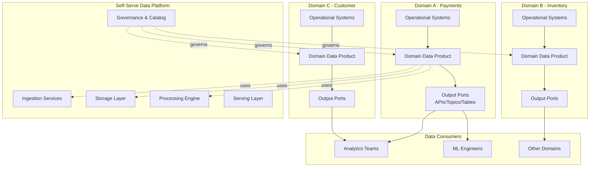

# Data Mesh & Domain-Oriented Ownership

## 1. Mục tiêu của Task

Hiểu sâu kiến trúc **Data Mesh** - paradigm shift từ centralized data lake/monolithic data platform sang **distributed domain-oriented data architecture**. Nắm vững bản chất của domain ownership, self-serve infrastructure, và federated governance để thiết kế hệ thống dữ liệu quy mô lớn trong enterprise.

> **Tóm tắt cốt lõi:** Data Mesh không phải là công nghệ, mà là **sự thay đổi tư duy tổ chức** - chuyển ownership của data từ centralized data team về domain teams, coi data như product thay vì by-product của hệ thống.

---

## 2. Bản Chất và Cơ Chế Hoạt Động

### 2.1 Vấn đề gốc rễ của Centralized Data Architecture

Trước khi hiểu Data Mesh, phải hiểu tại sao nó ra đỳ:

| Khía cạnh | Centralized Data Lake | Hệ quả |
|-----------|----------------------|--------|
| **Ownership** | Data team sở hữu tất cả | Domain teams không có động lực保证 data quality |
| **Bottleneck** | Mọi request qua data team | Lead time từ weeks đến months |
| **Context Loss** | Data team thiếu domain knowledge | Hiểu sai semantics, sai transformation |
| **Scale Limit** | Linear scaling của central team | Không scale được với organization growth |

> **Nguyên tắc quan trọng:** "You build it, you run it" áp dụng cho software, nhưng data thì centralized - đây là mâu thuẫn cơ bản.

### 2.2 Bốn Nguyên Tắc Cốt Lõi của Data Mesh

Zhamak Dehghani đề xuất 4 principles:

```
┌─────────────────────────────────────────────────────────────────┐
│                    DATA MESH PRINCIPLES                         │
├─────────────────────────────────────────────────────────────────┤
│  ┌─────────────────┐  ┌─────────────────┐                       │
│  │   Domain        │  │   Data as       │                       │
│  │   Ownership     │  │   Product       │                       │
│  │   (Nguyên tắc 1)│  │   (Nguyên tắc 2)│                       │
│  └─────────────────┘  └─────────────────┘                       │
│           │                    │                                │
│           ▼                    ▼                                │
│  ┌─────────────────┐  ┌─────────────────┐                       │
│  │   Self-Serve    │  │   Federated     │                       │
│  │   Platform      │  │   Governance    │                       │
│  │   (Nguyên tắc 3)│  │   (Nguyên tắc 4)│                       │
│  └─────────────────┘  └─────────────────┘                       │
└─────────────────────────────────────────────────────────────────┘
```

#### 2.2.1 Domain-Oriented Decentralized Data Ownership

**Bản chất:** Chuyển ownership của analytical data từ central data team về **domain teams** - những ngưởi hiểu rõ business context nhất.

**Cơ chế hoạt động:**
- Mỗi domain team có **data product owner** riêng
- Domain team chịu trách nhiệm: ingestion, transformation, serving, quality của data thuộc domain mình
- Không còn "throw data over the wall" cho data team

**Trade-off quan trọng:**

| Lợi ích | Chi phí |
|---------|---------|
| Context-rich data products | Duplication của infrastructure effort |
| Faster time-to-insight | Cần upskill domain teams |
| Better data quality ownership | Risk của inconsistent practices |
| Reduced central bottleneck | Cần strong platform team |

#### 2.2.2 Data as a Product

**Bản chất:** Coi analytical data như **product có users**, không phải by-product của operational systems.

**Attributes của Data Product:**

```
Data Product = Domain Dataset + Metadata + API/Interface + SLOs

Attributes:
├── Discoverable (catalog, documentation)
├── Addressable (stable URI/URN)
├── Trustworthy (quality metrics, lineage)
├── Self-describing (schema, semantics)
├── Interoperable (standard formats)
└── Secure (access control, compliance)
```

**SLOs (Service Level Objectives) cho Data:**
- **Freshness:** "Data được cập nhật trong vòng 1 giờ"
- **Completeness:** "99.9% records không thiếu trường bắt buộc"
- **Accuracy:** "Error rate < 0.1% so với source"
- **Availability:** "99.9% uptime cho query interface"

> **Anti-pattern:** Team chỉ dump data vào S3/HDFS mà không có documentation, schema, hay contact point. Đây là "data swamp", không phải data product.

#### 2.2.3 Self-Serve Data Infrastructure Platform

**Bản chất:** Platform team cung cấp **infrastructure abstraction** để domain teams tự phục vụ, không cần deep infrastructure expertise.

**Kiến trúc Layer:**

```
┌────────────────────────────────────────────────────────┐
│  Domain Team Interface (Self-Serve Portal)            │
│  ├── Data Product Registration                        │
│  ├── Schema Definition & Evolution                    │
│  ├── Access Control Configuration                     │
│  └── Monitoring & Alerting Setup                      │
├────────────────────────────────────────────────────────┤
│  Platform Services (Provided by Platform Team)        │
│  ├── Ingestion (CDC, Batch, Streaming)                │
│  ├── Storage (Object Store, Warehouse, Lakehouse)     │
│  ├── Processing (Spark, Flink, dbt)                   │
│  ├── Serving (SQL API, GraphQL, REST)                 │
│  └── Governance (Catalog, Quality, Lineage)           │
├────────────────────────────────────────────────────────┤
│  Infrastructure (Compute, Network, Security)          │
└────────────────────────────────────────────────────────┘
```

**Key Insight:** Platform team là **enabler**, không phải **gatekeeper**. Họ xây dựng "paved roads" không phải "toll booths".

#### 2.2.4 Federated Computational Governance

**Bản chất:** Governance được **phân tán** về các domain, nhưng **orchestrated** thông qua automated policies và global standards.

**So sánh Governance Models:**

| Aspect | Centralized | Federated (Data Mesh) |
|--------|-------------|----------------------|
| Policy Definition | Central team | Collaborative (platform + domains) |
| Policy Enforcement | Manual review | Automated, as-code |
| Flexibility | Low - one-size-fits-all | High - domain-specific within guardrails |
| Speed | Slow - approval gates | Fast - automated compliance checks |
| Scale | Bottleneck | Scales with organization |

**Computational Governance = Policy as Code:**
- Schema validation tự động
- Data quality checks automated
- Access policies enforced bởi platform
- Compliance audit automated

---

## 3. Kiến Trúc Data Mesh

### 3.1 Logical Architecture



### 3.2 Data Product Specification

**Data Product có 3 loại Ports:**

| Port Type | Mục đích | Ví dụ |
|-----------|----------|-------|
| **Input Port** | Nhận data từ operational systems | CDC connector, Event consumer |
| **Output Port** | Cung cấp data cho consumers | SQL view, REST API, Kafka topic |
| **Discovery Port** | Metadata và documentation | Data catalog entry, schema registry |

**Data Product Manifest (YAML spec):**

```yaml
data_product:
  id: payments.transactions
  domain: payments
  owner: payments-data-team@company.com
  
  input_ports:
    - name: transaction_events
      type: kafka
      source: operational.payments.topic
      
  output_ports:
    - name: transaction_analytics
      type: snowflake_table
      location: analytics.payments.transactions
      interfaces:
        - sql
        - rest_api
      
  quality_slo:
    freshness: "1 hour"
    completeness: 99.9
    
  governance:
    pii_classification: [email, card_number]
    retention_days: 2555  # 7 years
    access_control: role_based
```

### 3.3 Inter-Domain Data Flow

**Vấn đề quan trọng:** Làm sao domain A sử dụng data từ domain B?

**Pattern: Polysemic Data Sharing**

```
┌──────────────────────────────────────────────────────┐
│  Domain B (Source)                                   │
│  ├── Output Port: orders (public interface)         │
│  └── SLO: freshness < 15 min                        │
│                                                      │
│         ↓ Consumer pulls (NOT push)                 │
│                                                      │
│  Domain A (Consumer)                                 │
│  ├── Input Port: consumes orders domain product     │
│  ├── Transform: joins với payments data             │
│  └── Output Port: payment_success_rate              │
└──────────────────────────────────────────────────────┘
```

> **Quy tắc quan trọng:** Consumer pulls, không phải source pushes. Điều này giữ **autonomy** của domain - source không cần biết có bao nhiêu consumers.

---

## 4. So Sánh Các Giải Pháp

### 4.1 Data Mesh vs Data Lake vs Data Warehouse

| Tiêu chí | Data Warehouse | Data Lake | Data Mesh |
|----------|---------------|-----------|-----------|
| **Architecture** | Centralized | Centralized | Distributed |
| **Ownership** | Central IT team | Central data team | Domain teams |
| **Data Structure** | Structured, schema-on-write | Raw, schema-on-read | Domain-oriented products |
| **Scalability** | Organization bottleneck | Technical scale only | Organization & technical |
| **Agility** | Low | Medium | High |
| **Governance** | Centralized, manual | Weak | Federated, automated |
| **Phù hợp khi** | BI reporting cố định | Data science exploration | Nhiều domains, nhiều use cases |

### 4.2 Data Mesh vs Data Lakehouse

**Data Lakehouse** (Databricks, Snowflake) là **công nghệ** - unified storage format (Delta Lake, Iceberg).
**Data Mesh** là **kiến trúc tổ chức** - cách tổ chức ownership và teams.

**Có thể kết hợp:**
- Dùng Data Lakehouse làm **nền tảng công nghệ**
- Áp dụng Data Mesh làm **kiến trúc tổ chức**

### 4.3 Khi nào NÊN dùng Data Mesh

✅ **NÊN dùng khi:**
- Organization có >3-4 domains rõ ràng
- Central data team là bottleneck
- Data consumers đa dạng (BI, ML, ops)
- Có platform engineering capability
- Culture của ownership và autonomy

❌ **KHÔNG NÊN dùng khi:**
- Startup nhỏ (<50 engineers)
- Chỉ có 1-2 domains
- Chưa có data infrastructure cơ bản
- Culture rất hierarchical, không thích autonomy

---

## 5. Rủi Ro, Anti-Patterns và Lỗi Thường Gặp

### 5.1 Anti-Patterns Nghiêm Trọng

#### Anti-Pattern 1: "Mesh-washing" - Đổi tên mà không đổi thực chất

```
❌ SAI: Central data team đổi tên thành "Platform Team"
     vẫn làm mọi thứ, domain teams chỉ "yêu cầu"

✅ ĐÚNG: Domain teams thực sự own và operate data products
```

#### Anti-Pattern 2: "Data Anarchy" - Thiếu governance

```
❌ SAI: Mỗi domain tự làm theo ý mình
     - Không có common standards
     - Không discoverable
     - Inconsistent quality

✅ ĐÚNG: Federated governance với automated policies
```

#### Anti-Pattern 3: "Big Bang Migration"

```
❌ SAI: "Từ tháng sau chúng ta làm Data Mesh"
     - Rewrite toàn bộ data pipeline
     - Freeze features 6 tháng
     - High risk, high resistance

✅ ĐÚNG: Evolutionary approach - start with 1-2 domains
```

### 5.2 Technical Failure Modes

| Failure Mode | Nguyên nhân | Hậu quả |
|--------------|-------------|---------|
| **Inconsistent Schema Evolution** | Không có global schema registry | Consumers break khi upstream thay đổi |
| **Data Quality Drift** | Domain team không monitor SLOs | Downstream decisions sai |
| **Access Control Sprawl** | Mỗi domain tự quản lý auth | Security gaps, audit nightmare |
| **Cost Explosion** | Self-serve không có guardrails | Cloud bill tăng vô hạn |
| **Lineage Blindness** | Không track cross-domain lineage | Impact analysis impossible |

### 5.3 Organizational Failure Modes

| Failure Mode | Dấu hiệu | Cách tránh |
|--------------|----------|------------|
| **Platform Team Gatekeeping** | Domain teams vẫn cần approval cho mọi thứ | Platform là enabler, không phải gatekeeper |
| **Domain Team Resistance** | "Chúng tôi là software engineers, không phải data engineers" | Training, pair programming, clear value prop |
| **Siloed Data Products** | Domains không share data | Incentives alignment, success metrics |
| **Governance Theater** | Nhiều policies nhưng không enforce | Computational governance, automation |

---

## 6. Khuyến Nghị Thực Chiến trong Production

### 6.1 Migration Strategy: Strangler Fig Pattern

Không rewrite, incremental transformation:

```
Phase 1: Foundation (3-6 tháng)
├── Xây dựng self-serve platform MVP
├── Chọn 1 pilot domain (sẵn sàng, high impact)
└── Setup federated governance framework

Phase 2: Pilot (3-6 tháng)
├── Pilot domain xây dựng data products
├── Iterate platform based on feedback
├── Document patterns và best practices

Phase 3: Expansion (6-12 tháng)
├── Onboard thêm 2-3 domains
├── Establish data product marketplace
├── Scale governance automation

Phase 4: Maturity (ongoing)
├── Full organizational adoption
├── Advanced: ML mesh, analytics mesh
└── Continuous optimization
```

### 6.2 Technology Stack Recommendations

**Data Mesh Platform Stack (2024-2025):**

| Layer | Công nghệ phổ biến | Ghi chú |
|-------|-------------------|---------|
| **Storage** | S3/GCS, Delta Lake/Iceberg | Open table formats critical |
| **Processing** | Spark, Flink, dbt | Domain choice within guardrails |
| **Serving** | Trino/Presto, GraphQL | Unified query layer |
| **Catalog** | DataHub, Collibra, Amundsen | Critical for discoverability |
| **Governance** | OpenPolicyAgent, Apache Ranger | Policy-as-code |
| **Quality** | Soda, Great Expectations | Automated SLO monitoring |
| **Lineage** | OpenLineage, Marquez | Cross-domain lineage |

### 6.3 Team Structure

```
┌─────────────────────────────────────────────────────┐
│           DATA MESH ORGANIZATION                     │
├─────────────────────────────────────────────────────┤
│                                                      │
│  ┌─────────────────────────────────────────┐        │
│  │     DATA PLATFORM TEAM (Platform)       │        │
│  │  - Infrastructure engineers             │        │
│  │  - Platform product managers            │        │
│  │  - Data architects                      │        │
│  │  Size: ~5-10% của total data engineers  │        │
│  └─────────────────────────────────────────┘        │
│                                                      │
│  ┌─────────────────────────────────────────┐        │
│  │     DOMAIN DATA TEAMS (Domains)         │        │
│  │  Mỗi domain:                            │        │
│  │  - Data product owner                   │        │
│  │  - Data engineers (2-4 ngưởi)           │        │
│  │  - Embedded với software teams          │        │
│  └─────────────────────────────────────────┘        │
│                                                      │
│  ┌─────────────────────────────────────────┐        │
│  │     FEDERATED GOVERNANCE GROUP          │        │
│  │  - Representatives từ mỗi domain        │        │
│  │  - Platform team members                │
│  │  - Security/compliance                  │        │
│  │  Meet: Monthly để định nghĩa standards  │        │
│  └─────────────────────────────────────────┘        │
└─────────────────────────────────────────────────────┘
```

### 6.4 Success Metrics (KPIs)

| Category | Metric | Target |
|----------|--------|--------|
| **Agility** | Time to new data product | < 2 weeks |
| **Agility** | Time for consumer to find data | < 5 minutes |
| **Quality** | % data products meeting SLOs | > 95% |
| **Quality** | Data incident MTTR | < 4 hours |
| **Adoption** | % domains onboarded | > 80% |
| **Adoption** | # of cross-domain data products | Tăng 2x/quý |
| **Governance** | % policies automated | > 90% |
| **Efficiency** | Cost per data product | Giảm 20%/năm |

---

## 7. Kết Luận

### Bản chất của Data Mesh

Data Mesh không phải là silver bullet, cũng không phải công nghệ mới. Nó là **sự nhận ra rằng:**

1. **Ownership matters:** Ngưởi hiểu domain nhất nên own data của domain đó
2. **Scale requires distribution:** Centralized không thể scale với organizational complexity
3. **Governance cần automation:** Manual governance trở thành bottleneck
4. **Data là product:** Cần product thinking, không phải by-product thinking

### Trade-off Quan Trọng Nhất

> **Freedom vs. Consistency:** Data Mesh trade centralized control lấy distributed ownership. Điều này tăng agility nhưng đòi hỏi **mature platform capabilities** và **strong engineering culture**. Không có self-serve platform tốt, Data Mesh trở thành chaos.

### Rủi Ro Lớn Nhất

> **Organizational Change Management:** Technical implementation là phần dễ. Thay đổi ownership model, thay đổi incentives, thay đổi mindset từ "data là responsibility của data team" sang "data là responsibility của domain teams" - đây là thử thách thực sự.

### Khi nào áp dụng

Chỉ áp dụng Data Mesh khi:
- Bạn có organizational complexity đủ lớn (>3 domains)
- Bạn có capability xây dựng self-serve platform
- Leadership committed với organizational change
- Bạn sẵn sàng evolutionary approach, không phải big bang

---

## 8. Tài Liệu Tham Khảo

1. Dehghani, Z. (2022). *Data Mesh: Delivering Data-Driven Value at Scale*. O'Reilly Media.
2. Dehghani, Z. (2019). "How to Move Beyond a Monolithic Data Lake to a Distributed Data Mesh". MartinFowler.com
3. Data Mesh Learning Community: datamesh-learning.com
4. DataHub Project: datahubproject.io
5. OpenLineage: openlineage.io

---

*Research completed: 2025-03-27*
*Author: Senior Backend Architect*
