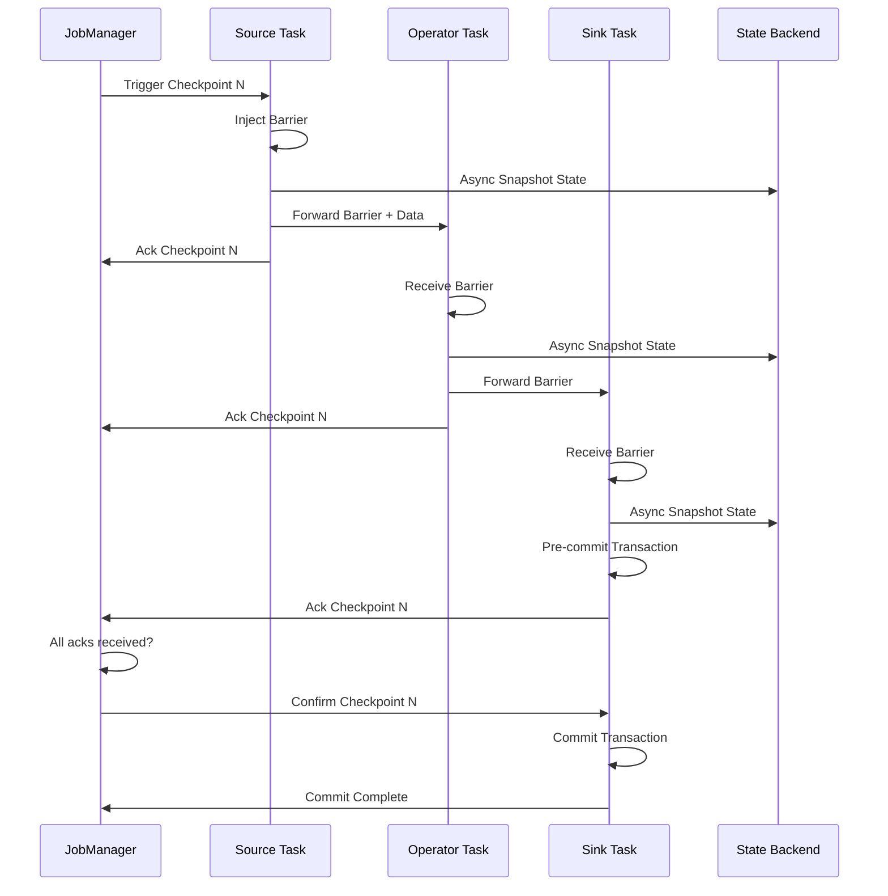

# Stream Processing at Scale - Apache Flink Internals

## 1. Mục tiêu của Task

Nghiên cứu sâu cơ chế vận hành bên trong của Apache Flink - một trong những stream processing engine phổ biến nhất trong hệ thống production hiện đại. Tập trung vào:
- Checkpointing mechanism và fault tolerance
- State backends (Heap, RocksDB) - cách lưu trữ và quản lý state
- Watermarking và event time processing
- Exactly-once processing semantics
- Windowing strategies (tumbling, sliding, session)
- Stream joining với different time characteristics

---

## 2. Bản chất và Cơ chế Hoạt động

### 2.1 Kiến trúc Tổng quan

Apache Flink được thiết kế xoay quanh khái niệm **Dataflow Graph** - một đồ thị có hướng mô tả luồng dữ liệu từ sources đến sinks.

```
┌─────────────┐     ┌─────────────┐     ┌─────────────┐
│   Source    │────▶│  Operators  │────▶│    Sink     │
│  (Kafka)    │     │ (map/filter │     │  (Database) │
│             │     │  /window)   │     │             │
└─────────────┘     └─────────────┘     └─────────────┘
       │                   │                   │
       └───────────────────┴───────────────────┘
              Distributed Dataflow
```

**Bản chất kiến trúc:**
- **JobManager**: Brain của cluster, quản lý job submission, scheduling, coordination
- **TaskManager**: Worker nodes, thực thi tasks, giữ state và checkpoints
- **Client**: Submit job, nhận feedback

### 2.2 Checkpointing - Cơ chế Fault Tolerance

> **Checkpointing là gốc rễ của fault tolerance trong Flink.** Không có checkpoint, distributed stream processing chỉ là "best effort".

#### Cơ chế Chandy-Lamport Distributed Snapshot

Flink sử dụng biến thể của thuật toán Chandy-Lamport để tạo consistent distributed snapshot mà không cần dừng toàn bộ hệ thống.

**Nguyên lý hoạt động:**

```
JobManager (Checkpoint Coordinator)
         │
         │ 1. Trigger Checkpoint (periodic)
         ▼
┌─────────────────────────────────────┐
│  Barrier Injection tại Sources     │
│  (Checkpoint Barrier = Logical      │
│   marker đánh dấu checkpoint)       │
└─────────────────────────────────────┘
         │
         │ Barrier lan truyền theo data flow
         ▼
┌─────────────────────────────────────┐
│  Task nhận barrier:                 │
│  - Đánh dấu state local             │
│  - Forward barrier downstream       │
│  - Không chặn processing!           │
└─────────────────────────────────────┘
         │
         ▼
┌─────────────────────────────────────┐
│  Snapshot State lưu vào             │
│  State Backend (async)              │
└─────────────────────────────────────┘
         │
         ▼
JobManager nhận ack từ tất cả tasks
         │
         ▼
    Checkpoint Complete
```

**Vì sao barrier không chặn processing?**

```
Stream Data:  A B C | D E F | G H I
              ↑     ↑       ↑
           Barrier Barrier  Barrier
              
Processing:   A B C   D E F   G H I  (liên tục)
              │   │   │   │   │   │
              ▼   ▼   ▼   ▼   ▼   ▼
Snapshot:    [A,B,C] [D,E,F] [G,H,I] (theo checkpoint)
```

Barriers đi kèm với data records nhưng được xử lý đặc biệt - chúng tách state thành "pre-checkpoint" và "post-checkpoint" mà không block data flow.

#### Alignment vs Unaligned Checkpoints

| Đặc điểm | Aligned Checkpoint | Unaligned Checkpoint |
|----------|-------------------|---------------------|
| **Cơ chế** | Task đợi barriers từ tất cả inputs trước khi snapshot | Lưu luôn in-flight data cùng state |
| **Latency impact** | Có (backpressure → checkpoint delay) | Không đáng kể |
| **State size** | Chỉ operator state | State + in-flight buffers |
| **Recovery time** | Nhanh hơn | Chậm hơn (phải replay in-flight) |
| **Use case** | Low-latency, stable throughput | High backpressure, burst traffic |

> **Quan trọng:** Unaligned checkpoint giải quyết vấn đề "checkpoint timeout do backpressure" nhưng trade-off là state lớn hơn và recovery phức tạp hơn.

### 2.3 State Backends - Nơi Lưu Trữ State

#### Heap State Backend

```
┌─────────────────────────────────┐
│       JVM Heap Memory           │
│  ┌─────────────────────────┐   │
│  │  KeyedStateBackend      │   │
│  │  - HashMap<K, State>    │   │
│  │  - ValueState           │   │
│  │  - ListState            │   │
│  │  - ReducingState        │   │
│  └─────────────────────────┘   │
└─────────────────────────────────┘
         │
         │ Checkpoints to
         ▼
┌─────────────────────────────────┐
│  Distributed File System        │
│  (HDFS, S3, GCS)                │
└─────────────────────────────────┘
```

**Bản chất:**
- State lưu trong JVM heap dưới dạng Java objects
- HashMap cho keyed state (partition by key hash)
- Snapshot async sang DFS khi checkpoint

**Giới hạn chết ngườI:**
- State size bị giới hạn bởi heap size
- GC pressure khi state lớn
- OOM risk nếu state > available heap

#### RocksDB State Backend

```
┌────────────────────────────────────────┐
│         TaskManager Process            │
│  ┌────────────────────────────────┐   │
│  │     RocksDB JNI Wrapper        │   │
│  │  ┌──────────────────────────┐  │   │
│  │  │    RocksDB Instance      │  │   │
│  │  │  - SST files on disk     │  │   │
│  │  │  - MemTable (in-memory)  │  │   │
│  │  │  - Block cache           │  │   │
│  │  │  - Write-ahead log       │  │   │
│  │  └──────────────────────────┘  │   │
│  └────────────────────────────────┘   │
└────────────────────────────────────────┘
```

**Bản chất RocksDB trong Flink:**
- Mỗi keyed state = một column family trong RocksDB
- Incremental checkpointing: chỉ lưu SST files thay đổi
- State có thể lớn hơn memory (spill to disk)
- Tuning options: block cache size, write buffer, compaction

**Trade-off Table:**

| Yếu tố | Heap | RocksDB |
|--------|------|---------|
| **State size** | < Heap | > Available disk |
| **Latency** | Microseconds | Milliseconds (JNI + disk) |
| **Throughput** | Very high | High |
| **Memory usage** | High (state in heap) | Medium (cache + off-heap) |
| **GC impact** | High | Low |
| **Incremental checkpoint** | ❌ | ✅ |
| **SSD required** | No | **Yes (bắt buộc)** |

> **Rule of thumb:** State < 100MB → Heap. State > 1GB hoặc không chắc chắn → RocksDB.

### 2.4 Watermarking - Xử lý Event Time

#### Bản chất vấn đề

Trong stream processing, có 3 loại time:

| Time Type | Định nghĩa | Khi nào dùng |
|-----------|-----------|--------------|
| **Event Time** | Thời điểm event thực sự xảy ra | Cần kết quả chính xác theo thời gian thực |
| **Ingestion Time** | Thời điểm event vào Flink | Không cần event timestamp |
| **Processing Time** | Thời điểm operator xử lý | Low latency, có thể chấp nhận approximate |

**Vấn đề với Event Time:**
- Events đến out-of-order do network delay
- Cần biết "khi nào đã nhận đủ dữ liệu đến time T"

#### Watermark là gì?

```
Event Stream:  A(1) B(2) C(5) D(3) E(8) F(9) G(6) H(12)
                    │         │              │
                    ▼         ▼              ▼
Watermarks:     W(2)      W(5)           W(9)
                │         │              │
                ▼         ▼              ▼
         "Tất cả events với timestamp ≤ watermark đã đến"
```

**Watermark là một metadata marker** chứa timestamp, ý nghĩa: "Tôi tin rằng không còn event nào với timestamp < watermark nữa."

#### Watermark Generation Strategies

```
Source ──▶ Timestamp Assigner ──▶ Watermark Generator ──▶ Downstream
```

**1. Periodic Watermarks (định kỳ):**
```
maxTimestamp - maxOutOfOrderness = watermark

Ví dụ: maxOutOfOrderness = 5 seconds
- Events: [10, 8, 15, 12, 20]
- Max timestamp seen = 20
- Watermark = 20 - 5 = 15
```

**2. Punctuated Watermarks (theo event đặc biệt):**
- Một số event chứa "low watermark" từ upstream system
- Thích hợp khi source biết rõ về completeness

**3. Idle Sources:**
```
┌─────────────┐     ┌─────────────┐
│ Partition 1 │────▶│             │
│ (active)    │     │  Operator   │
└─────────────┘     │             │
                    │  Watermark  │───▶ Progress blocked!
┌─────────────┐     │  = min(all  │
│ Partition 2 │────▶│   inputs)   │
│ (idle)      │     │             │
└─────────────┘     └─────────────┘
         Watermark stuck at old value
         
Solution: Mark idle source, ignore in min calculation
```

> **Critical:** Watermark progresses at the speed of the slowest partition. Một partition chậm/block làm stall toàn bộ pipeline.

### 2.5 Exactly-Once Processing Semantics

#### Ba Loại Semantics

| Semantics | Định nghĩa | Use Case |
|-----------|-----------|----------|
| **At-most-once** | Có thể mất data | Logging, metrics (cho phép loss) |
| **At-least-once** | Không mất, có thể duplicate | Idempotent sinks |
| **Exactly-once** | Không mất, không duplicate | Financial transactions |

#### Flink Exactly-Once Implementation

**Hai pillars của exactly-once:**

1. **Checkpointing & Recovery:**
```
Failure happens during checkpoint N+1
    │
    ▼
Rollback to checkpoint N (consistent state)
    │
    ▼
Replay from source offset của checkpoint N
    │
    ▼
Processing tiếp tục như chưa từng fail
```

2. **Transactional Sinks:**
```
Two-Phase Commit Protocol
    
Phase 1 (Pre-commit):
- Flink: "Tôi sẽ commit checkpoint N"
- Sink: Lưu data vào "pending" state
- Sink: Confirm ready to commit

Phase 2 (Commit):
- Flink: "Checkpoint N successful"
- Sink: Atomically commit pending data
- Sink: ACK completion

Rollback (nếu checkpoint fail):
- Sink: Discard pending data
```

**Ví dụ Kafka Sink Exactly-Once:**
```
Kafka Producer Transaction
├── initTransactions()  
├── beginTransaction()  ◀── Mỗi checkpoint
├── write(records)      
├── commitTransaction() ◀── Nếu checkpoint thành công
└── abortTransaction()  ◀── Nếu checkpoint fail
```

> **Trade-off:** Exactly-once cần transactional overhead, latency cao hơn at-least-once.

### 2.6 Windowing Strategies

#### Các loại Window

```
TUMBLING WINDOW (fixed size, no overlap)
Time ──▶ [0-5) [5-10) [10-15) [15-20)
Input:  A B     C D E   F        G H
Result: [A,B]   [C,D,E] [F]      [G,H]

SLIDING WINDOW (fixed size + slide interval)
Size=10s, Slide=5s
Time ──▶ [0-10)     [5-15)      [10-20)
Input:  A B C       D E          F G
Result: [A,B,C]     [C,D,E]      [E,F,G]

SESSION WINDOW (gap-based, dynamic size)
Gap = 5s
Time ──▶ A B     C          D E F    G
          │     │            │     │
          └─────┘            └─────┘
        [A,B] gap>5s [C]  [D,E,F]  [G]
        
GAP window kết thúc khi không có event trong gap duration
```

#### Window State Management

```
┌─────────────────────────────────────────┐
│  Window State trong KeyedStateBackend   │
│                                         │
│  Map<Key, Map<Window, State>>           │
│                                         │
│  Ví dụ:                                 │
│  "user-123" ──▶ {                       │
│    [10:00-10:05) ──▶ SumState(150),     │
│    [10:05-10:10) ──▶ SumState(230)      │
│  }                                      │
│                                         │
│  Cleanup: Khi window closed + allowed   │
│  lateness expired ──▶ state cleared     │
└─────────────────────────────────────────┘
```

**Late Data Handling:**
```
Event Time:    A(8) B(12) C(15) D(9) E(20)
                    │
                    ▼
Watermark W(10) ──▶ Window [5-10) triggered
                    Result: [A(8)]
                    
D(9) arrives sau W(10):
├── Allowed lateness = 5s
├── D(9) within allowed lateness
├── Update window result
└── Emit update (nếu side output configured)

Nếu D(9) sau W(15) → dropped hoặc side output
```

### 2.7 Stream Joining

#### Windowed Join (Interval Join)

```
Stream A:      A(10)     A(15)          A(25)
Stream B:           B(12)      B(18) B(22)
                     │          │     │
                     ▼          ▼     ▼
Joined:             [A,B](12)  []    [A,B](25)

Join condition: |A.ts - B.ts| < 5s
Buffer state: Mỗi stream lưu events trong interval window
```

**State growth concern:**
```
High cardinality keys + large time bounds
→ Unbounded state growth
→ Solution: State TTL hoặc sessionization
```

#### Temporal Table Join (Lookup Join)

```
Orders Stream (fact) ──▶ ┌─────────────┐
                         │  Lookup     │──▶ Enriched orders
Customer Dim (table) ──▶ │  Join       │
                         │ (temporal)  │
                         └─────────────┘
                         
Cơ chế:
- Dim table: latest version mỗi key
- Stream lookup: join với snapshot at processing time
- Không cần window, nhưng dim table phải fit memory
```

---

## 3. Kiến trúc và Luồng Xử lý

### 3.1 Sơ đồ Luồng Checkpoint Complete



### 3.2 Watermark Propagation

```mermaid
graph LR
    A[Kafka Source<br/>Partition 0] -->|W(10)| C[Watermark Merge]
    B[Kafka Source<br/>Partition 1] -->|W(15)| C
    C -->|W(10) = min| D[Window Operator]
    C -->|W(10)| E[Process Function]
```

---

## 4. So sánh các Giải pháp

### 4.1 Flink vs Kafka Streams vs Spark Streaming

| Aspect | Apache Flink | Kafka Streams | Spark Streaming |
|--------|--------------|---------------|-----------------|
| **Processing Model** | True streaming | True streaming | Micro-batching |
| **Latency** | Sub-second | Milliseconds | Seconds (batch) |
| **State Backend** | Heap/RocksDB | RocksDB | In-memory/RocksDB |
| **Checkpointing** | Distributed snapshot | Rebalancing-based | RDD lineage |
| **Exactly-once** | Native | EOS with transactions | Idempotent writes |
| **SQL Support** | Flink SQL | KSQL | Spark SQL |
| **Best For** | Complex event processing | Kafka-centric apps | Batch+streaming unified |

### 4.2 State Backend Selection Decision Tree

```
State Size?
├── < 100MB, predictable
│   └── Heap State Backend
│       ├── Pros: Fast, simple
│       └── Cons: GC pressure, limited size
│
├── > 1GB hoặc unpredictable
│   └── RocksDB State Backend
│       ├── Pros: Large state, incremental checkpoint
│       └── Cons: JNI overhead, needs SSD
│
└── 100MB - 1GB
    └── Consider:
        ├── Throughput critical? → Heap
        ├── Checkpoint frequency high? → RocksDB
        └── Memory constrained? → RocksDB
```

---

## 5. Rủi ro, Anti-patterns, Lỗi Thường gặp

### 5.1 Lỗi Checkpoint

| Lỗi | Nguyên nhân | Giải pháp |
|-----|-------------|-----------|
| **Checkpoint timeout** | Backpressure, state quá lớn | Unaligned checkpoint, tăng interval, scale up |
| **Checkpoint fail liên tục** | Network issues, disk full | Check task logs, disk space, network health |
| **Incremental checkpoint lớn** | Compaction không đều | Tune RocksDB compaction |
| **State size tăng vô hạn** | Không cleanup window state | Set appropriate TTL, allowed lateness |

### 5.2 Watermark Issues

> **"Watermark not progressing"** là lỗi production phổ biến nhất.

**Nguyên nhân:**
1. **Idle partition:** Một Kafka partition không có data
2. **Skewed data:** Một key chiếm phần lớn traffic → watermark stuck
3. **Clock skew:** NTP issues trên nodes

**Giải pháp:**
```java
// Idle timeout configuration
env.getConfig().setAutoWatermarkInterval(200);

// Trong Kafka source
KafkaSource.<Event>builder()
    .setProperty("partition.discovery.interval.ms", "10000")
    // Enable idle source detection
    .build();
```

### 5.3 State Anti-patterns

**❌ Anti-pattern: ValueState<List<>> không giới hạn**
```java
// KHÔNG NÊN: List state grow unbounded
ValueState<List<Event>> eventListState;

// NÊN: Dùng ListState với TTL hoặc window
ListState<Event> eventListState; // TTL configured
```

**❌ Anti-pattern: Broadcasting large state**
```java
// Broadcast state phải fit memory của mỗi task
// Nếu cần large lookup → dùng Async I/O + external cache
```

**❌ Anti-pattern: Không set State TTL**
```java
// Mọi state đều cần TTL trừ khi có lý do đặc biệt
StateTtlConfig ttl = StateTtlConfig
    .newBuilder(Time.hours(24))
    .setUpdateType(UpdateType.OnCreateAndWrite)
    .setStateVisibility(StateVisibility.NeverReturnExpired)
    .build();
```

### 5.4 Join Pitfalls

| Pitfall | Hậu quả | Giải pháp |
|---------|---------|-----------|
| **Large join window** | OOM, GC pause | Giảm window, dùng session window |
| **High cardinality keys** | State explosion | Key bucketing, pre-aggregation |
| **Skewed join keys** | Hot partition | Salting keys, rebalance |
| **No TTL trên join state** | Unbounded growth | Always set state TTL |

---

## 6. Khuyến nghị Thực chiến trong Production

### 6.1 Capacity Planning

**Memory Sizing:**
```
TaskManager Memory = 
    Framework Heap (128MB default) +
    Task Heap (user code) +
    Managed Memory (RocksDB cache, sorting) +
    Network Memory (buffers) +
    JVM Overhead

RocksDB: 30-40% của container memory cho block cache
```

**Parallelism Guidelines:**
- Source parallelism = Kafka partitions (1:1 optimal)
- Operator parallelism dựa trên throughput requirement
- Không nên > 2x CPU cores per TaskManager

### 6.2 Checkpoint Tuning

```
# Khuyến nghị cho ứng dụng production

# Checkpoint interval: 1-10 phút
checkpoint.interval: 60000  # 1 phút cho low-latency

# Timeout: 2-10x interval  
checkpoint.timeout: 600000  # 10 phút

# Concurrent checkpoints: 1 (mặc định)
# Chỉ tăng nếu checkpoint duration > interval

checkpoint.max-concurrent: 1

# Unaligned checkpoint nếu có backpressure
checkpoint.unaligned.enabled: true
```

### 6.3 Monitoring Key Metrics

| Metric | Alert Threshold | Ý nghĩa |
|--------|-----------------|---------|
| **Checkpoint Duration** | > 80% timeout | Checkpoint sắp fail |
| **Checkpoint Size** | > 50% state backend capacity | State growth |
| **Watermark Lag** | > 5 minutes | Delay processing |
| **Backpressure** | > 50% tasks | Throughput bottleneck |
| **Records Lag** | Tăng liên tục | Consumer can't keep up |

### 6.4 Recovery Strategies

**Restart Strategy:**
```yaml
# Fixed delay cho transient failures
restart-strategy: fixed-delay
restart-strategy.fixed-delay.attempts: 10
restart-strategy.fixed-delay.delay: 10s

# Exponential backoff cho external dependencies
restart-strategy: exponential-delay
```

**Regional Failover (Active-Active):**
```
DC1 (Active)          DC2 (Standby)
   │                      │
   ├── Flink Job          ├── Flink Job (standby)
   ├── Kafka (primary)    ├── Kafka (mirror)
   └── State Backend      └── State Backend
   
Failover: DNS redirect + Kafka consumer group rebalance
```

---

## 7. Kết luận

### Bản chất Cốt lõi

1. **Checkpointing** là cơ chế **distributed snapshot** dựa trên barrier propagation, cho phép recovery về consistent state mà không mất data.

2. **State Backend** quyết định trade-off giữa **performance** (Heap) và **scalability** (RocksDB). RocksDB cho phép state lớn hơn memory với chi phí JNI overhead.

3. **Watermark** là cơ chế **progress tracking** cho event time processing, trade-off giữa **completeness** (watermark delay) và **latency** (early results).

4. **Exactly-once** đạt được qua **checkpoint recovery** + **transactional sinks**, trade-off là throughput và latency.

5. **Window** và **Join** operations yêu cầu **bounded state** - cần TTL và resource planning để tránh OOM.

### Trade-off Tổng quan

```
Latency ◄─────────────────────────────────────► Completeness
   │                                          │
   ├── Processing Time (lowest latency)       │
   ├── Event Time + Early Results             │
   └── Event Time + Watermark (highest        │
       completeness)                          │
       
Memory ◄──────────────────────────────────────► Disk
   │                                          │
   ├── Heap State (fastest)                   │
   └── RocksDB (scalable)                     │
   
Throughput ◄──────────────────────────────────► Guarantee
   │                                          │
   ├── At-most-once (fastest)                 │
   ├── At-least-once                          │
   └── Exactly-once (transactional overhead)  │
```

### Khi nào Dùng Flink

✅ **Nên dùng:**
- Real-time analytics với event time
- Complex event processing (CEP)
- Large stateful operations (sessionization, joining)
- Exactly-once processing requirements

❌ **Không nên dùng:**
- Simple stateless transformation (Kafka Streams đủ)
- Batch-only workloads (Spark hiệu quả hơn)
- Very low latency (< 10ms) requirements (native app tốt hơn)

---

## 8. Code Minh họa (Tối thiểu)

### RocksDB Tuning Configuration

```java
// Production-grade RocksDB configuration
RocksDBStateBackend rocksDb = new RocksDBStateBackend(
    "hdfs://checkpoint-dir",
    true // incremental checkpointing
);

// Tuning options cho high-throughput
DefaultConfigurableOptionsFactory optionsFactory = 
    new DefaultConfigurableOptionsFactory();
    
// Block cache: 30% of container memory
optionsFactory.setRocksDBOptions("block.cache.size", "512mb");

// Write buffer: giảm flush frequency
optionsFactory.setRocksDBOptions("write.buffer.size", "64mb");
optionsFactory.setRocksDBOptions("max.write.buffer.number", "4");

// Compaction tuning
optionsFactory.setRocksDBOptions("target.file.size.base", "32mb");
optionsFactory.setRocksDBOptions("max.bytes.for.level.base", "256mb");

rocksDb.setRocksDBOptions(optionsFactory);
env.setStateBackend(rocksDb);
```

### Watermark Strategy với Idle Source Handling

```java
WatermarkStrategy<Event> strategy = WatermarkStrategy
    .<Event>forBoundedOutOfOrderness(Duration.ofSeconds(30))
    .withTimestampAssigner((event, timestamp) -> event.getEventTime())
    .withIdleness(Duration.ofMinutes(5)); // Mark source idle after 5 min

source.assignTimestampsAndWatermarks(strategy)
```

### State TTL Configuration

```java
StateTtlConfig ttlConfig = StateTtlConfig
    .newBuilder(Time.hours(24))
    .setUpdateType(StateTtlConfig.UpdateType.OnCreateAndWrite)
    .setStateVisibility(StateTtlConfig.StateVisibility.NeverReturnExpired)
    .cleanupFullSnapshot() // Cleanup during checkpoint
    .build();

ValueStateDescriptor<MyState> descriptor = 
    new ValueStateDescriptor<>("myState", MyState.class);
descriptor.enableTimeToLive(ttlConfig);
```

---

*Document này tập trung vào bản chất cơ chế và trade-off thay vì tutorial cơ bản. Để áp dụng thực tế, cần benchmark với workload cụ thể và monitor các metrics đã đề cập.*
