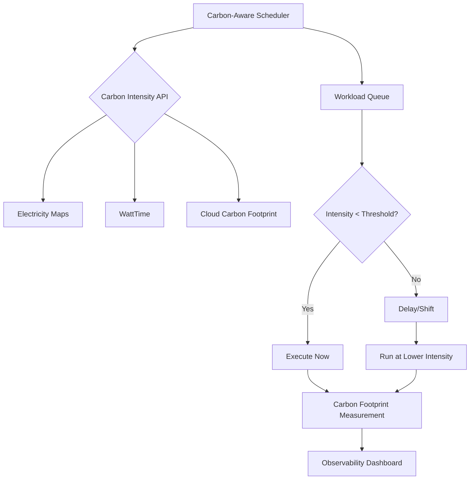
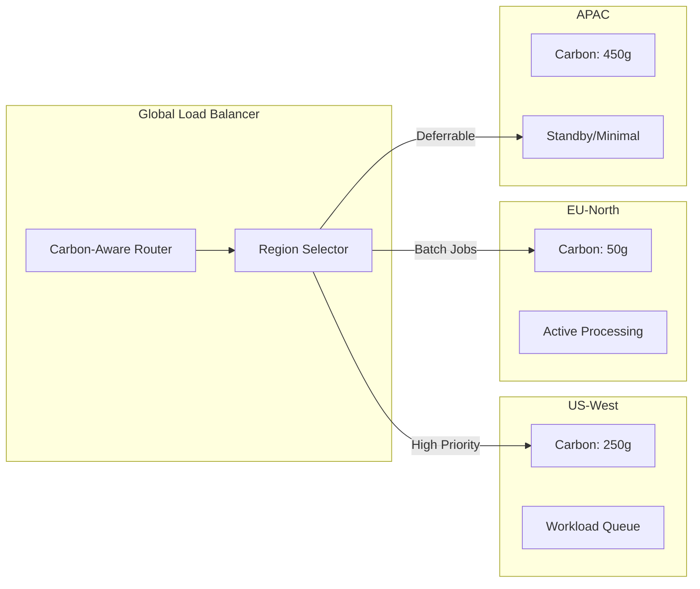
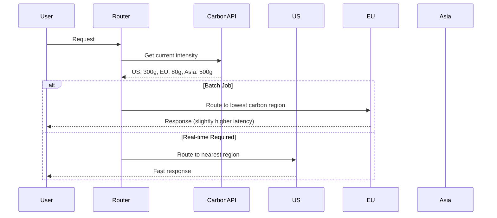

# Green Computing & Sustainable Software

> Nghiên cứu về kiến trúc phần mềm bền vững, tối ưu năng lượng và carbon-aware computing trong hệ thống backend quy mô lớn.

---

## 1. Mục tiêu của Task

Hiểu sâu bản chất của **Green Computing** - không chỉ là "tiết kiệm điện" mà là một paradigm shift trong thiết kế phần mềm. Mục tiêu:

- Nắm vững cơ chế đo lường và tối ưu carbon footprint trong software engineering
- Hiểu các kỹ thuật **carbon-aware** và **demand shifting** ở tầng architecture
- Phân tích trade-off giữa performance, reliability và sustainability
- Áp dụng các patterns thực tiễn trong production systems

---

## 2. Bản Chất và Cơ Chế Hoạt Động

### 2.1 Carbon Intensity Là Gì?

Carbon intensity (gCO₂eq/kWh) đo lượng khí thải carbon phát sinh khi sản xuất 1 kWh điện. Giá trị này **thay đổi liên tục** theo:

| Nguồn điện | Carbon Intensity | Đặc điểm |
|------------|------------------|----------|
| Than đá | 820-1050 gCO₂/kWh | Base load, ổn định |
| Khí tự nhiên | 350-490 gCO₂/kWh | Peaker plants |
| Năng lượng gió | 10-15 gCO₂/kWh | Biến động theo thờ tiết |
| Năng lượng mặt trờ | 40-50 gCO₂/kWh | Peak vào ban ngày |
| Thủy điện | 20-40 gCO₂/kWh | Ổn định, phụ thuộc mùa |
| Nuclear | 5-15 gCO₂/kWh | Base load, zero-emission |

> **Insight quan trọng**: Cùng một workload, chạy vào 2:00 PM (nhiều năng lượng mặt trờ) có thể có carbon footprint thấp hơn 50-70% so với 8:00 PM (phụ thuộc nhiều vào nhiệt điện).

### 2.2 Cơ Chế Carbon-Aware Computing



**Cơ chế cốt lõi**:

1. **Forecasting**: Dự đoán carbon intensity dựa trên weather forecast, grid demand prediction
2. **Decision Boundary**: Thiết lập ngưỡng carbon intensity chấp nhận được
3. **Temporal Shifting**: Dịch chuyển workload trong thờ gian (minutes đến hours)
4. **Spatial Shifting**: Dịch chuyển workload giữa các regions (cross-region scheduling)

### 2.3 Marginal vs Average Carbon Intensity

| Metric | Định nghĩa | Use Case |
|--------|-----------|----------|
| **Average** | Tổng emissions / Tổng generation | Báo cáo tổng thể, sustainability reports |
| **Marginal** | Emissions của unit điện tiếp theo được thêm vào grid | Quyết định real-time, carbon-aware scheduling |

> **Quan trọng**: Marginal intensity có thể cao gấp 3-5 lần average intensity trong giờ cao điểm. Đây là metric cần theo dõi cho carbon-aware decisions.

---

## 3. Kiến Trúc và Luồng Xử Lý

### 3.1 Carbon-Aware Architecture Pattern



### 3.2 Demand Shifting Strategies

#### Temporal Shifting (Dịch chuyển thờ gian)

```
Workload Classification:
├── Real-time (RT): Latency < 100ms, Không thể delay
│   └── Ví dụ: Payment processing, fraud detection
├── Near-real-time (NRT): Latency < 5s, Delay được vài giây
│   └── Ví dụ: Recommendation serving, analytics
├── Batch (B): Hours acceptable
│   └── Ví dụ: ETL pipelines, ML training
└── Flexible (F): Days acceptable
    └── Ví dụ: Backup, log aggregation, report generation
```

**Thực hiện temporal shifting**:

| Workload Type | Delay Strategy | Carbon Savings |
|---------------|----------------|----------------|
| Flexible Batch | Wait for next low-carbon window | 40-70% |
| Training Jobs | Pause/resume based on intensity | 30-50% |
| Data Replication | Sync during low-intensity hours | 50-80% |

#### Spatial Shifting (Dịch chuyển không gian)



**Trade-offs của Spatial Shifting**:

| Factor | Impact | Mitigation |
|--------|--------|------------|
| Latency | +50-200ms cross-region | Data locality, caching |
| Data Transfer Cost | $0.05-0.12/GB | Compression, delta sync |
| Compliance | GDPR, data residency | Region pinning for PII |
| Reliability | Multi-region complexity | Circuit breakers, fallbacks |

### 3.3 Locale Shifting (Chuyển vị trí địa lý)

Khác với spatial shifting trong cloud regions, locale shifting áp dụng cho edge computing:

```
Edge Node Selection Strategy:
1. Measure carbon intensity tại từng edge location
2. Predict renewable energy availability (solar/wind forecasts)
3. Route user requests đến edge node có carbon intensity thấp nhất
   trong phạm vi latency budget cho phép

Ví dụ:
- User ở Berlin
- Edge nodes: Berlin (200g), Copenhagen (80g), Amsterdam (150g)
- Latency SLO: < 50ms
- Decision: Route to Copenhagen nếu latency < 50ms
```

---

## 4. So Sánh Các Lựa Chọn

### 4.1 Carbon-Aware Scheduling Approaches

| Approach | Implementation | Pros | Cons | Best For |
|----------|---------------|------|------|----------|
| **Threshold-based** | Simple if-else với ngưỡng carbon | Đơn giản, dễ hiểu | Không optimal, binary decision | Batch jobs đơn giản |
| **Time-window** | Schedule trong các khung giờ xanh | Predictable, dễ plan | Không adaptive với grid changes | ETL, reporting |
| **ML-predicted** | Dự đoán intensity, optimize schedule | Near-optimal decisions | Complex, cần training data | Large-scale training jobs |
| **Market-based** | Bidding cho thờ gian xanh | Economic incentives | Requires carbon market | Spot instances |

### 4.2 Energy-Efficient Algorithms

#### Algorithm Complexity vs Energy Consumption

```
Không phải lúc nào O(n) cũng tiết kiệm năng lượng hơn O(n log n).

Ví dụ: Sorting 1M elements
- QuickSort O(n log n): CPU-intensive, cache-friendly
- BubbleSort O(n²): Nhiều instructions hơn, nhưng mỗi instruction đơn giản

Kết quả thực nghiệm:
- QuickSort: 0.1s, 50J
- BubbleSort: > 100s, 5000+J (nhiều hơn 100x!)

Kết luận: Time complexity strongly correlates with energy.
```

#### Energy-Efficient Data Structures

| Operation | Structure | Energy Consideration |
|-----------|-----------|---------------------|
| Frequent lookups | HashMap | O(1) time = predictable energy |
| Range queries | B-Tree | Sequential access = cache-friendly = lower energy |
| LRU cache | LinkedHashMap | Pointer chasing = cache misses = higher energy |
| Priority queue | Binary Heap | Array-based = cache-friendly |

> **Quy tắc**: Memory access patterns quan trọng hơn algorithmic complexity cho energy efficiency. Sequential access tiết kiệm năng lượng hơn random access.

### 4.3 Hardware vs Software Optimization

| Level | Technique | Impact | Effort |
|-------|-----------|--------|--------|
| Hardware | ARM64 vs x86 | 30-50% less power | Migration cost |
| Hardware | GPU acceleration | 10x throughput/watt | Code rewrite |
| Runtime | JVM tuning | 10-20% improvement | Configuration |
| Algorithm | Complexity reduction | 50-90% improvement | Algorithm design |
| Architecture | Async, event-driven | 20-40% improvement | System redesign |
| Scheduling | Carbon-aware | 40-70% carbon reduction | Scheduler changes |

---

## 5. Rủi Ro, Anti-patterns, và Lỗi Thường Gặp

### 5.1 Anti-patterns

#### 1. **Greenwashing Metrics**

```java
// ANTI-PATTERN: Chỉ optimize metric dễ đo, bỏ qua hệ thống tổng thể
// Ví dụ: Giảm CPU usage bằng cách tăng memory → Tổng energy có thể tăng

// Code "optimized" cho CPU
public void processInMemory(List<Data> items) {
    Map<String, Data> cache = new HashMap<>(); // Tốn nhiều memory
    for (Data item : items) {
        cache.put(item.getId(), item);
    }
    // Process...
}

// Thực tế: Memory energy consumption có thể cao hơn CPU savings
```

#### 2. **Over-deferral**

```java
// ANTI-PATTERN: Delay quá nhiều workload → Cascade failures
// Ví dụ: Defer tất cả batch jobs đến 3:00 AM → System overload

// Scheduler không có backpressure awareness
if (carbonIntensity > THRESHOLD) {
    delayJob(job, Duration.ofHours(6)); // Tất cả jobs đều delay 6h
}
// Result: 3:00 AM có 10,000 jobs queued, system crash
```

#### 3. **Ignoring Jevons Paradox**

> **Jevons Paradox**: Khi technology trở nên efficient hơn, usage thường tăng đến mức tổng consumption tăng.

```
Ví dụ:
- Data center efficiency tăng 50%
- Cost giảm → More workloads migrated to cloud
- Tổng energy consumption: TĂNG 20%

Giải pháp: Absolute caps cùng với efficiency improvements.
```

### 5.2 Edge Cases và Failure Modes

| Scenario | Problem | Mitigation |
|----------|---------|------------|
| Carbon API downtime | Scheduler không có data để decision | Fallback to time-based scheduling |
| Rapid intensity changes | Workload flip-flopping giữa regions | Hysteresis, minimum hold time |
| All regions high carbon | Không có lựa chọn tốt | Graceful degradation, notify operators |
| Cross-region data sync | Network energy > compute savings | Data locality analysis |
| Cold starts in target region | Latency spike | Pre-warming, predictive scaling |

### 5.3 Security Concerns

```
Rủi ro khi shifting workloads cross-region:
1. Data residency violations (GDPR, HIPAA)
2. Increased attack surface
3. Compliance audit complexity
4. Encryption overhead for cross-region transfer

Mitigation:
- Data classification tags
- Region pinning policies
- Encryption in transit mandatory
- Audit logging cho tất cả shifts
```

---

## 6. Khuyến Nghị Thực Chiến trong Production

### 6.1 Implementation Roadmap

#### Phase 1: Measurement (Weeks 1-4)

```yaml
# Tools setup
monitoring:
  - Cloud Carbon Footprint (open source)
  - Electricity Maps API integration
  - Custom metrics in Prometheus:
      - carbon_intensity_gco2_per_kwh
      - workload_carbon_gco2
      - energy_consumption_kwh

data_collection:
  - Per-service energy tracking
  - Regional carbon intensity correlation
  - Baseline establishment
```

#### Phase 2: Classification (Weeks 5-6)

```java
// Tag workloads với carbon flexibility
public enum CarbonFlexibility {
    REAL_TIME(0, ChronoUnit.SECONDS),      // Không thể delay
    NEAR_REAL_TIME(30, ChronoUnit.SECONDS), // Delay được vài chục giây
    BATCH(4, ChronoUnit.HOURS),            // Delay được vài giờ
    FLEXIBLE(24, ChronoUnit.HOURS)         // Delay được vài ngày
}

@Service
public class ReportGenerationService {
    
    @CarbonAware(flexibility = CarbonFlexibility.FLEXIBLE)
    public void generateMonthlyReport() {
        // Implementation
    }
}
```

#### Phase 3: Scheduling (Weeks 7-10)

```java
@Component
public class CarbonAwareScheduler {
    
    private final CarbonIntensityApi carbonApi;
    private final JobQueue jobQueue;
    
    @Scheduled(fixedRate = 5, TimeUnit.MINUTES)
    public void scheduleJobs() {
        double currentIntensity = carbonApi.getCurrentIntensity();
        double forecastIntensity = carbonApi.getForecast(1, TimeUnit.HOURS);
        
        List<Job> pendingJobs = jobQueue.getPending();
        
        for (Job job : pendingJobs) {
            if (shouldExecuteNow(job, currentIntensity, forecastIntensity)) {
                execute(job);
            } else {
                defer(job, calculateOptimalWindow(job));
            }
        }
    }
    
    private boolean shouldExecuteNow(Job job, double current, double forecast) {
        // Nếu forecast giảm đáng kể và job flexible → delay
        if (job.getFlexibility().getMaxDelay().toHours() > 1 
            && forecast < current * 0.7) {
            return false;
        }
        return current < THRESHOLD;
    }
}
```

#### Phase 4: Optimization (Weeks 11-12)

- ML-based forecasting
- Automatic threshold tuning
- Cross-region shifting implementation

### 6.2 Integration Patterns

#### Với Kubernetes

```yaml
apiVersion: batch/v1
kind: CronJob
metadata:
  name: carbon-aware-etl
spec:
  schedule: "0 * * * *"  # Base schedule
  jobTemplate:
    spec:
      template:
        metadata:
          annotations:
            carbon-aware.io/flexibility: "4h"
            carbon-aware.io/max-carbon-intensity: "200"
        spec:
          containers:
          - name: etl
            image: etl-processor:latest
            env:
            - name: CARBON_INTENSITY_API
              value: "https://api.electricitymap.org"
```

**Carbon-Aware K8s Scheduler**:

```go
// Custom scheduler plugin
type CarbonAwareScheduler struct {
    carbonAPI CarbonIntensityClient
}

func (c *CarbonAwareScheduler) Filter(pod *v1.Pod, nodes []v1.Node) ([]v1.Node, error) {
    flexibility := pod.Annotations["carbon-aware.io/flexibility"]
    if flexibility == "" {
        // Không có annotation → normal scheduling
        return nodes, nil
    }
    
    // Filter nodes by carbon intensity
    var lowCarbonNodes []v1.Node
    for _, node := range nodes {
        region := node.Labels["topology.kubernetes.io/region"]
        intensity := c.carbonAPI.GetIntensity(region)
        
        if intensity < c.getThreshold(pod) {
            lowCarbonNodes = append(lowCarbonNodes, node)
        }
    }
    
    if len(lowCarbonNodes) == 0 && flexibility == "none" {
        // Must run → return all nodes
        return nodes, nil
    }
    
    return lowCarbonNodes, nil
}
```

#### Với CI/CD Pipelines

```yaml
# .github/workflows/carbon-aware-ci.yml
name: Carbon-Aware CI

on:
  schedule:
    - cron: '0 */6 * * *'  # Check every 6 hours

jobs:
  check-carbon:
    runs-on: ubuntu-latest
    steps:
      - name: Check Carbon Intensity
        id: carbon
        run: |
          INTENSITY=$(curl -s "https://api.electricitymap.org/v3/carbon-intensity/latest?zone=DE" \
            -H "auth-token: ${{ secrets.ELECTRICITYMAP_TOKEN }}" | jq '.carbonIntensity')
          echo "intensity=$INTENSITY" >> $GITHUB_OUTPUT
          
      - name: Run Tests (if carbon intensity < 300)
        if: steps.carbon.outputs.intensity < 300
        run: ./run-tests.sh
        
      - name: Defer Tests (if high carbon)
        if: steps.carbon.outputs.intensity >= 300
        run: |
          echo "High carbon intensity (${{ steps.carbon.outputs.intensity }} gCO2/kWh)"
          echo "Tests deferred to next window"
          exit 0  # Soft fail
```

### 6.3 Monitoring và Observability

```yaml
# Prometheus recording rules
groups:
  - name: carbon_metrics
    rules:
      - record: workload:carbon_emissions_gco2:rate1h
        expr: |
          (
            sum by (service) (rate(cpu_usage_seconds_total[1h])) * 50 +
            sum by (service) (container_memory_working_set_bytes) * 0.0001
          ) * on() group_left() carbon_intensity_gco2_per_kwh
      
      - record: carbon_savings_percentage
        expr: |
          (
            carbon_emissions_baseline_gco2 - carbon_emissions_actual_gco2
          ) / carbon_emissions_baseline_gco2 * 100

# Grafana dashboard alerts
alerts:
  - alert: HighCarbonIntensity
    expr: carbon_intensity_gco2_per_kwh > 400
    for: 15m
    annotations:
      summary: "High carbon intensity detected"
      description: "Current intensity: {{ $value }} gCO2/kWh"
      
  - alert: CarbonBudgetExceeded
    expr: increase(workload_carbon_gco2[24h]) > 1000
    for: 1h
    annotations:
      summary: "Daily carbon budget exceeded"
```

---

## 7. Công Cụ và Thư Viện

### 7.1 Open Source Tools

| Tool | Purpose | Integration |
|------|---------|-------------|
| **Cloud Carbon Footprint** | Estimate cloud emissions | AWS/Azure/GCP APIs |
| **Kepler** | Kubernetes power monitoring | Prometheus exporter |
| **Scaphandre** | Server-level power measurement | RAPL, IPMI |
| **Carbon-Aware SDK** | Microsoft's scheduling SDK | .NET, Java, Python |
| **Electricity Maps** | Real-time carbon data | REST API |
| **WattTime** | Marginal emissions data | REST API |

### 7.2 Cloud Provider Features

| Provider | Feature | Notes |
|----------|---------|-------|
| **AWS** | Customer Carbon Footprint Tool | Delayed data (3 months), not real-time |
| **GCP** | Carbon Footprint Dashboard | Near real-time, scope 1/2/3 |
| **Azure** | Sustainability Calculator | Planning tool, not runtime |
| **Azure** | Carbon-Aware SDK | Open source, multi-cloud |

---

## 8. Kết Luận

### Bản Chất Cốt Lõi

Green Computing không phải là việc **hy sinh performance vì môi trường** mà là **tối ưu hóa thờ điểm và vị trí thực thi** để tận dụng năng lượng sạch có sẵn trong grid.

### Key Takeaways

1. **Marginal carbon intensity** là metric quan trọng nhất cho real-time decisions
2. **Temporal shifting** hiệu quả nhất cho batch workloads (40-70% savings)
3. **Spatial shifting** phù hợp cho latency-tolerant workloads
4. **Trade-offs** luôn tồn tại: latency vs carbon, cost vs carbon, complexity vs carbon
5. **Measurement trước optimization**: Không thể optimize những gì không đo được

### Trade-off Matrix Quyết Định

```
Workload cần chạy ngay lập tức?
├── Yes → Chạy ở region gần nhất (optimize latency)
│         └── Vẫn track carbon footprint cho reporting
└── No → Có thể delay?
          ├── No (SLA strict) → Spatial shifting
          │                    └── Compare network energy vs compute energy
          └── Yes → Temporal shifting
                    └── Optimize for lowest carbon window trong delay budget
```

### Hành Động Tiếp Theo

1. Bắt đầu với **measurement** - integrate Cloud Carbon Footprint
2. **Classify workloads** theo flexibility
3. Implement **time-based scheduling** đơn giản trước
4. Graduate lên **real-time carbon-aware scheduling**
5. Consider **spatial shifting** khi có multi-region deployment

---

## 9. Tài Liệu Tham Khảo

- [IEA Global Energy Review 2024](https://www.iea.org/reports/global-energy-review-2024)
- [Electricity Maps API Documentation](https://static.electricitymaps.com/api/docs/index.html)
- [Microsoft Carbon-Aware SDK](https://github.com/Green-Software-Foundation/carbon-aware-sdk)
- [Green Software Foundation Patterns](https://patterns.greensoftware.foundation/)
- [Cloud Carbon Footprint Methodology](https://www.cloudcarbonfootprint.org/docs/methodology)
- [Google's Carbon-Intelligent Computing](https://blog.google/inside-google/infrastructure/data-centers-work-harder-sun-shines-wind-blows/)

---

*Document version: 1.0*  
*Last updated: 2026-03-27*  
*Research completed by: Senior Backend Architect Agent*
