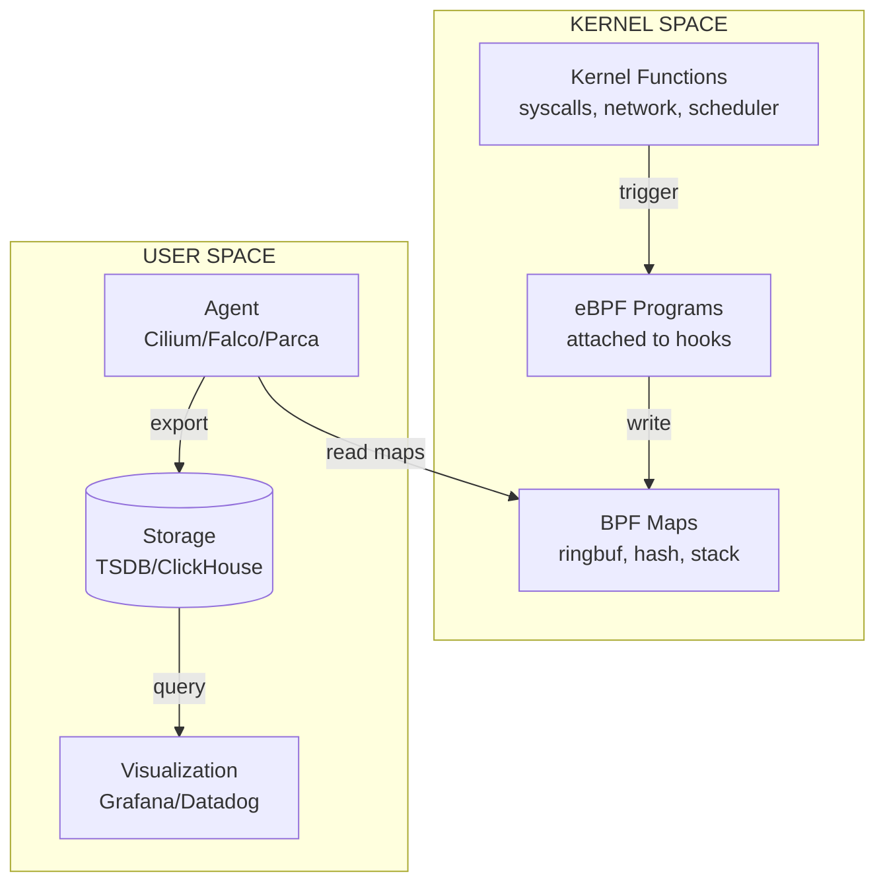

# eBPF for Observability & Security: Deep Dive Research

## 1. Mục tiêu của Task

Nghiên cứu bản chất công nghệ **eBPF (extended Berkeley Packet Filter)** - cơ chế chạy sandboxed code trong kernel Linux, ứng dụng cho observability và security. Hiểu sâu:
- Cơ chế hoạt động ở tầng kernel
- Kiến trúc và các thành phần chính
- Trade-off giữa hiệu năng và khả năng quan sát
- Production concerns khi triển khai
- So sánh với các giải pháp thay thế

---

## 2. Bản Chất và Cơ Chế Hoạt Động

### 2.1. eBPF Là Gì - Định Nghĩa Chính Xác

eBPF là **cơ chế trong-kernel virtual machine** cho phép chạy sandboxed programs trong không gian kernel mà không cần thay đổi source code kernel hoặc load kernel modules.

> **Bản chất cốt lõi:** eBPF biến kernel Linux thành một nền tảng programmable - nơi user-space có thể "cắm" logic xử lý vào các điểm hook trong kernel.

**Sự tiến hóa:**
- **1992:** Classical BPF (cBPF) - packet filtering cho tcpdump
- **2014:** eBPF merged vào Linux kernel 3.18
- **2020s:** Trở thành cơ sở hạ tầng cho cloud-native observability & security

### 2.2. Kiến Trúc eBPF - Từ Tầng Thấp

```
┌─────────────────────────────────────────────────────────────┐
│                    USER SPACE                               │
│  ┌─────────────┐  ┌─────────────┐  ┌─────────────────────┐  │
│  │  BPF Loader │  │   BPF Map   │  │   Control Plane     │  │
│  │  (libbpf)   │  │   Access    │  │   (Cilium/Falco)    │  │
│  └──────┬──────┘  └─────────────┘  └─────────────────────┘  │
└─────────┼───────────────────────────────────────────────────┘
          │ BPF Syscall (bpf())
          ▼
┌─────────────────────────────────────────────────────────────┐
│                    KERNEL SPACE                             │
│  ┌─────────────────────────────────────────────────────┐    │
│  │           eBPF VERIFIER (Security Check)            │    │
│  │  - Loop detection                                   │    │
│  │  - Out-of-bounds access prevention                  │    │
│  │  - Unreachable code elimination                     │    │
│  └──────────────────────┬──────────────────────────────┘    │
│                         ▼                                   │
│  ┌─────────────────────────────────────────────────────┐    │
│  │           eBPF JIT COMPILER                         │    │
│  │  - Compile bytecode → Native machine code           │    │
│  │  - x86_64, ARM64, RISC-V support                    │    │
│  └──────────────────────┬──────────────────────────────┘    │
│                         ▼                                   │
│  ┌─────────────────────────────────────────────────────┐    │
│  │           eBPF VIRTUAL MACHINE                      │    │
│  │  - 11 64-bit registers (R0-R10)                     │    │
│  │  - 1024 instructions max (đã tăng lên 1M từ v5.2)   │    │
│  │  - Bounded loops (từ v5.3)                          │    │
│  └──────────────────────┬──────────────────────────────┘    │
│                         ▼                                   │
│  ┌─────────────────────────────────────────────────────┐    │
│  │           BPF MAPS (Shared Memory)                  │    │
│  │  - Hash map, Array, LRU, Ring buffer, Stack trace   │    │
│  │  - Communication user-space ↔ kernel-space          │    │
│  └─────────────────────────────────────────────────────┘    │
└─────────────────────────────────────────────────────────────┘
```

### 2.3. Cơ Chế Hook - Điểm Gắn Kết Trong Kernel

eBPF programs attach vào **các điểm hook** trong kernel:

| Hook Type | Mục đích | Ví dụ |
|-----------|----------|-------|
| **kprobe/kretprobe** | Tracing kernel functions | Gọi hàm `tcp_sendmsg()` |
| **uprobe/uretprobe** | Tracing user-space functions | Gọi hàm trong application |
| **tracepoint** | Static kernel instrumentation | `sched:sched_switch` |
| **fentry/fexit** | Tracing hiệu năng cao (BPF v5.5+) | Thay thế kprobe nhanh hơn |
| **LSM** | Security hooks | SELinux/AppArmor integration |
| **XDP** | Packet processing trước network stack | DDoS mitigation, load balancing |
| **TC (Traffic Control)** | Packet filtering/redirecting | QoS, traffic shaping |
| **socket filters** | Packet inspection | tcpdump-style filtering |
| **cgroup hooks** | Resource control | CPU/memory accounting |

**Flow khi một event xảy ra:**

```
┌─────────────────┐     ┌─────────────────┐     ┌─────────────────┐
│  Kernel Event   │────▶│  eBPF Program   │────▶│   BPF Maps      │
│  (syscall/net)  │     │  (attached at   │     │   (store data)  │
│                 │     │   hook point)   │     │                 │
└─────────────────┘     └─────────────────┘     └─────────────────┘
                               │
                               ▼
                        ┌─────────────────┐
                        │  Return Action  │
                        │  (PASS/DROP/    │
                        │   MODIFY/...)   │
                        └─────────────────┘
```

### 2.4. BPF Verifier - Cơ Chế Bảo Mật

Đây là **thành phần quan trọng nhất** đảm bảo eBPF an toàn:

```
┌────────────────────────────────────────────────────────────┐
│                    BPF VERIFIER FLOW                       │
├────────────────────────────────────────────────────────────┤
│  1. SYNTAX CHECK                                           │
│     - Valid instructions?                                  │
│     - Jumps hợp lệ?                                        │
│                                                            │
│  2. CONTROL FLOW GRAPH (CFG) VALIDATION                    │
│     - Không có unreachable code                            │
│     - Không có loops vô hạn (trước v5.3)                   │
│     - Bounded complexity                                   │
│                                                            │
│  3. MEMORY SAFETY CHECK                                    │
│     - Bounds tracking cho tất cả memory accesses           │
│     - Null pointer checks                                  │
│     - Stack overflow prevention (512 bytes stack limit)    │
│                                                            │
│  4. TYPE CHECKING                                          │
│     - Map value size alignment                             │
│     - Context access validation                            │
│                                                            │
│  ❌ FAILED → Program rejected                              │
│  ✅ PASSED  → JIT compile → Run in kernel                  │
└────────────────────────────────────────────────────────────┘
```

> **Quan trọng:** Verifier chạy **mỗi lần load program**, không phải runtime. Nếu program vượt qua verifier, nó được đảm bảo không crash kernel (theory).

### 2.5. BPF Maps - Cơ Chế Truyền Dữ Liệu

Maps là **cấu trúc dữ liệu shared** giữa kernel và user-space:

| Map Type | Use Case | Complexity |
|----------|----------|------------|
| `BPF_MAP_TYPE_HASH` | Key-value lookups | O(1) |
| `BPF_MAP_TYPE_ARRAY` | Indexed access, counters | O(1) |
| `BPF_MAP_TYPE_LRU_HASH` | Auto-evicting cache | O(1) |
| `BPF_MAP_TYPE_RINGBUF` | High-perf event streaming | O(1) |
| `BPF_MAP_TYPE_STACK_TRACE` | Stack trace storage | O(depth) |
| `BPF_MAP_TYPE_SOCKHASH` | Socket redirection | O(1) |

**Ring Buffer (BPF v5.8+)** - Giải pháp cho high-throughput:
```
┌──────────────────────────────────────────────────────┐
│                    RING BUFFER                       │
│                                                      │
│   ┌─────┐  ┌─────┐  ┌─────┐  ┌─────┐  ┌─────┐      │
│   │ A   │──│ B   │──│ C   │──│ D   │──│ E   │── ... │
│   └─────┘  └─────┘  └─────┘  └─────┘  └─────┘      │
│      ▲                                          │    │
│      │                                          │    │
│  Producer (kernel)                       Consumer    │
│  ─────────────────                       (user)      │
│  - No locks per-CPU                      - poll()    │
│  - Lossless (configurable)               - mmap()    │
└──────────────────────────────────────────────────────┘
```

---

## 3. Kiến Trúc và Luồng Xử Lý

### 3.1. Observability với eBPF



### 3.2. Security với eBPF (LSM Integration)

```mermaid
flowchart LR
    subgraph Application["Application"]
        A[open()<br/>exec()<br/>connect()]
    end
    
    subgraph Kernel["Kernel LSM Hooks"]
        L[security_file_open<br/>security_bprm_check<br/>security_socket_connect]
    end
    
    subgraph eBPF["eBPF Security Policy"]
        P[Policy Enforcement<br/>- Allow<br/>- Deny<br/>- Audit]
    end
    
    A --> L
    L -->|attach| P
    P -->|decision| L
    L -->|result| A
```

---

## 4. So Sánh Các Lựa Chọn

### 4.1. eBPF vs Traditional Approaches

| Aspect | eBPF | Kernel Module | ptrace | LD_PRELOAD |
|--------|------|---------------|--------|------------|
| **Safety** | ✅ Sandboxed, verified | ❌ Full kernel access | ✅ User-space | ✅ User-space |
| **Performance** | ✅ Native speed sau JIT | ✅ Native | ❌ Context switches | ✅ Native |
| **Overhead** | ⭐ Very low (~1-5%) | Low | ⭐⭐⭐ High (50%+) | Low |
| **Flexibility** | ✅ Dynamic attach | ❌ Recompile/reload | Limited | Limited |
| **Stability** | ✅ Kernel API stable | ❌ Breaks with updates | ⭐⭐⭐ Stable | ⭐⭐ Stable |
| **Use case** | Production observability | Drivers, deep hooks | Debugging | Interception |

### 4.2. So Sánh Các Công Cụ eBPF

| Tool | Primary Use | Hook Types | Production Ready |
|------|-------------|------------|------------------|
| **Cilium** | Network, Service Mesh | XDP, TC, cgroup, LSM | ⭐⭐⭐ Enterprise |
| **Falco** | Runtime Security | tracepoint, kprobe | ⭐⭐⭐ Enterprise |
| **Pixie** | Observability | kprobe, uprobe | ⭐⭐⭐ Enterprise |
| **Tetragon** | Security Observability | LSM, kprobe | ⭐⭐⭐ Production |
| **kubectl-trace** | Debugging | kprobe | ⭐⭐ Dev/Debug |
| **Parca** | Continuous Profiling | perf_events | ⭐⭐⭐ Production |
| **Pyroscope** | Continuous Profiling | perf_events | ⭐⭐⭐ Production |

### 4.3. eBPF vs Service Mesh (Sidecar vs Kernel)

| Feature | Istio/Envoy (Sidecar) | Cilium (eBPF-based) |
|---------|----------------------|---------------------|
| **Latency** | ~3-10ms | ~0.1-0.5ms |
| **Resource Usage** | High (per-pod proxy) | Low (shared kernel) |
| **mTLS** | Full implementation | Partial (kernel-level) |
| **Visibility** | L7 full | L3-L7 via eBPF |
| **Complexity** | High | Medium |
| **Multi-cluster** | Mature | Developing |

> **Quyết định:** Sidecar cho mTLS nặng và L7 policies phức tạp. eBPF cho hiệu năng và đơn giản.

---

## 5. Rủi Ro, Anti-Patterns, Lỗi Thường Gặp

### 5.1. Verifier Failures

**Lỗi phổ biến nhất khi phát triển:**

```c
// ❌ ANTI-PATTERN: Unbounded loop
for (int i = 0; i < some_variable; i++) {  // verifier rejects
    // ...
}

// ✅ PATTERN: Bounded loop (v5.3+) hoặc unroll
#pragma unroll
for (int i = 0; i < 10; i++) {  // constant bound
    // ...
}
```

```c
// ❌ ANTI-PATTERN: Null pointer không check
struct task_struct *task = bpf_get_current_task();
// Truy cập task->pid ngay - có thể null

// ✅ PATTERN: Bounds check hoặc dereference an toàn
if (task) {
    // Truy cập an toàn
}
```

### 5.2. Performance Pitfalls

| Pitfall | Impact | Solution |
|---------|--------|----------|
| **Quá nhiều kprobes** | High overhead | Dùng fentry/fexit thay thế |
| **Map lookups trong hot path** | CPU bound | Batch operations, per-CPU maps |
| **Ring buffer overflow** | Event loss | Tăng size, sampling, consumer optimization |
| **Stack depth > 512 bytes** | Verifier rejection | Dùng scratch maps |
| **BPF-to-BPF calls deep** | Stack pressure | Inline hoặc giảm call depth |

### 5.3. Production Concerns

**1. Kernel Version Compatibility:**
- eBPF features phụ thuộc kernel version
- CO-RE (Compile Once - Run Everywhere) giải quyết vấn đề này

```c
// Sử dụng BTF (BPF Type Format) và CORE macros
struct task_struct *task = (void *)bpf_get_current_task();
// CO-RE field access
u64 pid = BPF_CORE_READ(task, pid);
```

**2. Memory Limits:**
- Instruction limit: 1M instructions (kernel 5.2+)
- Stack: 512 bytes
- Map entries: Có thể configure

**3. Privilege Requirements:**
- Root hoặc CAP_BPF capability cần thiết
- Unprivileged eBPF bị disable mặc định (security)

### 5.4. Security Risks

> **eBPF không phải "silver bullet" - vẫn có attack surface:**

| Risk | Description | Mitigation |
|------|-------------|------------|
| **Verifier bypass** | Lỗ hổng trong verifier logic | Update kernel, theo dõi CVE |
| **Speculative execution** | Spectre-style attacks trong BPF | Kernel mitigations |
| **Side channels** | Timing attacks qua BPF maps | Isolation, careful design |
| **DoS via BPF** | Resource exhaustion | cgroup limits, rate limiting |

---

## 6. Khuyến Nghị Thực Chiến Production

### 6.1. Triển Khai Observability

**Stack khuyến nghị:**
```
┌────────────────────────────────────────────────────────┐
│                  OBSERVABILITY STACK                   │
├────────────────────────────────────────────────────────┤
│  Collection:  Parca/Pyroscope (continuous profiling)   │
│               + Pixie/Cilium Hubble (network)          │
│  Storage:    Grafana Tempo (traces)                    │
│               + Prometheus (metrics)                   │
│  Analysis:   Grafana dashboards                        │
│  Alerting:   Prometheus Alertmanager                   │
└────────────────────────────────────────────────────────┘
```

**Best practices:**
1. **Start với off-the-shelf tools** trước khi viết BPF programs custom
2. **Test overhead trên staging** - measure trước khi deploy
3. **Sampling cho high-volume events** - không trace mọi syscall
4. **Version pinning** cho kernel compatibility
5. **Monitoring the monitoring** - theo dõi BPF agent health

### 6.2. Triển Khai Security

**Defense in Depth với eBPF:**

```
Layer 1: Network (Cilium) → XDP/TC filtering
Layer 2: System Call (Falco) → Runtime threat detection  
Layer 3: Process (Tetragon) → Execution monitoring
Layer 4: File System (eBPF LSM) → Access control
```

**Rule priorities:**
1. **Default deny** cho sensitive operations
2. **Least privilege** - chỉ monitor cần thiết
3. **Audit before enforce** - chế độ dry-run trước
4. **Regular updates** - policy và signatures

### 6.3. Debugging eBPF

**Công cụ:**
- `bpftool prog list/show` - Xem loaded programs
- `bpftool map list/dump` - Inspect maps
- `bpftrace` - One-liners cho ad-hoc debugging
- `/sys/kernel/debug/tracing/` - Kernel tracepoints

**Ví dụ debugging workflow:**
```bash
# Kiểm tra programs đang chạy
bpftool prog list

# Xem bytecode của một program
bpftool prog dump xlated id <id>

# Xem JIT compiled code
bpftool prog dump jited id <id>

# Dump map contents
bpftool map dump id <map_id>
```

---

## 7. Kết Luận

**Bản chất của eBPF:**
eBPF biến Linux kernel thành một nền tảng **programmable** - nơi có thể chèn logic xử lý an toàn, hiệu năng cao vào bất kỳ điểm nào trong kernel. Đây là **paradigm shift** từ việc "qu observing từ ngoài" sang "thực thi logic bên trong kernel".

**Trade-off cốt lõi:**
- ✅ **Hiệu năng vượt trội** vs sidecar/traditional approaches
- ✅ **Flexibility** - dynamic attach mà không cần restart
- ⚠️ **Complexity** - phải hiểu kernel internals, verifier constraints
- ⚠️ **Kernel dependency** - features tied to kernel version
- ⚠️ **Security surface** - cần privileged access, verifier là single point of failure

**Khi nào dùng eBPF:**
- High-frequency event monitoring (syscalls, network packets)
- Low-latency security enforcement
- Cloud-native environments (Kubernetes networking)
- Continuous profiling ở scale

**Khi nào KHÔNG dùng eBPF:**
- Simple logging/metrics (overkill)
- Legacy kernels (< 4.x)
- Highly regulated environments (kernel patching concerns)
- Teams không có kernel expertise

**Tương lai:**
eBPF đang trở thành **platform layer** cho cloud-native infrastructure. Windows eBPF đang phát triển. WebAssembly + eBPF là xu hướng mới. Hiểu eBPF không còn là "nice-to-have" mà là **required knowledge** cho Senior Backend/DevOps Engineers.

---

## Tài Liệu Tham Khảo

1. [eBPF.io - Official Documentation](https://ebpf.io/what-is-ebpf/)
2. [Linux Kernel BPF Documentation](https://www.kernel.org/doc/html/latest/bpf/)
3. [Cilium Documentation](https://docs.cilium.io/)
4. [Falco Rules Guide](https://falco.org/docs/rules/)
5. [BPF Performance Tools - Brendan Gregg](http://www.brendangregg.com/bpf-performance-tools-book.html)
6. [eBPF Summit Recordings](https://ebpf.io/summit-2023/)
