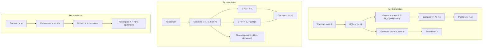
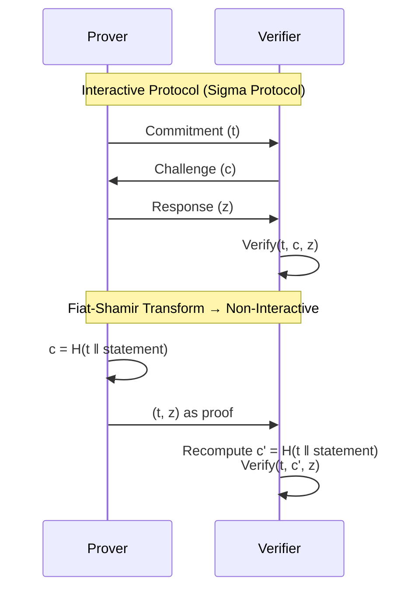

# Post-Quantum Cryptography & Zero-Knowledge Proofs

> **Mục tiêu:** Hiểu sâu bản chất mật mã hậu lượng tử, các thuật toán lattice-based, và cơ chế zero-knowledge proofs — từ lý thuyết toán học đến chiến lược migration trong hệ thống production.

---

## 1. Mục tiêu của Task

Task này đi sâu vào:
1. **Post-Quantum Cryptography (PQC):** Các thuật toán mật mã chống chịu trước sức mạnh tính toán của máy tính lượng tử
2. **Lattice-based Cryptography:** Nền tảng toán học của hầu hết các thuật toán PQC được chuẩn hóa
3. **Zero-Knowledge Proofs (ZKP):** Cơ chế chứng minh tính đúng đắn mà không tiết lộ thông tin
4. **Migration Strategy:** Lộ trình chuyển đổi từ RSA/ECC sang PQC trong hệ thống legacy

---

## 2. Bản Chất và Cơ Chế Hoạt Động

### 2.1 Mối Đe Dọa Từ Máy Tính Lượng Tử

#### Shor's Algorithm - Mối Nguy Hiểm Thực Sự

Máy tính lượng tử không phải là "máy tính nhanh hơn" — chúng giải quyết **một số bài toán cụ thể** với độ phức tạp hoàn toàn khác:

| Thuật toán | Độ phức tạp Classical | Độ phức tạp Quantum | Ảnh hưởng |
|------------|----------------------|---------------------|-----------|
| Integer Factorization (RSA) | O(exp((ln n)^(1/3))) | O((log n)³) | **Broken** |
| Discrete Log (DH, DSA) | O(exp((ln n)^(1/3))) | O((log n)³) | **Broken** |
| Elliptic Curve Log (ECC) | O(exp((ln n)^(1/3))) | O((log n)³) | **Broken** |
| Symmetric Key (AES) | O(2ⁿ) | O(2^(n/2)) | Cần key size ×2 |
| Hash Functions (SHA) | O(2ⁿ) | O(2^(n/2)) | Cần output size ×2 |

> **Lưu ý quan trọng:** Shor's algorithm chỉ phá vỡ các hệ mật dựa trên **nhóm giao hoán** (abelian groups). Các hệ dựa trên lattice, hash-based, code-based, và multivariate polynomial **không sử dụng cấu trúc nhóm giao hoán**, nên immune với Shor's algorithm.

#### Timeline Thực Tế

```
2024-2026: NIST standardization complete
2027-2030: Early adopters, regulated industries (banking, government)
2030-2035: Mass adoption, "harvest now, decrypt later" threat materializes
2035+: Cryptographically relevant quantum computer (CRQC) possible
```

> **"Harvest Now, Decrypt Later":** Kẻ tấn công đang lưu trữ dữ liệu mã hóa ngay hôm nay, chờ CRQC để giải mã sau. Dữ liệu có giá trị lâu dài (bí mật quốc gia, IP, PII) cần được bảo vệ **ngay bây giờ**.

---

### 2.2 Lattice-Based Cryptography - Nền Tảng Toán Học

#### Cấu Trúc Lattice

Lattice là tập hợp các điểm integer trong không gian n-chiều:

```
L = { Σᵢ xᵢbᵢ : xᵢ ∈ Z }

Trong đó: b₁, b₂, ..., bₙ là basis vectors
```

**Bài toán khó của lattice:**

| Bài toán | Mô tả | Độ khó |
|----------|-------|--------|
| **SVP** (Shortest Vector Problem) | Tìm vector ngắn nhất ≠ 0 trong lattice | NP-hard (approximate) |
| **CVP** (Closest Vector Problem) | Tìm lattice point gần nhất với target point | NP-hard |
| **LWE** (Learning With Errors) | Phân biệt random linear equations vs equations with small error | Average-case hard |
| **Ring-LWE** | LWE trên polynomial rings | Structured variant, efficient |
| **Module-LWE** | LWE trên module structures | Balance security vs efficiency |

> **Tại sao lattice-based resistant với quantum?** Không có cấu trúc nhóm giao hoán để Shor's algorithm khai thác. Grover's algorithm chỉ cung cấp speedup căn bậc hai — có thể counter bằng cách tăng key size gấp đôi.

---

### 2.3 CRYSTALS-Kyber: Key Encapsulation Mechanism (KEM)

#### Kiến Trúc Tổng Quan



#### Cơ Chế Chi Tiết

Kyber dựa trên **Module-LWE (MLWE)** — làm việc với vectors và matrices trên polynomial ring:

```
R = Z_q[X] / (Xⁿ + 1)  với n = 256, q = 3329

Module: R_q^k × R_q^k → R_q

Security levels:
- Kyber-512:  k = 2  → AES-128 equivalent
- Kyber-768:  k = 3  → AES-192 equivalent  
- Kyber-1024: k = 4  → AES-256 equivalent
```

**Compression/Decompression — Optimizating Ciphertext Size:**

```
Original:  each coefficient needs ⌈log₂q⌉ = 12 bits
Compressed: du bits for u, dv bits for v (du = 10 or 11, dv = 4)

Ciphertext size (Kyber-768):
- Uncompressed: ~3KB
- Compressed: 1,088 bytes
```

> **Trade-off:** Compression là lossy, thêm noise vào ciphertext. Nhưng noise được tính toán cẩn thận để không ảnh hưởng đến correctness.

---

### 2.4 CRYSTALS-Dilithium: Digital Signature

#### Kiến Trúc Tổng Quan

Dilithium sử dụng **"Fiat-Shamir with Aborts"** — kỹ thuật rejection sampling để tạo signature mà không leak secret key.

```mermaid
flowchart TB
    subgraph "Key Generation"
        A[Random seed ζ] --> B["Expand to matrix A ∈ R_q^(k×l)"]
        B --> C["Generate secret (s₁, s₂) with small coefficients"]
        C --> D["Compute t = As₁ + s₂"]
        D --> E["Public key: (A, t)"]
        C --> F["Secret key: (s₁, s₂, t)"]
    end
    
    subgraph "Signing"
        G[Message M] --> H["Generate random y with small coeffs"]
        H --> I["Compute w = Ay"]
        I --> J["Compute challenge c = H(μ ‖ w₁)"]
        J --> K["Compute z = y + cs₁"]
        K --> L{"‖z‖∞ < γ₁ - β?"}
        L -->|No| H
        L -->|Yes| M["Output (z, c) or (z, h)"]
    end
    
    subgraph "Verification"
        N[Receive (z, c)] --> O["Recompute w' = Az - ct"]
        O --> P["Verify c = H(μ ‖ w'₁)"]
        P --> Q{"‖z‖∞ < γ₁?"}
    end
```

#### Bản Chất "Fiat-Shamir with Aborts"

```
Vấn đề: z = y + cs₁ nếu được publish trực tiếp sẽ leak thông tin về s₁
        (vì attacker biết y, c, z → có thể tính s₁)

Giải pháp: Rejection sampling — chỉ accept z nằm trong "safe zone"
            Nếu z quá lớn, discard và retry với y mới

Trade-off: Signing time không deterministic, nhưng secret key được bảo vệ
```

**Security Parameters:**

| Level | k | l | γ₁ | β | Security | Signature | Public Key |
|-------|---|---|----|---|----------|-----------|------------|
| 2 | 4 | 4 | 2¹⁷ | 78 | 128-bit | 2,420 B | 1,312 B |
| 3 | 6 | 5 | 2¹⁹ | 196 | 192-bit | 3,293 B | 1,952 B |
| 5 | 8 | 7 | 2¹⁹ | 196 | 256-bit | 4,595 B | 2,592 B |

---

### 2.5 Zero-Knowledge Proofs (ZKP)

#### Bản Chất Triết Học

> **Zero-Knowledge Proof:** Peggy (prover) chứng minh cho Victor (verifier) rằng cô biết secret x, thỏa mãn statement S(x) = true, **mà không tiết lộ bất kỳ thông tin gì về x ngoài validity của S**.

Ba tính chất:
1. **Completeness:** Nếu statement đúng và prover trung thực, verifier sẽ accept
2. **Soundness:** Nếu statement sai, prover dishonest không thể convince verifier (với xác suất cao)
3. **Zero-Knowledge:** Verifier học được **không gì** về secret từ proof

#### Cấu Trúc Interactive Proof → Non-Interactive



---

### 2.6 zk-SNARKs vs zk-STARKs

| Đặc điểm | zk-SNARKs | zk-STARKs |
|----------|-----------|-----------|
| **Setup** | Trusted setup required (CRS) | Transparent setup (no trust) |
| **Post-quantum** | ❌ Vulnerable | ✅ Resistant |
| **Proof size** | ~200 bytes (tiny) | ~50-100 KB (larger) |
| **Verification time** | ~2ms (fast) | ~10ms (slower) |
| **Proving time** | Seconds to minutes | Faster for large circuits |
| **Cryptographic assumption** | Elliptic curves, pairings | Hash functions only |
| **Use case phù hợp** | Blockchain, privacy coins | Scalable verification, long-term security |

#### Bản Chất zk-SNARKs

```
Arithmetic Circuit → R1CS (Rank-1 Constraint System) → QAP (Quadratic Arithmetic Program)

QAP: Tìm polynomial P(x) sao cho P(x) = 0 tại các roots cụ thể iff circuit được satisfy

CRS (Common Reference String): Setup phase tạo structured reference string chứa
  - powers of secret τ: [τ⁰], [τ¹], [τ²], ..., [τⁿ]  (in exponent, on curve)
  
Prover chứng minh biết witness w sao cho P(w) = 0 mà không tiết lộ w
```

> **Vấn đề tin cậy của zk-SNARKs:** Nếu entity tạo CRS giữ lại "toxic waste" (secret τ), họ có thể tạo fake proofs. Giải pháp: MPC ceremony với hundreds of participants — chỉ cần 1 người trung thực thì setup an toàn.

#### Bản Chất zk-STARKs

```
STARK = Scalable Transparent Argument of Knowledge

Dựa trên: FRI (Fast Reed-Solomon Interactive Oracle Proof of Proximity)

Cơ chế chính:
1. Arithmetization: Convert computation thành algebraic constraints
2. Low-degree testing: Prover chứng minh polynomial có degree thấp (FRI)
3. Merkle commitments: Commit to polynomial evaluations
4. Query phase: Verifier randomly query committed values

Security: Dựa trên hardness của finding collisions in hash functions
→ Post-quantum secure vì Grover's algorithm chỉ cung cấp square-root speedup
```

---

### 2.7 FHE (Fully Homomorphic Encryption) - Ngắn Gọn

FHE cho phép tính toán trên encrypted data:

```
Given: Enc(m₁), Enc(m₂)
Compute: Enc(m₁ ⊕ m₂), Enc(m₁ ⊗ m₂)  (without decrypting)

Bảng tính toán "trong mây" mà cloud provider không thấy dữ liệu
```

> **Trade-off:** FHE extremely slow (10⁶-10⁹× slower than plaintext). Practical cho specific use cases (private ML inference, voting) nhưng chưa feasible cho general computation.

---

## 3. So Sánh Các Phương Án Triển Khai

### 3.1 PQC Algorithms Comparison

```
┌─────────────────────────────────────────────────────────────────────────┐
│                    NIST STANDARDIZED ALGORITHMS                          │
├──────────────┬─────────────┬──────────────┬──────────────┬──────────────┤
│   Use Case   │  Algorithm  │  Security    │ Performance  │    Size      │
├──────────────┼─────────────┼──────────────┼──────────────┼──────────────┤
│ KEM/Key      │ Kyber-768   │ AES-192 eq   │ ~10× faster  │ PK: 1,184 B  │
│ Exchange     │ (ML-KEM)    │              │ than RSA-3072│ CT: 1,088 B  │
├──────────────┼─────────────┼──────────────┼──────────────┼──────────────┤
│ Digital      │ Dilithium-3 │ AES-192 eq   │ Similar to   │ Sig: 3,293 B │
│ Signatures   │ (ML-DSA)    │              │ RSA-PSS      │ PK: 1,952 B  │
├──────────────┼─────────────┼──────────────┼──────────────┼──────────────┤
│ Digital      │ SPHINCS+    │ SHA-3 based  │ Signing:     │ Sig: 7-49 KB │
│ Signatures   │ (SLH-DSA)   │ Stateless    │ 10-100×      │ PK: 32-64 B  │
│ (hash-based) │             │ hash-based   │ slower       │ (tiny!)      │
├──────────────┼─────────────┼──────────────┼──────────────┼──────────────┤
│ Digital      │ Falcon-512  │ NTRU-based   │ Fast sig,    │ Sig: 666 B   │
│ Signatures   │             │              │ but FP       │ PK: 897 B    │
│ (NTRU-based) │             │              │ sensitive    │              │
└──────────────┴─────────────┴──────────────┴──────────────┴──────────────┘
```

### 3.2 Khi Nào Dùng Gì

| Scenario | Recommendation | Lý do |
|----------|----------------|-------|
| TLS handshake replacement | **Kyber** | Fast, small, well-tested |
| Code signing, long-term docs | **SPHINCS+** | Stateless, hash-based (conservative security) |
| High-volume transaction signing | **Dilithium** | Balance size and speed |
| Constrained devices (IoT) | **Falcon** hoặc **Kyber** | Smaller signatures |
| Blockchain, smart contracts | **STARKs** hoặc **SNARKs** | Efficient verification |

---

## 4. Rủi Ro, Anti-patterns, và Lỗi Thường Gặp

### 4.1 Catastrophic Failures trong PQC

#### 1. Side-Channel Leakage

```
Vấn đề: Kyber/Dilithium implementations có thể leak secret key qua:
  - Timing attacks (non-constant-time operations)
  - Power analysis (SPA/DPA)
  - Cache attacks (Flush+Reload)

Giải pháp:
  - Chỉ dùng audited libraries (liboqs, Bouncy Castle PQC)
  - Constant-time implementations
  - Hardware security modules (HSM) cho key storage
```

#### 2. Ciphertext Malleability

```
Lattice-based KEMs không tự động authenticate ciphertext.

Anti-pattern:
  shared_secret = KEM.decrypt(ciphertext)
  data = AES.decrypt(encrypted_data, shared_secret)  // WRONG!

Best practice:
  shared_secret = KEM.decrypt(ciphertext)
  // ALWAYS use authenticated encryption
  data = AES-GCM.decrypt(encrypted_data, shared_secret, associated_data=ciphertext)
```

#### 3. Hybrid Deployment Mistakes

```
❌ BAD: RSA-2048 + Kyber-512 (weakest link = RSA)
✅ GOOD: RSA-3072 + Kyber-768 hoặc Kyber-1024

❌ BAD: "Either/or" fallback — cho phép client downgrade về RSA
✅ GOOD: Always combine (hybrid), never fallback
```

### 4.2 ZKP Pitfalls

| Lỗi | Hệ quả | Phòng tránh |
|-----|--------|-------------|
| **Under-constrained circuits** | Prover có thể cheat | Formal verification của circuit |
| **Trusted setup compromise** | Unlimited fake proofs | MPC ceremony, transparency |
| **Replay attacks** | Proof bị reuse | Include nonce/timestamp trong statement |
| **Front-running** | MEV extraction | Time-locked proofs, commit-reveal |

---

## 5. Khuyến Nghị Thực Chiến trong Production

### 5.1 Migration Strategy: Hybrid Approach

```mermaid
flowchart LR
    subgraph "Phase 1: Inventory"
        A[Catalog all crypto usage] --> B[Identify data sensitivity]
        B --> C[Risk assessment]
    end
    
    subgraph "Phase 2: Crypto Agility"
        D[Abstract crypto layer] --> E[Implement algorithm negotiation]
    end
    
    subgraph "Phase 3: Hybrid Deployment"
        F[Concurrent deployment] --> G[Traditional + PQC]
        G --> H[Monitor performance]
    end
    
    subgraph "Phase 4: Full Migration"
        I[Remove legacy algorithms] --> J[Audit & validate]
    end
    
    C --> D
    E --> F
    H --> I
```



### 5.2 Implementation Guidelines

```java
// Abstract Crypto Layer - Cho phép algorithm agility
public interface KeyEncapsulation {
    byte[] generateKeyPair();
    EncapsulationResult encapsulate(byte[] publicKey);
    byte[] decapsulate(byte[] secretKey, byte[] ciphertext);
}

// Hybrid KEM implementation
public class HybridKEM implements KeyEncapsulation {
    private final KeyEncapsulation classicalKEM;  // e.g., ECDH
    private final KeyEncapsulation pqcKEM;        // e.g., Kyber
    
    @Override
    public byte[] decapsulate(byte[] sk, byte[] ct) {
        // Classical + PQC secrets combined via KDF
        byte[] classicalSecret = classicalKEM.decapsulate(skClassical, ctClassical);
        byte[] pqcSecret = pqcKEM.decapsulate(skPQC, ctPQC);
        return HKDF.derive(classicalSecret, pqcSecret);
    }
}
```

### 5.3 Monitoring & Observability

| Metric | Alert Threshold | Ý nghĩa |
|--------|-----------------|---------|
| PQC handshake latency | >50ms P95 | Performance degradation |
| PQC handshake failure rate | >0.1% | Compatibility issues |
| Certificate expiry (PQC) | <90 days | Migration tracking |
| HSM operation latency | >10ms | Hardware bottleneck |

### 5.4 Tooling & Libraries

| Library | Ngôn ngữ | Mục đích | Production Ready? |
|---------|----------|----------|-------------------|
| **liboqs** | C/C++ | Reference implementations | Yes (Cautiously) |
| **Bouncy Castle** | Java | Full PQC suite | Yes |
| **pq-crystals.org** | C | Official reference | Reference only |
| **AWS-LC** | C | AWS crypto library w/ PQC | Yes |
| **OpenSSL 3.2+** | C | TLS 1.3 + PQC | Early adoption |
| ** CIRCL** | Go | Cloudflare's crypto | Yes |

---

## 6. Kết Luận

### Bản Chất Cốt Lõi

1. **PQC không phải "tương lai xa" — harvest-now-decrypt-later đang diễn ra.** Dữ liệu nhạy cảm cần PQC protection ngay hôm nay.

2. **Lattice-based cryptography (Kyber, Dilithium) là lựa chọn pragmatic:** Fast, compact, well-understood security foundation.

3. **Zero-knowledge proofs cho phép privacy-preserving verification:** zk-STARKs superior cho long-term security (post-quantum + transparent setup).

4. **Migration là marathon, không phải sprint:** Hybrid deployment, crypto agility, và staged rollout là essential.

### Trade-offs Quan Trọng Nhất

```
┌─────────────────────────────────────────────────────────────┐
│  TRADITIONAL CRYPTO          │  POST-QUANTUM CRYPTO         │
├─────────────────────────────────────────────────────────────┤
│  ✓ Fast, optimized           │  ✓ Quantum-resistant         │
│  ✓ Small keys/signatures     │  ✓ Conservative security     │
│  ✗ Broken by quantum         │  ✗ Larger keys/signatures    │
│  ✗ No migration path         │  ✗ Less mature ecosystem     │
└─────────────────────────────────────────────────────────────┘

→ HYBRID là answer: Kết hợp cả hai đến khi PQC mature
```

### Rủi Ro Lớn Nhất

> **Không phải quantum computer — mà là hasty migration.** Implementing PQC incorrectly (side channels, under-constrained circuits, improper hybrid composition) tạo ra vulnerabilities worse than quantum threat itself.

**Action Items:**
1. Inventory crypto usage trong hệ thống ngay lập tức
2. Implement crypto agility layer
3. Start hybrid deployment cho sensitive data
4. Monitor NIST và IETF standards evolution
5. Plan for algorithm upgrades (PQC v2.0)

---

## 7. Tài Liệu Tham Khảo

1. **NIST PQC Standardization:** https://csrc.nist.gov/projects/post-quantum-cryptography
2. **CRYSTALS-Kyber Specification:** https://pq-crystals.org/kyber/
3. **CRYSTALS-Dilithium Specification:** https://pq-crystals.org/dilithium/
4. **zk-SNARKs paper:** "Succinct Non-Interactive Zero Knowledge for a von Neumann Architecture" (Ben-Sasson et al.)
5. **zk-STARKs paper:** "Scalable, transparent, and post-quantum secure computational integrity" (Ben-Sasson et al.)
6. **IETF PQC in TLS:** draft-ietf-tls-hybrid-design
7. **CNCF whitepaper:** "Cloud Native Cryptography"

---

*Last updated: 2026-03-27*
*Research completed by Senior Backend Architect Agent*
