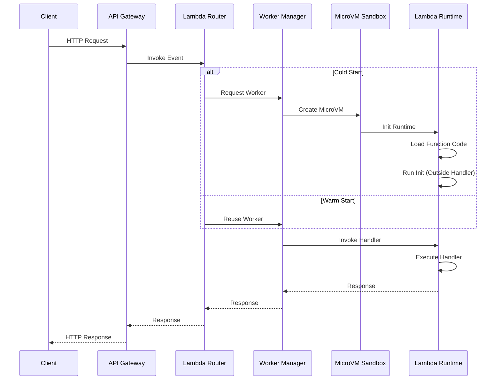
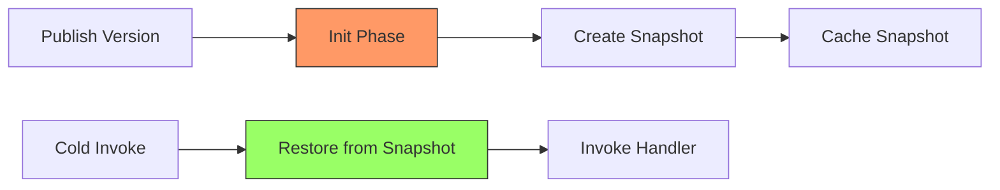

# Serverless Architecture Deep Dive

## 1. Mục tiêu của Task

Nghiên cứu bản chất kiến trúc Serverless (Function-as-a-Service), hiểu sâu cơ chế vận hành, các trade-off giữa latency và cost, chiến lược tối ưu cold start, và phương án giảm thiểu vendor lock-in thông qua các nền tảng mở như Knative/OpenFaaS.

---

## 2. Bản Chất và Cơ Chế Hoạt Động

### 2.1 Định nghĩa chính xác

Serverless không có nghĩa là "không có server". Đúng hơn, đó là mô hình **abstraction hoàn toàn infrastructure** - ngườ dùng không quản lý, không cấu hình, và không trả tiền cho idle resources.

| Khái niệm | Ý nghĩa thực tế |
|-----------|-----------------|
| **FaaS** (Function-as-a-Service) | Đơn vị triển khai là function, event-triggered, ephemeral execution |
| **BaaS** (Backend-as-a-Service) | Các dịch vụ managed (DB, Auth, Storage) tích hợp sẵn |
| **Serverless Container** | Container chạy trên nền tảng serverless (AWS Fargate, Cloud Run) |

### 2.2 Kiến trúc AWS Lambda Internals

```
┌─────────────────────────────────────────────────────────────────────┐
│                        AWS Lambda Service                           │
├─────────────────────────────────────────────────────────────────────┤
│  ┌─────────────┐    ┌─────────────┐    ┌─────────────────────────┐  │
│  │   Invoke    │───→│   Worker    │───→│   Execution Sandbox     │  │
│  │   Router    │    │   Manager   │    │   (Firecracker MicroVM) │  │
│  └─────────────┘    └─────────────┘    └─────────────────────────┘  │
│         │                  │                      │                  │
│         ↓                  ↓                      ↓                  │
│  ┌─────────────┐    ┌─────────────┐    ┌─────────────────────────┐  │
│  │   Event     │    │  Placement  │    │   Lambda Runtime API    │  │
│  │   Sources   │    │  (AZ-aware) │    │   (HTTP on localhost)   │  │
│  └─────────────┘    └─────────────┘    └─────────────────────────┘  │
└─────────────────────────────────────────────────────────────────────┘
```

#### Firecracker MicroVM - Cốt lõi của Lambda

AWS Lambda sử dụng **Firecracker** - hypervisor nhẹ viết bằng Rust, tạo MicroVM chỉ trong ~125ms:

- **KVM-based**: Tận dụng hardware virtualization
- **Minimal device model**: Chỉ emulate virtio-net, virtio-block, serial console
- **Memory overhead thấp**: ~5MB per MicroVM (so với 100MB+ cho VM truyền thống)
- **Startup time**: < 125ms (so với vài giây cho container thông thường)

> **Quan trọng:** Lambda không dùng Docker container trực tiếp. Mỗi invocation có thể chạy trên MicroVM mới hoặc tái sử dụng MicroVM đã warm.

### 2.3 Lambda Execution Lifecycle



#### Các phase của Lambda execution:

| Phase | Thờ gian điển hình | Mô tả |
|-------|-------------------|-------|
| **Init Phase** | 100-1000ms | Tạo sandbox, init runtime, load code |
| **Restore Phase** | 0-200ms | (SnapStart) Restore từ snapshot |
| **Invoke Phase** | Variable | Thực thi handler code |
| **Shutdown Phase** | 500ms | Cleanup, runtime shutdown |

---

## 3. Cold Start - Bài Toán Quan Trọng Nhất

### 3.1 Cơ chế Cold Start

Cold start xảy ra khi Lambda cần khởi tạo execution environment mới. Có 3 loại cold start:

```
┌─────────────────────────────────────────────────────────────────┐
│                    Cold Start Hierarchy                         │
├─────────────────────────────────────────────────────────────────┤
│                                                                 │
│  ┌─────────────────────────────────────────────────────────┐   │
│  │  SANDY (Init Cold Start)                                │   │
│  │  • Tạo mới MicroVM hoàn toàn                            │   │
│  │  • ~1000-3000ms (Java), ~200-500ms (Node.js/Python)     │   │
│  │  • Nguyên nhân: First invoke, scale-out, AZ failover    │   │
│  └─────────────────────────────────────────────────────────┘   │
│                          ↑                                      │
│  ┌─────────────────────────────────────────────────────────┐   │
│  │  COLD (Runtime Cold Start)                              │   │
│  │  • Có MicroVM nhưng chưa load runtime/code              │   │
│  │  • ~500-1500ms (Java với large dependencies)            │   │
│  │  • Nguyên nhân: Function update, runtime upgrade        │   │
│  └─────────────────────────────────────────────────────────┘   │
│                          ↑                                      │
│  ┌─────────────────────────────────────────────────────────┐   │
│  │  WARM (No Cold Start)                                   │   │
│  │  • Reuse execution context                              │   │
│  │  • < 10ms overhead                                      │   │
│  │  • Giữ warm: 5-15 phút (configurable với Provisioned)   │   │
│  └─────────────────────────────────────────────────────────┘   │
│                                                                 │
└─────────────────────────────────────────────────────────────────┘
```

### 3.2 Chi tiết Cold Start Java

Java có cold start **nặng nhất** trong các runtime phổ biến:

| Nguyên nhân | Tác động | Giải pháp |
|-------------|----------|-----------|
| **JVM Startup** | 100-300ms | GraalVM Native Image, CRaC |
| **Classpath Scanning** | 200-800ms | Spring AOT, explicit configuration |
| **Reflection/Proxy** | 100-500ms | Remove runtime proxies, compile-time weaving |
| **Dependency Injection** | 200-600ms | Lazy initialization, Dagger 2 (compile-time DI) |

#### AWS Lambda SnapStart cho Java



**SnapStart** giảm cold start Java từ 3000-6000ms xuống còn 500-1000ms bằng cách:
1. Chạy Init phase một lần khi publish version
2. Tạo snapshot memory của initialized runtime
3. Restore snapshot thay vì init lại

> **Lưu ý quan trọng:** SnapStart yêu cầu code **idempotent** và không giữ state. Các kết nối network, file descriptors, entropy sources (SecureRandom) cần được re-initialize sau restore.

### 3.3 Chiến lược Tối ưu Cold Start

| Chiến lược | Mô tả | Trade-off |
|------------|-------|-----------|
| **Provisioned Concurrency** | Giữ số lượng execution environment warm | Chi phí cao (~$25/concurrency/tháng) |
| **SnapStart (Java)** | Pre-initialized snapshots | Chỉ cho Java, giới hạn state |
| **Lambda Power Tuning** | Tăng memory = tăng CPU = giảm init time | Chi phí thấp hơn Provisioned |
| **GraalVM Native Image** | AOT compilation, no JVM startup | Build phức tạp, một số feature không hỗ trợ |
| **CRaC (Coordinated Restore at Checkpoint)** | Snapshot/restore JVM tại thờ điểm mong muốn | Java 17+, cần container support |
| **Keep-alive Pings** | Gửi request định kỳ giữ warm | Không đảm bảo 100%, tốn chi phí |

---

## 4. Kiến trúc Event-Driven Serverless

### 4.1 Event Sources và Integration Patterns

```
┌─────────────────────────────────────────────────────────────────────┐
│                    Event-Driven Serverless                          │
├─────────────────────────────────────────────────────────────────────┤
│                                                                     │
│   ┌──────────┐   ┌──────────┐   ┌──────────┐   ┌──────────┐       │
│   │  S3      │   │ API GW   │   │ EventBridge│  │   SQS    │       │
│   │  Events  │   │  HTTP    │   │  Events    │  │  Queue   │       │
│   └────┬─────┘   └────┬─────┘   └────┬─────┘   └────┬─────┘       │
│        │              │              │              │              │
│        └──────────────┴──────────────┴──────────────┘              │
│                           │                                         │
│                    ┌──────┴──────┐                                  │
│                    │   Lambda    │                                  │
│                    │   Router    │                                  │
│                    └──────┬──────┘                                  │
│                           │                                         │
│        ┌──────────────────┼──────────────────┐                     │
│        ↓                  ↓                  ↓                     │
│   ┌─────────┐       ┌─────────┐       ┌─────────┐                  │
│   │Lambda A │       │Lambda B │       │Lambda C │                  │
│   │(Process)│       │(Process)│       │(Process)│                  │
│   └────┬────┘       └────┬────┘       └────┬────┘                  │
│        │                  │                  │                      │
│        └──────────────────┼──────────────────┘                      │
│                           ↓                                         │
│                    ┌────────────┐                                   │
│                    │  Step      │                                   │
│                    │  Functions │                                   │
│                    │  (Orchestrate)│                                │
│                    └────────────┘                                   │
│                                                                     │
└─────────────────────────────────────────────────────────────────────┘
```

### 4.2 AWS Step Functions - Orchestration vs Choreography

**Step Functions (Orchestration)**:
- Centralized workflow definition
- Visual design, state machine execution
- Built-in error handling, retries, parallel execution
- **Trade-off:** Coupling với Step Functions, latency thêm ~100-200ms mỗi transition

**EventBridge (Choreography)**:
- Decentralized, event-driven
- Services communicate qua events
- **Trade-off:** Khó trace, eventual consistency, cần schema registry

| Tiêu chí | Step Functions | EventBridge |
|----------|---------------|-------------|
| **Complexity** | High (workflow phức tạp) | Low (simple events) |
| **Visibility** | Built-in visualization | Cần thêm tracing |
| **Coupling** | Tight (orchestrator) | Loose |
| **Latency** | Thêm overhead | Direct |
| **Cost** | ~$25 per million transitions | ~$1 per million events |

---

## 5. Trade-offs: Latency vs Cost

### 5.1 Mô hình chi phí Lambda

```
Total Cost = Request Charges + Duration Charges + Provisioned Concurrency Charges

Request Charges: $0.20 per 1M requests
Duration Charges: $0.0000166667 per GB-second  
Provisioned Concurrency: $0.0000046458 per GB-second (idle)
                     + Regular duration charges (when processing)
```

### 5.2 Phân tích Cost vs Latency

| Workload Pattern | Recommendation | Lý do |
|-----------------|----------------|-------|
| **Low traffic, latency tolerant** | On-demand Lambda | Chi phí thấp nhất, chấp nhận cold start |
| **Low traffic, latency sensitive** | Provisioned Concurrency = 1 | Giữ warm, chi phí cố định thấp |
| **High traffic, steady** | Provisioned Concurrency + Auto-scaling | Predictable latency, cost optimized |
| **Spiky traffic** | On-demand + Burst limits | Tận dụng free tier, chấp nhận thờ gian spike |
| **Real-time API** | Lambda + CloudFront caching | Giảm số invocation |

### 5.3 Break-even Analysis

```
Giả sử: Function 1GB memory, 500ms duration

On-demand: $0.20/M requests + $0.000008333/request = $0.208333/1000 requests
Provisioned (1 concurrency): $0.0000046458 * 1GB * 2,592,000s = $12.04/tháng

Break-even: $12.04 / $0.208333 = ~57,800 requests/tháng

→ Nếu > 2000 requests/ngày: Provisioned có thể rẻ hơn + đảm bảo latency
```

---

## 6. Rủi Ro, Anti-patterns và Lỗi Thường Gặp

### 6.1 Các Anti-pattern Nguy Hiểm

| Anti-pattern | Hệ quả | Giải pháp |
|--------------|--------|-----------|
| **Monolithic Lambda** | Package lớn, cold start chậm, khó maintain | Decompose theo bounded context |
| **Lambda calling Lambda sync** | Double billing, timeout cascade, debugging khó | Use Step Functions or async events |
| **Shared database without pooling** | Connection exhaustion | RDS Proxy, HTTP-based DB (DynamoDB) |
| **Storing state in Lambda** | Mất data khi cold start | External state store (ElastiCache, DynamoDB) |
| **Infinite loop with recursion** | Cost explosion, throttling | Loop detection, maximum retry limits |

### 6.2 Các Failure Mode Đặc Trưng

```
┌─────────────────────────────────────────────────────────────────┐
│                    Lambda Failure Modes                         │
├─────────────────────────────────────────────────────────────────┤
│                                                                 │
│  1. THROTTLING (429)                                           │
│     • Nguyên nhân: Burst concurrency vượt quá account limit    │
│     • Giải pháp: Request limit increase, exponential backoff   │
│                                                                 │
│  2. TIMEOUT                                                      │
│     • Nguyên nhân: Handler chạy quá 15 phút (max limit)        │
│     • Giải pháp: Break into smaller functions, use Step Functions│
│                                                                 │
│  3. OUT OF MEMORY                                                │
│     • Nguyên nhân: Memory limit < actual usage                 │
│     • Giải pháp: Power tuning, streaming data processing       │
│                                                                 │
│  4. COLD START SPIKE                                             │
│     • Nguyên nhân: Scale-out đột ngột                          │
│     • Giải pháp: Provisioned concurrency, scheduled scaling    │
│                                                                 │
│  5. VPC COLD START                                               │
│     • Nguyên nhân: ENI attachment (~10-15s)                    │
│     • Giải pháp: Avoid VPC khi có thể, dùng VPC endpoints      │
│                                                                 │
└─────────────────────────────────────────────────────────────────┘
```

### 6.3 VPC Cold Start - Vấn đề nghiêm trọng

Khi Lambda chạy trong VPC, cần tạo Elastic Network Interface (ENI):

```
Thờ gian cold start trong VPC:
- Không VPC: ~100-300ms
- Trong VPC: ~10-15000ms (tùy thuộc số subnet)

Nguyên nhân: Mỗi ENI cần thờ gian để attach vào Hypervisor
```

**Giải pháp:**
- Dùng **VPC Lattice** hoặc **PrivateLink** thay vì direct VPC attachment
- **Lambda VPC Networking Improvements** (2022019): Hyperplane ENI, giảm xuống ~100-200ms
- Tránh VPC nếu không bắt buộc (dùng IAM auth cho RDS, DynamoDB)

---

## 7. Vendor Lock-in và Giải pháp Mở

### 7.1 Các mức độ Lock-in

| Mức độ | Ví dụ | Khó di chuyển |
|--------|-------|---------------|
| **Runtime** | Java, Node.js, Python | Dễ - portable code |
| **Trigger/Event** | S3, DynamoDB Streams | Trung bình - cần abstraction layer |
| **Orchestration** | Step Functions, EventBridge | Khó - logic workflow gắn chặt |
| **State Management** | DynamoDB Global Tables | Rất khó - data migration phức tạp |

### 7.2 Knative - Kubernetes-native Serverless

```
┌─────────────────────────────────────────────────────────────────┐
│                    Knative Architecture                         │
├─────────────────────────────────────────────────────────────────┤
│                                                                 │
│  ┌─────────────────────────────────────────────────────────┐   │
│  │                    Knative Serving                        │   │
│  │  ┌─────────────┐    ┌─────────────┐    ┌─────────────┐  │   │
│  │  │   Route     │───→│ Revision    │───→│ Deployment  │  │   │
│  │  │   (Traffic) │    │ (Immutable) │    │ (K8s)       │  │   │
│  │  └─────────────┘    └─────────────┘    └─────────────┘  │   │
│  │         │                                               │   │
│  │         ↓                                               │   │
│  │  ┌─────────────┐    ┌─────────────┐                     │   │
│  │  │  Service    │───→│  Autoscaler │ (KPA/HPA)          │   │
│  │  │  (CRD)      │    │  (Scale to 0)│                    │   │
│  │  └─────────────┘    └─────────────┘                     │   │
│  └─────────────────────────────────────────────────────────┘   │
│                                                                 │
│  ┌─────────────────────────────────────────────────────────┐   │
│  │                    Knative Eventing                       │   │
│  │  ┌───────────┐   ┌───────────┐   ┌───────────┐         │   │
│  │  │  Source   │──→│  Broker   │──→│  Trigger  │         │   │
│  │  │  (Kafka,  │   │  (Channel)│   │  (Filter) │         │   │
│  │  │   RabbitMQ│  │           │   │           │         │   │
│  │  └───────────┘   └───────────┘   └─────┬─────┘         │   │
│  │                                        ↓               │   │
│  │                                   ┌──────────┐         │   │
│  │                                   │  Service │         │   │
│  │                                   │  (Sink)  │         │   │
│  │                                   └──────────┘         │   │
│  └─────────────────────────────────────────────────────────┘   │
│                                                                 │
└─────────────────────────────────────────────────────────────────┘
```

**Ưu điểm Knative:**
- Chạy trên bất kỳ Kubernetes cluster nào
- Abstract cloud provider specifics
- CNCF incubating project, community lớn

**Nhược điểm:**
- Cần quản lý Kubernetes cluster
- Cold start chậm hơn (K8s pod startup)
- Không có managed scaling tinh vi như Lambda

### 7.3 OpenFaaS

| Đặc điểm | OpenFaaS |
|----------|----------|
| **Architecture** | Container-based, Docker Swarm hoặc K8s |
| **Cold Start** | Container startup (~1-5s) |
| **Scaling** | HPA hoặc custom metrics |
| **Use case** | Edge computing, on-premise, dev environments |

### 7.4 Chiến lược Tránh Lock-in

```java
// Abstraction layer cho Event Source
public interface EventPublisher {
    void publish(String topic, Event event);
}

// AWS Implementation
public class AWSEventBridgePublisher implements EventPublisher {
    private final EventBridgeClient client;
    
    @Override
    public void publish(String topic, Event event) {
        // AWS-specific code isolated here
    }
}

// Knative Implementation  
public class KnativeBrokerPublisher implements EventPublisher {
    // Knative-specific implementation
}

// Application code chỉ phụ thuộc vào interface
@Service
public class OrderService {
    private final EventPublisher publisher; // Inject implementation
    
    public void createOrder(Order order) {
        // Business logic
        publisher.publish("orders.created", new OrderEvent(order));
    }
}
```

---

## 8. Production Concerns

### 8.1 Observability trong Serverless

```
┌─────────────────────────────────────────────────────────────────┐
│              Serverless Observability Stack                     │
├─────────────────────────────────────────────────────────────────┤
│                                                                 │
│  METRICS (CloudWatch/X-Ray)                                    │
│  ├── Duration, Memory, Invocations                             │
│  ├── Cold Start Rate, Throttles, Errors                        │
│  └── Custom Business Metrics                                   │
│                                                                 │
│  TRACING (AWS X-Ray / OpenTelemetry)                           │
│  ├── Distributed trace across Lambda boundaries                │
│  ├── Integration với downstream services                       │
│  └── Latency breakdown by component                            │
│                                                                 │
│  LOGGING (CloudWatch Logs / Lumigo)                            │
│  ├── Structured JSON logging                                   │
│  ├── Correlation IDs                                           │
│  └── Log aggregation và alerting                               │
│                                                                 │
└─────────────────────────────────────────────────────────────────┘
```

### 8.2 Security Best Practices

| Concern | Implementation |
|---------|---------------|
| **Least Privilege** | IAM role per function, granular permissions |
| **Secrets Management** | AWS Secrets Manager, Parameter Store (không hardcode) |
| **Runtime Security** | Lambda Extensions for security scanning |
| **Network Security** | VPC endpoints cho AWS services, mTLS nếu cần |
| **Input Validation** | API Gateway validation, Lambda layer sanitization |

### 8.3 Deployment Best Practices

```
┌─────────────────────────────────────────────────────────────────┐
│              Safe Deployment Patterns                           │
├─────────────────────────────────────────────────────────────────┤
│                                                                 │
│  1. CANARY DEPLOYMENT                                          │
│     • Route 5% traffic đến new version                         │
│     • Monitor error rate, latency                              │
│     • Gradually increase nếu ổn định                           │
│                                                                 │
│  2. LINEAR DEPLOYMENT                                          │
│     • Tăng traffic linearly trong 10-30 phút                   │
│     • Auto-rollback nếu alarm trigger                          │
│                                                                 │
│  3. ALL-AT-ONCE (Chỉ cho dev/test)                             │
│     • Instant switch, high risk                                │
│     • Không dùng cho production                                │
│                                                                 │
└─────────────────────────────────────────────────────────────────┘
```

---

## 9. Kết Luận

### Bản chất của Serverless

Serverless là **abstraction layer** cho infrastructure management, không phải magic. Bản chất của nó bao gồm:

1. **Event-driven execution model** - Functions được trigger bởi events, không chạy liên tục
2. **Ephemeral compute** - Không state, không shared memory giữa invocations
3. **Automatic scaling** - Scale từ 0 đến thousands dựa trên demand
4. **Pay-per-use** - Chi trả chính xác cho resources đã tiêu thụ

### Khi nào NÊN dùng Serverless

- Event-driven workloads (webhooks, file processing)
- Spiky traffic patterns
- Microservices với clear bounded contexts
- Rapid prototyping và MVPs
- Cost-sensitive workloads với low baseline traffic

### Khi nào KHÔNG NÊN dùng Serverless

- Long-running processes (>15 phút)
- Predictable high-throughput workloads (container rẻ hơn)
- Latency-critical applications (sub-100ms requirements)
- Applications cần stateful connections (WebSocket nặng)
- Complex inter-service communication patterns

### Trade-off quan trọng nhất

> **Cold Start vs Cost**: Để giảm latency, bạn phải trả phí cho Provisioned Concurrency. Để tiết kiệm chi phí, bạn phải chấp nhận cold start. Không có silver bullet - quyết định dựa trên business requirements.

### Xu hướng tương lai

- **SnapStart-style optimizations** cho nhiều runtime hơn
- **Serverless containers** (Fargate, Cloud Run) bridging gap
- **Edge functions** (Cloudflare Workers, Lambda@Edge) giảm latency
- **WASM trong serverless** cho near-zero cold start
