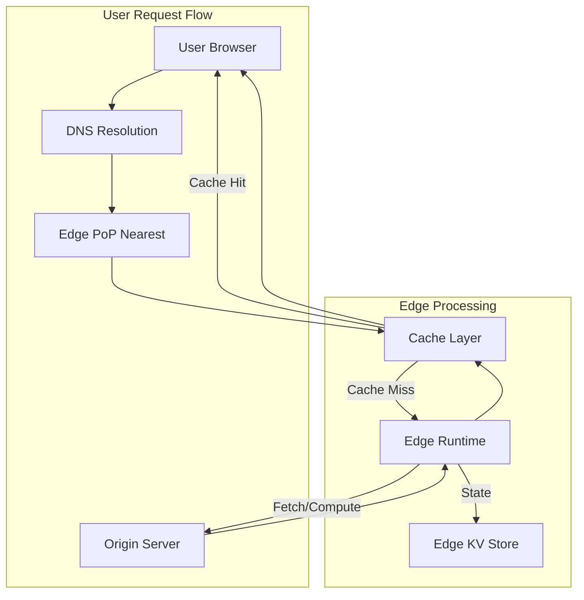

# Edge Computing & CDN Deep Dive

> **Mục tiêu:** Hiểu sâu kiến trúc, cơ chế hoạt động, và trade-off của các nền tảng Edge Computing hiện đại - Cloudflare Workers, Fastly Compute@Edge, và AWS Lambda@Edge.

---

## 1. Mục tiêu của Task

Task này tập trung vào việc phân tích sâu các nền tảng Edge Computing hiện đại, bao gồm:
- Kiến trúc runtime và cách các platform thực thi code tại edge
- Chiến lược caching và request routing
- Real-time personalization patterns
- Trade-off giữa các platform và khi nào nên chọn platform nào

---

## 2. Bản chất và Cơ chế Hoạt động

### 2.1 Edge Computing là gì? Tại sao cần?

**Bản chất vấn đề:**
- Khoảng cách vật lý gây ra latency (tốc độ ánh sáng: ~300km/ms trong fiber)
- Một request từ Hà Nội đến server ở Singapore (~2300km) mất tối thiểu 15-20ms one-way
- Với 3-way TCP handshake + TLS handshake, chưa xử lý gì đã mất 100-200ms

**Giải pháp Edge Computing:**
- Đưa logic xử lý đến gần ngưởi dùng nhất (PoP - Point of Presence)
- CDN có hàng trăm PoP toàn cầu, giảm latency xuống <50ms

```
Traditional: User → DNS → Origin Server (hundreds of ms)
Edge:        User → Edge PoP (local) → Origin (if needed)
                      ↓
                   Process locally
```

### 2.2 Kiến trúc Tổng quan



---

## 3. Cloudflare Workers Deep Dive

### 3.1 Kiến trúc Runtime

**V8 Isolates Architecture:**
- Không dùng container hay VM truyền thống
- Mỗi Worker chạy trong một **V8 Isolate** - lightweight context
- Isolates share engine nhưng không share memory

```
┌─────────────────────────────────────────┐
│         Cloudflare Edge Node            │
│  ┌─────────────────────────────────┐   │
│  │         V8 Engine               │   │
│  │  ┌──────┐ ┌──────┐ ┌──────┐   │   │
│  │  │Iso#1 │ │Iso#2 │ │Iso#3 │   │   │
│  │  │Worker│ │Worker│ │Worker│   │   │
│  │  └──┬───┘ └──┬───┘ └──┬───┘   │   │
│  │     │        │        │       │   │
│  │     └────────┴────────┘       │   │
│  │      Shared V8 Runtime         │   │
│  └─────────────────────────────────┘   │
│              ↓                         │
│    CPU/Memory Resources                │
└─────────────────────────────────────────┘
```

**Ưu điểm của V8 Isolates:**
| Metric | Container | VM | V8 Isolate |
|--------|-----------|-----|------------|
| Startup time | 100-500ms | seconds | <1ms |
| Memory overhead | 10-100MB | 100MB+ | ~1-5MB |
| Density | 100s/node | 10s/node | 1000s/node |
| Context switch | ms | ms | μs |

### 3.2 Request Lifecycle

```
1. DNS Resolution (Anycast: 1.1.1.1)
         ↓
2. Router chọn nearest PoP (275+ cities)
         ↓
3. TLS termination tại edge
         ↓
4. Cache check
         ↓
5. Worker invocation (if not cached)
   - Spawn/Resume Isolate (<1ms)
   - Execute JavaScript/WASM
   - Cold start: <1ms (yes, really!)
         ↓
6. Subrequest đến origin (nếu cần)
         ↓
7. Response caching và trả về
```

### 3.3 Request Context và Limitations

**Giới hạn quan trọng:**
```javascript
// Worker runs in a restricted environment
export default {
  async fetch(request, env, ctx) {
    // NO access to:
    // - Node.js modules
    // - File system
    // - Native sockets directly
    // - setTimeout/setInterval (use ctx.waitUntil)
    
    // HAS access to:
    // - Fetch API
    // - WebCrypto
    // - WebSockets
    // - Cache API
    
    return new Response('Hello from Edge');
  }
}
```

**CPU Time Limit:**
- Free plan: 10ms CPU time per request
- Paid plan: 50ms CPU time (can burst đến 1000ms)
- **Lưu ý:** Đây là CPU time, không phải wall clock time
- I/O (fetch, KV get) không tính vào CPU time limit

### 3.4 Storage Options tại Edge

| Service | Consistency | Latency | Use Case |
|---------|-------------|---------|----------|
| Workers KV | Eventual | <50ms global | Config, flags, non-critical data |
| Durable Objects | Strong | <50ms regional | State coordination, multiplayer |
| R2 (Object Storage) | Strong | ~100ms | Files, images, static assets |
| D1 (SQLite) | Strong | ~50ms | Structured data, queries |
| Cache API | N/A | <1ms | HTTP response caching |

**Trade-off quan trọng:**
> Workers KV eventual consistency: Writes từ Singapore có thể mất 10-60s để propagate đến London. Không dùng cho counters, session data, hay bất kỳ thứ gì cần read-after-write consistency.

---

## 4. Fastly Compute@Edge Deep Dive

### 4.1 Kiến trúc WebAssembly Runtime

**Khác biệt cốt lõi so với Cloudflare:**
- Fastly dùng **WebAssembly (WASM)** runtime thay vì V8 Isolates
- Hỗ trợ nhiều ngôn ngữ: Rust, Go, JavaScript (compiled to WASM)
- Không có garbage collector trong runtime chính

```
┌─────────────────────────────────────────┐
│         Fastly Edge Node                │
│  ┌─────────────────────────────────┐   │
│  │    WebAssembly Runtime          │   │
│  │  ┌──────┐ ┌──────┐ ┌──────┐   │   │
│  │  │WASM#1│ │WASM#2│ │WASM#3│   │   │
│  │  │Rust  │ │Go    │ │JS    │   │   │
│  │  └──────┘ └──────┘ └──────┘   │   │
│  │                                 │   │
│  │  Capabilities-based security    │   │
│  └─────────────────────────────────┘   │
└─────────────────────────────────────────┘
```

### 4.2 Request Lifecycle và Execution Model

**Startup Flow:**
```
1. Request đến edge
2. VCL (Varnish Config Language) routing
3. Chọn Compute service
4. WASM module initialization
5. Handler invocation
6. Streaming response (không buffer toàn bộ)
```

**Streaming-first Architecture:**
```rust
// Fastly Compute@Edge - Rust example
use fastly::http::{Request, Response, StatusCode};
use fastly::{Body, Error};

#[fastly::main]
fn main(mut req: Request<Body>) -> Result<Response<Body>, Error> {
    // Request body stream - không load toàn bộ vào memory
    // Response body stream - gửi dần cho client
    
    let backend_resp = req.send("backend")?;
    
    // Transform streaming response
    Ok(Response::builder()
        .status(backend_resp.status())
        .body(backend_resp.into_body())
        .unwrap())
}
```

**Quan trọng:** Fastly hỗ trợ streaming transforms - có thể xử lý files GB mà không cần GB memory.

### 4.3 Giới hạn và Đặc điểm

| Resource | Limit |
|----------|-------|
| Memory | ~128MB per instance |
| Startup time | ~50μs |
| Request timeout | 60s (wall clock) |
| Body size | 16KB request, streaming response |
| Subrequests | 256 per request |

**Capability-based Security:**
```
WASM module chỉ có quyền:
- HTTP request/response
- Cache read/write
- Backend fetch
- Secret store access

Không có:
- Random access
- System time (monotonic only)
- Network sockets trực tiếp
```

---

## 5. AWS Lambda@Edge Deep Dive

### 5.1 Kiến trúc và Cách thức Hoạt động

**Khác biệt cốt lõi:**
- Lambda@Edge dựa trên **containerized runtime** (not V8/WASM)
- Chạy trên AWS CloudFront edge locations (400+)
- Hỗ trợ Node.js và Python

```
┌─────────────────────────────────────────┐
│      CloudFront Edge Location           │
│  ┌─────────────────────────────────┐   │
│  │    Lambda Runtime Container     │   │
│  │  ┌─────────────────────────┐   │   │
│  │  │  Node.js/Python Runtime │   │   │
│  │  │  - Function code        │   │   │
│  │  │  - AWS SDK              │   │   │
│  │  │  - Container runtime    │   │   │
│  │  └─────────────────────────┘   │   │
│  └─────────────────────────────────┘   │
│              ↓                         │
│    Cold start: 100-1000ms              │
└─────────────────────────────────────────┘
```

### 5.2 Triggers và Use Cases

| Trigger | Timing | Use Case |
|---------|--------|----------|
| Viewer Request | Sau DNS, trước cache | Auth, URL rewrite, bot detect |
| Origin Request | Cache miss, trước origin | Dynamic origin selection, request signing |
| Origin Response | Sau origin, trước cache | Response modification, header injection |
| Viewer Response | Trước trả về client | Cookie manipulation, security headers |

### 5.3 Cold Start Problem

**Vấn đề nghiêm trọng:**
```
Lambda@Edge Cold Start Timeline:
- Container provisioning: 50-200ms
- Runtime initialization: 50-100ms  
- Function initialization: 50-500ms
- Total: 150-800ms (hoặc hơn nếu VPC)
```

**So sánh Cold Start:**
| Platform | Cold Start | Warm Request |
|----------|------------|--------------|
| Cloudflare Workers | <1ms | <1ms |
| Fastly Compute | <0.1ms | <0.1ms |
| Lambda@Edge | 150-800ms | 1-10ms |

> **Kết luận:** Lambda@Edge không phù hợp cho use cases yêu cầu latency cực thấp (<100ms total).

### 5.4 Giới hạn và Constraints

| Resource | Limit |
|----------|-------|
| Memory | 128MB - 10GB |
| Timeout | 5s (viewer triggers), 30s (origin triggers) |
| Package size | 50MB zipped, 250MB unzipped |
| Concurrent executions | 1000 per region (soft limit) |
| Environment variables | 4KB |

---

## 6. So sánh Chi tiết các Platform

### 6.1 Feature Comparison

| Feature | Cloudflare Workers | Fastly Compute@Edge | AWS Lambda@Edge |
|---------|-------------------|---------------------|-----------------|
| **Runtime Model** | V8 Isolates | WebAssembly | Container |
| **Languages** | JS, TS, Rust, WASM | Rust, Go, JS (WASM) | Node.js, Python |
| **Cold Start** | <1ms | <0.1ms | 150-800ms |
| **CPU Limit** | 50-1000ms | None explicit | 5-30s |
| **Memory** | ~128MB | ~128MB | 128MB-10GB |
| **Global PoPs** | 275+ | 100+ | 400+ |
| **Pricing Model** | Requests + CPU time | Requests + Bandwidth | Requests + Duration |
| **Free Tier** | 100K requests/day | Không có | 1M requests/tháng |

### 6.2 When to Use What?

**Chọn Cloudflare Workers khi:**
- Cần latency cực thấp (<50ms)
- Global distribution là ưu tiên
- Budget hạn chế (free tier generous)
- Không cần heavy computation
- Team quen JavaScript/TypeScript

**Chọn Fastly Compute@Edge khi:**
- Cần streaming transforms
- Xử lý large payloads (GB)
- Ưu tiên memory safety (Rust)
- Cần strict determinism
- Có budget cho enterprise

**Chọn Lambda@Edge khi:**
- Đã dùng AWS ecosystem
- Cần runtime quen thuộc (Node/Python)
- Cold start acceptable
- Cần nhiều memory (>128MB)
- Cần integration với AWS services

---

## 7. Edge Caching Strategies

### 7.1 Cache Key Design

```
Cache Key = Host + URL Path + Query String + Vary Headers

# Ví dụ tốt:
GET /api/products/123?format=json
Cache-Key: example.com/api/products/123?format=json

# Ví dụ xấu (cache fragmentation):
GET /api/products?user_id=123&session=abc&timestamp=123456
Cache-Key: ... (hàng triệu unique keys, cache miss liên tục)
```

### 7.2 Cache Invalidation Patterns

| Pattern | Pros | Cons | Use Case |
|---------|------|------|----------|
| TTL-based | Simple, predictable | Stale data | Static assets |
| Active invalidation | Immediate consistency | Complex | Product catalogs |
| Versioned URLs | Immutable, cacheable | URL complexity | Releases |
| Stale-while-revalidate | Freshness + speed | Slight staleness | News, dashboards |

### 7.3 Cache Hierarchy

```
┌─────────────────────────────────────┐
│         Browser Cache               │  ← Private, fastest
│    (Cache-Control: private)         │
├─────────────────────────────────────┤
│         CDN Edge Cache              │  ← Shared, regional
│    (Cache-Control: public)          │
├─────────────────────────────────────┤
│         Origin Cache                │  ← Application level
│    (Redis/Memcached)                │
├─────────────────────────────────────┤
│         Database                    │  ← Source of truth
└─────────────────────────────────────┘
```

---

## 8. Real-time Personalization Patterns

### 8.1 Cookie-based Personalization

```javascript
// Cloudflare Workers example
export default {
  async fetch(request, env) {
    const cookie = request.headers.get('Cookie');
    const userPref = parseCookie(cookie, 'user_pref');
    
    // Vary cache key based on user preference
    const cacheKey = new Request(request.url + '?pref=' + userPref, request);
    
    const cache = caches.default;
    let response = await cache.match(cacheKey);
    
    if (!response) {
      response = await fetch(request);
      // Cache với key riêng cho từng preference
      ctx.waitUntil(cache.put(cacheKey, response.clone()));
    }
    
    return response;
  }
}
```

**Trade-off:** Cache fragmentation vs Personalization
- Mỗi unique cookie = 1 cache entry
- Too many variants = cache hit rate giảm

### 8.2 Edge-side Includes (ESI) Pattern

```html
<!-- Page có thể cache ở edge -->
<html>
  <head><!-- shared --></head>
  <body>
    <!-- Cache hit -->
    <esi:include src="/api/user/profile" />
    <!-- Cache hit -->
    <esi:include src="/api/recommendations" />
  </body>
</html>
```

**Lợi ích:**
- Static shell cached tại edge
- Dynamic fragments fetched riêng
- Reduced TTFB (Time To First Byte)

### 8.3 JWT Validation tại Edge

```javascript
// Validate JWT before reaching origin
async function verifyJWT(request, env) {
  const token = request.headers.get('Authorization')?.replace('Bearer ', '');
  
  try {
    // Verify tại edge, không cần round-trip đến auth server
    const payload = await jwtVerify(token, env.JWT_PUBLIC_KEY);
    
    // Inject user info vào headers cho origin
    const modifiedRequest = new Request(request, {
      headers: {
        ...request.headers,
        'X-User-Id': payload.sub,
        'X-User-Role': payload.role
      }
    });
    
    return modifiedRequest;
  } catch (e) {
    return new Response('Unauthorized', { status: 401 });
  }
}
```

**Lợi ích:**
- Chặn unauthorized requests sớm
- Giảm load trên auth service
- Origin không cần xử lý JWT verification

---

## 9. Rủi ro, Anti-patterns, và Lỗi thường gặp

### 9.1 Anti-patterns nghiêm trọng

**1. Treating Edge like Origin**
```javascript
// ❌ SAI: Làm mọi thứ ở edge
export default {
  async fetch(request) {
    // Heavy computation
    const result = await heavyMLModel(request);
    // Database queries
    const data = await sql.query('SELECT * FROM large_table');
    // File processing
    const processed = await processLargeFile(request);
    return new Response(processed);
  }
}

// ✅ ĐÚNG: Edge làm việc nhẹ
export default {
  async fetch(request) {
    // Auth check
    // Cache lookup
    // Route selection
    // Light transformation
    return fetch(selectedOrigin, modifiedRequest);
  }
}
```

**2. State Mismanagement**
```javascript
// ❌ SAI: Giữ state trong isolate
let counter = 0; // Shared between requests!

export default {
  async fetch(request) {
    counter++; // Race condition!
    return new Response(String(counter));
  }
}

// ✅ ĐÚNG: Stateless hoặc external storage
export default {
  async fetch(request, env) {
    const counter = await env.COUNTER_KV.get('counter');
    const newValue = parseInt(counter) + 1;
    await env.COUNTER_KV.put('counter', newValue);
    return new Response(String(newValue));
  }
}
```

**3. Ignoring Consistency**
```javascript
// ❌ SAI: Read-after-write
export default {
  async fetch(request, env) {
    await env.KV.put('config', newValue);
    const config = await env.KV.get('config'); // Có thể là old value!
    return new Response(config);
  }
}

// ✅ ĐÚNG: Cache locally hoặc dùng Durable Objects
export default {
  async fetch(request, env, ctx) {
    // Lưu vào local cache của request
    ctx.config = newValue;
    await env.KV.put('config', newValue);
    return new Response(newValue);
  }
}
```

### 9.2 Failure Modes

| Failure | Cause | Mitigation |
|---------|-------|------------|
| CPU timeout | Infinite loop, heavy compute | Add timeouts, monitor CPU usage |
| Memory exhaustion | Large payloads, memory leaks | Stream processing, limits |
| KV consistency issues | Read-after-write | Durable Objects, local caching |
| Cold start latency | Lambda@Edge | Provisioned concurrency (không có ở edge) |
| Cache stampede | Thundering herd | Stale-while-revalidate, request coalescing |

### 9.3 Production Concerns

**Observability:**
- Workers: Workers Analytics + Custom logging
- Fastly: Real-time logs (Syslog/Splunk/Datadog)
- Lambda: CloudWatch Logs + X-Ray

**Testing:**
- wrangler dev (local simulation)
- Fastly VCL/Compute sandbox
- Lambda@Edge không có local testing tốt

**Deployment:**
- Gradual rollout (traffic splitting)
- Version rollback
- Blue-green deployments

---

## 10. Khuyến nghị Thực chiến Production

### 10.1 Architecture Patterns

**Pattern 1: Edge-First Architecture**
```
┌─────────────┐
│    User     │
└──────┬──────┘
       ↓
┌─────────────┐  Cache hit → Trả về ngay
│  Edge CDN   │  Cache miss → Edge processing
│  + Compute  │  Auth check, routing, transforms
└──────┬──────┘
       ↓
┌─────────────┐
│   Origin    │  Chỉ nhận validated requests
│  (Shielded) │  Heavy processing, database
└─────────────┘
```

**Pattern 2: Multi-Tier Caching**
```
Edge Cache (1-50ms)
    ↓ Miss
Regional Cache (Redis - 5-20ms)
    ↓ Miss
Origin Cache (Local - 1-5ms)
    ↓ Miss
Database (<100ms)
```

### 10.2 Decision Framework

```
Start: Cần edge computing?
  │
  ├─ Latency > 100ms acceptable? → Stay at origin
  │
  └─ Latency < 100ms required?
       │
       ├─ Cold start 150ms+ acceptable? → Lambda@Edge
       │
       └─ Need <50ms response?
            │
            ├─ Need streaming/large files? → Fastly
            │
            └─ General purpose, budget-conscious? → Cloudflare
```

### 10.3 Performance Checklist

- [ ] Cache hit rate > 90% ở edge
- [ ] P99 latency < 100ms
- [ ] Cold start impact measured
- [ ] Error handling tại edge (fallback to origin)
- [ ] Circuit breaker pattern cho subrequests
- [ ] Rate limiting để tránh abuse
- [ ] Security headers injection tại edge
- [ ] Cost monitoring (surprise bills!)

---

## 11. Kết luận

**Bản chất Edge Computing:**
- Không phải thay thế origin, mà là **extension của origin** gần user hơn
- Trade-off chính: **Latency vs Complexity vs Cost**
- Stateless là bắt buộc (hoặc externalize state)

**Chọn platform dựa trên:**
1. **Latency requirements** → Quyết định cold start budget
2. **Team expertise** → Rust (Fastly) vs JS (Cloudflare) vs Node (Lambda)
3. **Existing ecosystem** → AWS shop thì Lambda@Edge có lợi thế integration
4. **Budget** → Cloudflare có free tier tốt nhất

**Trade-off quan trọng nhất:**
> Workers/Fastly cho latency cực thấp nhưng giới hạn compute. Lambda@Edge cho compute linh hoạt nhưng chấp nhận cold start. Không có silver bullet.

**Rủi ro lớn nhất:**
> Distributed state management. Eventual consistency của edge storage dễ gây bug khó debug. Dùng Durable Objects (Cloudflare) hoặc external database nếu cần strong consistency.

---

*Document này tập trung vào chiều sâu kiến trúc và trade-off. Code chỉ dùng để minh họa cơ chế, không phải production-ready templates.*
