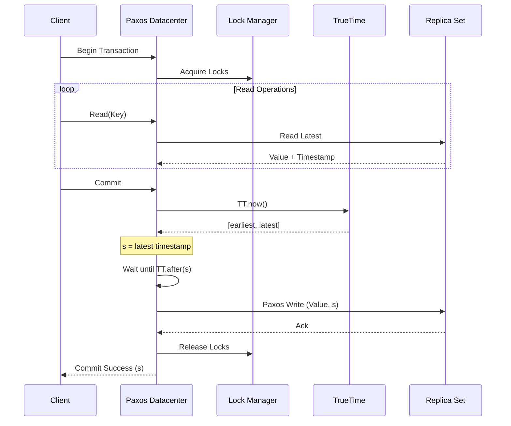
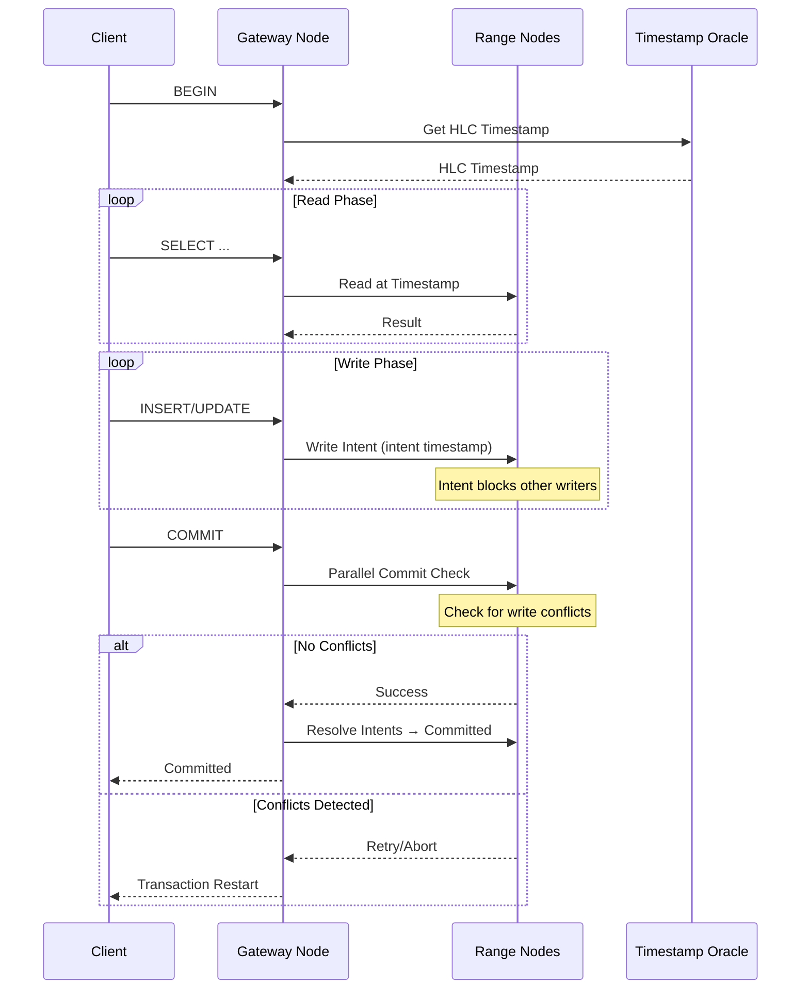

# Global Database Systems: Spanner, CockroachDB, YugabyteDB

> Nghiên cứu về hệ quản trị cơ sở dữ liệu phân tán toàn cầu, đồng hồ vật lý, và trade-off giữa consistency-availability trong môi trường multi-region.

---

## 1. Mục tiêu của Task

Hiểu sâu cơ chế đảm bảo **external consistency** (tương đương linearizability) trong hệ thống database phân tán toàn cầu, khi mà các node nằm ở các region khác nhau với độ trễ mạng đáng kể. Phân tích các giải pháp:

- **Google Spanner**: Sử dụng TrueTime API và đồng hồ vật lý để đạt linearizability
- **CockroachDB**: Hybrid logical/physical clock, serializable default
- **YugabyteDB**: Raft-based distribution với tablet sharding

---

## 2. Bản chất và Cơ chế Hoạt động

### 2.1 Vấn đề cốt lõi: Ordering Events trong Distributed Systems

Trong single-node database, ordering đơn giản: timestamp local đủ để xác định thứ tự. Trong distributed system, **clock skew** (độ lệch đồng hồ) giữa các node trở thành vấn đề nghiêm trọng:

```
Node A (clock: 10:00:00.100) ──write X=1──┐
                                          ├─ Network latency
Node B (clock: 10:00:00.050) ──read X────┘
```

Nếu B đọc sau A write nhưng clock B chậm hơn, B có thể không thấy dữ liệu mới → **violation of external consistency**.

> **External Consistency**: Nếu transaction T1 commit trước T2 bắt đầu, thì timestamp của T1 phải nhỏ hơn T2. Đảm bảo thứ tự commit khớp với thứ tự thực tế.

### 2.2 Google Spanner: TrueTime API

Spanner giải quyết vấn đề bằng cách **từ bỏ ý tưởng đồng hồ hoàn hảo** và chấp nhận **uncertainty interval**.

#### TrueTime API Design

```
TT.now() → TTinterval: [earliest, latest]

TT.after(t) → bool:  true if t < latest time
TT.before(t) → bool: true if t > earliest time
```

Mỗi timestamp trả về là một **khoảng** chứ không phải một điểm. Khoảng này đại diện cho độ không chắc chắn của đồng hồ.

#### Cơ chế đồng bộ đồng hồ

Spanner sử dụng **GPS và Atomic Clocks**:
- Mỗi datacenter có reference time servers
- GPS cung cấp thứ gian UTC với độ chính xác cao
- Atomic clocks dự phòng khi GPS fail
- **Marzullo's algorithm** để detect và loại bỏ faulty time sources

| Thành phần | Mục đích |
|------------|----------|
| GPS receivers | Cung cấp thứ gian toàn cầu, độ chính xác ~100ns |
| Atomic clocks | Duy trì thứ gian khi GPS unavailable |
| Time master election | Mỗi datacenter chọn leader, cross-check giữa các datacenter |
| Daemon per machine | Liên tục poll time masters, áp dụng **slew** thay vì jump |

#### Đảm bảo External Consistency với Commit Wait

```
Commit(T):
  1. s = TT.now().latest  // Lấy upper bound timestamp
  2. Wait until TT.after(s)  // Chờ uncertainty interval trôi qua
  3. Commit với timestamp s
```

**Bản chất**: Bằng cách chờ đến khi chắc chắn rằng "thứ gian thực" đã vượt qua `s`, Spanner đảm bảo rằng mọi node khác sẽ nhìn thấy commit này với timestamp lớn hơn bất kỳ transaction nào commit trước đó.

> **Chi phí**: Commit wait thường kéo dài ~7ms (do uncertainty interval). Đây là trade-off của external consistency.

### 2.3 CockroachDB: Hybrid Logical Clock (HLC)

CockroachDB không phụ thuộc vào specialized hardware như Spanner. Thay vào đó, nó sử dụng **Hybrid Logical Clock**.

#### HLC Structure

```
HLC = (PhysicalTimestamp, LogicalCounter)

Ví dụ: (1704067200000, 42)
        │                  │
        │                  └── Số lượng events trong cùng physical timestamp
        └── Milliseconds since epoch từ local clock
```

#### Cơ chế hoạt động

**Khi nhận message từ node khác:**

```
Receive(event, remoteHLC):
  localPhysical = getPhysicalTime()
  
  // Lấy max của physical time local và remote
  newPhysical = max(localPhysical, remoteHLC.physical)
  
  if newPhysical == localPhysical:
    // Local time đủ lớn, reset counter
    localHLC = (newPhysical, 0)
  else if newPhysical == remoteHLC.physical:
    // Phải dùng remote physical, tăng logical
    localHLC = (newPhysical, max(localCounter, remoteHLC.logical) + 1)
```

#### Serializable Default

CockroachDB sử dụng **serializable snapshot isolation (SSI)**:

- Mỗi transaction đọc tại một **timestamp** (snapshot)
- Ghi conflict detection: Nếu transaction ghi vào row đã được modify sau snapshot timestamp, transaction bị abort
- **Write intents**: Uncommitted writes để lại "intent" với timestamp, các transaction khác phải wait hoặc resolve

| Đặc điểm | CockroachDB | Spanner |
|----------|-------------|---------|
| Clock dependency | HLC, không cần hardware đặc biệt | TrueTime, cần GPS/atomic clocks |
| Default isolation | Serializable | External consistency (linearizable) |
| Commit latency | Không có commit wait | Có commit wait (~7ms) |
| Cost | Chạy trên commodity hardware | Cần infrastructure đặc biệt |
| Read latency | Có thể read từ follower với timestamp | Read anywhere, TrueTime đảm bảo order |

### 2.4 YugabyteDB: Raft + Tablet Sharding

YugabyteDB kết hợp architecture từ Spanner và CockroachDB với một số khác biệt.

#### Kiến trúc tổng quan

```
┌─────────────────────────────────────────────┐
│         YugabyteDB Universe                 │
│  ┌─────────┐  ┌─────────┐  ┌─────────┐     │
│  │ Master  │  │ Master  │  │ Master  │     │
│  │ (RAFT)  │  │ (RAFT)  │  │ (RAFT)  │     │
│  └─────────┘  └─────────┘  └─────────┘     │
├─────────────────────────────────────────────┤
│  ┌─────────┐  ┌─────────┐  ┌─────────┐     │
│  │Tablet-1 │  │Tablet-2 │  │Tablet-3 │ ... │
│  │(Leader) │  │(Follower│  │(Leader) │     │
│  └─────────┘  └─────────┘  └─────────┘     │
└─────────────────────────────────────────────┘
```

#### Tablet và Raft Groups

- Data được partition thành **tablets** (tương tự shards)
- Mỗi tablet là một **Raft group** (thường 5 nodes)
- Leader election trong mỗi Raft group đảm bảo strong consistency

#### DocDB Storage Layer

YugabyteDB sử dụng RocksDB làm storage engine với extension:

```
Key structure: (HashComponent, RangeComponents, DocKey, SubKey, Timestamp)

Ví dụ:
  User table với PRIMARY KEY (country_code, user_id)
  Row: ('US', 12345, 'John', 30)
  
  Internal keys:
  - ('US', 12345, 'name', T1) → 'John'
  - ('US', 12345, 'age', T1) → 30
```

**MVCC trong DocDB**: Mỗi write tạo một version mới với timestamp. Reads specify timestamp để đọc consistent snapshot.

---

## 3. Kiến trúc và Luồng xử lý

### 3.1 Spanner: Read-Write Transaction Flow



### 3.2 CockroachDB: Distributed Transaction



---

## 4. So sánh Các Lựa chọn

### 4.1 Consistency Models

| Hệ thống | Default Isolation | Consistency Guarantee | Clock Mechanism |
|----------|-------------------|----------------------|-----------------|
| **Spanner** | External Consistency | Linearizable, strict serializability | TrueTime (GPS + Atomic) |
| **CockroachDB** | Serializable | Serializable snapshot isolation | Hybrid Logical Clock |
| **YugabyteDB** | Snapshot Isolation | Configurable (Raft = strong) | Hybrid Logical Clock |
| **TiDB** | Snapshot Isolation | SI with async commit | TSO (Timestamp Oracle) |

### 4.2 Trade-off Matrix

```
                    Latency
                       ▲
                       │
         Spanner       │       DynamoDB
    (External Cons)    │    (Eventual Cons)
                       │
    ◄──────────────────┼──────────────────►
    Strong Consistency │     Availability
                       │
         CockroachDB   │       Cassandra
         (Serializable)│    (Tunable Cons)
                       │
                       ▼
                   Complexity
```

### 4.3 Khi nào dùng cái nào

| Use Case | Khuyến nghị | Lý do |
|----------|-------------|-------|
| Financial transactions, banking | Spanner hoặc CockroachDB | Serializable là bắt buộc |
| Global inventory, reservations | CockroachDB hoặc YugabyteDB | Serializable, cost-effective |
| Analytics, time-series | YugabyteDB | Good at range scans |
| Write-heavy, eventual OK | Cassandra, DynamoDB | Better throughput |
| Multi-region, low-latency reads | Spanner | Read from nearest replica |
| Kubernetes-native deployment | CockroachDB, YugabyteDB | Operator ecosystem |

---

## 5. Rủi ro, Anti-patterns, Lỗi thường gặp

### 5.1 Clock Synchronization Failures

**Vấn đề với Spanner**:
- Nếu GPS receivers fail và atomic clocks drift quá xa, TrueTime interval mở rộng
- Commit wait time tăng lên đáng kể, ảnh hưởng latency
- **Mitigation**: Dự phòng nhiều time source, monitoring drift

**Vấn đề với HLC (CockroachDB, YugabyteDB)**:
- Nếu clock skew quá lớn (> max_offset, thường 500ms), node bị kill
- **Anti-pattern**: Không sync NTP đúng cách, VM migration gây clock jump
- **Best practice**: Sử dụng **chrony** thay vì ntpd, enable **panic threshold**

### 5.2 Hot Sharding / Hot Tablets

**Triệu chứng**: Một tablet/shard nhận quá nhiều traffic, trở thành bottleneck.

**Nguyên nhân**:
- Poor partition key design (VD: partition by date, ngày hiện tại = hotspot)
- Sequential IDs (AUTO_INCREMENT gây write vào cuối range)

**Giải pháp**:
- Sử dụng **hash partitioning** hoặc **composite keys**
- UUID v7 (time-ordered) thay vì UUID v4 (random) hoặc sequential ID
- **Premier keys** trong CockroachDB: `PRIMARY KEY (hash, id)`

### 5.3 Transaction Conflicts và Retries

**Serializable contention**:
- Các transaction cùng đọc/ghi một tập dữ liệu gây conflict
- Retry storm khi load cao

**Anti-patterns**:
```sql
-- BAD: Long-running transaction giữ locks
BEGIN;
SELECT * FROM orders WHERE status = 'pending';  -- Đọc nhiều
-- ... xử lý business logic lâu ...
UPDATE orders SET status = 'processed';  -- Giữ locks quá lâu
COMMIT;
```

**Best practices**:
- Giữ transaction ngắn nhất có thể
- Sử dụng **follower reads** cho read-only queries
- **Batch operations** thay vì nhiều small transactions

### 5.4 Network Partitions

**Split-brain trong multi-region**:
- Nếu partition xảy ra giữa regions, Raft groups không thể elect leader
- Write availability bị ảnh hưởng

**Mitigation**:
- **Majority quorum** placement: Đảm bảo majority nodes trong cùng region hoặc spread đủ đều
- **Witness nodes**: Nodes không lưu data nhưng vote trong election (TiDB, YugabyteDB)

---

## 6. Khuyến nghị Thực chiến trong Production

### 6.1 Deployment Topology

**Spanner (Managed)**:
- 3+ regions cho high availability
- Chọn region placement dựa trên user distribution
- **Leader placement**: Đặt leader gần write-heavy application

**CockroachDB Self-hosted**:
```
Region 1 (US-East):    3+ nodes, majority of ranges
Region 2 (US-West):    3+ nodes, follower replicas  
Region 3 (EU-West):    3+ nodes, follower replicas

Diversity requirements:
- Rack diversity trong cùng datacenter
- Region diversity cho DR
- Disk type: SSD NVMe (bắt buộc)
```

### 6.2 Monitoring và Observability

| Metric | Ý nghĩa | Ngưỡng cảnh báo |
|--------|---------|-----------------|
| `clock_offset` | Độ lệch đồng hồ giữa nodes | > 100ms (HLC), > 10ms (TrueTime) |
| `transaction_restart_rate` | Transaction conflicts | > 5% of total |
| `range_unavailable` | Ranges không có leader | > 0 (immediate alert) |
| `follower_read_timestamp_offset` | Staleness của follower reads | > 10 seconds |
| `raft_process_command_duration` | Commit latency | P99 > 100ms |

### 6.3 Connection Pooling

```
Application → PgBouncer/CrdbProxy → Database Nodes

Pool sizing formula:
connections = (core_count * 2) + effective_spindle_count

Với cloud (SSD): 
- CockroachDB: 2-4 connections per core per node
- YugabyteDB: Tương tự PostgreSQL best practices
```

### 6.4 Backup và DR Strategy

**Backup types**:

| Type | Spanner | CockroachDB | YugabyteDB |
|------|---------|-------------|------------|
| Full | Automated, incremental | `BACKUP` command | `yb_backup` |
| Incremental | Built-in | CDC + backup chain | xCluster replication |
| Point-in-time | 7-365 days config | PITR (enterprise) | Snapshots |
| Cross-region | Automatic replication | Backup to S3/GCS | xCluster DR |

---

## 7. Kết luận

### Bản chất đã làm rõ

1. **Distributed databases không thể có đồng hồ hoàn hảo**. Spanner chấp nhận điều này và đo uncertainty interval; CockroachDB dùng HLC để avoid hardware dependency.

2. **Linearizability có giá của nó**. Spanner's commit wait (~7ms) là chi phí để đảm bảo external consistency. CockroachDB chấp nhận Serializable SI là default, ít strict hơn nhưng không cần specialized hardware.

3. **Raft là nền tảng của consistency**. Cả CockroachDB và YugabyteDB đều dùng Raft cho strong consistency trong từng shard. Spanner dùng Paxos (tương tự Raft).

### Trade-off quan trọng nhất

```
Strong Consistency (Spanner-style)
    ↓
Latency penalty + Infrastructure cost
    ↓
Phù hợp: Financial systems, inventory

vs

Serializable SI (CockroachDB-style)  
    ↓
Lower latency + Commodity hardware
    ↓
Phù hợp: General OLTP, SaaS applications
```

### Rủi ro lớn nhất trong production

- **Clock skew không được kiểm soát** → Transaction anomalies, node crashes
- **Hotspot trong sharding** → Performance degradation unpredictable
- **Transaction contention** → Retry loops, effectively downtime
- **Multi-region network partition** → Write unavailability

### Tư duy khi thiết kế

> Đừng chọn database vì "strongest consistency". Chọn vì **use case cần gì**, sau đó chấp nhận trade-off đi kèm. CockroachDB là sweet spot cho hầu hết enterprise applications: Serializable default, không cần Spanner-level infrastructure, chạy tốt trên Kubernetes.
