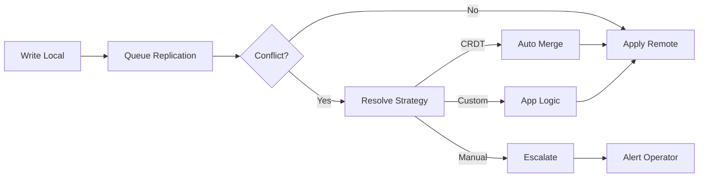

# Active-Active Multi-Region Design

## 1. Mục tiêu của Task

Hiểu sâu kiến trúc **Active-Active Multi-Region** - mô hình triển khai hệ thống phân tán đồng thởi hoạt động ở nhiều region khác nhau, trong đó mọi region đều có khả năng xử lý read và write. Phân tích cơ chế đồng bộ dữ liệu, xử lý xung đột, và trade-off giữa consistency, availability và latency trong môi trường WAN.

---

## 2. Bản Chất và Cơ Chế Hoạt Động

### 2.1 Active-Active vs Active-Passive

| Aspect | Active-Passive | Active-Active |
|--------|----------------|---------------|
| **Write capability** | Chỉ primary region | Tất cả regions |
| **Failover time** | Cần promotion (seconds-minutes) | Instant (zero RTO) |
| **Latency** | Cross-region cho write | Local read/write |
| **Complexity** | Thấp | Cao |
| **Data consistency** | Đơn giản (single writer) | Phức tạp (conflict resolution) |

> **Bản chất:** Active-Active không chỉ là "nhiều region cùng chạy" mà là **bài toán consensus trong môi trường network partition thường trực**.

### 2.2 Cơ Chế Đồng Bộ Dữ Liệu

#### 2.2.1 Synchronous Replication

```
Client → Region A → Ack (success)
              ↓
         Sync Write
              ↓
         Region B → Ack back to A
```

- **Trade-off:** Strong consistency nhưng latency = RTT giữa regions (thường 50-200ms)
- **Use case:** Financial transactions yêu cầu ACID cross-region
- **Risk:** Network partition → system unavailable (CAP theorem)

#### 2.2.2 Asynchronous Replication (Eventual Consistency)

```
Client → Region A → Ack immediately
              ↓ (async, background)
         Region B (lag: 100ms - 10s)
```

- **Trade-off:** Low latency nhưng temporary inconsistency
- **Use case:** Social media, analytics, non-critical data
- **Risk:** Conflict khi cùng record bị modify ở 2 regions đồng thởi

#### 2.2.3 Hybrid: Read-Your-Write Consistency

```
Client → Write Region A → Replicate to B
              ↓
         Client read from A (guaranteed consistent)
         Client read from B (may be stale)
```

> **Pattern quan trọng:** Session affinity - route user về region đã write để đảm bảo read-your-own-write consistency.

---

## 3. Conflict Resolution Strategies

### 3.1 Last-Writer-Wins (LWW)

```
Region A: Update X=5 (timestamp: T1)
Region B: Update X=10 (timestamp: T2 > T1)
Result: X=10 (B wins)
```

- **Vấn đề:** Clock skew - nếu B có clock nhanh hơn A, A sẽ never win
- **Mitigation:** Logical clocks hoặc vector clocks
- **Data loss:** Có thể silent (update của A mất)

### 3.2 Vector Clocks

Mỗi node maintain một vector `[A:1, B:2, C:0]` đại diện cho sự kiện đã thấy từ mỗi node.

```
A: [1,0,0] → [2,0,0] (write X=5)
B: [0,1,0] → [0,2,0] (write X=10, chưa thấy A)

Conflict detection: [2,0,0] và [0,2,0] không thể so sánh
→ Cần conflict resolution
```

- **Ưu điểm:** Detect được concurrent updates
- **Nhược điểm:** Vector size grow với số nodes; stale entries cần garbage collection

### 3.3 Conflict-Free Replicated Data Types (CRDTs)

**Bản chất:** Data structures thiết kế để merge tự động không cần coordination.

#### 3.3.1 State-Based CRDTs (Convergent)

Sử dụng **join-semilattice** - mỗi update làm state "grow" theo partial order.

```
G-Counter (Grow-only Counter):
- Mỗi node có vector local counts
- Merge: element-wise max
- Query: sum of all elements

Node A: [5,0,0]
Node B: [0,3,0]
Merge: [5,3,0] → Total: 8
```

#### 3.3.2 Operation-Based CRDTs (Commutative)

Operations được thiết kế để **commutative** - order không quan trọng.

```
OR-Set (Observed-Remove Set):
- Add(a) và Remove(a) đều assign unique tags
- Remove chỉ xóa elements mà node đã "observe"
- Concurrent add/remove: add wins (tags khác nhau)
```

> **Trade-off CRDTs:** 
> - State-based: Cần transmit full state, tốn bandwidth
> - Op-based: Cần reliable broadcast, delivery order không quan trọng nhưng phải đảm bảo exactly-once

### 3.4 Application-Level Conflict Resolution

Khi automatic merge không thể:

```java
// Business logic quyết định
def resolveConflict(versionA: Cart, versionB: Cart): Cart = {
    // Strategy: Merge items, keep max quantity
    val mergedItems = (versionA.items ++ versionB.items)
        .groupBy(_.productId)
        .map { case (id, items) => 
            Item(id, items.map(_.quantity).max)
        }
    Cart(mergedItems.toList)
}
```

---

## 4. Global Consensus trong WAN Environment

### 4.1 Vấn Đề Consensus Cross-Region

Paxos/Raft trong WAN:
- **Latency impact:** Quorum cần majority → ít nhất 1 cross-region RTT
- **Ví dụ:** 3 regions (US, EU, Asia) → quorum = 2 regions
- **RTT:** US-EU ~70ms, US-Asia ~150ms → write latency tối thiểu 70-150ms

### 4.2 Raft Modifications cho Multi-Region

#### 4.2.1 Leader Placement Strategy

```
Option 1: Single global leader
- US (leader) ← EU, Asia (followers)
- Write latency cao cho EU/Asia users
- Read có thể local (stale)

Option 2: Regional leaders + replication
- US Leader, EU Leader, Asia Leader
- Mỗi leader phụ trách partition của data
- Hotspot mitigation quan trọng
```

#### 4.2.2 Raft Log Replication Optimization

```
Raft tối ưu cho WAN:
1. Pipeline append entries (không đợi ack cho mỗi entry)
2. Batch multiple entries trong một RPC
3. Learner nodes (replica không vote, giảm quorum size)
4. Pre-vote phase để tránh term inflation
```

### 4.3 Clock Synchronization

#### 4.3.1 TrueTime (Google Spanner)

```
TrueTime API:
- TT.now() → interval [earliest, latest]
- Uncertainty bound (ε) thường < 7ms (với GPS/atomic clocks)
- Commit wait: Đợi until TT.now().latest > commit timestamp
```

> **Bản chất:** Spanner đạt External Consistency (linearizability) bằng cách đợi clock uncertainty settle.

#### 4.3.2 Hybrid Logical Clocks (HLC)

Kết hợp physical clock và Lamport logical clock:

```
HLC = (physical_time, logical_counter)

Update rules:
- Nhận message từ peer: lj = max(lj, lm)
- Local event: t = max(t, physical_now), increment counter nếu t không đổi
```

- **Ưu điểm:** Không cần specialized hardware như TrueTime
- **Capture causality:** Happens-before relationship
- **Nhược điểm:** Không đảm bảo total order như TrueTime

---

## 5. Kiến Trúc và Luồng Xử Lý

### 5.1 Multi-Master Database Pattern

```
┌─────────────┐     ┌─────────────┐     ┌─────────────┐
│  Region US  │◄───►│  Region EU  │◄───►│ Region Asia │
│  (Master)   │     │  (Master)   │     │  (Master)   │
└──────┬──────┘     └──────┬──────┘     └──────┬──────┘
       │                   │                   │
       └───────────────────┴───────────────────┘
              Conflict Resolution Layer
```

**Components:**
1. **Replication Stream:** Async log shipping (MySQL binlog, Postgres WAL)
2. **Conflict Detector:** Compare vector clocks/timestamps
3. **Resolver:** CRDT merge hoặc business logic
4. **Apply Thread:** Apply resolved changes vào local DB

### 5.2 Conflict Detection Pipeline



### 5.3 Routing và Load Balancing

```
User Request → GeoDNS/Anycast → Nearest Region
                    ↓
            ┌───────┴───────┐
            ▼               ▼
    [Read Local]      [Write Local]
            ↓               ↓
    Immediate Response  Async Replicate
```

**Routing Strategies:**
- **GeoDNS:** Route dựa trên user IP geography
- **Latency-based:** Route đến region có lowest latency
- **Capacity-based:** Route dựa trên region load
- **Data-locality:** Route đến region chứa data partition

---

## 6. Rủi Ro, Anti-Patterns và Lỗi Thường Gặp

### 6.1 Split-Brain Scenarios

```
Network partition giữa US và EU:

US Region                    EU Region
    ↓                            ↓
[Leader - A] ◄────X────► [Leader - B]  ← Both think they're primary!
    ↓                            ↓
Accepting writes         Accepting writes

Result: Divergent data, manual reconciliation needed
```

**Prevention:**
- Strict quorum requirements (fencing tokens)
- Automatic failover với witness nodes
- Split-brain detection (heartbeat timeout)

### 6.2 Conflict Storm

```
Scenario:
- Network partition kéo dài 10 phút
- Cả 2 regions đều accept writes
- Khi network recover → hàng ngàn conflicts cần resolve

Impact:
- CPU spike trên conflict resolver
- Replication lag tăng đột biến
- User thấy inconsistent data
```

**Mitigation:**
- Rate limiting write khi partition detected
- Prioritize conflict resolution (business-critical trước)
- Background reconciliation jobs

### 6.3 Clock Skew Issues

```
Region A clock: 12:00:00
Region B clock: 12:00:05 (nhanh 5s)

A writes X=1 (timestamp 12:00:00)
B writes X=2 (timestamp 12:00:04)

LWW: B wins dù A write trước!
```

**Solutions:**
- NTP sync với <10ms accuracy
- Logical timestamps (Lamport, HLC)
- Clock skew monitoring và alerting

### 6.4 Anti-Patterns

| Anti-Pattern | Tại sao nguy hiểm | Thay thế |
|--------------|-------------------|----------|
| **Timestamp-based ordering** | Clock skew → incorrect ordering | Vector clocks hoặc HLC |
| **Silent conflict resolution** | Data loss không detect được | Explicit conflict logging |
| **Synchronous cross-region writes** | Availability suffers | Async + conflict resolution |
| **Single global sequence** | Bottleneck và SPOF | Distributed IDs (Snowflake) |
| **Assuming monotonic read** | Replica lag → read old data | Read-after-write routing |

---

## 7. Production Concerns

### 7.1 Monitoring và Observability

**Metrics cần theo dõi:**

```
Replication Metrics:
- replication_lag_seconds (histogram by region pair)
- conflicts_detected_total (counter, label: resolution_type)
- conflict_resolution_duration
- replication_throughput_bytes/sec

System Health:
- cross_region_latency_ms
- clock_skew_ms (per region)
- split_brain_detected (gauge: 0/1)

Business Impact:
- stale_read_percentage
- conflict_resolution_failures
- data_divergence_score
```

### 7.2 Backward Compatibility

**Schema Evolution trong Multi-Region:**

```
Vấn đề:
- Region A deploy schema v2
- Region B vẫn ở schema v1
- Replication từ A→B fail (unknown columns)

Solution:
1. Forward-compatible writes (v1 ignore unknown fields)
2. Backward-compatible reads (v2 default values)
3. Staged rollout: standby → canary → full
4. Version negotiation trong replication protocol
```

### 7.3 Disaster Recovery

**RPO/RTO Targets:**

| Scenario | RPO | RTO | Strategy |
|----------|-----|-----|----------|
| Single region failure | 0 (sync repl) | < 1 min | Auto-failover |
| Multi-region failure | Minutes | 10-30 min | Restore từ backup |
| Data corruption | Hours | Hours | Point-in-time recovery |
| Split-brain | Depends | Manual | Reconciliation tools |

**Backup Strategies:**
- Cross-region snapshot (async, daily)
- WAL archiving tới object storage
- Incremental backups với deduplication

---

## 8. So Sánh Các Giải Pháp

### 8.1 Database Systems

| System | Replication Model | Conflict Resolution | Consistency |
|--------|-------------------|---------------------|-------------|
| **CockroachDB** | Multi-raft (per range) | Automatic (serializable) | Strong |
| **Spanner** | Paxos groups | Automatic (TrueTime) | External consistency |
| **YugabyteDB** | Raft | Automatic | Tunable |
| **Cassandra** | Async gossip | LWW or custom | Eventual |
| **MongoDB** | Async replica sets | Primary wins | Eventual |
| **MySQL Group Replication** | Consensus (Paxos) | Single primary | Strong |
| **PostgreSQL BDR** | Async logical | CRDT/App logic | Eventual |

### 8.2 When to Use What

**Chọn Strong Consistency (Spanner/CockroachDB) khi:**
- Financial transactions
- Inventory management
- User authentication state
- Không tolerate data divergence

**Chọn Eventual Consistency (Cassandra/MongoDB) khi:**
- User-generated content
- Analytics data
- Recommendations
- Tolerate temporary inconsistency

**Chọn Application-Level Resolution khi:**
- Business logic phức tạp
- CRDTs không đủ expressive
- Cần human-in-the-loop

---

## 9. Khuyến Nghị Thực Chiến

### 9.1 Design Principles

1. **Design for failure:** Luôn assume network partition sẽ xảy ra
2. **Explicit conflict handling:** Không rely vào "it won't happen"
3. **Monitor clock skew:** Critical cho timestamp-based systems
4. **Test partition scenarios:** Chaos engineering với network failure
5. **Prefer idempotent operations:** Makes retries safe

### 9.2 Implementation Checklist

```
□ Identify data domains (what can be partitioned)
□ Choose consistency model per domain
□ Implement conflict detection (vector clocks)
□ Design resolution strategy (CRDT/app logic)
□ Set up monitoring (lag, conflicts, clock skew)
□ Test failover scenarios
□ Document RPO/RTO per failure mode
□ Plan for data reconciliation tools
```

### 9.3 Java Ecosystem

```java
// Example: CRDT G-Counter implementation
public class GCounter {
    private final Map<String, Long> counters = new ConcurrentHashMap<>();
    private final String nodeId;
    
    public void increment() {
        counters.merge(nodeId, 1L, Long::sum);
    }
    
    public void merge(GCounter other) {
        other.counters.forEach((node, count) -> 
            counters.merge(node, count, Math::max)
        );
    }
    
    public long query() {
        return counters.values().stream().mapToLong(Long::longValue).sum();
    }
}
```

**Libraries:**
- **Akka Distributed Data:** CRDTs cho Actor systems
- **Redis CRDT:** Redis Enterprise hỗ trợ CRDT replication
- **Hazelcast:** IMDG với WAN replication
- **Infinispan:** Data grid với cross-site replication

---

## 10. Kết Luận

**Bản chất của Active-Active Multi-Region:**
- Không phải là "high availability đơn thuần" mà là **bài toán distributed consensus trong điều kiện bất lợi**
- Trade-off chính: **Latency vs Consistency** - không thể có cả hai trong WAN
- Thành công đòi hỏi: **explicit conflict handling, robust observability, và graceful degradation**

**Key Takeaways:**
1. CRDTs là giải pháp elegant cho state merging nhưng limited expressiveness
2. Vector clocks detect conflict nhưng không resolve - cần application logic
3. TrueTime/HLC cho phép causal consistency không cần global coordination
4. Monitoring clock skew và replication lag là critical operational requirement
5. Test partition tolerance - đây là failure mode phổ biến nhất

**Trade-off quan trọng nhất:** Chọn giữa "đơn giản (active-passive)" với failover time vs "phức tạp (active-active)" với zero downtime nhưng operational burden cao.

**Rủi ro lớn nhất:** Split-brain dẫn đến data divergence không phát hiện được cho đến khi quá muộn → cần automated fencing và split-brain detection.
