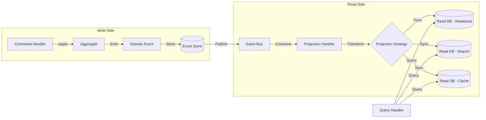
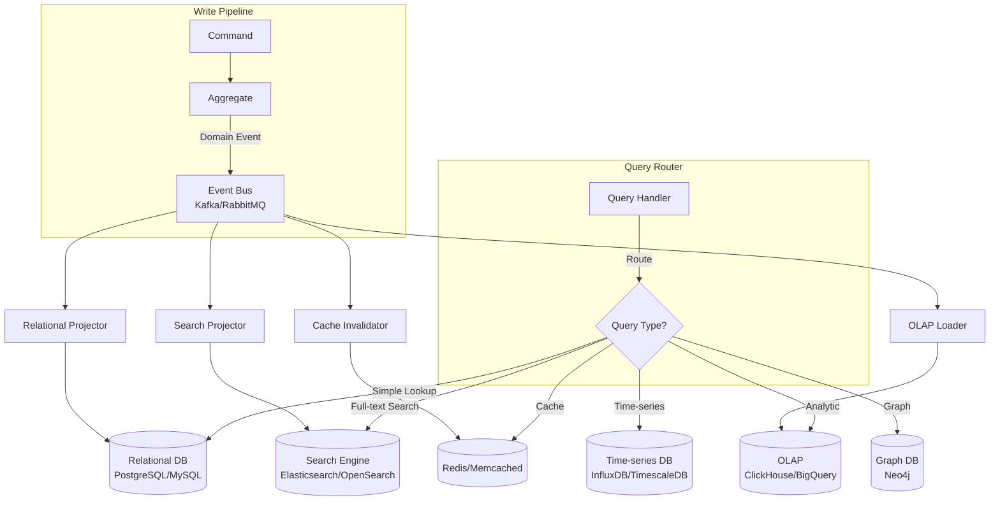
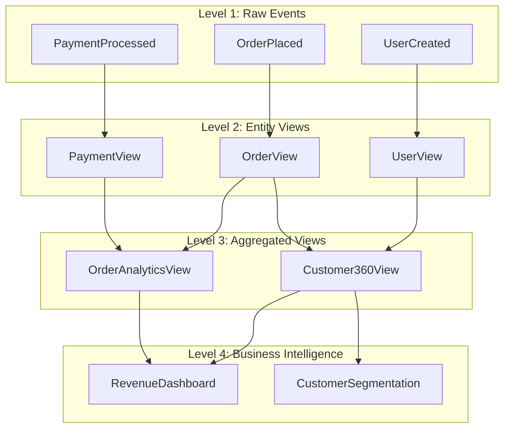
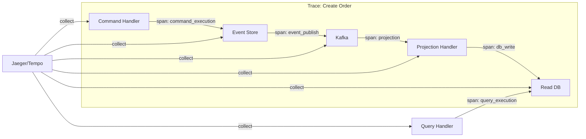

# CQRS Advanced Patterns: Read Model Optimization & Materialized View Strategies

## 1. Mục Tiêu CủA Task

Nghiên cứu chiều sâu về **Command Query Responsibility Segregation (CQRS)** ở cấp độ advanced - tập trung vào:
- Tối ưu hóa Read Model trong hệ thống phân tán quy mô lớn
- Chiến lược Materialized View và cơ chế đồng bộ hóa
- Tách biệt tối ưu Write Path và Read Path
- Các pattern giảm thiểu ảnh hưởng của Eventual Consistency trong production

> **Bản chất CQRS:** Không chỉ là "tách read/write" - đó là việc thiết kế **mô hình dữ liệu khác biệt** phục vụ hai mục đích fundamentally khác nhau: ghi dữ liệu (business rules, consistency) và đọc dữ liệu (query patterns, performance).

---

## 2. Bản Chất Và Cơ Chế Hoạt Động

### 2.1 Tại Sao CQRS Cần "Mô Hình Khác Biệt"?

Trong kiến trúc truyền thống (CRUD-centric), một domain model cố gắng phục vụ cả hai mục đích:

| Aspect | Write Model | Read Model |
|--------|-------------|------------|
| **Mục tiêu** | Enforce business rules, maintain consistency | Serve query patterns efficiently |
| **Validation** | Complex invariants, cross-aggregate rules | Minimal validation |
| **Structure** | Normalized, aggregate boundaries | Denormalized, query-optimized |
| **Consistency** | Strong consistency (ACID) | Eventual consistency acceptable |
| **Access Pattern** | By ID/aggregate root | Complex joins, filters, sorting |
| **Performance Focus** | Transaction throughput | Query latency |

> **Pitfall phổ biến:** Nhiều team áp dụng CQRS chỉ ở mức "tách controller" hoặc "tách service method" mà không thay đổi **data model** - điều này không mang lại lợi ích thực sự và chỉ tăng complexity.

### 2.2 Cơ Chế Đồng Bộ Hóa Read Model



**Các cơ chế đồng bộ:**

1. **Synchronous Projection (Immediate Consistency)**
   - Event được project ngay trong cùng transaction
   - Read model updated trước khi command trả về
   - Trade-off: Write latency tăng, coupling giữa write và read
   - Use case: Khi read-after-write consistency là bắt buộc

2. **Asynchronous Projection (Eventual Consistency)**
   - Event published ra message queue sau khi commit
   - Projection handler xử lý async
   - Lag time thường từ milliseconds đến seconds
   - Use case: Hệ thống phân tán, chấp nhận eventual consistency

3. **Pull-based Projection (On-demand)**
   - Read model được xây dựng khi query được thực hiện
   - Dùng event sourcing - replay events để tạo view
   - Trade-off: Query latency cao, không phù hợp read-heavy

### 2.3 Eventual Consistency: Hiểu Đúng Bản Chất

Eventual consistency không phải là "lỗi" - đó là **trade-off có chủ đích**:

> **CAP Theorem context:** Khi phân vùng (partition) xảy ra, hệ thống distributed phải chọn giữa consistency và availability. CQRS với eventual consistency chọn availability.

**Consistency Timeline:**
```
T0: Command Commit (Write Model updated)
T1: Event Published to Bus
T2: Projection Handler nhận Event
T3: Read Model updated
T4: Query trả về dữ liệu mới (Consistency achieved)
```

**Window of Inconsistency = T4 - T0**

---

## 3. Kiến Trúc & Luồng Xử Lý

### 3.1 Multi-Model Read Architecture



### 3.2 Materialized View Patterns

#### Pattern 1: Single-Source Materialized View

```
Write Model (User Aggregate)
    ↓
Event: UserProfileUpdated
    ↓
Projection: Update User Read Table
```

**Đặc điểm:**
- Một aggregate → Một read model
- Đơn giản, dễ maintain
- Phù hợp cho CRUD views

#### Pattern 2: Composite Materialized View (Multi-Source Join)

```
Order Aggregate ─┐
                 ├─→ OrderSummary Read Model
User Aggregate ──┤
                 ├─→ OrderSummary Read Model  
Product Aggregate┘
```

**Challenge:** Multiple events từ different aggregates cùng update một read model

**Giải pháp:**
1. **Idempotent Projections:** Projection handler phải idempotent
2. **Optimistic Locking:** Version-based conflict resolution
3. **CQRS Saga:** Nếu cần coordination giữa multiple projections

#### Pattern 3: Hierarchical Materialized Views



**Lợi ích:**
- Incremental computation
- Reusability giữa các level
- Có thể parallelize

**Trade-off:**
- Latency tăng qua các level
- Complexity trong dependency tracking

---

## 4. So Sánh Các Lựa Chọn

### 4.1 Projection Strategies Comparison

| Strategy | Consistency | Latency | Complexity | Use Case |
|----------|-------------|---------|------------|----------|
| **In-Transaction** | Strong | High (blocking) | Low | Critical consistency |
| **Outbox Pattern** | Eventual | Medium | Medium | General distributed |
| **CDC (Change Data Capture)** | Eventual | Low | Medium | Legacy integration |
| **Event Sourcing Replay** | Eventual | High | High | Audit, time-travel |
| **Dual Write** | Risky | Low | Low | **AVOID** |

> **Dual Write Anti-pattern:** Đừng bao giờ write vào write DB và read DB trong cùng một transaction mà không có mechanism để handle partial failure. Đây là nguồn gốc của data inconsistency.

### 4.2 Read Model Storage Options

| Storage | Query Pattern | Scale | Consistency Model | Best For |
|---------|---------------|-------|-------------------|----------|
| **PostgreSQL/MySQL** | SQL, ACID | Vertical | Strong | Complex queries, joins |
| **MongoDB** | Document, flexible schema | Horizontal | Eventual | Dynamic schemas |
| **Elasticsearch** | Full-text, aggregation | Horizontal | Eventual | Search, analytics |
| **Redis** | Key-value, limited query | Horizontal | Eventual | Cache, real-time |
| **ClickHouse** | Columnar, OLAP | Horizontal | Eventual | Analytics, time-series |
| **Neo4j** | Graph traversal | Horizontal | ACID | Relationship-heavy |

### 4.3 Event Delivery Guarantees

| Guarantee | Implementation | Trade-off |
|-----------|----------------|-----------|
| **At-most-once** | Fire-and-forget | Có thể miss events |
| **At-least-once** | Ack + retry | Duplicate events possible |
| **Exactly-once** | Idempotent consumer + dedup | Highest complexity, overhead |

**Recommendation:** Use **at-least-once** + **idempotent projections** cho phần lớn use cases. Exactly-once thường overkill và complex.

---

## 5. Rủi Ro, Anti-patterns & Lỗi Thường Gặp

### 5.1 Critical Anti-Patterns

#### Anti-Pattern 1: Shared Database

```java
// ❌ WRONG: Read và Write dùng chung DB schema
@GetMapping("/orders")
public List<Order> getOrders() {
    return orderRepository.findAll(); // Same DB, same model
}

@PostMapping("/orders")
public Order createOrder(@RequestBody Order order) {
    return orderRepository.save(order); // Same DB, same model
}
```

**Vấn đề:** Không phải CQRS - chỉ là tách API endpoint.

#### Anti-Pattern 2: Direct Read Model Write

```java
// ❌ WRONG: Client ghi trực tiếp vào Read Model
queryService.updateReadModel(data); // Bypass write model!
```

**Vấn đề:** Mất business rules, data inconsistency, audit trail broken.

#### Anti-Pattern 3: Projection Without Idempotency

```java
// ❌ WRONG: Non-idempotent projection
@EventListener
public void on(OrderPlacedEvent event) {
    // Không check xem đã xử lý chưa
    readRepository.save(new OrderView(event));
}
```

**Hậu quả:** Duplicate events → duplicate data.

#### Anti-Pattern 4: Tight Coupling in Projection

```java
// ❌ WRONG: Projection gọi external service
@EventListener
public void on(OrderPlacedEvent event) {
    // External call trong projection - dangerous!
    externalService.notify(event); // Có thể fail, block, timeout
    readRepository.save(view);
}
```

**Giải pháp:** Projection chỉ nên tương tác với local read DB. External calls nên qua separate process (outbox pattern).

### 5.2 Eventual Consistency Pitfalls

#### Problem: Stale Data on Read-After-Write

**Scenario:**
1. User tạo order → Command success
2. User redirect đến order detail → Query returns null (chưa sync)
3. User thấy "Order not found" → Confusion

**Solutions:**

**Option A: Optimistic UI (Frontend Strategy)**
```javascript
// Frontend giữ state tạm thời
createOrder(data).then(response => {
    // Show success với data từ response, không wait read model
    showOrderDetail(response.data);
});
```

**Option B: Polling with Timeout**
```javascript
// Poll read model với timeout
const checkOrder = async (orderId, maxAttempts = 10) => {
    for (let i = 0; i < maxAttempts; i++) {
        const order = await getOrder(orderId);
        if (order) return order;
        await sleep(100);
    }
    throw new Error("Order sync timeout");
};
```

**Option C: Command Returns Read Model (Hybrid)**
```java
// Trả về projected data trong command response
public OrderDetailDTO createOrder(CreateOrderCommand cmd) {
    Order order = commandHandler.handle(cmd);
    // Trigger projection sync hoặc return trực tiếp
    return projectionService.getImmediate(order.getId());
}
```

### 5.3 Failure Modes in Production

| Failure | Impact | Mitigation |
|---------|--------|------------|
| **Projection lag** | Stale reads | Monitoring, alerting, auto-scaling |
| **Projection failure** | Read model out of sync | Dead letter queue, replay capability |
| **Event loss** | Missing data | Persistent message queue, acks |
| **Read DB outage** | Query failures | Fallback, circuit breaker |
| **Write DB outage** | No updates | Degraded mode, queue commands |

---

## 6. Khuyến Nghị Thực Chiến Trong Production

### 6.1 Monitoring & Observability

**Key Metrics:**

```yaml
projection_metrics:
  - name: projection_lag_ms
    threshold: 
      warning: 1000ms
      critical: 5000ms
    
  - name: projection_error_rate
    threshold:
      warning: 1%
      critical: 5%
      
  - name: read_query_latency_p99
    threshold:
      warning: 100ms
      critical: 500ms
      
  - name: write_throughput
    # Monitor để detect unexpected spikes
    
  - name: read_staleness_age_ms
    # Đo độ trễ thực tế giữa write và read
```

**Distributed Tracing:**



### 6.2 Projection Implementation Best Practices

#### Idempotency Implementation

```java
@Component
public class OrderProjectionHandler {
    
    @EventListener
    public void handle(OrderPlacedEvent event) {
        // Check đã xử lý chưa
        if (processedEventRepository.exists(event.getEventId())) {
            return; // Skip duplicate
        }
        
        // Hoặc dùng unique constraint
        try {
            OrderView view = OrderView.from(event);
            orderViewRepository.save(view);
            processedEventRepository.save(event.getEventId());
        } catch (DuplicateKeyException e) {
            // Already processed, ignore
            log.debug("Duplicate event ignored: {}", event.getEventId());
        }
    }
}
```

#### Batching & Bulk Operations

```java
// Batch processing để tối ưu throughput
@KafkaListener(topics = "order-events", batch = "true")
public void handleBatch(List<OrderEvent> events) {
    // Deduplicate trong batch
    List<OrderEvent> unique = events.stream()
        .collect(Collectors.toMap(
            OrderEvent::getEventId,
            e -> e,
            (e1, e2) -> e1
        ))
        .values()
        .stream()
        .collect(Collectors.toList());
    
    // Bulk insert/update
    List<OrderView> views = unique.stream()
        .map(OrderView::from)
        .collect(Collectors.toList());
    
    orderViewRepository.saveAll(views);
}
```

#### Circuit Breaker for Resilience

```java
@Service
public class ResilientProjectionHandler {
    
    private final CircuitBreaker circuitBreaker;
    
    @EventListener
    public void handle(DomainEvent event) {
        circuitBreaker.executeRunnable(() -> {
            try {
                projectionService.project(event);
            } catch (Exception e) {
                // Send to DLQ để retry sau
                deadLetterQueue.send(event, e);
                throw e;
            }
        });
    }
}
```

### 6.3 Schema Evolution & Versioning

**Event Schema Versioning:**

```java
public record OrderPlacedEvent(
    String eventId,
    String orderId,
    String customerId,
    BigDecimal amount,
    Instant timestamp,
    int schemaVersion  // 👈 Quan trọng cho backward compatibility
) {
    public OrderPlacedEvent {
        if (schemaVersion == 0) {
            // Migration từ old format
            amount = amount.setScale(2, RoundingMode.HALF_UP);
        }
    }
}
```

**Read Model Migration:**

```sql
-- Strategy: Dual-write during migration
-- Phase 1: Write to both old và new schema
INSERT INTO order_view_legacy (...)
INSERT INTO order_view_v2 (...)

-- Phase 2: Backfill historical data
INSERT INTO order_view_v2 (SELECT ... FROM events)

-- Phase 3: Switch read path to new schema
-- Phase 4: Remove old schema
```

### 6.4 Handling Complex Query Patterns

#### Pattern: Materialized View Pre-computation

```java
// Pre-compute expensive aggregations
@Scheduled(cron = "0 */5 * * * *") // Every 5 minutes
public void refreshOrderStatistics() {
    List<OrderStats> stats = orderRepository
        .calculateStatistics(LocalDate.now());
    
    // Upsert vào read model
    statsRepository.saveAll(stats);
}
```

#### Pattern: CQRS + CQ (Command Query) Segregation trong Aggregate

```java
public class OrderAggregate {
    // Write model chỉ giữ state cần cho business rules
    private OrderId id;
    private OrderStatus status;
    private List<OrderItem> items;
    
    // Không lưu các trường chỉ dùng cho query
    // - totalAmount (có thể calculate)
    // - customerName (thuộc về Customer aggregate)
}

// Read model denormalize tất cả
public class OrderDetailView {
    private String orderId;
    private String customerName;     // Denormalized
    private String customerEmail;    // Denormalized
    private BigDecimal totalAmount;  // Pre-calculated
    private List<ItemDetail> items;  // Flattened
}
```

---

## 7. Kết Luận

### Bản Chất Của CQRS Advanced

CQRS ở cấp độ advanced không phải là "công nghệ" hay "framework" - đó là **tư duy thiết kế**:

1. **Accept Eventual Consistency:** Đừng chiến đấu với nó. Thiết kế UI và UX chấp nhận độ trễ ngắn.

2. **Model Around Query Patterns:** Read model phải là **1:1 mapping** với UI screens/API responses, không phải normalized entities.

3. **Idempotency Everywhere:** Projection handlers phải chịu được duplicate events mà không corrupt data.

4. **Monitor the Gap:** Projection lag là metric quan trọng nhất. Alert trước khi user complain.

5. **Start Simple:** Đừng áp dụng multi-model read architecture ngay từ đầu. PostgreSQL cho cả read và write vẫn ổn cho 90% use cases. Scale khi có measured problem.

### Trade-off Summary

| Benefit | Cost |
|---------|------|
| Read performance | Eventual consistency complexity |
| Write scalability | Infrastructure complexity (multiple DBs) |
| Team autonomy | Learning curve |
| Query flexibility | Data duplication |
| Technology heterogeneity | Operational complexity |

> **Quyết định cuối cùng:** CQRS advanced patterns đáng giá khi:
> - Hệ thống có **read/write ratio > 10:1**
> - **Query patterns đa dạng** và thay đổi thường xuyên
> - **Team đủ senior** để handle distributed systems complexity
> - **Có infrastructure investment** cho monitoring và alerting

---

## 8. Tài Liệu Tham Khảo

- [Microsoft: CQRS Pattern](https://docs.microsoft.com/en-us/azure/architecture/patterns/cqrs)
- [Martin Fowler: CQRS](https://martinfowler.com/bliki/CQRS.html)
- [Event Store Documentation](https://developers.eventstore.com/)
- [Kafka Streams: Materialized Views](https://kafka.apache.org/documentation/streams/)
- [AWS: Event-Driven Architecture](https://docs.aws.amazon.com/prescriptive-guidance/latest/modernization-data-persistence/cqrs-pattern.html)

---

*Research completed: March 27, 2026*
*Senior Backend Architecture Deep Dive Series*
