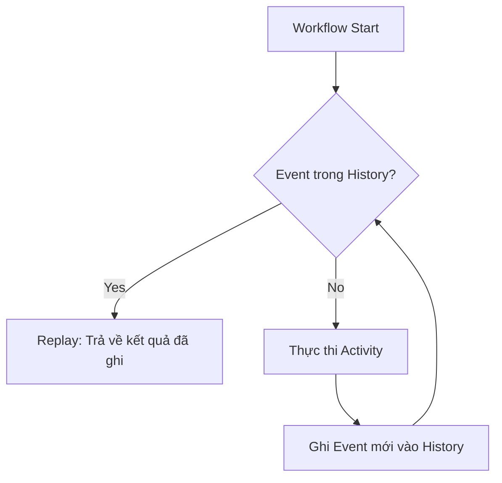
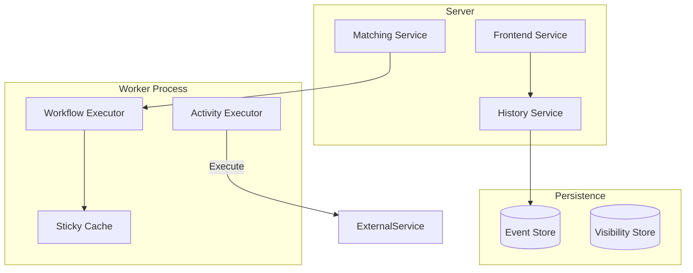
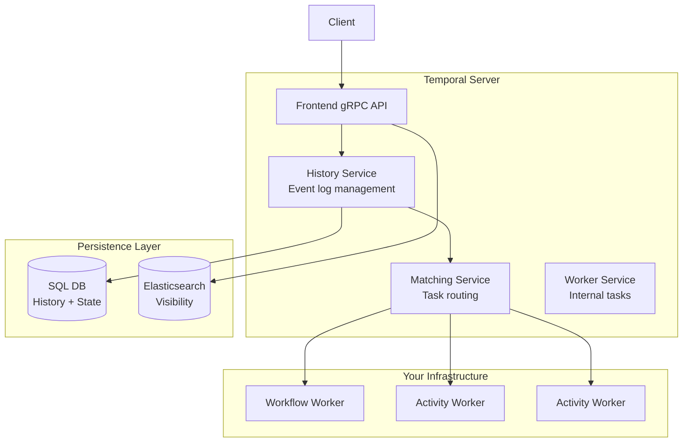
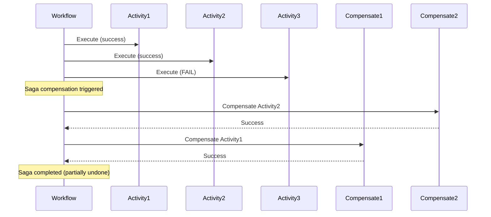

# State Machine Orchestration: Temporal/Cadence Workflow Engines

## 1. Mục tiêu của Task

Hiểu sâu cơ chế vận hành của Workflow Engine (Temporal/Cadence) - nền tảng xử lý **long-running transactions**, **saga pattern**, và **stateful orchestration** trong distributed systems. Tập trung vào:

- Bản chất "deterministic replay" - cơ chế cốt lõi làm nên khả năng fault tolerance
- Kiến trúc state machine persistence và event sourcing tích hợp
- Cách triển khai saga pattern với compensation handling đúng đắn
- Trade-off giữa orchestration vs choreography trong microservices

> **Tại sao điều này quan trọng:** Khi hệ thống phân tán phát triển, các giao dịch kéo dài (minutes, hours, days) trở thành norm. Traditional transaction managers (2PC) không scale. Workflow engines giải quyết bài toán này bằng cách biến state thành first-class citizen.

---

## 2. Bản chất và Cơ chế Hoạt động

### 2.1 Cốt lõi: Deterministic Replay

Đây là **đột phá kiến trúc** của Temporal/Cadence so với các workflow engine truyền thống:

```
Truyền thống: Lưu state sau mỗi bước → Resume từ checkpoint
Temporal:   Lưu EVENT HISTORY → Replay code để tái tạo state
```

**Cơ chế hoạt động:**

1. **Workflow Definition** - Code của bạn chính là state machine
2. **Event History** - Mọi activity completion, timer, signal đều được ghi lại
3. **Deterministic Replay** - Khi worker restart, engine replay event history qua workflow code
4. **State Reconstruction** - State được tái tạo hoàn toàn, không cần lưu trữ state riêng



**Tại sao điều này quan trọng:**

| Aspect | Traditional Checkpoint | Deterministic Replay |
|--------|----------------------|---------------------|
| Storage | State snapshot (lớn, complex) | Event log (nhỏ, append-only) |
| Versioning | Migration phức tạp | Replay với code mới (cẩn thận) |
| Debugging | Khó trace | Event history = perfect audit log |
| Scalability | State size giới hạn | History có thể paginate |

### 2.2 Event Sourcing + State Machine = Workflow Persistence

Temporal kết hợp hai pattern mạnh:

**Event Sourcing:** Mọi thay đổi state đều là immutable event
**State Machine:** Transition được định nghĩa rõ ràng trong code

```
┌─────────────────────────────────────────┐
│           WORKFLOW EXECUTION            │
├─────────────────────────────────────────┤
│  Event 1: WorkflowExecutionStarted      │
│  Event 2: ActivityTaskScheduled         │
│  Event 3: ActivityTaskCompleted         │
│  Event 4: TimerStarted                  │
│  Event 5: TimerFired                    │
│  Event 6: ActivityTaskScheduled         │
│  ...                                    │
└─────────────────────────────────────────┘
         ↓ (Replay qua workflow code)
    ┌─────────────┐
    │ Current State │ ← Không lưu, tính toán realtime
    └─────────────┘
```

### 2.3 Saga Pattern Implementation

Saga pattern giải quyết vấn đề: *Làm thế nào để đảm bảo consistency khi không thể dùng distributed transaction?*

**Cách Temporal triển khai:**

```
Saga = Sequence of Local Transactions + Compensation

OrderService.create()     → Success (có thể compensate)
PaymentService.charge()   → Success (có thể refund)  
InventoryService.reserve() → Success (có thể release)
ShippingService.schedule() → Success (có thể cancel)

NẾU ShippingService.schedule() FAIL:
  → Compensation theo thứ tự ngược:
     ShippingService.cancel()   [skip vì chưa thành công]
     InventoryService.release() [execute]
     PaymentService.refund()    [execute]
     OrderService.cancel()      [execute]
```

**Temporal's Approach:**

```java
// Compensation được định nghĩa ngay khi activity thành công
Saga saga = new Saga();

try {
    OrderResult order = activities.createOrder(request);
    saga.addCompensation(activities::cancelOrder, order.getId());
    
    PaymentResult payment = activities.processPayment(order.getId());
    saga.addCompensation(activities::refundPayment, payment.getId());
    
    InventoryResult inv = activities.reserveInventory(request.getItems());
    saga.addCompensation(activities::releaseInventory, inv.getReservationId());
    
    activities.scheduleShipping(order.getId(), inv.getItems());
    
} catch (ActivityFailure e) {
    // Automatic compensation execution
    saga.compensate();
    throw e;
}
```

**Điểm then chốt:** Compensation là **nested transactions ngược chiều**, không phải "undo" thực sự. Compensation cũng có thể fail, cần idempotency và retry.

### 2.4 Long-Running Transaction Orchestration

**Định nghĩa:** Transaction kéo dài từ phút đến ngày, không thể giữ lock database trong suốt quá trình.

**Kiến trúc Temporal xử lý:**



**Cơ chế hoạt động chi tiết:**

1. **Workflow Task:** Worker poll từ queue, nhận workflow code + event history
2. **Replay:** Workflow code chạy, mỗi lần gặp activity đã có kết quả trong history → skip execution, trả về cached result
3. **New Execution:** Khi gặp activity chưa có kết quả → schedule activity task
4. **Completion:** Activity worker thực thi, trả kết quả → server append vào history
5. **Continue:** Workflow task mới được tạo để continue execution

---

## 3. Kiến trúc và Luồng Xử Lý

### 3.1 Temporal Architecture



**Tách biệt Workflow vs Activity:**

| Workflow | Activity |
|----------|----------|
| Deterministic (phải replay được) | Non-deterministic (side effects OK) |
| Lightweight, stateless | Heavy, stateful, external calls |
| Chạy trong worker process | Có thể chạy ở worker khác |
| Không block thread (async) | Block thread OK |
| Không call external service | Gọi database, API, file system |

### 3.2 State Machine Representation

Workflow code của bạn **chính là** state machine definition:

```
State: Initial
  ↓ Action: schedule activity "CreateOrder"
State: OrderCreated
  ↓ Action: schedule activity "ProcessPayment"
State: PaymentProcessed  
  ↓ Action: schedule timer "WaitForFulfillment"
State: AwaitingFulfillment
  ↓ Event: Signal "FulfillmentComplete"
State: Completed
```

**Temporal không lưu "current state"** - nó lưu event history. State được tính toán bằng cách replay.

### 3.3 Saga Compensation Flow



---

## 4. So Sánh Các Lựa Chọn

### 4.1 Temporal vs Cadence vs Conductor vs Camunda

| Feature | Temporal | Cadence | Netflix Conductor | Camunda |
|---------|----------|---------|-------------------|---------|
| **Origin** | Uber → Temporal | Uber (original) | Netflix | Camunda |
| **Persistence** | Cassandra/MySQL/PostgreSQL | Cassandra/MySQL | Redis/Postgres/MySQL | Relational DB |
| **Language SDK** | Java, Go, TypeScript, Python, .NET, PHP | Java, Go | Java, Python, Go | Java, Node.js |
| **Deterministic Replay** | ✅ Native | ✅ Native | ❌ State machine | ❌ BPMN engine |
| **Scalability** | High (millions workflows) | High | High | Medium |
| **Self-hosted** | ✅ | ✅ | ✅ | ✅ |
| **Cloud** | Temporal Cloud | - | Orkes | Camunda Cloud |
| **Learning Curve** | Medium | Medium | Low | Medium |
| **Community** | Very Active | Maintenance mode | Active | Active |

### 4.2 Orchestration vs Choreography

| Orchestration (Temporal) | Choreography (Event-driven) |
|-------------------------|----------------------------|
| Central coordinator | Decentralized, peer-to-peer |
| Clear visibility của flow | Logic phân tán, khó trace |
| Dễ implement saga | Saga phức tạp, cần framework |
| Single point of logic | Highly decoupled |
| Scaling coordinator là challenge | Natural scaling |
| Phù hợp complex workflows | Phù hợp simple, independent flows |

**Khi nào dùng gì:**

- **Orchestration:** Multi-step business processes, cần visibility, compensation phức tạp, human approval
- **Choreography:** Simple event flows, high-throughput events, loosely coupled domains

### 4.3 Temporal vs Traditional Job Schedulers

| Aspect | Temporal | Quartz/Cron | Airflow |
|--------|----------|-------------|---------|
| **Trigger** | Event, Signal, Schedule | Time-based | Time-based |
| **State** | Stateful, durable | Stateless | Stateful |
| **Failure handling** | Automatic retry, compensation | Manual | Retry logic |
| **Long-running** | Native support | N/A | N/A |
| **Human interaction** | Signals, Queries | No | No |

---

## 5. Rủi ro, Anti-patterns, Lỗi thường gặp

### 5.1 Non-deterministic Workflow Code

> **❌ LỖI NGHIÊM TRỌNG NHẤT**

```java
// ❌ SAI: Random, Time, UUID trong workflow
public class BadWorkflow {
    public void execute() {
        // Random - non-deterministic!
        int random = Math.random(); 
        
        // Current time - thay đổi mỗi replay!
        Instant now = Instant.now();
        
        // UUID - khác nhau mỗi lần!
        String id = UUID.randomUUID().toString();
    }
}

// ✅ ĐÚNG: Dùng Temporal APIs
public class GoodWorkflow {
    public void execute() {
        // Random deterministic
        int random = Workflow.random().nextInt();
        
        // Time từ Temporal
        Instant now = Workflow.currentTimeMillis();
        
        // UUID từ Temporal
        String id = Workflow.randomUUID().toString();
    }
}
```

### 5.2 Blocking trong Workflow Code

```java
// ❌ SAI: Block thread
Thread.sleep(1000);  // Block thread, ảnh hưởng throughput

// ✅ ĐÚNG: Dùng Temporal timer
Workflow.sleep(Duration.ofSeconds(1));  // Non-blocking
```

### 5.3 Calling External Services trong Workflow

```java
// ❌ SAI: HTTP call trong workflow
public void execute() {
    httpClient.post("/api/order", order);  // Side effect!
}

// ✅ ĐÚNG: Move vào Activity
public void execute() {
    activities.createOrder(order);  // Activity = có thể retry, timeout
}
```

### 5.4 Compensation Anti-patterns

```java
// ❌ SAI: Compensation không idempotent
public void cancelOrder(String orderId) {
    // Nếu gọi 2 lần = exception
    orderRepository.delete(orderId);
}

// ✅ ĐÚNG: Idempotent compensation
public void cancelOrder(String orderId) {
    // Check trước khi delete
    if (orderRepository.exists(orderId)) {
        orderRepository.delete(orderId);
    }
}
```

### 5.5 Versioning Workflows

```java
// ❌ SAI: Thay đổi workflow code cho running workflows
public void execute() {
    // Workflow cũ chỉ có 2 activities
    activity1.run();
    activity2.run();  // Thêm dòng này sẽ break replay!
}

// ✅ ĐÚNG: Dùng versioning
public void execute() {
    activity1.run();
    
    int version = Workflow.getVersion("add-activity-2", 
                                      Workflow.DEFAULT_VERSION, 1);
    if (version >= 1) {
        activity2.run();
    }
}
```

### 5.6 Large Payloads trong Event History

```java
// ❌ SAI: Payload lớn làm history bloat
@ActivityMethod
OrderDetails fetchOrderDetails(String orderId) {
    // Return 10MB JSON - lưu vào history!
    return hugeOrderDetails;
}

// ✅ ĐÚNG: Lưu external, reference trong workflow
@ActivityMethod
String fetchOrderDetails(String orderId) {
    String blobId = storeToBlobStorage(hugeOrderDetails);
    return blobId;  // Chỉ lưu ID vào history
}
```

---

## 6. Khuyến nghị Thực chiến trong Production

### 6.1 Deployment Patterns

**Separate Worker Processes:**
```
Workflow Workers: Nhẹ, stateless, nhiều instance
Activity Workers: Heavy, external calls, độc lập scale
```

**Sticky Cache:**
- Enable để giảm replay cost
- Worker giữ workflow state trong memory
- Lưu ý: Mất worker = mất cache, nhưng không mất state

### 6.2 Monitoring & Observability

**Metrics cần track:**
- `workflow_failed` - Số workflow fail
- `workflow_execution_latency` - Thời gian chạy
- `activity_execution_failed` - Activity failure rate
- `task_schedule_to_start_latency` - Queue depth indicator
- `worker_task_slots_available` - Capacity planning

**Tracing:**
- Mỗi workflow execution = 1 trace
- Activities = spans
- Propagate context qua activities

### 6.3 Back-pressure & Rate Limiting

```java
// Worker options để control concurrency
WorkerOptions options = WorkerOptions.newBuilder()
    .setMaxConcurrentActivityExecutionSize(100)
    .setMaxConcurrentWorkflowTaskExecutionSize(50)
    .setMaxConcurrentActivityTaskPollers(10)
    .setMaxConcurrentWorkflowTaskPollers(10)
    .build();
```

### 6.4 Security Considerations

- **Payload encryption:** Nếu chứa PII, encrypt trước khi trả về từ activity
- **mTLS:** Worker ↔ Server communication
- **Authorization:** Temporal server hỗ trợ authorization hooks
- **Secret management:** Không để secret trong workflow code, dùng secret store

### 6.5 Disaster Recovery

**Event history là source of truth:**
- Backup event store (SQL/Cassandra)
- Point-in-time recovery
- Cross-region replication nếu cần

**Workflow reset:**
- Có thể reset workflow về specific point trong history
- Dùng khi deploy buggy code

---

## 7. Kết luận

**Bản chất cốt lõi:** Temporal/Cadence biến **code thành state machine durable** bằng cơ chế **deterministic replay** dựa trên event sourcing. Điều này cho phép:

1. **Long-running processes** tồn tại qua restarts, failures, deployments
2. **Saga pattern** được implement một cách clean với compensation tự động
3. **Visibility** hoàn hảo vào trạng thái và lịch sử của mọi business process

**Trade-off quan trọng nhất:**
- **Lợi:** Fault tolerance hoàn hảo, observability, saga implementation clean
- **Hại:** Learning curve, constraint về deterministic code, operational complexity

**Rủi ro lớn nhất trong production:**
Non-deterministic workflow code gây corruption hoặc inconsistent state. Cần strict code review và automated testing với `TestWorkflowEnvironment`.

**Khi nào nên dùng:**
- Business processes có nhiều bước (3+)
- Cần compensation logic
- Long-running (minutes+)
- Cần human approval/intervention
- Distributed transactions

**Khi nào KHÔNG nên dùng:**
- Simple CRUD operations
- Real-time, low-latency requirements (< 100ms)
- Stateless event processing
- Simple scheduled jobs

---

## 8. Code References

### Workflow Definition Pattern

```java
public interface OrderWorkflow {
    @WorkflowMethod
    OrderResult processOrder(OrderRequest request);
    
    @SignalMethod
    void approveOrder(String approverId);
    
    @QueryMethod
    OrderStatus getStatus();
}

public class OrderWorkflowImpl implements OrderWorkflow {
    private final OrderActivities activities;
    private OrderStatus status = OrderStatus.PENDING;
    private boolean approved = false;
    
    public OrderWorkflowImpl() {
        this.activities = Workflow.newActivityStub(
            OrderActivities.class,
            ActivityOptions.newBuilder()
                .setScheduleToCloseTimeout(Duration.ofMinutes(5))
                .setRetryOptions(RetryOptions.newBuilder()
                    .setInitialInterval(Duration.ofSeconds(1))
                    .setMaximumAttempts(3)
                    .build())
                .build()
        );
    }
    
    @Override
    public OrderResult processOrder(OrderRequest request) {
        Saga saga = new Saga(new Saga.Options.Builder().build());
        
        try {
            // Step 1: Create order
            Order order = activities.createOrder(request);
            status = OrderStatus.CREATED;
            saga.addCompensation(activities::cancelOrder, order.getId());
            
            // Step 2: Wait for approval (human-in-the-loop)
            Workflow.await(Duration.ofHours(24), () -> approved);
            if (!approved) {
                throw new RuntimeException("Order not approved within 24h");
            }
            status = OrderStatus.APPROVED;
            
            // Step 3: Process payment
            Payment payment = activities.processPayment(order.getId());
            saga.addCompensation(activities::refundPayment, payment.getId());
            
            // Step 4: Reserve inventory
            activities.reserveInventory(order.getItems());
            
            status = OrderStatus.COMPLETED;
            return new OrderResult(order.getId(), "SUCCESS");
            
        } catch (Exception e) {
            saga.compensate();
            status = OrderStatus.FAILED;
            throw e;
        }
    }
    
    @Override
    public void approveOrder(String approverId) {
        this.approved = true;
    }
    
    @Override
    public OrderStatus getStatus() {
        return status;
    }
}
```

### Activity Implementation

```java
public class OrderActivitiesImpl implements OrderActivities {
    private final OrderRepository orderRepo;
    private final PaymentClient paymentClient;
    
    @Override
    public Order createOrder(OrderRequest request) {
        // Idempotent: check if exists first
        Optional<Order> existing = orderRepo.findByExternalId(request.getExternalId());
        if (existing.isPresent()) {
            return existing.get();
        }
        
        Order order = Order.builder()
            .id(UUID.randomUUID().toString())
            .externalId(request.getExternalId())
            .items(request.getItems())
            .status(OrderStatus.CREATED)
            .build();
            
        return orderRepo.save(order);
    }
    
    @Override
    public void cancelOrder(String orderId) {
        // Idempotent compensation
        orderRepo.findById(orderId).ifPresent(order -> {
            order.setStatus(OrderStatus.CANCELLED);
            orderRepo.save(order);
        });
    }
    
    @Override
    public Payment processPayment(String orderId) {
        // External call with retry logic handled by Temporal
        return paymentClient.charge(orderId);
    }
    
    @Override
    public void refundPayment(String paymentId) {
        // Idempotent compensation
        paymentClient.refund(paymentId);
    }
}
```

### Worker Setup

```java
public class TemporalWorkerApplication {
    public static void main(String[] args) {
        // Connect to Temporal server
        WorkflowServiceStubs service = WorkflowServiceStubs.newLocalServiceStubs();
        WorkflowClient client = WorkflowClient.newInstance(service);
        
        // Create worker factory
        WorkerFactory factory = WorkerFactory.newInstance(client);
        
        // Register workflow worker
        Worker workflowWorker = factory.newWorker("order-task-queue");
        workflowWorker.registerWorkflowImplementationTypes(OrderWorkflowImpl.class);
        
        // Register activity worker
        OrderActivities activities = new OrderActivitiesImpl(
            new OrderRepository(), 
            new PaymentClient()
        );
        workflowWorker.registerActivitiesImplementations(activities);
        
        // Start
        factory.start();
    }
}
```

---

**References:**
- Temporal Documentation: https://docs.temporal.io/
- Cadence Documentation: https://cadenceworkflow.io/
- Saga Pattern: https://microservices.io/patterns/data/saga.html
- Event Sourcing: https://martinfowler.com/eaaDev/EventSourcing.html
