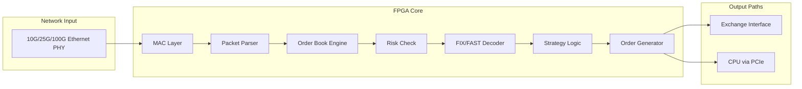
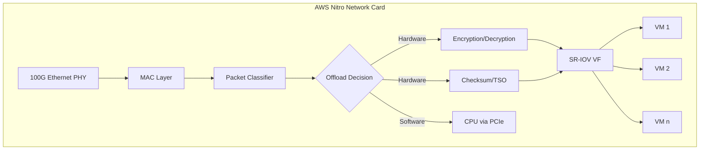

# Custom Hardware Acceleration: FPGA, SmartNICs và Kernel Bypass Techniques

## 1. Mục tiêu của Task

Nghiên cứu các giải pháp tăng tốc phần cứng (hardware acceleration) trong hệ thống backend hiện đại, tập trung vào:
- **FPGA trong High-Frequency Trading (HFT)** - xử lý giao dịch tốc độ cao
- **SmartNICs** (AWS Nitro, Azure Boost) - khả năng offloading của network interface cards
- **Kernel bypass techniques** - DPDK, RDMA, zero-copy data path

Mục tiêu cuối cùng: hiểu bản chất cơ chế, trade-off, và khi nào nên áp dụng các công nghệ này trong production.

---

## 2. Bản Chất và Cơ Chế Hoạt Động

### 2.1 Vấn Đề Cốt Lõi: Tại Sao Cần Hardware Acceleration?

Truyền thống, network stack của Linux hoạt động theo mô hình sau:

```
Application → Socket API → TCP/IP Stack → Network Driver → NIC Hardware
```

**Vấn đề:** Mỗi packet phải đi qua:
1. **Context switch** giữa user space và kernel space (~100ns - 1μs)
2. **Memory copy** từ kernel buffer sang user buffer (~50-100ns cho 1KB)
3. **Interrupt handling** - CPU bị gián đoạn mỗi khi packet đến
4. **Protocol processing** - TCP/IP stack trong kernel

Với hệ thống high-frequency trading hoặc microservices có throughput cao, độ trễ này là không chấp nhận được.

> **Con số thực tế:**
> - Standard Linux networking: ~10-50μs latency
> - Kernel bypass (DPDK/RDMA): ~1-5μs
> - FPGA-based processing: ~100-500ns
> - SmartNIC offloading: ~2-10μs nhưng giải phóng CPU

### 2.2 FPGA trong High-Frequency Trading

#### Bản Chất FPGA

**FPGA (Field-Programmable Gate Array)** là chip có thể lập trình để thực hiện logic tùy chỉnh ở mức phần cứng.

```
┌─────────────────────────────────────────┐
│              FPGA CHIP                  │
├─────────────────────────────────────────┤
│  ┌─────┐  ┌─────┐  ┌─────┐  ┌─────┐    │
│  │ CLB │  │ CLB │  │ CLB │  │ CLB │    │  CLB = Configurable Logic Block
│  │     │  │     │  │     │  │     │    │
│  └─────┘  └─────┘  └─────┘  └─────┘    │
│      │        │        │        │       │
│  ┌─────────────────────────────────┐   │
│  │     Programmable Interconnect    │   │  Cấu trúc mạng kết nối
│  │         (Routing Fabric)         │   │
│  └─────────────────────────────────┘   │
│      │        │        │        │       │
│  ┌─────┐  ┌─────┐  ┌─────┐  ┌─────┐    │
│  │ DSP │  │ DSP │  │ BRAM│  │BRAM │    │  DSP = Digital Signal Processor
│  │     │  │     │  │     │  │     │    │  BRAM = Block RAM
│  └─────┘  └─────┘  └─────┘  └─────┘    │
└─────────────────────────────────────────┘
```

#### Tại Sao FPGA Phù Hợp HFT?

| Đặc điểm | CPU | GPU | FPGA |
|----------|-----|-----|------|
| **Latency determinism** | Không (cache misses, interrupts) | Không (scheduler, memory coalescing) | **Có** (predictable clock cycles) |
| **Parallelism model** | Thread-level | SIMD/Thread-level | **Bit-level + Pipeline** |
| **Power efficiency** | Thấp | Trung bình | **Cao** |
| **Flexibility** | Cao | Trung bình | Thấp (phải re-synthesize) |
| **Time to market** | Ngay | Ngay | **Tuần/tháng** |

**Cơ chế pipeline trong FPGA:**

```
Clock Cycle:   1    2    3    4    5    6    7    8
              │    │    │    │    │    │    │    │
Packet 1:     [P1] [P1] [P1] [P1] ──► Output
Packet 2:          [P2] [P2] [P2] [P2] ──► Output
Packet 3:               [P3] [P3] [P3] [P3] ──► Output
              │    │    │    │    │    │    │    │
Stage:        S1   S2   S3   S4   S5   S6   S7   S8
```

> **Key insight:** FPGA có thể xử lý **1 packet mỗi clock cycle** sau khi pipeline được fill. Với clock 300MHz, throughput là 300M packets/second với latency chỉ ~10-20ns mỗi stage.

#### Kiến Trúc FPGA trong HFT



**Các thành phần chính:**

1. **Network Stack trên FPGA:**
   - MAC layer (Media Access Control) - xử lý frame-level
   - Custom lightweight TCP/IP (không đầy đủ như Linux stack)
   - Hoặc dùng **UDP** (stateless, không cần congestion control)

2. **Order Book Engine:**
   - Lưu trữ bid/ask orders trong BRAM (on-chip memory)
   - Update latency: <100ns
   - Matching engine: so khớp orders trong 1-2 clock cycles

3. **Risk Check:**
   - Pre-trade risk validation (position limits, notional limits)
   - Thực hiện song song với order generation

> **Trade-off quan trọng:**
> FPGA trade **flexibility** lấy **latency**. Mỗi lần thay đổi strategy phải re-synthesize (30 phút - vài giờ) và redeploy. Không thể "hot-update" như software.

### 2.3 SmartNICs: AWS Nitro và Azure Boost

#### Bản Chất SmartNIC

**SmartNIC = NIC (Network Interface Card) + Embedded Processor/FPGA/DPU**

Thay vì CPU xử lý network packets, SmartNIC tự xử lý và chỉ gửi **đã xử lý** dữ liệu lên host.

```
Traditional NIC:
┌─────────────┐     ┌─────────────┐     ┌─────────────┐
│   Packet    │────►│    CPU      │────►│  Application│
│   Arrives   │     │ (Processing)│     │             │
└─────────────┘     └─────────────┘     └─────────────┘

SmartNIC:
┌─────────────┐     ┌─────────────────────────┐     ┌─────────────┐
│   Packet    │────►│      SMARTNIC           │────►│  Application│
│   Arrives   │     │ (Encryption/Compression/│     │  (Clean data)│
└─────────────┘     │  Firewall/Load Balancer)│     └─────────────┘
                    └─────────────────────────┘
                               │
                               ▼
                    Offload work from CPU
```

#### AWS Nitro System

AWS Nitro là kiến trúc virtualization được AWS phát triển từ 2017, thay thế các software-based virtualization bằng dedicated hardware.

```
┌─────────────────────────────────────────────────────────────┐
│                    AWS NITRO ARCHITECTURE                   │
├─────────────────────────────────────────────────────────────┤
│                                                             │
│  ┌─────────────┐  ┌─────────────┐  ┌─────────────┐         │
│  │  Nitro Card │  │  Nitro Card │  │  Nitro Card │         │
│  │  (Network)  │  │  (Storage)  │  │ (Security)  │         │
│  │             │  │   (NVMe)    │  │  (Nitro TPM)│         │
│  └──────┬──────┘  └──────┬──────┘  └──────┬──────┘         │
│         │                │                │                 │
│         └────────────────┼────────────────┘                 │
│                          │                                  │
│                   ┌──────┴──────┐                          │
│                   │ Nitro Hypervisor │ ← Thay thế Xen/KVM  │
│                   │  (Minimal)  │     bare-metal-like perf  │
│                   └──────┬──────┘                          │
│                          │                                  │
│                   ┌──────┴──────┐                          │
│                   │   EC2 Host  │                          │
│                   │   (CPU/RAM) │                          │
│                   └─────────────┘                          │
│                                                             │
└─────────────────────────────────────────────────────────────┘
```

**Các thành phần Nitro:**

| Component | Chức năng | Benefit |
|-----------|-----------|---------|
| **Nitro Card for Network** | ENA (Elastic Network Adapter), SR-IOV, EBS optimized | ~100Gbps throughput, <100μs latency |
| **Nitro Card for Storage** | NVMe controller, hardware encryption | Offload I/O từ CPU, inline encryption |
| **Nitro Security Chip** | Hardware root of trust, TPM | Bảo mật hardware-level |
| **Nitro Hypervisor** | Minimal hypervisor (không cần Dom0) | Near bare-metal performance |

**Kiến trúc Nitro Network Card:**



> **Key insight:** AWS Nitro offloads **toàn bộ network virtualization** từ hypervisor xuống hardware. CPU của EC2 instance không "biết" nó đang chạy trong VM - performance gần như bare metal.

#### Azure Boost (DPU-based)

Azure Boost là công nghệ SmartNIC/DPU tương đương của Microsoft, được công bố năm 2023.

```
┌──────────────────────────────────────────────────────────────┐
│                   AZURE BOOST ARCHITECTURE                   │
├──────────────────────────────────────────────────────────────┤
│                                                              │
│  ┌────────────────────────────────────────────────────────┐ │
│  │                    Azure Boost DPU                     │ │
│  │  ┌──────────┐  ┌──────────┐  ┌──────────┐  ┌────────┐ │ │
│  │  │ ARM Cores│  │ Hardware │  │ NVMe     │  │Network │ │ │
│  │  │ (Linux)  │  │ Accelerators│ Controller│  │Engine  │ │ │
│  │  └──────────┘  └──────────┘  └──────────┘  └────────┘ │ │
│  │  ┌──────────────────────────────────────────────────┐  │ │
│  │  │         Programmable Accelerators                │  │ │
│  │  │   (Compression/Encryption/ML Inference)          │  │ │
│  │  └──────────────────────────────────────────────────┘  │ │
│  └────────────────────────────────────────────────────────┘ │
│                         │                                    │
│              PCIe Gen4/Gen5 Link                             │
│                         │                                    │
│                   ┌─────┴─────┐                              │
│                   │ Azure VM  │                              │
│                   │ (CPU/RAM) │                              │
│                   └───────────┘                              │
│                                                              │
└──────────────────────────────────────────────────────────────┘
```

**Điểm khác biệt Azure Boost vs AWS Nitro:**

| Aspect | AWS Nitro | Azure Boost |
|--------|-----------|-------------|
| **Base architecture** | ASIC + FPGA | DPU (ARM SoC + accelerators) |
| **Programmability** | Limited (AWS-controlled) | **Có thể chạy custom code** trên ARM cores |
| **Use case mở rộng** | Chỉ AWS services | Third-party extensions possible |
| **Offload capabilities** | I/O virtualization, encryption | I/O + custom accelerators |

> **Trade-off:** Azure Boost linh hoạt hơn (có thể chạy custom logic trên DPU) nhưng có thể phức tạp hơn trong việc quản lý.

### 2.4 Kernel Bypass Techniques

#### Vấn Đề: Linux Network Stack

```
┌─────────────────────────────────────────────────────────────┐
│                    LINUX NETWORK STACK                      │
├─────────────────────────────────────────────────────────────┤
│                                                             │
│  User Space:                                                │
│  ┌─────────────────────────────────────────────────────┐   │
│  │  Application (recv/send syscalls)                   │   │
│  └──────────────────┬──────────────────────────────────┘   │
│                     │ Context Switch (expensive)            │
│  Kernel Space:      ▼                                       │
│  ┌─────────────────────────────────────────────────────┐   │
│  │  Socket Layer (socket, sock structs)                │   │
│  └──────────────────┬──────────────────────────────────┘   │
│                     │                                       │
│  ┌──────────────────▼──────────────────────────────────┐   │
│  │  TCP/IP Stack ( congestion control, reassembly)     │   │
│  └──────────────────┬──────────────────────────────────┘   │
│                     │                                       │
│  ┌──────────────────▼──────────────────────────────────┐   │
│  │  Network Driver (SKB allocation, DMA setup)         │   │
│  └──────────────────┬──────────────────────────────────┘   │
│                     │ Interrupt                             │
│  Hardware:          ▼                                       │
│  ┌─────────────────────────────────────────────────────┐   │
│  │  NIC (Receive packet, DMA to memory)                │   │
│  └─────────────────────────────────────────────────────┘   │
│                                                             │
└─────────────────────────────────────────────────────────────┘
```

**Chi phí mỗi packet:**
- Context switch: ~100-1000 cycles
- Memory allocation (SKB): ~200-500 cycles
- Protocol processing: ~500-2000 cycles
- Interrupt handling: ~1000+ cycles
- **Total: ~5-10μs mỗi packet**

#### DPDK (Data Plane Development Kit)

**Bản chất:** Bypass toàn bộ kernel network stack, cho phép application truy cập trực tiếp NIC từ user space.

```
┌─────────────────────────────────────────────────────────────┐
│                    DPDK ARCHITECTURE                        │
├─────────────────────────────────────────────────────────────┤
│                                                             │
│  User Space:                                                │
│  ┌─────────────────────────────────────────────────────┐   │
│  │  ┌─────────────────────────────────────────────┐   │   │
│  │  │           DPDK Application                  │   │   │
│  │  │  ┌─────────┐  ┌─────────┐  ┌─────────────┐  │   │   │
│  │  │  │ L3 FWD  │  │ Load    │  │ Custom      │  │   │   │
│  │  │  │         │  │ Balancer│  │ Processing  │  │   │   │
│  │  │  └────┬────┘  └────┬────┘  └──────┬──────┘  │   │   │
│  │  │       └─────────────┴─────────────┘         │   │   │
│  │  │                 │                           │   │   │
│  │  │  ┌──────────────▼─────────────────────────┐  │   │   │
│  │  │  │           DPDK Libraries               │  │   │   │
│  │  │  │  ┌─────┐ ┌─────┐ ┌─────┐ ┌──────────┐ │  │   │   │
│  │  │  │  │ EAL │ │ Mempool│ │ PMD │ │ Ring/QoS │ │  │   │   │
│  │  │  │  └─────┘ └─────┘ └─────┘ └──────────┘ │  │   │   │
│  │  │  └──────────────────┬────────────────────┘  │   │   │
│  │  └─────────────────────┼───────────────────────┘   │   │
│  │                        │                           │   │
│  │  ┌─────────────────────▼───────────────────────┐   │   │
│  │  │  UIO/VFIO Driver (kernel module, minimal)   │   │   │
│  │  │  - PCIe device mapping to user space        │   │   │
│  │  │  - DMA memory allocation                    │   │   │
│  │  └─────────────────────┬───────────────────────┘   │   │
│  └────────────────────────┼───────────────────────────┘   │
│                           │                               │
│  Kernel Space:            │ (bypass hoàn toàn)            │
│  ┌────────────────────────┼───────────────────────────┐   │
│  │  NIC Driver (standard) │ ← Không dùng khi DPDK active│   │
│  └────────────────────────┼───────────────────────────┘   │
│                           │                               │
│  Hardware:                ▼                               │
│  ┌─────────────────────────────────────────────────────┐   │
│  │  NIC (direct access via PCIe BAR)                   │   │
│  │  - RX/TX descriptors managed in user space          │   │
│  │  - PMD polls instead of interrupts                  │   │
│  └─────────────────────────────────────────────────────┘   │
│                                                             │
└─────────────────────────────────────────────────────────────┘
```

**Các thành phần cốt lõi:**

1. **EAL (Environment Abstraction Layer):** 
   - Memory pinning (hugepages)
   - PCIe device mapping
   - CPU affinity binding

2. **PMD (Poll Mode Driver):**
   - Thay vì chờ interrupt, CPU **poll** liên tục
   - Eliminate interrupt latency
   - Trade: 100% CPU usage cho low latency

3. **Mempool:**
   - Pre-allocated memory pools
   - Lock-free ring buffers
   - Eliminate malloc/free overhead

> **Performance DPDK:**
> - Latency: ~1-5μs (vs 10-50μs kernel)
> - Throughput: 100+ Mpps trên 1 core
> - **Trade-off:** CPU core dedicated cho polling, không thể dùng cho việc khác

#### RDMA (Remote Direct Memory Access)

**Bản chất:** Cho phép một máy truy cập trực tiếp memory của máy khác mà không cần CPU involvement.

```
┌─────────────────────────────────────────────────────────────┐
│                    RDMA ARCHITECTURE                        │
├─────────────────────────────────────────────────────────────┤
│                                                             │
│  Server A                              Server B             │
│  ┌─────────────────┐                  ┌─────────────────┐   │
│  │  Application    │                  │  Application    │   │
│  │  (Verbs API)    │                  │  (Verbs API)    │   │
│  └────────┬────────┘                  └────────┬────────┘   │
│           │                                    │            │
│  ┌────────▼────────┐                  ┌────────▼────────┐   │
│  │  RDMA Stack     │                  │  RDMA Stack     │   │
│  │  (libibverbs)   │◄───── NO ───────►│  (libibverbs)   │   │
│  └────────┬────────┘    CPU COPY      └────────┬────────┘   │
│           │                                    │            │
│  ┌────────▼────────┐                  ┌────────▼────────┐   │
│  │  RNIC (HCA)     │◄════════════════►│  RNIC (HCA)     │   │
│  │  - Queue Pairs  │   RDMA Operations│  - Queue Pairs  │   │
│  │  - Memory Regions                  │  - Memory Regions  │
│  └────────┬────────┘                  └────────┬────────┘   │
│           │                                    │            │
│  ┌────────▼────────┐                  ┌────────▼────────┐   │
│  │  Physical Memory│◄════════════════►│  Physical Memory│   │
│  │  (registered)   │   DMA Transfer   │  (registered)   │   │
│  └─────────────────┘                  └─────────────────┘   │
│                                                             │
│  HCA = Host Channel Adapter (InfiniBand/RoCE/iWARP NIC)     │
└─────────────────────────────────────────────────────────────┘
```

**Các operations:**
- **SEND/RECV:** Messaging (giống socket nhưng zero-copy)
- **WRITE:** Remote machine ghi data vào memory của local
- **READ:** Local machine đọc data từ remote memory
- **ATOMIC:** Compare-and-swap, fetch-and-add (lock-free coordination)

> **RDMA over Converged Ethernet (RoCE):**
> - RoCE v1: Layer 2 (requires lossless Ethernet/PFC)
> - RoCE v2: Layer 3 (routable, UDP encapsulation)
> - **Trade-off:** RoCE đòi hỏi specialized switches (support PFC/ECN)

#### Zero-Copy Data Path

**Vấn đề:** Mỗi lần copy data giữa kernel ↔ user space tốn:
- Memory bandwidth
- CPU cycles (cache pollution)
- Latency

**Zero-copy techniques:**

```
Traditional (4 copies):
┌─────────┐     ┌─────────┐     ┌─────────┐     ┌─────────┐
│   NIC   │────►│  Kernel │────►│  User   │────►│  Socket │
│  (DMA)  │     │  Buffer │     │  Buffer │     │  Send   │
└─────────┘     └─────────┘     └─────────┘     └─────────┘
     │               │               │               │
     └───────────────┴───────────────┴───────────────┘
              4 memory copies

Zero-copy (1 copy):
┌─────────┐     ┌─────────────────────────────────────────┐
│   NIC   │────►│  Shared Memory / mmap / DMA-mapped     │
│  (DMA)  │     │  (accessible by both kernel and user)   │
└─────────┘     └─────────────────────────────────────────┘
     │                           │
     └───────────────────────────┘
           Direct access, no copy
```

**Implementation techniques:**

| Technique | Use Case | Complexity |
|-----------|----------|------------|
| **mmap()** | File I/O | Low |
| **sendfile()** | File → Socket | Low |
| ** splice()** | Pipe-to-pipe | Medium |
| **DPDK hugepages** | Network packets | High |
| **RDMA** | Inter-server | Very High |

---

## 3. Kiến Trúc và So Sánh

### 3.1 So Sánh Các Giải Pháp

```
┌─────────────────────────────────────────────────────────────────────┐
│              HARDWARE ACCELERATION SPECTRUM                         │
├─────────────────────────────────────────────────────────────────────┤
│                                                                     │
│  Flexibility ◄────────────────────────────────────────► Performance │
│                                                                     │
│  ┌──────────┐  ┌──────────┐  ┌──────────┐  ┌──────────┐  ┌────────┐ │
│  │ Standard │  │  DPDK/   │  │SmartNICs │  │  FPGA    │  │  ASIC  │ │
│  │ Linux    │  │  RDMA    │  │(Nitro/   │  │ (Custom) │  │ (Fixed)│ │
│  │Networking│  │          │  │ Boost)   │  │          │  │        │ │
│  └──────────┘  └──────────┘  └──────────┘  └──────────┘  └────────┘ │
│      │             │             │             │            │       │
│   ~50μs         ~1-5μs        ~5-20μs       ~100ns       ~10ns     │
│   Latency       Latency       Latency      Latency      Latency    │
│                                                                     │
│   General     High-perf      Offloaded    Ultra-low    Fixed      │
│   Purpose     Networking     I/O          Latency      Function    │
│                                                                     │
└─────────────────────────────────────────────────────────────────────┘
```

| Solution | Latency | Throughput | Flexibility | Cost | Use Case |
|----------|---------|------------|-------------|------|----------|
| **Kernel networking** | 10-100μs | 1-10 Gbps | Cao | Thấp | General purpose |
| **DPDK** | 1-5μs | 100+ Mpps | Trung bình | Trung bình | High-throughput networking |
| **RDMA** | 1-5μs | 100+ Gbps | Trung bình | Cao | Distributed storage, HPC |
| **SmartNIC** | 2-10μs | 100+ Gbps | Trung bình | Cao | Cloud virtualization, offloading |
| **FPGA** | 100-500ns | Custom | Thấp | Rất cao | HFT, custom protocols |
| **ASIC** | 10-100ns | Max | Không | Rất cao | Fixed function (switching, crypto) |

### 3.2 Trade-off Analysis

**Khi nào dùng cái nào?**

```
Decision Tree:
                          ┌─────────────────┐
                          │  Need <10μs     │
                          │  latency?       │
                          └────────┬────────┘
                                   │
                    ┌──────────────┼──────────────┐
                    │ YES                         │ NO
                    ▼                             ▼
           ┌─────────────────┐           ┌─────────────────┐
           │  Fixed function?│           │  High throughput│
           │  (no changes)   │           │  needed?        │
           └────────┬────────┘           └────────┬────────┘
                    │                             │
         ┌──────────┼──────────┐      ┌───────────┼───────────┐
         │ YES                │ NO    │ YES                   │ NO
         ▼                    ▼       ▼                       ▼
    ┌──────────┐        ┌──────────┐ ┌──────────┐       ┌──────────┐
    │  ASIC    │        │  FPGA    │ │  DPDK/   │       │ Standard │
    │(tối ưu)  │        │(linh     │ │  SmartNIC│       │ Kernel   │
    │          │        │ hoạt)    │ │          │       │ Network  │
    └──────────┘        └──────────┘ └──────────┘       └──────────┘
```

**Trade-off chính:**

> **Flexibility vs Performance**
> - Software (DPDK/RDMA): Thay đổi code nhanh, deploy dễ, nhưng latency cao hơn
> - FPGA: Latency cực thấp, nhưng phải re-synthesize mỗi khi thay đổi
> - ASIC: Tối ưu nhất, nhưng không thể thay đổi sau khi sản xuất

> **Cost vs Benefit**
> - SmartNIC: CAPEX cao (~$1000-5000/card), nhưng OPEX thấp (giảm số lượng server)
> - DPDK: Không cần hardware mới, nhưng tốn CPU cores (100% utilization khi polling)

---

## 4. Rủi Ro, Anti-Patterns và Lỗi Thường Gặp

### 4.1 FPGA Anti-Patterns

| Anti-Pattern | Mô tả | Hệ quả |
|--------------|-------|--------|
| **Over-engineering** | Dùng FPGA cho bài toán đơn giản | Chi phí phát triển và bảo trì cao không cần thiết |
| **Ignoring timing closure** | Không đảm bảo design đáp ứng timing requirements | Race conditions, intermittent failures |
| **Insufficient testing** | Test chỉ trên simulation, không trên real hardware | Behavior khác nhau giữa sim và hardware |
| **Vendor lock-in** | Dùng proprietary IP cores không portable | Khó migrate sang platform khác |
| **No fallback** | Không có software fallback khi FPGA fail | Total system outage |

### 4.2 SmartNIC/DPDK Pitfalls

> **1. CPU Affinity và NUMA Awareness**
> 
> **Lỗi:** Không bind DPDK process đúng NUMA node với NIC.
> 
> **Hệ quả:** Cross-NUMA memory access làm tăng latency ~100-200ns, giảm throughput 20-40%.
> 
> **Giải pháp:** Dùng `numactl --cpunodebind=0 --membind=0` hoặc DPDK EAL parameters.

> **2. Memory Fragmentation**
> 
> **Lỗi:** Không dùng hugepages cho DPDK.
> 
> **Hệ quả:** TLB misses tăng, performance giảm 30-50%.
> 
> **Giải pháp:** Reserve 1GB hugepages: `echo 8 > /sys/kernel/mm/hugepages/hugepages-1048576kB/nr_hugepages`

> **3. Interrupt vs Polling**
> 
> **Lỗi:** Dùng PMD polling cho low-traffic scenarios.
> 
> **Hệ quả:** 100% CPU usage cho ít traffic.
> 
> **Giải pháp:** Hybrid mode - polling khi busy, interrupt khi idle.

> **4. RDMA Connection Management**
> 
> **Lỗi:** Không handle RDMA connection failures graceful.
> 
> **Hệ quả:** Memory leak (registered memory regions), application hang.
> 
> **Giải pháp:** Implement heartbeat, graceful teardown, memory region recycling.

### 4.3 Production Concerns

**Observability:**
- FPGA: Khó debug, cần specialized tools (ILA - Integrated Logic Analyzer)
- DPDK: Metrics exposure qua `rte_eth_stats`, cần integrate với Prometheus
- RDMA: `perfquery` command để monitor performance counters

**Firmware Updates:**
- SmartNIC: Yêu cầu reboot, plan maintenance window
- FPGA: Có thể hot-reload nếu design cho phép partial reconfiguration

**Vendor Support:**
- FPGA: Xilinx/Intel có steep learning curve
- SmartNIC: AWS/Azure managed, ít control nhưng đỡ lo vận hành

---

## 5. Khuyến Nghị Thực Chiến trong Production

### 5.1 When to Use What

**Dùng DPDK khi:**
- Xây dựng high-performance proxy/load balancer (NGINX on steroids)
- Packet processing ở scale lớn (IDS/IPS, DPI)
- Có dedicated CPU cores để polling

**Dùng RDMA khi:**
- Distributed storage (Ceph, NVMe-oF)
- High-performance computing (MPI)
- Database replication (low-latency)

**Dùng SmartNIC khi:**
- Chạy trên cloud (AWS/Azure) - tận dụng sẵn có
- Cần offload encryption/compression
- Muốn reduce CPU usage cho networking

**Dùng FPGA khi:**
- HFT hoặc real-time systems với sub-microsecond latency requirements
- Custom protocol processing (non-TCP/IP)
- Budget cho phép và có FPGA expertise

### 5.2 Architecture Recommendations

```
┌──────────────────────────────────────────────────────────────┐
│              RECOMMENDED ARCHITECTURE PATTERNS               │
├──────────────────────────────────────────────────────────────┤
│                                                              │
│  1. HYBRID APPROACH (Recommended)                           │
│                                                              │
│     ┌──────────────────────────────────────────────────┐    │
│     │  Hot path (latency-sensitive): FPGA/DPDK         │    │
│     │  Warm path (moderate): RDMA/DPDK                 │    │
│     │  Cold path (background): Standard kernel         │    │
│     └──────────────────────────────────────────────────┘    │
│                                                              │
│  2. GRADUAL MIGRATION                                       │
│                                                              │
│     Phase 1: Kernel networking + monitoring                 │
│     Phase 2: DPDK cho critical paths                        │
│     Phase 3: SmartNIC offloading                            │
│     Phase 4: FPGA cho ultra-low latency (nếu cần)           │
│                                                              │
│  3. FALLBACK STRATEGY                                       │
│                                                              │
│     Always maintain software fallback:                      │
│     ┌─────────────────┐    ┌─────────────────┐             │
│     │  Hardware accel │───►│  Software path  │             │
│     │  (primary)      │    │  (fallback)     │             │
│     └─────────────────┘    └─────────────────┘             │
│                                                              │
└──────────────────────────────────────────────────────────────┘
```

### 5.3 Monitoring và Alerting

**Key Metrics:**
- **Latency:** P50, P99, P99.9 (tail latency quan trọng)
- **Throughput:** Packets/sec, Bytes/sec
- **Resource usage:** CPU (polling threads), Memory (hugepages), PCIe bandwidth
- **Errors:** CRC errors, dropped packets, RDMA retries

**Alerting thresholds:**
- Latency > SLA (e.g., 10μs cho DPDK)
- Packet drops > 0.01%
- RDMA connection failures

---

## 6. Kết Luận

### Bản Chất Vấn Đề

Hardware acceleration không phải là "silver bullet" - nó là **trade-off** giữa:
- **Flexibility** (software) vs **Performance** (hardware)
- **Development velocity** vs **Runtime efficiency**
- **CAPEX** (hardware cost) vs **OPEX** (power, cooling, rack space)

### Key Takeaways

1. **Kernel bypass (DPDK/RDMA)** là bước đầu tiên hợp lý - không cần hardware mới, đạt được 5-10x improvement.

2. **SmartNICs** tốt cho cloud environments - offload từ CPU nhưng vẫn maintain software-like flexibility.

3. **FPGA** chỉ dùng khi thực sự cần sub-microsecond latency - chi phí phát triển và bảo trì rất cao.

4. **Zero-copy** là principle quan trọng - eliminate memory copies ở mọi layer.

5. **Monitoring** hardware-accelerated systems khó hơn software - invest vào observability.

### When NOT to Use

- Đừng dùng hardware acceleration cho premature optimization
- Đừng dùng FPGA nếu team không có hardware expertise
- Đừng dùng DPDK polling cho low-traffic services (waste CPU)

> **Golden Rule:** "Make it work, make it right, make it fast - in that order." Hardware acceleration là bước "make it fast", chỉ sau khi đã "work" và "right".

---

## 7. Code Reference (Minimal)

### DPDK Hello World (Initialization)

```c
// DPDK EAL initialization - chỉ khởi tạo, không xử lý packet
int main(int argc, char **argv) {
    // Khởi tạo DPDK Environment Abstraction Layer
    int ret = rte_eal_init(argc, argv);
    if (ret < 0) rte_exit(EXIT_FAILURE, "EAL init failed\n");
    
    // Kiểm tra available ports
    uint16_t nb_ports = rte_eth_dev_count_avail();
    printf("Available ports: %u\n", nb_ports);
    
    // Cấu hình port (simplified)
    struct rte_eth_conf port_conf = {0};
    ret = rte_eth_dev_configure(0, 1, 1, &port_conf);
    
    // Memory pool cho packets
    struct rte_mempool *mbuf_pool = rte_pktmbuf_pool_create(
        "MBUF_POOL", 8192, 256, 0, 
        RTE_MBUF_DEFAULT_BUF_SIZE, rte_socket_id()
    );
    
    // Start device
    ret = rte_eth_dev_start(0);
    
    // Polling loop (simplified - trong thực tế cần nhiều xử lý hơn)
    while (1) {
        struct rte_mbuf *bufs[32];
        uint16_t nb_rx = rte_eth_rx_burst(0, 0, bufs, 32);
        if (nb_rx > 0) {
            // Xử lý packets...
            rte_pktmbuf_free_bulk(bufs, nb_rx);
        }
    }
}
```

### RDMA Connection Setup (libibverbs)

```c
// Khởi tạo RDMA context - cho phép hiểu mô hình lập trình
struct ibv_context *create_rdma_context() {
    struct ibv_device **dev_list = ibv_get_device_list(NULL);
    if (!dev_list) return NULL;
    
    // Lấy device đầu tiên (trong thực tế cần chọn theo criteria)
    struct ibv_device *device = dev_list[0];
    printf("Using device: %s\n", ibv_get_device_name(device));
    
    // Mở device context
    struct ibv_context *ctx = ibv_open_device(device);
    ibv_free_device_list(dev_list);
    
    return ctx;
}
```

### Hugepages Configuration (Linux)

```bash
# /etc/sysctl.conf
# Reserve 8GB hugepages cho DPDK
vm.nr_hugepages = 4096

# Mount hugepages
mkdir -p /mnt/huge
mount -t hugetlbfs nodev /mnt/huge
```

---

*Document này tập trung vào bản chất cơ chế và trade-off. Để triển khai thực tế, cần đọc thêm documentation từ DPDK.org, AWS Nitro, và Xilinx/Intel FPGA tools.*
