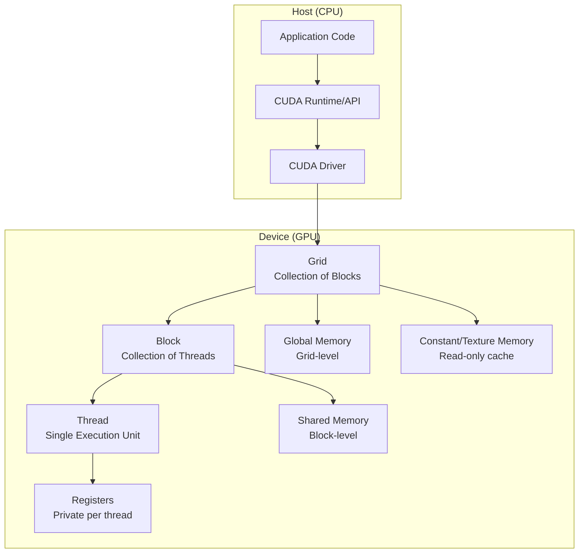
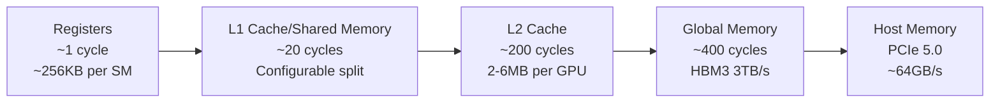
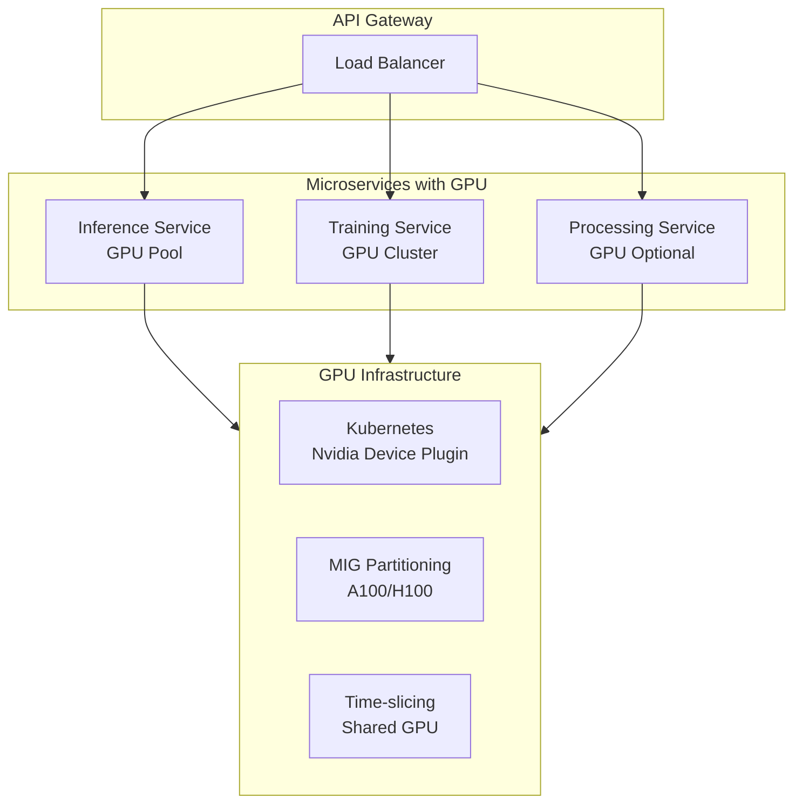
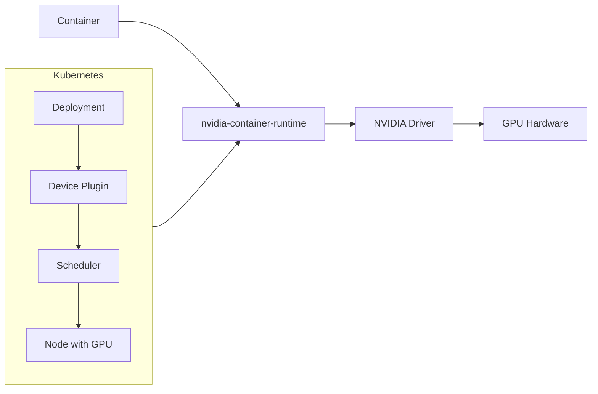

# GPU Computing in Backend Systems

## 1. Mục tiêu của Task

Nghiên cứu bản chất của GPU computing trong backend systems, hiểu sâu cơ chế CUDA kernels, quản lý bộ nhớ GPU, và các pattern tích hợp AI inference acceleration vào microservices architecture. Xác định trade-off, rủi ro production và khuyến nghị thực chiến.

---

## 2. Bản Chất và Cơ Chế Hoạt Động

### 2.1 Tại Sao Cần GPU trong Backend?

| Khía cạnh | CPU | GPU |
|-----------|-----|-----|
| **Architecture** | Few powerful cores (8-64) | Thousands of simple cores (thousands-ten thousands) |
| **Optimized for** | Sequential, branching logic | Parallel, SIMD operations |
| **Memory bandwidth** | ~50-100 GB/s | ~600-3000 GB/s (HBM3) |
| **Latency focus** | Low latency per thread | High throughput overall |
| **Power consumption** | 100-250W | 300-700W |

> **Bản chất quan trọng:** GPU không thay thế CPU. GPU là **co-processor** chuyên xử lý workloads có tính parallel cao: matrix operations, neural network inference, image processing, simulations.

### 2.2 CUDA Execution Model - Bản Chất Từng Tầng



#### Execution Hierarchy (Từ lớn đến nhỏ):

| Level | Scope | Resource | Synchronization |
|-------|-------|----------|-----------------|
| **Grid** | Toàn bộ kernel launch | Global memory | Không đồng bộ giữa blocks |
| **Block** | Group of threads (max 1024) | Shared memory (48KB-164KB) | `__syncthreads()` |
| **Warp** | 32 threads (đơn vị thực thi) | SIMT execution | Ngầm định, lockstep |
| **Thread** | Đơn vị nhỏ nhất | Private registers | Không sync với threads khác |

> **Critical Insight:** Warp divergence là kẻ thù số 1 của performance. Khi threads trong cùng warp thực thi nhánh khác nhau (if/else), GPU phải serialize execution → utilization giảm mạnh.

### 2.3 Memory Hierarchy Deep Dive



| Memory Type | Latency | Size | Visibility | Lifetime |
|-------------|---------|------|------------|----------|
| **Registers** | 1 cycle | 255 registers/thread | Thread | Thread |
| **Shared Memory** | ~20 cycles | 48-164 KB/block | Block | Block |
| **L1 Cache** | ~20 cycles | Configurable with SM | All threads | Application |
| **L2 Cache** | ~200 cycles | 2-6 MB | All SMs | Application |
| **Global Memory** | ~400 cycles | 16-80 GB | All threads | Application |
| **Constant Memory** | Cached | 64 KB | All threads | Application |
| **Host Memory** | ~10 μs | System RAM | CPU + GPU | Application |

> **Memory Coalescing Rule:** Các threads trong warp phải truy cập memory locations liên tiếp để đạt hiệu suất tối đa. Pattern `array[threadIdx.x]` = good. Pattern `array[random_index]` = bad.

### 2.4 CUDA Kernel Launch Flow

```
1. Host allocates device memory (cudaMalloc)
2. Host copies data to device (cudaMemcpy H2D)
3. Host launches kernel: kernel<<<gridDim, blockDim>>>(args)
4. GPU schedules blocks to available SMs
5. Each SM executes warps, context switching miễn phí
6. Kernel completion signal
7. Host copies results back (cudaMemcpy D2H)
8. Host frees device memory (cudaFree)
```

**Stream và Async Execution:**
- Default stream: synchronous, blocking
- Non-default streams: concurrent kernel execution và memory copy
- CUDA Events: timing và dependency management

---

## 3. Kiến Trúc và Luồng Xử Lý

### 3.1 GPU trong Microservices Architecture



### 3.2 GPU Serving Patterns

| Pattern | Use Case | Pros | Cons |
|---------|----------|------|------|
| **Dedicated GPU** | Production inference, latency-critical | Predictable performance, isolation | Cost cao, underutilization |
| **MIG (Multi-Instance GPU)** | A100/H100, nhiều models | Hard isolation, QoS guarantee | Chỉ dùng được trên dòng A100+ |
| **Time-slicing** | Dev/test, low-priority workloads | Flexible sharing | Context switching overhead |
| **GPU Pool** | Batch inference, varied workloads | High utilization, auto-scaling | Scheduling complexity |
| **External GPU Service** | Sporadic GPU needs | No infra management | Network latency, cost/req |

### 3.3 cuDNN và Deep Learning Acceleration

cuDNN (CUDA Deep Neural Network) là library tối ưu hóa primitives cho deep learning:

| Primitive | Optimization | Speedup vs naive |
|-----------|--------------|------------------|
| Convolution | Winograd, FFT, implicit GEMM | 10-50x |
| Matrix Multiply (GEMM) | Tensor Cores (FP16/TF32/BF16) | 8-16x |
| RNN/LSTM | Fused layers, persistent kernels | 5-10x |
| Attention | FlashAttention, fused softmax | 2-4x memory, 2-7x speed |
| Normalization | Fused batch norm, layer norm | 3-5x |

**Tensor Cores (Turing/Ampere/Hopper):**
- Chuyên xử lý mixed-precision: FP16 input, FP32 accumulation
- Mỗi Tensor Core thực hiện 4x4x4 matrix multiply per clock
- Hopper: FP8 support, Transformer Engine (dynamic precision scaling)

---

## 4. So Sánh Các Lựa Chọn Triển Khai

### 4.1 GPU vs CPU cho AI Inference

| Metric | CPU (Intel Xeon) | GPU (NVIDIA A100) | GPU (H100) |
|--------|------------------|-------------------|------------|
| **BERT-Base inference** | 20-50 seq/sec | 2,000-5,000 seq/sec | 5,000-12,000 seq/sec |
| **ResNet-50 batch=64** | 50 img/sec | 6,000 img/sec | 15,000 img/sec |
| **Latency (single req)** | 10-50ms | 5-20ms | 3-10ms |
| **Latency (batch=64)** | 640-3200ms | 80-200ms | 50-120ms |
| **Power efficiency** | Baseline | 10-20x better | 20-30x better |
| **Cost efficiency** | - | 5-10x better | 10-15x better |

> **Key Decision:** GPU vượt trội khi batch size đủ lớn để saturate compute units. Với single-request, low-latency: CPU hoặc specialized accelerators (TPU, Inferentia) có thể tốt hơn.

### 4.2 GPU trong Container và Kubernetes



**Resource Specification:**
```yaml
resources:
  limits:
    nvidia.com/gpu: 1  # Yêu cầu 1 GPU
  requests:
    nvidia.com/gpu: 1
```

**GPU Sharing Strategies:**

| Strategy | Mechanism | Granularity | Use Case |
|----------|-----------|-------------|----------|
| **MIG** | Hardware partition | 1/2/3/4/7 GPU | Production isolation |
| **Time-slicing** | Scheduler multiplexing | Milliseconds | Dev/test |
| **vGPU** | Virtualization layer | Configurable | VDI, cloud |
| **MPS** | Multi-Process Service | Contexts | Multi-tenant inference |

### 4.3 GPU Frameworks Comparison

| Framework | Level | Use Case | Learning Curve |
|-----------|-------|----------|----------------|
| **CUDA C/C++** | Low | Custom kernels, research | Steep |
| **cuDNN** | Primitives | DL acceleration | Moderate |
| **TensorRT** | Optimized inference | Production deployment | Moderate |
| **PyTorch/TensorFlow** | High | Model development | Gentle |
| **ONNX Runtime** | Interoperability | Cross-framework deployment | Gentle |
| **Triton Inference Server** | Serving | Multi-model serving | Moderate |

---

## 5. Rủi Ro, Anti-Patterns và Lỗi Thường Gặp

### 5.1 Critical Production Risks

| Risk | Impact | Mitigation |
|------|--------|------------|
| **CUDA Out of Memory** | Crash, service unavailable | Memory pooling, gradient checkpointing, model sharding |
| **Kernel Timeout** | Watchdog kills kernel | Chunk large workloads, use multiple streams |
| **PCIe Bottleneck** | Data transfer throttling | Zero-copy, unified memory, pinned memory |
| **Thermal Throttling** | Performance degradation | Adequate cooling, temperature monitoring |
| **Driver Incompatibility** | System instability | Version pinning, containerization |
| **NUMA Misalignment** | Slower memory access | CPU-GPU affinity, proper hardware topology |

### 5.2 Common Anti-Patterns

> **❌ Anti-Pattern 1: Synchronous H2D → Kernel → D2H**
```
Bad:  H2D (10ms) → Kernel (5ms) → D2H (10ms) = 25ms total
Good: Stream1: H2D → Kernel → D2H (pipelined)
      Stream2: H2D → Kernel → D2H (overlapped)
      Total ~15ms with 2 streams
```

> **❌ Anti-Pattern 2: Small Batch Inference**
```
Bad:  Batch size = 1, GPU utilization = 5%
Good: Dynamic batching, accumulate requests đến batch size tối ưu
      (thường 8-64 cho NLP, 64-256 cho vision)
```

> **❌ Anti-Pattern 3: Memory Allocation trong Loop**
```c
// BAD: cudaMalloc/cudaFree mỗi iteration
for (int i = 0; i < N; i++) {
    cudaMalloc(&d_data, size);  // Expensive!
    // ... compute ...
    cudaFree(d_data);
}

// GOOD: Memory pooling
MemoryPool pool(size);
for (int i = 0; i < N; i++) {
    void* d_data = pool.allocate();
    // ... compute ...
    pool.deallocate(d_data);
}
```

> **❌ Anti-Pattern 4: Không kiểm tra CUDA Errors**
```c
// BAD: Silent failures
cudaMalloc(&d_ptr, size);  // Có thể fail nhưng không biết
kernel<<<grid, block>>>(d_ptr);  // Undefined behavior nếu malloc fail

// GOOD: Macro check
#define CUDA_CHECK(call) \
    do { \
        cudaError_t err = call; \
        if (err != cudaSuccess) { \
            fprintf(stderr, "CUDA error %s:%d: %s\n", \
                    __FILE__, __LINE__, cudaGetErrorString(err)); \
            exit(1); \
        } \
    } while(0)

CUDA_CHECK(cudaMalloc(&d_ptr, size));
```

### 5.3 Edge Cases và Pitfalls

| Scenario | Problem | Solution |
|----------|---------|----------|
| **First CUDA call slow** | Driver initialization, JIT compilation | Warm-up, pre-compiled kernels |
| **Non-deterministic results** | Floating point associativity | Fixed algorithm, deterministic ops |
| **Memory fragmentation** | Long-running process | Memory pooling, periodic restart |
| **Context switch overhead** | Multiple processes sharing GPU | MPS, MIG, hoặc dedicated GPU |
| **Library version mismatch** | ABI incompatibility | Container images, version locking |

---

## 6. Khuyến Nghị Thực Chiến trong Production

### 6.1 Architecture Best Practices

**1. Separation of Concerns:**
```
┌─────────────────┐     ┌──────────────────┐     ┌─────────────────┐
│  CPU Service    │────▶│  Message Queue   │────▶│  GPU Worker     │
│  (API, Orchestration)│  │  (Redis, Kafka)  │     │  (Inference)    │
└─────────────────┘     └──────────────────┘     └─────────────────┘
       │                                                   │
       │                                            ┌──────┴──────┐
       │                                            │  GPU Pool   │
       └────────────────────────────────────────────│  (A100x8)   │
                                                    └─────────────┘
```
- CPU service xử lý request validation, preprocessing, auth
- Message queue decouple và buffer requests
- GPU workers pull và process với optimal batching

**2. Dynamic Batching:**
```java
// Pseudo-code cho batching scheduler
public class DynamicBatcher {
    private List<Request> buffer = new ArrayList<>();
    private int maxBatchSize = 64;
    private int maxWaitMs = 50;
    
    public void addRequest(Request req) {
        buffer.add(req);
        if (buffer.size() >= maxBatchSize) {
            flush();
        }
    }
    
    @Scheduled(fixedRate = 50)
    public void timeoutFlush() {
        if (!buffer.isEmpty()) {
            flush();
        }
    }
    
    private void flush() {
        // Gửi batch đến GPU
        gpuService.infer(buffer);
        buffer.clear();
    }
}
```

**3. Model Optimization Pipeline:**
```
PyTorch/TensorFlow Model
    ↓
ONNX Export (interoperability)
    ↓
TensorRT Optimization (layer fusion, precision calibration)
    ↓
FP16/INT8 Quantization (2-4x speedup)
    ↓
TensorRT Engine (production deployment)
```

### 6.2 Monitoring và Observability

| Metric | Tool | Alert Threshold |
|--------|------|-----------------|
| **GPU Utilization** | nvidia-smi, DCGM | < 50% (underutilized), > 95% (saturated) |
| **GPU Memory** | nvidia-smi | > 85% (risk of OOM) |
| **Temperature** | NVML | > 80°C (throttling risk) |
| **PCIe Bandwidth** | DCGM | Saturation indicates bottleneck |
| **Kernel Latency** | CUDA Profiling | P99 > SLA threshold |
| **Queue Depth** | Application metric | > 10 (backpressure) |

**Key Dashboards:**
- GPU utilization theo model/service
- Memory usage trends (detect leaks)
- Inference latency distribution (p50, p95, p99)
- Batch size distribution (optimization opportunities)

### 6.3 Scaling Strategies

**Horizontal Scaling (Multi-GPU):**
```
Option 1: Data Parallelism
    - Mỗi GPU giữ full model copy
    - Input data split across GPUs
    - Output aggregated
    
Option 2: Model Parallelism (sharding)
    - Model layers distributed across GPUs
    - Activation communicated between GPUs
    - Cần cho models > single GPU memory
    
Option 3: Tensor Parallelism
    - Individual layers split across GPUs
    - Phức tạp nhất, hiệu quả nhất cho large models
```

**Auto-scaling Policy:**
```yaml
metrics:
  - type: Pods
    pods:
      metric:
        name: gpu_queue_depth
      target:
        type: AverageValue
        averageValue: "5"
  - type: Resource
    resource:
      name: nvidia.com/gpu
      target:
        type: Utilization
        averageUtilization: 70
```

### 6.4 Security Considerations

| Vector | Risk | Mitigation |
|--------|------|------------|
| **Model stealing** | IP theft | Input validation, rate limiting, watermarking |
| **Adversarial attacks** | Incorrect predictions | Input preprocessing, ensemble methods |
| **Side-channel attacks** | Information leakage | Timing attack mitigation, constant-time ops |
| **GPU memory leak** | Cross-tenant data exposure | MIG isolation, memory clearing |
| **Supply chain** | Backdoored models | Model signing, verification |

---

## 7. Kết Luận

### Bản Chất Cốt Lõi

1. **GPU là co-processor, không phải replacement cho CPU.** Kiến trúc SIMT (Single Instruction, Multiple Thread) của GPU tối ưu cho workloads có tính data-parallel cao, đặc biệt là matrix operations trong deep learning.

2. **Memory hierarchy quyết định performance.** Memory bandwidth (3 TB/s cho HBM3) là lý do chính GPU nhanh hơn CPU. Tuy nhiên, latency cao (~400 cycles) đòi hỏi careful memory access patterns (coalescing) và ample parallelism để hide latency.

3. **Batching là yếu tố then chốt.** GPU cần đủ work để saturate thousands of cores. Single-request inference trên GPU thường kém hiệu quả hơn CPU vì overhead và underutilization.

### Trade-off Quan Trọng Nhất

| Trade-off | Consideration |
|-----------|---------------|
| **Latency vs Throughput** | GPU tối ưu throughput qua batching, nhưng làm tăng latency cá nhân. Dynamic batching với timeout là giải pháp cân bằng. |
| **Cost vs Performance** | GPU expensive ($10K-40K/unit) nhưng cost-per-inference thấp hơn CPU cluster tương đương performance. |
| **Complexity vs Efficiency** | CUDA programming cho optimal performance đòi hỏi expertise sâu. Frameworks (TensorRT, Triton) trade some efficiency for usability. |
| **Power vs Density** | GPU rack power density cao (10-15kW/rack) đòi hỏi specialized cooling và power infrastructure. |

### Rủi Ro Lớn Nhất trong Production

1. **CUDA Out of Memory** - Crash không graceful, cần memory pooling và careful capacity planning
2. **PCIe bottleneck** - Data transfer giữa CPU-GPU có thể thành bottleneck nếu không optimize
3. **Underutilization** - GPU expensive, underutilization là waste lớn → cần monitoring và right-sizing

### Khuyến Nghị Cuối Cùng

- **Bắt đầu với managed services** (AWS SageMaker, GCP Vertex AI) trước khi tự quản lý GPU infrastructure
- **Sử dụng TensorRT/Triton** cho production inference thay vì raw PyTorch/TensorFlow
- **Implement dynamic batching** để đạt throughput tối ưu mà không sacrifice latency quá nhiều
- **Monitor GPU utilization** - target 70-90% utilization, adjust batch size và model selection accordingly
- **Plan for failures** - GPU hardware failures common hơn CPU, cần redundancy và graceful degradation

---

## 8. Tài Liệu Tham Khảo

1. **NVIDIA CUDA Programming Guide** - https://docs.nvidia.com/cuda/
2. **CUDA Best Practices Guide** - Memory optimization, occupancy
3. **TensorRT Documentation** - Production inference optimization
4. **NVIDIA Triton Inference Server** - Multi-model serving
5. **NVIDIA Data Center GPU Manager (DCGM)** - GPU monitoring
6. **Kubernetes GPU Scheduling** - https://kubernetes.io/docs/tasks/manage-gpus/
7. **CUDA Memory Model** - PTX ISA documentation

---

*Document version: 1.0*  
*Last updated: 2025-03-27*  
*Researcher: Senior Backend Architect*
