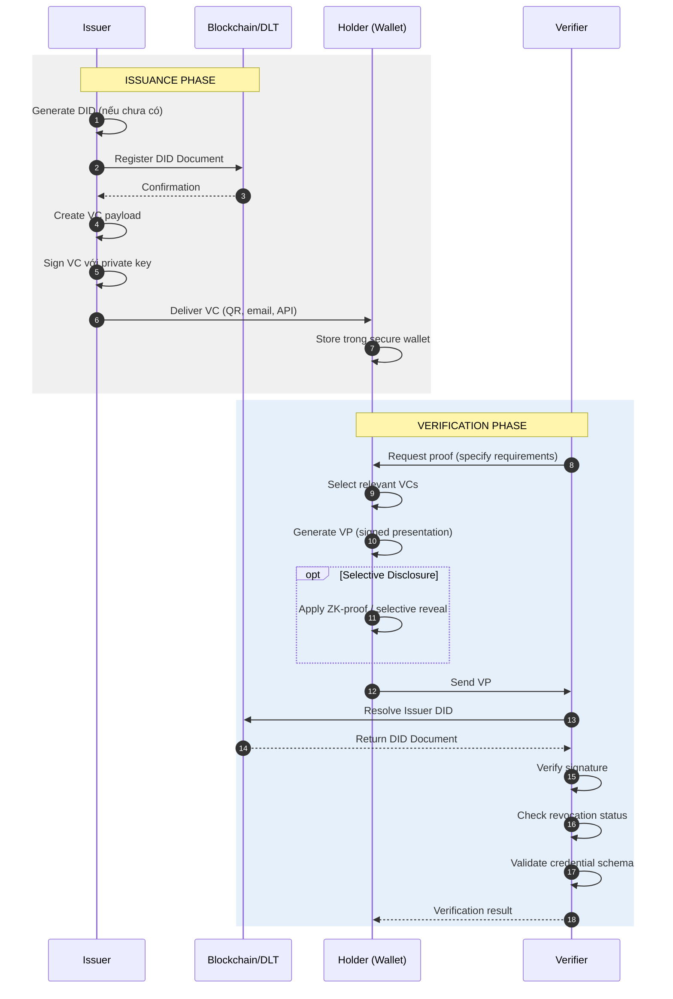

# Decentralized Identity (DID) & Verifiable Credentials

> **Bản chất:** Chuyển quyền kiểm soát danh tính số từ tổ chức tập trung sang cá nhân, dựa trên cryptography và decentralized trust thay vì centralized authority.

---

## 1. Mục Tiêu Củả Task

Hiểu sâu:
- **Bản chất cơ chế:** DID document, DID resolution, verifiable credentials data model
- **Mục tiêu thiết kế:** Self-sovereign identity (SSI) - ngườí dùng tự chủ danh tính
- **Trust frameworks:** Làm sao tin tưởng mà không cần centralized authority
- **Revocation & lifecycle:** Thu hồi credentials mà không làm lộ thông tin
- **Production challenges:** Interoperability, key management, regulatory compliance

---

## 2. Bản Chất Và Cơ Chế Hoạt Động

### 2.1 Kiến Trúc Tổng Quan: Tam Giác SSI

```
┌─────────────────────────────────────────────────────────────────────────┐
│                         DECENTRALIZED IDENTITY                          │
│                                                                         │
│     ┌──────────────┐         ┌──────────────┐         ┌──────────────┐  │
│     │   HOLDER     │◄────────│   ISSUER     │         │   VERIFIER   │  │
│     │  (Ngườí      │  VC     │  (Ngườí cấp  │         │  (Ngườí      │  │
│     │   dùng)      │         │   phát)      │         │   xác thực)  │  │
│     └──────┬───────┘         └──────────────┘         └──────┬───────┘  │
│            │                                                 ▲          │
│            │              ┌──────────────┐                  │          │
│            └─────────────►│  BLOCKCHAIN/ │──────────────────┘          │
│                 DID Doc   │   DLT /      │        Verify               │
│                           │  Distributed │        Signature            │
│                           │   Ledger     │                             │
│                           └──────────────┘                             │
│                                  ▲                                      │
│                                  │                                      │
│                           ┌──────────────┐                             │
│                           │  DID Registry│                             │
│                           │  (Ethereum,  │                             │
│                           │  Bitcoin,    │                             │
│                           │  Sovrin...)  │                             │
│                           └──────────────┘                             │
└─────────────────────────────────────────────────────────────────────────┘
```

### 2.2 DID (Decentralized Identifier) - Bản Chất

**Định nghĩa cốt lõi:**

```
did:method:specific-identifier
│   │      │
│   │      └──> Ethereum address, public key hash, unique string...
│   │
│   └──> did:ethr, did:web, did:key, did:ion...
│
└──> Scheme cố định theo W3C standard
```

**Ví dụ thực tế:**
- `did:ethr:0x1234...abcd` - Ethereum-based DID
- `did:web:example.com` - Web domain-based DID
- `did:key:z6Mk...` - Cryptographic key-based DID (self-contained)
- `did:ion:EiClk...` - Bitcoin Sidetree-based DID (Microsoft)

**Bản chất kỹ thuật:**

DID không phải là "account" mà là **pointer tới DID Document** - một JSON-LD object chứa:

```json
{
  "@context": ["https://www.w3.org/ns/did/v1"],
  "id": "did:example:123456789abcdefghi",
  "verificationMethod": [{
    "id": "did:example:123456789abcdefghi#keys-1",
    "type": "Ed25519VerificationKey2018",
    "controller": "did:example:123456789abcdefghi",
    "publicKeyBase58": "H3C2AVvLMv6gmMNam3uVAjZpfkcJCwDwnZn6z3wXmqPV"
  }],
  "authentication": ["did:example:123456789abcdefghi#keys-1"],
  "service": [{
    "id": "did:example:123456789abcdefghi#vcs",
    "type": "VerifiableCredentialService",
    "serviceEndpoint": "https://example.com/vc/"
  }]
}
```

**Các thành phần quan trọng:**

| Thành phần | Mục đích | Trade-off |
|-----------|---------|-----------|
| `verificationMethod` | Public keys để verify signature | Nhiều keys = linh hoạt nhưng tăng attack surface |
| `authentication` | Chỉ định keys dùng để authenticate | Separation of concerns vs complexity |
| `assertionMethod` | Keys dùng để issue credentials | Delegate issuance vs central control |
| `service` | Endpoint cho additional services | Privacy leak risk vs convenience |
| `alsoKnownAs` | Canonical aliases | Interoperability vs confusion |

### 2.3 DID Resolution - Cơ Chế Phân Giải

**Bản chất:** DID resolver ánh xạ DID string → DID Document thông qua method-specific logic.

```
┌─────────────┐     ┌─────────────────┐     ┌─────────────────┐
│   did:ethr  │────►│  Ethereum       │────►│  Smart Contract │
│  0x1234...  │     │  Mainnet/       │     │  Registry       │
└─────────────┘     │  Sepolia        │     │  (lookup)       │
                    └─────────────────┘     └─────────────────┘
                                                       │
                                                       ▼
┌─────────────┐     ┌─────────────────┐     ┌─────────────────┐
│  did:web:   │────►│  HTTPS GET      │────►│  /.well-known/  │
│ example.com │     │  DNS resolution │     │  did.json       │
└─────────────┘     └─────────────────┘     └─────────────────┘
                                                       │
┌─────────────┐     ┌─────────────────┐                │
│   did:key   │────►│  Multibase      │────────────────┘
│  z6Mk...    │     │  decode (local) │     (no network!)
└─────────────┘     └─────────────────┘
```

**Phân loại DID methods theo trust model:**

| Category | Examples | Trust Assumption | Use Case |
|----------|----------|------------------|----------|
| **Blockchain-based** | did:ethr, did:ion, did:sov | Consensus của network | High-assurance identity |
| **Web-based** | did:web, did:webvh | DNS + HTTPS PKI | Enterprise integration |
| **Self-contained** | did:key, did:jwk | Cryptography only | Ephemeral, offline-capable |
| **Distributed** | did:cheqd, did:indy | Permissioned validators | Enterprise/private networks |

> **Trade-off quan trọng:** Blockchain-based = censorship-resistant nhưng costly; did:key = privacy-preserving nhưng không revocable; did:web = simple nhưng lệ thuộc domain owner.

### 2.4 Verifiable Credentials (VC) - Cơ Chế Bên Trong

**Bản chất:** VC là tam giác cryptographically signed:

```
┌─────────────────────────────────────────────────────────────┐
│                    VERIFIABLE CREDENTIAL                     │
├─────────────────────────────────────────────────────────────┤
│  HEADER (Proof)                                             │
│  ├── type: "Ed25519Signature2020"                          │
│  ├── created: "2024-01-15T10:30:00Z"                       │
│  ├── verificationMethod: "did:issuer#key-1"                │
│  └── proofPurpose: "assertionMethod"                        │
├─────────────────────────────────────────────────────────────┤
│  PAYLOAD (Claims)                                           │
│  ├── @context: ["https://www.w3.org/2018/credentials/v1"]  │
│  ├── type: ["VerifiableCredential", "UniversityDegree"]    │
│  ├── issuer: "did:university:123"                          │
│  ├── issuanceDate: "2024-01-15"                            │
│  ├── credentialSubject: {                                   │
│  │   ├── id: "did:holder:abc"      ◄── Subject = Holder   │
│  │   ├── degree: {                                          │
│  │   │   ├── type: "BachelorDegree"                        │
│  │   │   └── name: "Computer Science"                      │
│  │   │   └── graduationDate: "2024-01-15"                  │
│  │   └── gpa: "3.8"          ◄── Selective disclosure có   │
│  │                              thể ẩn field này           │
│  └── }                                                      │
├─────────────────────────────────────────────────────────────┤
│  SIGNATURE                                                  │
│  └── jws: "eyJhbG...XHU3Njw"  ◄── Issuer sign = trust      │
└─────────────────────────────────────────────────────────────┘
```

**Cơ chế Selective Disclosure (Bằng chứng không tiết lộ):**

```
┌────────────────────────────────────────────────────────────────┐
│              ZERO-KNOWLEDGE PROOF IN VCs                       │
├────────────────────────────────────────────────────────────────┤
│                                                                │
│   Original VC (Holder có)          Verifiable Presentation    │
│   ┌─────────────────────┐          (Gửi cho Verifier)        │
│   │  name: "Nguyễn Văn A"│          ┌─────────────────────┐   │
│   │  birthDate: 1990    │          │  proof: ZK-Proof    │   │
│   │  salary: $100k      │   ───►   │  revealed: {        │   │
│   │  employer: "Corp X" │          │    age > 21: true   │   │
│   └─────────────────────┘          │    salary > $50k: true│  │
│                                    │  }                  │   │
│                                    │  hidden: [name,     │   │
│                                    │           employer] │   │
│                                    └─────────────────────┘   │
│                                                                │
│   Verifier biết: "Ngườí này >21 tuổi và lương >$50k"          │
│   Verifier KHÔNG biết: tên, tuổi chính xác, tên công ty        │
│                                                                │
└────────────────────────────────────────────────────────────────┘
```

> **Công nghệ:** BBS+ signatures, zk-SNARKs/STARKs, hoặc JSON-LD frame-based selective disclosure.

### 2.5 Trust Framework - Làm Sao Tin Tưởng?

**Vấn đề:** Không có centralized CA (Certificate Authority), làm sao verifier biết issuer đáng tin?

**Các mô hình trust:**

```
┌─────────────────────────────────────────────────────────────────────┐
│                    TRUST FRAMEWORK MODELS                           │
├─────────────────────────────────────────────────────────────────────┤
│                                                                     │
│  1. WEB OF TRUST (Decentralized)                                   │
│     ┌───┐    ┌───┐    ┌───┐                                        │
│     │ A │◄──►│ B │◄──►│ C │    Mỗi ngườí tự quyết định tin ai     │
│     └───┘    └───┘    └───┘    PGP-style, reputation-based         │
│        ▲        ▲                                                   │
│        └────────┘                                                   │
│                                                                     │
│  2. TRUST REGISTRY (Federated)                                     │
│     ┌─────────────────┐                                             │
│     │  Governance     │    Danh sách approved issuers              │
│     │  Framework      │    (EU eIDAS, US DIACC, ToIP)              │
│     │  (DID:trusted)  │                                             │
│     └────────┬────────┘                                             │
│              │                                                      │
│     ┌────────┴────────┐                                             │
│     │  Approved       │                                             │
│     │  Issuers List   │                                             │
│     └─────────────────┘                                             │
│                                                                     │
│  3. SELF-ATTESTED (Minimal)                                        │
│     ┌───┐     Không cần issuer!                                    │
│     │Me │────► Self-issued credentials                              │
│     └───┘     (phù hợp cho basic claims)                           │
│                                                                     │
└─────────────────────────────────────────────────────────────────────┘
```

**Trust Triangle trong SSI:**

```
         ┌─────────────┐
         │   ISSUER    │
         │  (Authority)│
         │  Signs VC    │
         └──────┬──────┘
                │ Trust =
                │ Reputation +
                │ Governance
       ┌────────┴────────┐
       │                 │
       ▼                 ▼
┌─────────────┐   ┌─────────────┐
│   HOLDER    │◄──┤  VERIFIER   │
│  (Controls) │VP │  (Validates)│
│  Presents VC│   │  Checks proof│
└─────────────┘   └─────────────┘

HOLDER không cần tin ISSUER, VERIFIER quyết định tin ISSUER
```

---

## 3. Kiến Trúc Và Luồng Xử Lý

### 3.1 Luồng Complete: Issue → Hold → Verify



### 3.2 Revocation - Vấn Đề Hóc Búa

**Challenge:** Làm sao revoke credential mà không:
1. Lộ danh sách tất cả credentials?
2. Lộ thông tin holder bị revoke?
3. Require constant online check?

**Giải pháp: Revocation Status List**

```
┌─────────────────────────────────────────────────────────────────────┐
│           PRIVACY-PRESERVING REVOCATION (Status List 2021)         │
├─────────────────────────────────────────────────────────────────────┤
│                                                                     │
│   Issuer maintains compressed bitstring:                           │
│   ┌─────────────────────────────────────────────────────────┐      │
│   │ Index:  0  1  2  3  4  5  6  7  8  9  10 11 12 ...      │      │
│   │ Status: 0  0  1  0  0  0  1  0  0  0  0  1  0  ...      │      │
│   │         │  │  │  │  │  │  │  │  │  │  │  │             │      │
│   │         └──┴──┘  └──┴──┘  └──┴──┘  └──┘               │      │
│   │           Active    Active   Revoked  Active           │      │
│   └─────────────────────────────────────────────────────────┘      │
│                                                                     │
│   VC của Alice chứa:                                               │
│   {                                                                 │
│     "credentialStatus": {                                          │
│       "id": "https://issuer.com/status/3#12345",                  │
│       "type": "StatusList2021Entry",                              │
│       "statusListIndex": "12345",    ◄── Chỉ số trong bitstring  │
│       "statusListCredential": "https://issuer.com/status/3"       │
│     }                                                              │
│   }                                                                 │
│                                                                     │
│   Verifier download toàn bộ list (compressed), check index 12345   │
│   → Không biết Alice là ai trong danh sách!                        │
│   → Batch verification possible                                    │
│                                                                     │
└─────────────────────────────────────────────────────────────────────┘
```

**So sánh các phương pháp revocation:**

| Phương pháp | Privacy | Scalability | Latency | Complexity |
|-------------|---------|-------------|---------|------------|
| **Status List 2021** | High (k-anonymity) | High (compressed) | Low | Medium |
| **CRL (Certificate Revocation List)** | Low (có thể liệt kê) | Medium | Medium | Low |
| **OCSP** | Low (real-time query) | High | Low | Medium |
| **Accumulator (RSA/ECC)** | High (ZK-proof) | Medium | Medium | High |
| **Merkle Tree** | Medium | High | Low | Medium |

### 3.3 Wallet Architecture - Holder Side

```
┌─────────────────────────────────────────────────────────────────────┐
│                     SSI WALLET ARCHITECTURE                         │
├─────────────────────────────────────────────────────────────────────┤
│                                                                     │
│  ┌─────────────────────────────────────────────────────────────┐   │
│  │                    SECURE STORAGE LAYER                      │   │
│  │  ┌──────────────┐  ┌──────────────┐  ┌──────────────┐       │   │
│  │  │ Master Secret│  │ Private Keys │  │   VCs/VPs    │       │   │
│  │  │  (seed phrase│  │  (HD Wallet) │  │  (encrypted) │       │   │
│  │  │   BIP-39/44) │  │              │  │              │       │   │
│  │  └──────────────┘  └──────────────┘  └──────────────┘       │   │
│  │                    Hardware Security Module (HSM/TEE)        │   │
│  └──────────────────────────────┬──────────────────────────────┘   │
│                                 │                                   │
│  ┌──────────────────────────────┼──────────────────────────────┐   │
│  │           AGENT LAYER        │                              │   │
│  │  ┌─────────────┐  ┌──────────┴──────────┐  ┌─────────────┐  │   │
│  │  │  DIDComm    │  │  Credential         │  │  Resolution │  │   │
│  │  │  Messaging  │  │  Handler            │  │  (Universal │  │   │
│  │  │  (RFC 0019) │  │  (issue/verify)     │  │   Resolver) │  │   │
│  │  └─────────────┘  └─────────────────────┘  └─────────────┘  │   │
│  └─────────────────────────────────────────────────────────────┘   │
│                                                                     │
│  ┌─────────────────────────────────────────────────────────────┐   │
│  │                    PRESENTATION LAYER                        │   │
│  │         (UI/UX cho user consent và selective disclosure)     │   │
│  └─────────────────────────────────────────────────────────────┘   │
│                                                                     │
└─────────────────────────────────────────────────────────────────────┘
```

---

## 4. So Sánh Các Lựa Chọn

### 4.1 DID Methods Comparison

| Method | Underlying Tech | Cost | Privacy | Performance | Best For |
|--------|-----------------|------|---------|-------------|----------|
| **did:ethr** | Ethereum | Gas fees | Pseudonymous | ~15s finality | DeFi, public chains |
| **did:ion** | Bitcoin Sidetree | Low (batch) | Pseudonymous | ~10m anchor | Enterprise, Microsoft ecosystem |
| **did:key** | Standalone key | Free | Ephemeral | Instant | IoT, ephemeral sessions |
| **did:web** | HTTPS/DNS | Domain cost | Tied to domain | Instant | Enterprise integration |
| **did:indy** | Hyperledger Indy | Permissioned | Selective disclosure | Fast | Enterprise private networks |
| **did:cheqd** | Cosmos SDK | Low | Configurable | Fast | Interoperability focus |

### 4.2 Credential Formats

| Format | Standard | Interop | Features | Ecosystem |
|--------|----------|---------|----------|-----------|
| **W3C VC 2.0** | W3C | High | ZK-proof, JSON-LD | Universal |
| **JWT-VC** | IETF | High | Simple, compact | OIDC/SIOP |
| **AnonCreds** | Hyperledger | Medium | ZK-proofs built-in | Indy/Aries |
| **SD-JWT** | IETF draft | Medium | Selective disclosure | OID4VC |
| **mDL (ISO 18013-5)** | ISO | Low | Mobile driving license | Government |

### 4.3 SSI vs Traditional Identity

| Aspect | Traditional (SAML/OAuth) | SSI (DID/VC) |
|--------|--------------------------|--------------|
| **Identity Owner** | Service Provider | Individual (Holder) |
| **Trust Model** | Federated/Delegated | Self-sovereign + Verifiable |
| **Data Storage** | Centralized silos | Edge (user-controlled) |
| **Portability** | Locked to provider | Universal, interoperable |
| **Privacy** | Provider sees everything | Selective disclosure |
| **Offline capable** | No | Yes (did:key) |
| **Revocation** | Central admin | Cryptographic status list |
| **Complexity** | Established, simpler | Emerging, more complex |
| **Regulatory** | Well-understood | Evolving (eIDAS 2.0) |

---

## 5. Rủi Ro, Anti-Patterns, Lỗi Thường Gặp

### 5.1 Security Risks

```
┌─────────────────────────────────────────────────────────────────────┐
│                    CRITICAL SECURITY RISKS                          │
├─────────────────────────────────────────────────────────────────────┤
│                                                                     │
│  🔴 KEY COMPROMISE                                                  │
│     ├── DID keys stolen → attacker can impersonate indefinitely    │
│     ├── Mitigation: Key rotation, multi-key setup, HSM             │
│     └── Recovery: DID controller update (nếu method hỗ trợ)        │
│                                                                     │
│  🔴 REVOCATION BYPASS                                               │
│     ├── Verifier không check revocation status                     │
│     ├── Compromised VC vẫn được accept                             │
│     └── Mitigation: Mandatory revocation check trong verifier lib  │
│                                                                     │
│  🔴 CORRELATION ATTACKS                                             │
│     ├── Same DID used everywhere → tracking across services        │
│     ├── VC issuance reveals holder identity                        │
│     └── Mitigation: Pairwise DIDs, selective disclosure, ZK-proofs │
│                                                                     │
│  🔴 SMART CONTRACT BUGS (on-chain DIDs)                             │
│     ├── Logic flaw trong DID registry                              │
│     ├── Immutable bug = permanent vulnerability                    │
│     └── Mitigation: Formal verification, audits, upgrade patterns  │
│                                                                     │
│  🔴 MAN-IN-THE-MIDDLE (did:web)                                     │
│     ├── DNS hijacking, compromised web server                      │
│     └── Mitigation: Certificate pinning, multi-factor verification │
│                                                                     │
└─────────────────────────────────────────────────────────────────────┘
```

### 5.2 Anti-Patterns Production

| Anti-Pattern | Vấn đề | Giải pháp |
|--------------|--------|-----------|
| **Single DID for all purposes** | Correlation, privacy loss | Pairwise DIDs (mỗi relationship = DID mới) |
| **Storing VCs on public blockchain** | GDPR violation, data exposure | Store hash on-chain, VC off-chain |
| **Ignoring key rotation** | Long-term compromise risk | Scheduled rotation, recovery mechanisms |
| **Hard-coded resolver endpoints** | Single point of failure | Universal Resolver, local caching |
| **No consent management** | User không control data sharing | Clear consent UI, data minimization |
| **Synchronous only** | Offline scenarios fail | Async protocols, delayed verification |

### 5.3 Edge Cases & Failure Modes

```
┌─────────────────────────────────────────────────────────────────────┐
│                    EDGE CASES & FAILURE MODES                       │
├─────────────────────────────────────────────────────────────────────┤
│                                                                     │
│  1. DID Resolution Failure                                          │
│     ├── Network partition → cannot resolve issuer DID              │
│     ├── Ledger reorganization (blockchain) → temporary invalidity  │
│     └── Mitigation: Caching, local DID document storage            │
│                                                                     │
│  2. Key Recovery Scenarios                                          │
│     ├── Lost device = lost keys (nếu không có backup)              │
│     ├── Social recovery: n-of-m guardians                           │
│     └── Mitigation: Shamir secret sharing, hardware backup         │
│                                                                     │
│  3. Cross-Method Verification                                       │
│     ├── Issuer dùng did:ethr, Verifier chỉ hỗ trợ did:web          │
│     └── Mitigation: Universal Resolver, method-agnostic libraries   │
│                                                                     │
│  4. Schema Evolution                                                │
│     ├── Old verifier không hiểu new credential format              │
│     └── Mitigation: Semantic versioning, backward-compatible JSON-LD│
│                                                                     │
│  5. Regulatory Compliance                                           │
│     ├── Right to be forgotten vs immutable blockchain              │
│     └── Mitigation: Off-chain storage, hash-only on-chain          │
│                                                                     │
└─────────────────────────────────────────────────────────────────────┘
```

---

## 6. Khuyến Nghị Thực Chiến Production

### 6.1 Architecture Patterns

```
┌─────────────────────────────────────────────────────────────────────┐
│              PRODUCTION SSI ARCHITECTURE PATTERNS                   │
├─────────────────────────────────────────────────────────────────────┤
│                                                                     │
│  PATTERN 1: HYBRID ON/OFF-CHAIN                                     │
│  ┌─────────────┐     ┌─────────────┐     ┌─────────────┐           │
│  │   Issuer    │────►│  Private    │────►│  Public     │           │
│  │   System    │     │  Storage    │     │  Registry   │           │
│  │             │     │  (VC data)  │     │  (DID hash) │           │
│  └─────────────┘     └─────────────┘     └─────────────┘           │
│                                                                     │
│  PATTERN 2: LAYERED VERIFICATION                                    │
│  ┌─────────────────────────────────────────────────────────┐       │
│  │  Layer 1: Cryptographic signature check (fast)          │       │
│  │  Layer 2: Revocation status check (cached)              │       │
│  │  Layer 3: Trust framework validation (policy-based)     │       │
│  │  Layer 4: Business logic verification (domain-specific) │       │
│  └─────────────────────────────────────────────────────────┘       │
│                                                                     │
│  PATTERN 3: MULTI-METHOD SUPPORT                                    │
│  ┌─────────────┐                                                    │
│  │  Universal  │──► did:ethr resolver                              │
│  │  Resolver   │──► did:web resolver                               │
│  │  Gateway    │──► did:key resolver                               │
│  │             │──► did:ion resolver                               │
│  └─────────────┘    (pluggable, configurable)                      │
│                                                                     │
└─────────────────────────────────────────────────────────────────────┘
```

### 6.2 Technology Stack Recommendations

| Layer | Recommended | Alternatives | Notes |
|-------|-------------|--------------|-------|
| **DID Method** | did:web (enterprise), did:ethr (public) | did:ion, did:key | Match use case |
| **VC Format** | W3C VC 2.0 | JWT-VC, AnonCreds | Interoperability |
| **Wallet** | Aries Framework | Web5, Veramo | Mature ecosystems |
| **Resolver** | Universal Resolver | Local resolver | Caching strategy |
| **Storage** | Encrypted local + IPFS/Arweave | Private cloud | Redundancy |
| **Crypto** | Ed25519, BLS12-381 | secp256k1 | Quantum-resistant prep |

### 6.3 Monitoring & Observability

```
┌─────────────────────────────────────────────────────────────────────┐
│                    SSI MONITORING METRICS                           │
├─────────────────────────────────────────────────────────────────────┤
│                                                                     │
│  OPERATIONAL METRICS:                                               │
│  ├── DID resolution latency (p50, p99)                              │
│  ├── VC verification throughput (ops/sec)                          │
│  ├── Revocation check cache hit rate                               │
│  └── Cross-method interoperability success rate                    │
│                                                                     │
│  SECURITY METRICS:                                                  │
│  ├── Revoked credential detection count                            │
│  ├── Invalid signature attempts                                    │
│  ├── Key rotation frequency per DID                                │
│  └── Correlation attack attempts (anomaly detection)               │
│                                                                     │
│  BUSINESS METRICS:                                                  │
│  ├── Credential issuance volume by type                            │
│  ├── Verification success rate by issuer                           │
│  ├── User adoption (wallet installs, active DIDs)                  │
│  └── Average credentials per holder                                │
│                                                                     │
└─────────────────────────────────────────────────────────────────────┘
```

### 6.4 Migration Strategy từ Legacy

```
┌─────────────────────────────────────────────────────────────────────┐
│                 MIGRATION: TRADITIONAL → SSI                        │
├─────────────────────────────────────────────────────────────────────┤
│                                                                     │
│  PHASE 1: PARALLEL ISSUANCE (6-12 tháng)                           │
│  ├── Issue cả traditional (JWT) và SSI (VC) credentials            │
│  ├── Backward compatibility maintained                             │
│  └── Users dần adopt SSI wallets                                   │
│                                                                     │
│  PHASE 2: SSI PREFERRED (6-12 tháng)                               │
│  ├── New features chỉ trên SSI                                     │
│  ├── Legacy maintenance mode                                        │
│  └── Incentive structures cho migration                            │
│                                                                     │
│  PHASE 3: SSI NATIVE (12+ tháng)                                   │
│  ├── Legacy system deprecation                                      │
│  ├── Full SSI architecture                                          │
│  └── Decommission traditional identity provider                    │
│                                                                     │
│  KEY SUCCESS FACTORS:                                               │
│  ✓ Executive sponsorship                                            │
│  ✓ User education và UX investment                                  │
│  ✓ Regulatory alignment (eIDAS 2.0 in EU)                          │
│  ✓ Interoperability testing với partners                           │
│                                                                     │
└─────────────────────────────────────────────────────────────────────┘
```

---

## 7. Kết Luận

### Bản Chất Của Decentralized Identity

> **DID/VC không phải là công nghệ "thay thế" identity truyền thống - đó là sự dịch chuyển quyền lực từ tổ chức sang cá nhân, dựa trên cryptography thay vì legal contracts.**

**Core Insights:**

1. **Cryptographic Trust > Institutional Trust**
   - Không cần tin tưởng issuer vì tổ chức "lớn", mà vì public key có thể verify
   - Trust framework chuyển từ "brand reputation" sang "governance rules"

2. **Selective Disclosure là Killer Feature**
   - Chứng minh thuộc tính mà không lộ dữ liệu (ZK-proofs)
   - Privacy-preserving compliance (age verification không cần birth date)

3. **Key Management là Achilles Heel**
   - User-controlled keys = user-responsible security
   - Recovery mechanisms quan trọng hơn issuance mechanisms

4. **Interoperability > Innovation**
   - W3C standards, DID Core, VC Data Model là foundation
   - Proprietary solutions sẽ thất bại như identity silos hiện tại

**Trade-offs Quan Trọng Nhất:**

| Dimension | Traditional | SSI | When to Choose |
|-----------|-------------|-----|----------------|
| **Privacy** | Low | High | SSI cho sensitive personal data |
| **Usability** | High | Medium | Traditional cho mass consumer apps |
| **Auditability** | Centralized | Decentralized | SSI cho regulatory transparency |
| **Recovery** | Easy (reset password) | Complex | Hybrid cho critical accounts |
| **Performance** | Fast | Slower (crypto ops) | Traditional cho high-throughput |

**Rủi Ro Lớn Nhất Trong Production:**

1. **Key compromise without recovery** → Permanent identity loss
2. **Correlation attacks via DID reuse** → Privacy violations
3. **Blockchain dependency** → Availability và cost risks
4. **Regulatory uncertainty** → eIDAS 2.0, GDPR compliance complexity

**Tương Lai (2024-2027):**

- **eIDAS 2.0** (EU) sẽ mandate EUDI wallets - SSI at government scale
- **Passkeys + SSI convergence** - FIDO2 và DID/VC hội tụ
- **Enterprise adoption** - Microsoft Entra Verified ID, IBM Verify Credentials
- **AI-generated identity attacks** - SSI sẽ critical để combat deepfakes

---

## 8. Tài Liệu Tham Khảo

### Standards
- W3C DID Core 1.0: https://www.w3.org/TR/did-core/
- W3C VC Data Model 2.0: https://www.w3.org/TR/vc-data-model-2.0/
- DIDComm Messaging: https://identity.foundation/didcomm-messaging/spec/

### Implementations
- Hyperledger Aries: https://github.com/hyperledger/aries-framework-go
- Veramo: https://veramo.io/
- Web5 SDK: https://developer.tbd.website/
- Microsoft Entra Verified ID: https://aka.ms/verifiedid

### Trust Frameworks
- Trust Over IP (ToIP): https://trustoverip.org/
- EU eIDAS 2.0: https://digital-strategy.ec.europa.eu/en/policies/eidas-regulation
- DIF (Decentralized Identity Foundation): https://identity.foundation/

---

*Research completed: March 27, 2026*
