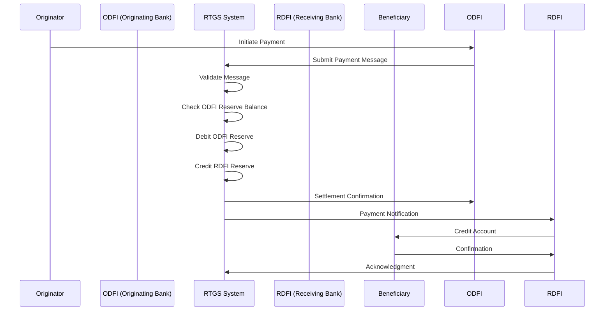
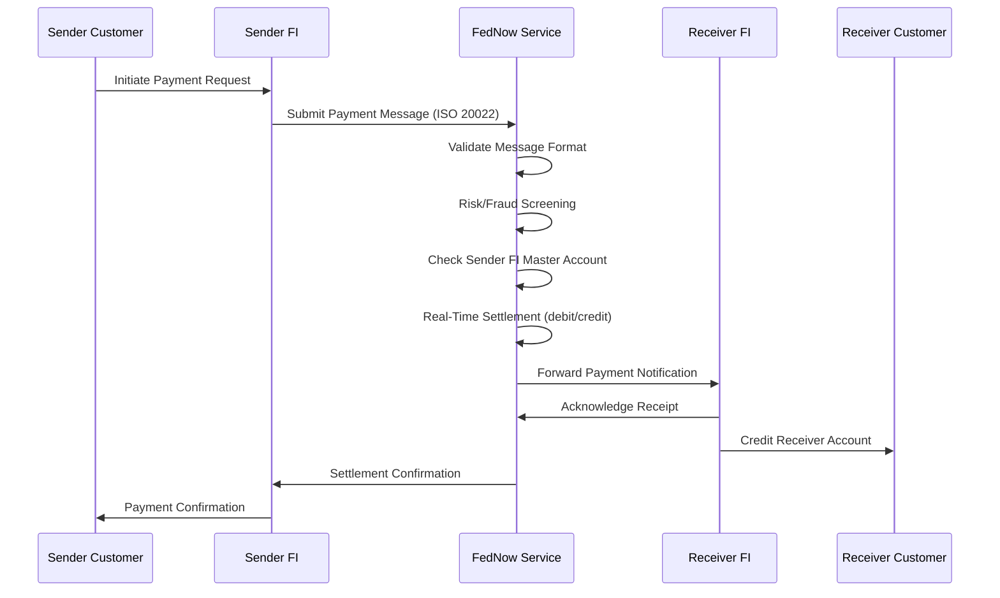

# Instant Payment Architecture: Kiến Trúc Thanh Toán Thởi Gian Thực

> **Mục tiêu:** Hiểu sâu bản chất hệ thống thanh toán tức thờ (Instant Payment), các tiêu chuẩn messaging (ISO 20022), cơ chế settlement, quản lý thanh khoản và vận hành 24/7.

---

## 1. Mục tiêu của Task

Nghiên cứu bản chất kiến trúc hệ thống thanh toán thởi gian thực (Real-Time Payment - RTP), bao gồm:
- Tiêu chuẩn **ISO 20022** - ngôn ngữ chung cho dữ liệu tài chính
- Các hệ thống thanh toán tức thờ điển hình: **SEPA Instant**, **FedNow**
- Cơ chế **Real-Time Gross Settlement (RTGS)** và quản lý thanh khoản
- Yêu cầu vận hành **24/7/365** và các thách thức kỹ thuật

---

## 2. Bản Chất và Cơ Chế Hoạt Động

### 2.1 ISO 20022: Tiêu Chuẩn Messaging Tài Chính

#### Bản chất cơ chế

ISO 20022 không chỉ là một định dạng message - đây là một **mô hình dữ liệu ngữ nghĩa (semantic data model)** được thiết kế để mang ý nghĩa kinh doanh, không chỉ cấu trúc kỹ thuật.

**Kiến trúc tầng (Layered Architecture):**

```
┌─────────────────────────────────────────────┐
│  Business Layer (Business Concepts)         │
│  - Payment, Account, Party, Agent           │
├─────────────────────────────────────────────┤
│  Message Layer (Message Definitions)        │
│  - pacs.008 (FIToFICustomerCreditTransfer)  │
│  - pain.001 (CustomerCreditTransferInit)    │
├─────────────────────────────────────────────┤
│  Syntax Layer (Serialization)               │
│  - XML, JSON, ASN.1, Protocol Buffers       │
└─────────────────────────────────────────────┘
```

**Cấu trúc message ISO 20022:**

```
Message Definition
├── Business Header (From, To, Creation DateTime)
├── Group Header (Message ID, Number of Transactions)
└── Payment Information
    ├── Debtor (Ngưởi trả)
    ├── Debtor Agent (Ngân hàng gửi)
    ├── Intermediary Agent (Trung gian - optional)
    ├── Creditor Agent (Ngân hàng nhận)
    ├── Creditor (Ngưởi nhận)
    └── Remittance Information (Nội dung thanh toán)
```

> **Quan trọng:** ISO 20022 sử dụng **XML Schema Definition (XSD)** để định nghĩa cấu trúc, nhưng bản chất là **business model** - mỗi element có ý nghĩa kinh doanh rõ ràng, không chỉ là trường dữ liệu.

#### Trade-off: ISO 20022 vs Legacy Formats (SWIFT MT)

| Aspect | ISO 20022 (MX) | SWIFT MT | Impact |
|--------|----------------|----------|---------|
| **Data Richness** | 10,000+ data elements | ~100 fields | MX cho phép structured remittance, richer reconciliation |
| **Extensibility** | XML/JSON based, dễ mở rộng | Fixed-length, rigid | MX hỗ trợ innovation nhanh hơn |
| **Processing** | Verbosity cao, payload lớn | Compact, nhẹ | MX cần nhiều bandwidth, storage |
| **Interoperability** | Global standard, structured | Legacy, proprietary | Migration complexity cao |
| **Validation** | XSD-based, strict validation | Field-level validation | MX cho phép better data quality |

#### Failure Modes & Anti-patterns

**1. Semantic Mismatch (Lỗi ngữ nghĩa phổ biến nhất)**
- **Vấn đề:** Cùng một business concept được ánh xạ khác nhau giữa các hệ thống
- **Ví dụ:** `UltimateDebtor` vs `InitiatingParty` - khi nào dùng cái nào?
- **Giải pháp:** Establish **Data Dictionary** và **Mapping Guidelines** rõ ràng

**2. Character Encoding Issues**
- ISO 20022 yêu cầu UTF-8, nhưng legacy systems dùng ASCII/EBCDIC
- **Lỗi thực tế:** Tên có dấu (Tiếng Việt, Trung, Ả Rập) bị corrupt
- **Solution:** Normalization pipeline trước khi gửi message

**3. Version Drift**
- ISO 20022 có nhiều versions (pain.001.001.09 vs pain.001.001.12)
- **Anti-pattern:** Hardcode version trong code thay vì cấu hình
- **Production concern:** Version negotiation và backward compatibility

### 2.2 Real-Time Gross Settlement (RTGS)

#### Bản chất cơ chế

**RTGS vs Deferred Net Settlement (DNS):**

```
RTGS (Real-Time Gross Settlement):
┌─────────┐    Payment    ┌─────────┐
│ Bank A  │ ─────────────→│ Bank B  │
│   $1M   │   Settled     │  +$1M   │
│  -$1M   │  Immediately  │         │
└─────────┘               └─────────┘
   ↓                           ↓
Reserve Account           Reserve Account
  Debited                  Credited

DNS (Deferred Net Settlement):
┌─────────┐               ┌─────────┐
│ Bank A  │ ─────────────→│ Bank B  │
│         │   Payment     │         │
│         │   Queued      │         │
└─────────┘               └─────────┘
         ↓ End of Day ↓
    Net Position Calculated
    Single Settlement
```

**RTGS - Settlement Finality:**

> **Settlement finality** là điểm không thể đảo ngược - một khi settled, transaction không thể reversed, ngay cả khi ngân hàng phát sinh phá sản.

**Luồng xử lý RTGS:**



#### Liquidity Management Challenge

**Vấn đề cốt lõi của RTGS:**

> Trong RTGS, ngân hàng phải giữ **sufficient liquidity** (reserve balance) để settle payments ngay lập tức. Điều này tạo ra **opportunity cost** - tiền nằm trong reserve account không sinh lời.

**Các cơ chế quản lý thanh khoản:**

1. **Intraday Credit (Thấu chi trong ngày)**
   - Central bank cung cấp credit line secured by collateral
   - Zero interest rate (in most jurisdictions)
   - Must be repaid by end of day

2. **Liquidity Saving Mechanisms (LSM)**
   - **Bilateral/ Multilateral Offsetting:** Tìm vòng lặp netting
   - **Partial/Deferred Settlement:** Queue payments, settle khi có liquidity
   - **Priority Queue:** Phân loại payment theo urgency

3. **Liquidity Pooling**
   - Nhóm ngân hàng chia sẻ liquidity chung
   - Reduce aggregate liquidity requirements

**Trade-off Analysis:**

| Mechanism | Risk Reduction | Complexity | Cost | Use Case |
|-----------|---------------|------------|------|----------|
| Pure RTGS | Cao nhất (settlement risk = 0) | Thấp | Cao (liquidity tie-up) | High-value payments |
| DNS with LSM | Trung bình | Cao | Thấp hơn | High volume, lower value |
| Hybrid (RTGS+DNS) | Cân bằng | Rất cao | Tối ưu | Modern systems (TARGET2) |

### 2.3 SEPA Instant Credit Transfer (SCT Inst)

#### Kiến trúc tổng quan

**SEPA Instant là gì:**
- Hệ thống thanh toán EUR tức thở 24/7/365 trong khu vực SEPA (36 quốc gia)
- **Maximum execution time:** 10 giây (95th percentile)
- **Transaction limit:** €100,000 (có thể thay đổi theo từng PSP)

**Kiến trúc kỹ thuật:**

```
┌─────────────────────────────────────────────────────────────┐
│                    SEPA Instant Scheme                      │
├─────────────────────────────────────────────────────────────┤
│  ┌──────────────┐                              ┌──────────┐ │
│  │   Originator │                              │Beneficiary│ │
│  └──────┬───────┘                              └─────┬────┘ │
│         │                                           │       │
│  ┌──────▼───────┐      Clearing &       ┌──────────▼────┐  │
│  │ Originator   │      Settlement       │ Beneficiary   │  │
│  │    Bank      │←───────Layer ────────→│     Bank      │  │
│  │   (ODFI)     │   (CSM - Clearing     │    (RDFI)     │  │
│  └──────┬───────┘    & Settlement Mgmt)  └──────┬───────┘  │
│         │                                        │         │
│         └────────────────────────────────────────┘         │
│                   SCT Inst Network                         │
└─────────────────────────────────────────────────────────────┘
```

**Các Clearing and Settlement Mechanisms (CSM) chính:**

| CSM | Coverage | Settlement Model | Characteristics |
|-----|----------|------------------|-----------------|
| **RT1** (EBA Clearing) | Pan-European | RTGS (TARGET2) | First-mover, established |
| **TIPS** (ECB) | Pan-European | Central Bank Money | Harmonized pricing, integration với TARGET2 |
| **STEP2 SCT Inst** | Pan-European | DNS with LSM | Lower cost, slightly slower |
| **National CSMs** | Country-specific | Varies | Local optimization |

#### Timeout và Exception Handling

**10-Second Rule:**

```
T+0:    Originator submits payment
T+0.5:  ODFI validates và forwards to CSM
T+2:    CSM routes to RDFI
T+5:    RDFI validates và credits beneficiary
T+6:    RDFI sends confirmation to CSM
T+8:    CSM settles (if RTGS-based)
T+10:   ODFI nhận confirmation

Nếu T+10 không nhận được confirmation:
→ Payment coi là timeout
→ Exception handling process bắt đầu
→ Investigation workflow
```

**Exception Scenarios:**

1. **Timeout (>10 seconds)**
   - Originator không biết payment status
   - Cần **investigation request** (camt.027)
   - Manual intervention có thể required

2. **RDFI Rejection**
   - Invalid account number
   - Account closed
   - Regulatory hold
   - Return message (pacs.004) sent back

3. **CSM Failure**
   - Network partition
   - Settlement system downtime
   - Failover to backup CSM (nếu có)

> **Critical Anti-pattern:** Không implement proper timeout handling - cho user đợi mãi mà không có status update.

### 2.4 FedNow Service (Mỹ)

#### Kiến trúc tổng quan

**FedNow khác biệt với SEPA Instant:**

| Aspect | FedNow | SEPA Instant |
|--------|--------|--------------|
| **Launch** | July 2023 | Nov 2017 |
| **Currency** | USD | EUR |
| **Operator** | Federal Reserve | Multiple CSMs |
| **Settlement** | Master Account at Fed | Varies (RTGS/Central Bank) |
| **Message Format** | ISO 20022 (mandatory) | ISO 20022 hoặc legacy |
| **Transaction Limit** | $500,000 (initially $100K) | €100,000 |
| **Availability** | 24/7/365 | 24/7/365 |

**FedNow Architecture:**

```
┌────────────────────────────────────────────────────────────┐
│                      FedNow Service                         │
├────────────────────────────────────────────────────────────┤
│  ┌──────────────────────────────────────────────────────┐ │
│  │           FedNow Operator Platform                    │ │
│  │  ┌──────────────┐  ┌──────────────┐  ┌────────────┐  │ │
│  │  │   Message    │  │  Settlement  │  │   Fraud    │  │ │
│  │  │   Router     │  │   Engine     │  │  Detection │  │ │
│  │  └──────────────┘  └──────────────┘  └────────────┘  │ │
│  └──────────┬──────────────────────────────────────┬─────┘ │
│             │                                      │       │
│  ┌──────────▼──────────┐              ┌────────────▼───┐   │
│  │   Sender FI         │              │   Receiver FI  │   │
│  │  (Participant)      │              │  (Participant) │   │
│  └──────────┬──────────┘              └─────┬──────────┘   │
│             │                               │              │
│  ┌──────────▼──────────┐      ┌────────────▼───┐          │
│  │   Sender's Customer │      │Receiver's Customer        │
│  └─────────────────────┘      └────────────────┘          │
└────────────────────────────────────────────────────────────┘
```

#### FedNow Message Flow



**FedNow Security & Risk Controls:**

1. **Liquidity Management**
   - Participants maintain **Master Account** tại Fed
   - Real-time position monitoring
   - **Net debit cap** limits để kiểm soát exposure

2. **Fraud Detection**
   - Real-time transaction screening
   - Velocity checking
   - Behavioral analytics
   - **Request for Payment (RfP)** với strong authentication

3. **Operational Resilience**
   - Geographic redundancy (primary/backup sites)
   - Message persistence
   - Disaster recovery procedures

### 2.5 Vận Hành 24/7/365: Thách Thức Kỹ Thuật

#### Bản chất vấn đề

> **Legacy banking systems** được thiết kế cho **batch processing** trong **maintenance windows** (typically nights/weekends). Instant payment yêu cầu **continuous availability**.

**Các thách thức chính:**

**1. Database Availability**
- Traditional: Nightly batch jobs, EOD reconciliation
- Instant 24/7: Continuous transaction processing
- **Solution:** Multi-region active-active databases, eventual consistency

**2. Maintenance Windows**
- Legacy: Scheduled downtime acceptable
- Instant: Zero-downtime deployments
- **Solution:** Blue-green deployment, rolling updates, feature flags

**3. Reconciliation**
- Traditional: End-of-day batch reconciliation
- Instant: Real-time reconciliation, continuous auditing
- **Solution:** Event sourcing, immutable ledgers

**4. Human Operations**
- Traditional: Business hours support
- Instant: 24/7 operations center required
- **Solution:** Automated monitoring, escalation procedures

#### Kiến trúc hệ thống 24/7

```
┌─────────────────────────────────────────────────────────────┐
│              Multi-Region Active-Active Setup               │
├─────────────────────────────────────────────────────────────┤
│  ┌─────────────────────┐      ┌─────────────────────┐      │
│  │   Region A (Active) │◄────►│   Region B (Active) │      │
│  │   - Primary DB      │ Sync │   - Replica DB      │      │
│  │   - App Servers     │      │   - App Servers     │      │
│  │   - Message Queue   │      │   - Message Queue   │      │
│  └──────────┬──────────┘      └──────────┬──────────┘      │
│             │                            │                 │
│             └────────────┬───────────────┘                 │
│                          │                                  │
│                   ┌──────▼──────┐                          │
│                   │Global Load │                          │
│                   │  Balancer   │                          │
│                   └──────┬──────┘                          │
│                          │                                  │
│                   ┌──────▼──────┐                          │
│                   │   Users     │                          │
│                   └─────────────┘                          │
└─────────────────────────────────────────────────────────────┘
```

---

## 3. So Sánh Các Lựa Chọn

### 3.1 RTGS vs DNS vs Hybrid

| Criteria | RTGS | DNS | Hybrid (Modern) |
|----------|------|-----|-----------------|
| **Settlement Risk** | None (immediate) | High (until EOD) | Low-Medium |
| **Liquidity Efficiency** | Poor (high requirements) | Excellent (netting) | Good (LSM) |
| **Speed** | Immediate | End-of-day | Near-real-time |
| **Operational Complexity** | Medium | Low | High |
| **Systemic Risk** | Low | High (settlement failure) | Medium |
| **Best For** | High-value, urgent | Low-value, bulk | Universal (modern) |

### 3.2 SEPA Instant vs FedNow

| Aspect | SEPA Instant | FedNow |
|--------|--------------|--------|
| **Governance** | EPC (rulebook) + Multiple CSMs | Federal Reserve (single) |
| **Pricing** | Varies by CSM | Fixed ($0.045 per transaction) |
| **Reach** | Cross-border (SEPA) | Domestic (US only) |
| **Interoperability** | Complex (multiple schemes) | Simpler (single operator) |
| **Adoption Speed** | Gradual (existing SCT migration) | Fast (greenfield) |

### 3.3 ISO 20022 vs Legacy (MT Messages)

```
Legacy SWIFT MT (Message Type):
-------------------------------
:20:12345ABC
:32A:230526EUR100000,00
:50K:/123456789
JOHN DOE
123 MAIN STREET
:59:/987654321
JANE SMITH
456 OAK AVENUE

→ Flat structure, limited fields, no structured data

ISO 20022 (MX Message):
-----------------------
<GrpHdr>
  <MsgId>12345ABC</MsgId>
  <CreDtTm>2023-05-26T10:30:00</CreDtTm>
</GrpHdr>
<CdtTrfTxInf>
  <Amt>
    <InstdAmt Ccy="EUR">100000.00</InstdAmt>
  </Amt>
  <Cdtr>
    <Nm>JANE SMITH</Nm>
    <PstlAdr>
      <StrtNm>Oak Avenue</StrtNm>
      <BldgNb>456</BldgNb>
    </PstlAdr>
  </Cdtr>
</CdtTrfTxInf>

→ Hierarchical, structured, machine-readable, extensible
```

---

## 4. Rủi Ro, Anti-patterns, và Lỗi Thường Gặp

### 4.1 Rủi Ro Production

**1. Liquidity Crisis (Thiếu hụt thanh khoản)**
- **Scenario:** Ngân hàng gửi nhiều payment nhưng không có đủ reserve balance
- **Impact:** Payment queue, potential timeout, reputational damage
- **Mitigation:** Real-time liquidity monitoring, intraday credit lines, LSM

**2. Settlement Failure (Hệ thống thanh toán lỗi)**
- **Scenario:** Central settlement system downtime
- **Impact:** Cascade failure, queue buildup
- **Mitigation:** Multiple CSM routes, disaster recovery, business continuity plans

**3. Duplicate Payments**
- **Scenario:** Network retry hoặc idempotency failure
- **Impact:** Double payment, reconciliation nightmare
- **Mitigation:** Strict idempotency keys, deduplication logic

**4. Fraud trong Real-Time**
- **Scenario:** Fraudulent transactions settled instantly (không thể reverse)
- **Impact:** Financial loss
- **Mitigation:** Real-time fraud detection, velocity checks, sender confirmation

### 4.2 Anti-patterns

**1. Synchronous End-to-End Processing**
```java
// ANTI-PATTERN: Đợi tất cả các bước hoàn thành
public void processPayment(PaymentRequest req) {
    validate(req);           // Sync
    callCoreBanking(req);    // Sync - SLOW
    sendToClearing(req);     // Sync - NETWORK
    waitForSettlement(req);  // Sync - BLOCKING
    notifyCustomer(req);     // Sync
}
// Result: Timeout, poor throughput
```

**2. Ignoring Idempotency**
```java
// ANTI-PATTERN: Không xử lý duplicate
public void creditAccount(String accountId, BigDecimal amount) {
    Account account = accountRepository.find(accountId);
    account.setBalance(account.getBalance().add(amount));
    accountRepository.save(account);
    // Nếu retry xảy ra → double credit!
}
```

**3. No Timeout Handling**
```java
// ANTI-PATTERN: Không có timeout
public PaymentStatus sendPayment(PaymentMessage msg) {
    Response response = clearingSystem.send(msg); // Có thể đợi mãi!
    return response.getStatus();
}
```

### 4.3 Edge Cases

**1. Clock Skew trong Distributed Systems**
- Các hệ thống có thể có timestamps khác nhau
- ISO 20022 timestamps cần timezone-aware
- **Solution:** NTP synchronization, UTC timestamps

**2. Daylight Saving Time (DST)**
- 24/7 operations phải xử lý DST transitions
- Duplicate hour (fall back) hoặc missing hour (spring forward)
- **Solution:** UTC for internal processing, local time only for display

**3. Leap Seconds**
- Banking systems thường "smear" leap seconds over several hours
- **Solution:** Don't rely on precise second-level timing

**4. Cross-Border Timezone Issues**
- SEPA Instant: Multiple timezones
- **Solution:** Single reference time (CET cho SEPA)

---

## 5. Khuyến Nghị Thực Chiến trong Production

### 5.1 Kiến Trúc Hệ Thống

**Event-Driven Architecture cho Instant Payment:**

```
┌─────────────┐     ┌─────────────┐     ┌─────────────┐
│   API       │────►│   Kafka/    │────►│  Payment    │
│   Gateway   │     │   RabbitMQ  │     │  Processor  │
└─────────────┘     └─────────────┘     └──────┬──────┘
                                                │
                       ┌────────────────────────┘
                       │
       ┌───────────────▼────────────────┐
       │      Payment State Machine     │
       │  (Submitted → Validated →      │
       │   Sent → Acked → Settled)     │
       └───────────────┬────────────────┘
                       │
       ┌───────────────┼───────────────┐
       ▼               ▼               ▼
  ┌─────────┐    ┌──────────┐    ┌──────────┐
  │ Clearing│    │   Core   │    │ Notification│
  │ Adapter │    │ Banking  │    │  Service   │
  └─────────┘    └──────────┘    └──────────┘
```

**Key Design Principles:**

1. **Asynchronous Processing**
   - Không block user chờ settlement
   - Event-driven với clear state transitions
   - Callback/Webhook cho status updates

2. **Idempotency First**
   - Mọi operation phải idempotent
   - Idempotency keys với TTL
   - Deduplication at multiple layers

3. **Circuit Breaker Pattern**
   - Protect against CSM failures
   - Graceful degradation
   - Failover to alternative routes

### 5.2 Monitoring & Observability

**RED Metrics cho Payment System:**

| Metric | Description | Alert Threshold |
|--------|-------------|-----------------|
| **Rate** | Payments/second processed | Baseline ±20% |
| **Errors** | Failed/timeout percentage | >0.1% |
| **Duration** | End-to-end latency (p50, p95, p99) | p95 > 5s |

**Business Metrics:**
- Settlement success rate
- Liquidity utilization
- Queue depth
- Investigation request volume

### 5.3 Testing Strategy

**1. Chaos Engineering**
- Simulate CSM downtime
- Network latency/packet loss
- Database failover
- Clock skew

**2. Load Testing**
- Peak load simulation (Black Friday, salary day)
- Sustained load (24-hour soak test)
- Spike testing (sudden traffic increase)

**3. End-to-End Testing**
- Happy path
- Timeout scenarios
- Duplicate handling
- Reconciliation accuracy

### 5.4 Security Best Practices

**1. Message Integrity**
- Digital signatures (XML-DSig)
- TLS 1.3 for transport
- Certificate pinning

**2. Access Control**
- mTLS between participants
- API key management
- IP whitelisting

**3. Audit Trail**
- Immutable logs
- Non-repudiation
- Long-term archival (7+ years for financial)

---

## 6. Kết Luận

### Bản chất cốt lõi

**Instant Payment Architecture** là sự kết hợp của:

1. **Standardized Messaging (ISO 20022)** - Ngôn ngữ chung cho dữ liệu tài chính, machine-readable, extensible

2. **Real-Time Settlement (RTGS)** - Settlement finality ngay lập tức, loại bỏ settlement risk nhưng đòi hỏi liquidity management tinh vi

3. **24/7 Operational Model** - Chuyển đổi từ batch-based sang continuous processing, yêu cầu kiến trúc distributed, event-driven

### Trade-off quan trọng nhất

> **Speed vs Security vs Cost:**
> - RTGS cho tốc độ và an toàn nhưng tốn liquidity
> - DNS tiết kiệm liquidity nhưng chậm và risky
> - Hybrid (với LSM) là sweet spot cho most use cases

### Rủi ro lớn nhất

> **Operational Complexity:** Vận hành 24/7/365 không downtime đòi hỏi:
> - Multi-region active-active architecture
> - Comprehensive monitoring và automated recovery
> - 24/7 operations team
> - Disaster recovery procedures tested regularly

### Tư duy thiết kế

**Không phải:** "Làm sao để gửi payment nhanh nhất"

**Mà là:** "Làm sao để đảm bảo payment đến nơi an toàn, trong thởi gian cam kết, với chi phí tối ưu, và có thể audit được"

---

## 7. Code Tham Khảo (Khi Thực Sự Cần)

### Idempotency Handler Pattern

```java
@Component
public class IdempotentPaymentProcessor {
    
    @Autowired
    private IdempotencyKeyRepository keyRepository;
    
    @Autowired
    private PaymentRepository paymentRepository;
    
    public PaymentResult process(PaymentRequest request) {
        String idempotencyKey = request.getIdempotencyKey();
        
        // Check if already processed
        Optional<IdempotencyRecord> existing = keyRepository.findByKey(idempotencyKey);
        if (existing.isPresent()) {
            // Return cached result - true idempotency
            return PaymentResult.from(existing.get());
        }
        
        // Try to acquire lock
        boolean locked = keyRepository.tryLock(idempotencyKey, Duration.ofMinutes(5));
        if (!locked) {
            throw new ConcurrentProcessingException("Payment is being processed");
        }
        
        try {
            // Process payment
            Payment payment = executePayment(request);
            
            // Store result for future idempotent calls
            keyRepository.save(IdempotencyRecord.of(idempotencyKey, payment));
            
            return PaymentResult.success(payment);
        } finally {
            keyRepository.releaseLock(idempotencyKey);
        }
    }
}
```

**Ý nghĩa:**
- `IdempotencyRecord` lưu kết quả để trả về cho các request duplicate
- Lock mechanism ngăn concurrent processing cùng một payment
- TTL (5 phút) để tránh resource leak nếu process crash

### Circuit Breaker cho Clearing System

```java
@Component
public class ClearingServiceClient {
    
    private final CircuitBreaker circuitBreaker;
    private final ClearingSystem primarySystem;
    private final ClearingSystem fallbackSystem;
    
    public ClearingServiceClient(
            @Qualifier("rt1") ClearingSystem primary,
            @Qualifier("tips") ClearingSystem fallback) {
        this.primarySystem = primary;
        this.fallbackSystem = fallback;
        this.circuitBreaker = CircuitBreaker.ofDefaults("clearing");
    }
    
    public ClearingResponse sendPayment(PaymentMessage message) {
        return circuitBreaker.executeSupplier(() -> {
            try {
                return primarySystem.send(message);
            } catch (ClearingException e) {
                // Log và failover
                log.warn("Primary clearing failed, using fallback", e);
                return fallbackSystem.send(message);
            }
        });
    }
}
```

**Ý nghĩa:**
- Nếu primary CSM (RT1) fail, tự động chuyển sang fallback (TIPS)
- Circuit breaker pattern ngăn cascade failure
- Graceful degradation thay vì complete failure

### State Machine cho Payment Lifecycle

```java
public enum PaymentStatus {
    SUBMITTED,      // Initial state
    VALIDATED,      // Passed validation
    SENT_TO_CLEARING, // Forwarded to CSM
    ACKNOWLEDGED,   // CSM confirmed receipt
    SETTLED,        // Settlement complete
    COMPLETED,      // Beneficiary credited
    FAILED,         // Error occurred
    TIMEOUT,        // Timeout waiting for response
    INVESTIGATING   // Under manual investigation
}

public class PaymentStateMachine {
    
    private static final StateMachine<PaymentStatus, PaymentEvent> sm;
    
    static {
        sm = StateMachineBuilder
            .newBuilder(PaymentStatus.class, PaymentEvent.class)
            .initialState(SUBMITTED)
            .transition(SUBMITTED, VALIDATE, VALIDATED)
            .transition(VALIDATED, SEND_TO_CSM, SENT_TO_CLEARING)
            .transition(SENT_TO_CLEARING, RECEIVE_ACK, ACKNOWLEDGED)
            .transition(ACKNOWLEDGED, SETTLE, SETTLED)
            .transition(SETTLED, CREDIT_BENEFICIARY, COMPLETED)
            .transition(SENT_TO_CLEARING, TIMEOUT_EVENT, TIMEOUT)
            .transition(TIMEOUT, INVESTIGATE, INVESTIGATING)
            .anyTransition(ERROR_EVENT, FAILED)
            .build();
    }
    
    public PaymentStatus processEvent(PaymentStatus current, PaymentEvent event) {
        return sm.fire(current, event);
    }
}
```

**Ý nghĩa:**
- Explicit state transitions thay vì implicit logic
- Dễ dàng track payment status
- Support timeout và exception handling
- Audit trail rõ ràng

---

## Tài Liệu Tham Khảo

1. **EPC SCT Inst Rulebook** - European Payments Council
2. **FedNow Service Technical Specifications** - Federal Reserve
3. **ISO 20022 Universal Financial Industry Message Scheme** - ISO
4. **TARGET2 User Detailed Functional Specifications** - ECB
5. **Principles for Financial Market Infrastructures (PFMI)** - CPSS-IOSCO

---

*Document Version: 1.0*  
*Last Updated: 2025-03-27*  
*Researcher: Senior Backend Architect*
