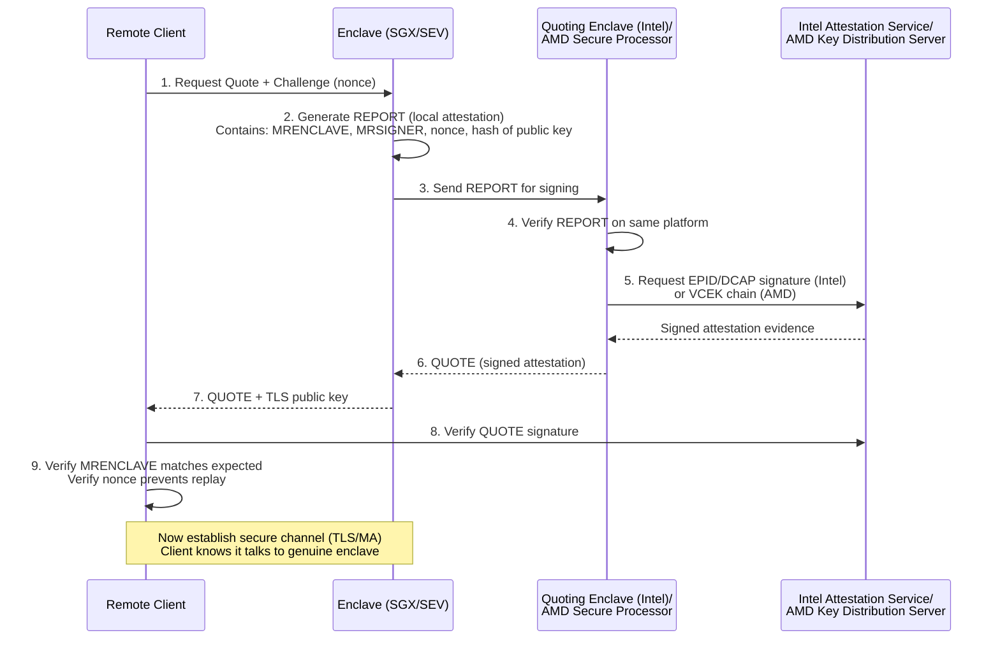

# Confidential Computing & Trusted Execution Environments (TEE)

## 1. Mục tiêu của Task

Nghiên cứu cơ chế bảo vệ dữ liệu đang xử lý (data-in-use) thông qua Trusted Execution Environments (TEEs), tập trung vào:
- **Intel SGX**: Application-level enclaves với memory encryption
- **AMD SEV**: VM-level encryption với Secure Processor
- **ARM TrustZone**: Dual-world architecture cho mobile/embedded

Mục tiêu là hiểu sâu **bản chất bảo mật hardware**, **các vectơ tấn công thực tế**, và **trade-off** khi triển khai trong production systems.

---

## 2. Bản chất và Cơ chế Hoạt động

### 2.1 Vấn đề cốt lõi: Data-in-Use

Traditional security chỉ bảo vệ **data-at-rest** (mã hóa ổ đĩa) và **data-in-transit** (TLS). **Data-in-use** - dữ liệu trong RAM khi CPU đang xử lý - luôn ở dạng plaintext, tạo "attack window" lớn.

```
┌─────────────────────────────────────────────────────────────┐
│  Data-at-Rest          Data-in-Transit        Data-in-Use   │
│  (Disk Encryption)     (TLS/HTTPS)            (??? Gap)     │
│       🔒                    🔒                    ⚠️         │
└─────────────────────────────────────────────────────────────┘
```

**Confidential Computing** lấp đầy khoảng trống này bằng cách mã hóa memory ngay cả khi CPU truy cập.

### 2.2 Intel SGX: Application-Scoped Enclaves

**Kiến trúc tầng thấp:**

SGX tạo **enclaves** - vùng memory được phân cách với encrypted page cache (EPC). CPU có **Memory Encryption Engine (MEE)** tích hợp thực hiện real-time AES encryption/decryption.

```
┌────────────────────────────────────────────────────────────────┐
│                    Application Process                         │
│  ┌──────────────────┐  ┌────────────────────────────────────┐  │
│  │  Untrusted Code  │  │         Trusted Enclave             │  │
│  │  (Regular Memory)│  │  ┌──────────────────────────────┐   │  │
│  │                  │  │  │   Encrypted Page Cache (EPC)  │   │  │
│  │                  │  │  │   - Code & Data encrypted     │   │  │
│  │                  │  │  │   - CPU decrypts on-the-fly   │   │  │
│  │                  │  │  │   - Measurement (MRENCLAVE)   │   │  │
│  │                  │  │  └──────────────────────────────┘   │  │
│  │                  │  │         Enclave Page Cache            │  │
│  └──────────────────┘  └────────────────────────────────────┘  │
│                                                                │
└────────────────────────────────────────────────────────────────┘
         ↑                                    ↑
    OS/Hypervisor không thể đọc         Chỉ CPU có khóa
```

**Cơ chế then chốt:**

| Thành phần | Chức năng |
|------------|-----------|
| **EPCM** (Enclave Page Cache Map) | Metadata cho từng EPC page - address mapping, permissions |
| **SECS** (SGX Enclave Control Structure) | Enclave metadata, measurement hash |
| **TCS** (Thread Control Structure) | Entry points, state save area |
| **MRENCLAVE** | 256-bit SHA-256 measurement của enclave - identity cryptographic |
| **MRSIGNER** | Identity của entity đã sign enclave |

**EENTER/EEXIT:** Context switch vào/ra enclave có overhead đáng kể (~10,000 cycles) do:
- TLB flush
- Register save/restore  
- Security checks

### 2.3 AMD SEV: VM-Scoped Encryption

AMD SEV tiếp cận ở **VM-level**, không phải application-level như SGX.

**Kiến trúc:**

```
┌──────────────────────────────────────────────────────────────────────┐
│                          Hypervisor                                  │
│  ┌───────────────────┐  ┌───────────────────┐  ┌───────────────────┐ │
│  │   Regular VM      │  │  Encrypted VM     │  │  Encrypted VM     │ │
│  │   (Plaintext)     │  │  (Key: K1)        │  │  (Key: K2)        │ │
│  └───────────────────┘  └─────────┬─────────┘  └─────────┬─────────┘ │
│                                   │                      │           │
└───────────────────────────────────┼──────────────────────┼───────────┘
                                    │                      │
              ┌─────────────────────┴──────────────────────┴───────────┐
              │              AMD Secure Processor (ARM Cortex-A5)       │
              │  ┌──────────────────────────────────────────────────┐  │
              │  │  - AES-128/256 engine                            │  │
              │  │  - Firmware-based key management                 │  │
              │  │  - One key per VM                                │  │
              │  └──────────────────────────────────────────────────┘  │
              └────────────────────────────────────────────────────────┘
```

**Generations:**

| Gen | Features | Bảo vệ | Use case |
|-----|----------|--------|----------|
| **SEV** (2016) | Memory encryption | Chỉ memory | Basic isolation |
| **SEV-ES** (2017) | + Register encryption | Memory + CPU state | Hypervisor compromise |
| **SEV-SNP** (2021) | + Integrity protection | + Replay/remapping protection | Strong isolation |
| **SEV-TIO** (2025) | + Trusted I/O | + Device isolation | GPU/DPU workloads |

**Khác biệt then chốt với SGX:**
- **No EPC limit**: Full system RAM, không giới hạn 128MB/256GB
- **No code changes**: Chạy unmodified VMs
- **Hypervisor là untrusted**: SEV-SNP chống cả malicious hypervisor

### 2.4 ARM TrustZone: Dual-World Architecture

TrustZone chia system thành **Secure World** và **Normal World**.

```
┌─────────────────────────────────────────────────────────────────────┐
│                         Processor                                   │
│  ┌─────────────────────────┐  ┌─────────────────────────────────┐  │
│  │      Normal World       │  │         Secure World             │  │
│  │  ┌─────────────────┐    │  │  ┌─────────────────────────┐     │  │
│  │  │  Rich OS        │    │  │  │  Trusted OS (OP-TEE)    │     │  │
│  │  │  (Linux/Android)│    │  │  │  ┌───────────────────┐  │     │  │
│  │  │                 │    │  │  │  │ Trusted Apps      │  │     │  │
│  │  │                 │    │  │  │  │ - Fingerprint     │  │     │  │
│  │  │                 │    │  │  │  │ - DRM keys        │  │     │  │
│  │  │                 │    │  │  │  │ - Secure payments │  │     │  │
│  │  │                 │    │  │  │  └───────────────────┘  │     │  │
│  │  │                 │    │  │  └─────────────────────────┘     │  │
│  │  │                 │    │  │         TZASC (TZ Address        │  │
│  │  │                 │    │  │         Space Controller)        │  │
│  │  └─────────────────┘    │  └─────────────────────────────────┘  │
│  │         ↑               │                   ↑                   │
│  │   NS-bit = 1            │            NS-bit = 0                 │
│  └─────────────────────────┘  ─────────────────────────────────────┘
│                                                                     │
│  Monitors (SMC instructions) giữa hai world                         │
└─────────────────────────────────────────────────────────────────────┘
```

**SoC-Level Integration:**

TrustZone không chỉ là CPU feature - nó mở rộng đến:
- **TZASC**: Partition DRAM thành secure/non-secure regions
- **TZPC**: Peripheral access control  
- **TrustZone-aware DMA**: Devices chỉ access memory regions phù hợp

---

## 3. Kiến trúc và Luồng Xử lý

### 3.1 Remote Attestation Flow

Attestation là cơ chế **proves to a remote party** rằng enclave chạy trên genuine hardware với expected code.



### 3.2 Memory Encryption Flow (SGX)

```
┌──────────────────────────────────────────────────────────────────────────┐
│                          CPU Core                                        │
│  ┌──────────────────────────────────────────────────────────────────┐   │
│  │  Enclave Execution                                               │   │
│  │  ┌─────────┐    ┌──────────┐    ┌─────────────┐    ┌──────────┐  │   │
│  │  │   PC    │───→│  MMU     │───→│  TLB Miss   │───→│ Page Walk│  │   │
│  │  │         │    │          │    │             │    │          │  │   │
│  │  └─────────┘    └──────────┘    └─────────────┘    └────┬─────┘  │   │
│  │                                                         │        │   │
│  │                              ┌──────────────────────────┘        │   │
│  │                              ↓                                   │   │
│  │  ┌─────────┐    ┌──────────────────┐    ┌──────────────────┐    │   │
│  │  │ Physical│←───│  Memory Encryption │←───│  EPCM Lookup     │    │   │
│  │  │ Address │    │  Engine (MEE)      │    │  (Verify access) │    │   │
│  │  └─────────┘    └──────────────────┘    └──────────────────┘    │   │
│  │                        ↑                                         │   │
│  │                   AES-128-GCM                                    │   │
│  │              Decrypt data from DRAM                              │   │
│  └──────────────────────────────────────────────────────────────────┘   │
└──────────────────────────────────────────────────────────────────────────┘
                                    │
                                    ↓
┌──────────────────────────────────────────────────────────────────────────┐
│                    DRAM (Encrypted for Enclave Pages)                    │
│  ┌────────────────────────────────────────────────────────────────────┐  │
│  │  Line 0: 0x7a3f... (ciphertext)    Line 1: 0x9e2b... (ciphertext) │  │
│  │  Line 2: 0x4c81... (ciphertext)    Line 3: 0xf5d2... (ciphertext) │  │
│  └────────────────────────────────────────────────────────────────────┘  │
└──────────────────────────────────────────────────────────────────────────┘
```

### 3.3 SEV-SNP Reverse Map Table (RMP)

SEV-SNP giới thiệu **RMP** - cấu trúc then chốt cho integrity:

```
┌─────────────────────────────────────────────────────────────────────────┐
│                     SEV-SNP Memory Access Flow                          │
│                                                                         │
│  ┌─────────────┐      ┌──────────────┐      ┌──────────────────────┐   │
│  │  Guest VM   │─────→│  Hardware    │─────→│   DRAM               │   │
│  │  (vCPU)     │      │  Check:      │      │                      │   │
│  │             │      │              │      │  ┌────────────────┐  │   │
│  │  gPA        │      │  1. RMP Check│      │  │ System RAM     │  │   │
│  │  (guest     │      │     - Valid? │      │  │                │  │   │
│  │   physical) │      │     - ASID   │      │  │  Page X:       │  │   │
│  │             │      │       match? │      │  │  Encrypted     │  │   │
│  └─────────────┘      │     - Page   │      │  │  (key for      │  │   │
│                       │       state  │      │  │   this VM)     │  │   │
│                       │              │      │  └────────────────┘  │   │
│                       │  2. If pass: │      │                      │   │
│                       │     Decrypt  │      │                      │   │
│                       │     Access   │      │                      │   │
│                       └──────────────┘      │                      │   │
│                                             └──────────────────────┘   │
│                                                                         │
│  RMP Entry per 4KB page:                                                │
│  ┌────────┬────────┬─────────┬──────────┬─────────┐                     │
│  │ Valid  │ ASID   │ VMPL    │ Page     │ Immutable│                    │
│  │ (1b)   │ (16b)  │ (4b)    │ Size     │ (1b)     │                    │
│  └────────┴────────┴─────────┴──────────┴─────────┘                     │
│                                                                         │
│  Hypervisor cannot: modify RMP, access guest memory, remap pages        │
└─────────────────────────────────────────────────────────────────────────┘
```

---

## 4. So sánh các Lựa chọn

### 4.1 Feature Comparison Matrix

| Feature | Intel SGX | AMD SEV-SNP | ARM TrustZone |
|---------|-----------|-------------|---------------|
| **Granularity** | Application (enclave) | Full VM | Secure World (OS) |
| **Memory Model** | EPC (limited) | Full RAM | Partitioned |
| **Code Changes** | Required (SGX SDK) | None | Secure World development |
| **Trusted Computing Base** | Smallest (enclave only) | Larger (full guest OS) | Medium (Trusted OS) |
| **Performance Overhead** | High (EENTER/EEXIT) | Low (~2-3%) | Context switch cost |
| **Side-channel Resistance** | Weak (numerous attacks) | Moderate | Strong (HW isolation) |
| **Attestation** | EPID/DCAP | VCEK-based | Device-specific |
| **Multi-tenancy** | Complex | Native | Single secure world |

### 4.2 When to use What?

**Chọn Intel SGX khi:**
- Cần **minimal TCB** - chỉ protect critical code paths
- Ứng dụng có thể được partition thành trusted/untrusted
- Running on cloud (Azure, Alibaba Cloud có SGX nodes)
- Use case: Key management, cryptocurrency wallets, DRM

**Chọn AMD SEV khi:**
- Cần lift-and-shift VMs không modify
- Protect against **cloud provider compromise** (zero-trust cloud)
- Large memory workloads (databases, ML training)
- Running confidential containers at scale

**Chọn ARM TrustZone khi:**
- Mobile/embedded systems
- Hardware root of trust cho device authentication
- Secure boot và firmware protection
- Use case: Mobile payments, biometric auth, IoT

---

## 5. Rủi ro, Anti-patterns, và Side-channel Attacks

### 5.1 Known Vulnerabilities & Attack Classes

#### A. Speculative Execution Attacks

| Attack | Target | Mechanism | Impact |
|--------|--------|-----------|--------|
| **Foreshadow (L1TF)** | SGX | L1 cache leak during speculative execution | Extract enclave memory |
| **SGAxe** | SGX | L1D eviction sampling + speculation | Extract attestation keys |
| **CacheOut** | SGX | Cache eviction + speculative load | Selective data leak |
| **SmashEx** | SGX | Async signal handling + speculation | Code injection |

**Bản chất:** CPU speculatively executes code trước khi permission checks complete, leaving traces in cache/tlb có thể bị đo.

#### B. Voltage/Frequency Attacks

**Plundervolt (CVE-2019-11157):**
- Khai thác **undervolting interface** (software-accessible)
- Inject faults vào enclave computation bằng cách giảm voltage
- Có thể corrupt cryptographic operations, leak keys
- Cũng có thể bypass memory safety checks

```
Normal execution:    correct_result = crypto_operation(data)
                                    ↓
Undervolted:         faulty_result  = crypto_operation(data)  ← bit flips
                                    ↓
Differential analysis: Extract key from (correct, faulty) pairs
```

#### C. Software-based Attacks

**Memory Safety Issues trong Enclave:**
- Enclave không magic: code vẫn có thể có buffer overflows
- **SGX-Shield**: ASLR bypasses
- **Cổ điển**: strcpy, sprintf vulnerabilities trong enclave code

**Page Table Side Channels:**
- Untrusted OS controls page tables
- **Controlled-Channel Attacks**: OS có thể track page faults để infer enclave execution flow

```
Attacker observes:
  Page fault at 0x1000 → code path A taken
  Page fault at 0x2000 → code path B taken
  
Infer: Enclave đang xử lý data type X (dựa trên execution pattern)
```

### 5.2 Anti-patterns trong Production

| Anti-pattern | Tại sao nguy hiểm | Giải pháp |
|--------------|-------------------|-----------|
| **OCALL không validate** | Untrusted OS có thể return malicious data | Always sanitize OCALL returns |
| **Sealing với MRSIGNER only** | Any enclave signed by same entity can unseal | Include MRENCLAVE trong policy |
| **Large EPC footprint** | Paging overhead → side channels | Minimize working set |
| **No attestation** | Cannot verify running genuine code | Always verify MRENCLAVE |
| **Debug enclave in production** | Debug enclaves không bảo vệ gì cả | Build release mode only |

### 5.3 Side-channel Mitigations

| Technique | Effectiveness | Cost |
|-----------|---------------|------|
| **Constant-time code** | High (crypto) | Development effort |
| **ORAM (Oblivious RAM)** | Very high | 10-100x slowdown |
| **Data-oblivious execution** | High | 2-10x slowdown |
| **SGX-Step** (controlled execution) | Research only | Extreme slowdown |
| **TSX-based defenses** | Moderate | Transaction aborts |

---

## 6. Khuyến nghị Thực chiến trong Production

### 6.1 Architecture Patterns

#### Pattern 1: Secure Key Vault (SGX)

```
┌─────────────────────────────────────────────────────────────────┐
│                     Application Server                           │
│  ┌──────────────────────────────────────────────────────────┐   │
│  │  Untrusted Component                                     │   │
│  │  - HTTP handlers                                         │   │
│  │  - Business logic                                        │   │
│  │  - Database queries                                      │   │
│  │                                                          │   │
│  │  ┌──────────────────────────────────────────────────┐   │   │
│  │  │  Enclave (SGX)                                   │   │   │
│  │  │  - Private key storage                           │   │   │
│  │  │  - Signing operations                            │   │   │
│  │  │  - Decryption of sensitive fields                │   │   │
│  │  │  - Sealed data persistence                       │   │   │
│  │  └──────────────────────────────────────────────────┘   │   │
│  │                       ↑                                  │   │
│  │              ECALL (enter) / OCALL (exit)                │   │
│  └──────────────────────────────────────────────────────────┘   │
└─────────────────────────────────────────────────────────────────┘
```

**Best practice:** Enclave chỉ chứa cryptographic operations và key material. Business logic stays outside.

#### Pattern 2: Confidential VM (SEV-SNP)

```
┌─────────────────────────────────────────────────────────────────┐
│                    Cloud Provider Infrastructure                │
│  ┌──────────────────────────────────────────────────────────┐   │
│  │  Untrusted Hypervisor                                    │   │
│  │  - Cannot access VM memory (encrypted)                   │   │
│  │  - Cannot modify VM state (SNP integrity)                │   │
│  │                                                          │   │
│  │  ┌──────────────────────────────────────────────────┐   │   │
│  │  │  Confidential VM                                 │   │   │
│  │  │  - Full Linux kernel                             │   │   │
│  │  │  - PostgreSQL/MySQL                              │   │   │
│  │  │  - Application code (no changes needed)          │   │   │
│  │  │  - Remote attestation on boot                    │   │   │
│  │  └──────────────────────────────────────────────────┘   │   │
│  └──────────────────────────────────────────────────────────┘   │
└─────────────────────────────────────────────────────────────────┘
```

**Best practice:** Use for databases, AI/ML training, multi-tenant SaaS.

### 6.2 Deployment Checklist

**Pre-deployment:**
- [ ] Enclave measurement (MRENCLAVE) documented và pinned
- [ ] Attestation verification code tested
- [ ] Side-channel analysis cho cryptographic paths
- [ ] Fail-closed: Enclave không khởi động nếu attestation fails
- [ ] Debug mode disabled (ISVPRODID = 1)

**Runtime:**
- [ ] Monitoring: EPC usage, page faults, EEXIT frequency
- [ ] Alert on unexpected OCALL patterns
- [ ] Rotate sealed data encryption keys periodically
- [ ] Backup strategy cho sealed data (keys bound to enclave)

### 6.3 Tooling Recommendations

| Purpose | Tool | Platform |
|---------|------|----------|
| LibOS (unmodified apps) | Gramine | SGX |
| Go enclaves | EGo | SGX |
| Rust enclaves | Teaclave/Enarx | SGX/SEV |
| Confidential Containers | Confidential Containers (CoCO) | SEV-SNP |
| Remote attestation | Intel DCAP / AMD SEV-SNP toolstack | Both |
| Side-channel detection | Microwalk, CacheQuery | Research |

---

## 7. Kết luận

**Bản chất của Confidential Computing:**

1. **Hardware-rooted trust**: Bảo mật dựa trên keys fused trong silicon, không extractable
2. **Memory encryption at speed**: AES engine trong memory controller, transparent to software
3. **Attestation chain**: From hardware to application, verifiable by remote parties

**Trade-off chính:**

| Yếu tố | Security ↑ | Usability ↓ |
|--------|-----------|-------------|
| Smaller TCB (SGX) | ✅ Stronger | ❌ Harder to develop |
| Larger TCB (SEV) | ⚠️ Larger surface | ✅ Lift-and-shift |
| Side-channel resistance | ⚠️ Ongoing battle | ❌ Performance cost |

**Rủi ro lớn nhất:**
- **Side-channel attacks** là reality, không phải theory. Spectre-class attacks liên tục evolve.
- **Attestation key compromise** (như SGAxe) erodes toàn bộ ecosystem trust.
- **Development complexity** dẫn đến bugs trong enclave code itself.

**Khi nào nên dùng:**
- Multi-tenant cloud với sensitive data
- Regulatory requirements (GDPR data protection, financial)
- Zero-trust architecture (don't trust cloud provider)

**Khi nào KHÔNG nên dùng:**
- Single-tenant dedicated hardware
- Performance-critical paths (trừ khi optimized)
- Không có expertise để làm đúng attestation và side-channel defense

---

## 8. Tài liệu Tham khảo

1. Intel SGX SDK Documentation - https://software.intel.com/sgx
2. AMD SEV-SNP Firmware ABI Specification (56860.pdf)
3. Plundervolt Attack - https://plundervolt.com/
4. CacheOut/SGAxe - https://cacheoutattack.com/
5. Gramine Project - https://gramineproject.io/
6. EGo Framework - https://docs.edgeless.systems/ego
7. Confidential Computing Consortium - https://confidentialcomputing.io/
