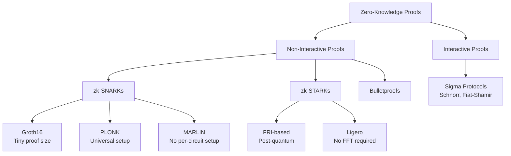
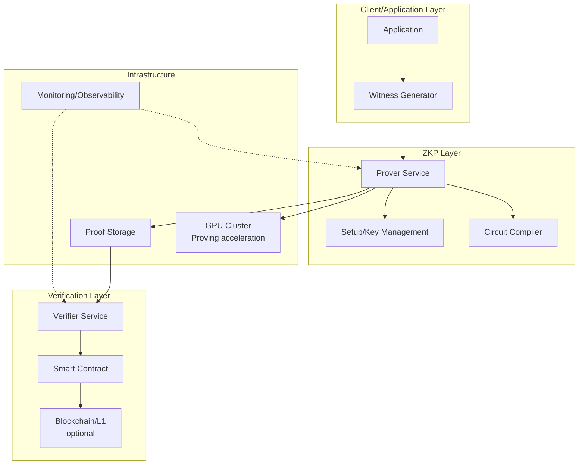

# Zero-Knowledge Proofs in Production

## 1. Mục tiêu của Task

Nghiên cứu bản chất, cơ chế hoạt động, trade-off và các vấn đề production của Zero-Knowledge Proofs (ZKPs) - công nghệ cho phép chứng minh tính đúng đắn của một statement mà không tiết lộ thông tin bí mật. Tập trung vào:
- zk-SNARKs và zk-STARKs - hai phương pháp phổ biến nhất trong production
- Privacy-preserving KYC/AML và anonymous credentials
- Circuit design, trusted setup và các thách thức deployment thực tế

---

## 2. Bản Chất và Cơ Chế Hoạt Động

### 2.1 Định nghĩa Chính xác

Zero-Knowledge Proof là một giao thức tương tác (hoặc non-interactive) giữa **Prover** (ngườichứng minh) và **Verifier** (ngườiverify) thỏa mãn 3 tính chất:

| Tính chất | Định nghĩa | Ý nghĩa Production |
|-----------|------------|-------------------|
| **Completeness** | Nếu statement đúng và prover trung thực, verifier luôn chấp nhận | Đảm bảo hệ thống không từ chối ngườidùng hợp lệ |
| **Soundness** | Nếu statement sai, prover gian lận không thể thuyết phục verifier | Bảo vệ chống fake proof |
| **Zero-Knowledge** | Verifier không học được gì ngoài tính đúng đắn của statement | Đảm bảo privacy thực sự |

### 2.2 Phân loại ZKPs trong Production



### 2.3 zk-SNARKs - Cơ chế Sâu

#### Bản chất Toán học

zk-SNARKs (Zero-Knowledge Succinct Non-Interactive Argument of Knowledge) dựa trên:

**1. Quadratic Arithmetic Programs (QAP)**
- Circuit logic được biến đổi thành hệ phương trình đa thức
- R1CS (Rank-1 Constraint System): mỗi constraint dạng `A × B = C`
- QAP: Chuyển R1CS thành đa thức để sử dụng polynomial commitment

```
Ví dụ đơn giản: Proving x * y = z

R1CS Constraints:
- Constraint 1: x * y = z (trực tiếp)

QAP Transformation:
- Tạo các đa thức A(x), B(x), C(x) sao cho:
  A(x) * B(x) - C(x) = H(x) * Z(x)
  (Z(x) là vanishing polynomial, roots tại evaluation points)
```

**2. Elliptic Curve Pairings**
- Sử dụng pairing-friendly curves: BN254, BLS12-381
- Pairing: `e: G1 × G2 → GT` (bilinear map)
- Cho phép verifier kiểm tra proof mà không cần witness

**3. Trusted Setup**

> **⚠️ Critical Production Risk**: Trusted setup tạo ra "toxic waste" - nếu attacker có access vào randomness ban đầu, họ có thể tạo fake proof.

```
Trusted Setup Process:
1. Generate random secret τ (tau)
2. Compute powers of tau: [τ]G, [τ²]G, [τ³]G, ..., [τⁿ]G
3. Delete τ (toxic waste)
4. Distribute proving/verification keys

Multi-Party Computation (MPC) Setup:
- N participants contribute randomness ri
- Final τ = τ₁ × τ₂ × ... × τₙ
- An toàn nếu 1 participant trung thực và xóa ri
```

**4. Proof Generation & Verification**

```
Proving Process:
1. Witness → R1CS constraints satisfaction check
2. R1CS → QAP polynomial construction
3. Commit to polynomials using KZG (Kate-Zaverucha-Goldberg)
4. Generate proof: π = (commitments, evaluation proofs)

Proof Structure (Groth16):
- 3 elliptic curve points (G1, G1, G2)
- Size: ~200 bytes (extremely compact)
- Verification: 3 pairings + few multiplications
```

### 2.4 zk-STARKs - Cơ chế Sâu

#### Bản chất Toán học

zk-STARKs (Zero-Knowledge Scalable Transparent Argument of Knowledge) khác biệt ở:
- **Transparent**: Không cần trusted setup
- **Scalable**: Prover time quasilinear, verifier time polylogarithmic
- **Post-quantum**: Dựa trên hash functions, không dùng elliptic curves

**1. Algebraic Intermediate Representation (AIR)**
- Execution trace được biểu diễn như ma trận
- Transition constraints: quy tắc chuyển trạng thái hợp lệ
- Boundary constraints: giá trị đầu vào/đầu ra

**2. Fast Reed-Solomon IOP of Proximity (FRI)**

```
FRI Commitment Scheme:
1. Prover commits to execution trace polynomial f(x)
2. Verifier queries random points
3. Prover provides Merkle proofs cho evaluations
4. Recursive folding giảm degree của polynomial
5. Final check: low-degree polynomial verification

Commitment: Merkle tree của Reed-Solomon codeword
No elliptic curves → quantum resistant
```

**3. STARK Structure**

```
STARK Proof Components:
├── Trace commitment (Merkle root)
├── Constraint commitment (Merkle root)  
├── Composition polynomial commitment
├── FRI layers (Merkle roots tại mỗi folding layer)
├── Query responses (Merkle paths)
└── Randomness (Fiat-Shamir transcript)

Proof size: 50-500KB (lớn hơn SNARKs ~1000x)
Verification: O(log²n) field operations
```

### 2.5 So sánh Chi tiết: SNARKs vs STARKs

| Khía cạnh | zk-SNARKs (Groth16) | zk-STARKs | Production Implication |
|-----------|---------------------|-----------|----------------------|
| **Proof Size** | ~200 bytes | 50-500 KB | SNARKs tốt cho on-chain, STARKs cho off-chain |
| **Verification Time** | ~2-3ms | ~10-100ms | SNARKs phù hợp high-throughput systems |
| **Prover Time** | ~1-10s (circuit phức tạp) | ~1-30s | STARKs có overhead prover lớn hơn |
| **Trusted Setup** | Required (per-circuit hoặc universal) | None | STARKs ưu việt về security audit |
| **Post-Quantum** | No (ECC-based) | Yes (hash-based) | STARKs future-proof trước quantum threat |
| **Cryptographic Assumptions** | Strong (pairing, q-PKE) | Weak (collision-resistant hash) | SNARKs có attack surface lớn hơn |
| **Circuit Compilation** | Complex (R1CS/QAP) | Moderate (AIR/Algebraic) | STARKs có toolchain đơn giản hơn |
| **Recursion Support** | Yes (with cycles of curves) | Yes (native) | STARKs recursion hiệu quả hơn |

---

## 3. Kiến trúc Production System

### 3.1 High-Level Architecture



### 3.2 Circuit Design - Nghệ thuật và Khoa học

#### Constraint Efficiency

> **🔴 Production Pitfall**: Mỗi constraint trong ZK circuit là một phép nhân trong finite field. Circuit phức tạp = prover time tăng theo cấp số nhân.

```
Circuit Optimization Techniques:

1. Constraint Reduction:
   - Lookup tables (PLONK, PLOOKUP): Giảm constraints cho range checks
   - Custom gates: Specialized constraints cho phép toán phổ biến
   - Wire optimization: Minimize số lượng wires giữa gates

2. SNARK-friendly Algorithms:
   - SHA-256 → Poseidon/Pedersen hash (fewer constraints)
   - ECDSA → EdDSA hoặc Schnorr signatures
   - Avoid: bitwise operations, floating point, division

3. Parallelization:
   - Divide circuit thành sub-circuits
   - Recursive proof composition
   - Distributed proving across GPU cluster
```

#### Circuit Language/Framework

| Framework | Target | Production Maturity | Notes |
|-----------|--------|---------------------|-------|
| **Circom** | SNARKs | High | DSL chuyên dụng, extensive library |
| **Noir** | Universal | Medium | Rust-like, Aztec Labs |
| **Cairo** | STARKs | High | StarkWare native |
| **Halo2** | SNARKs | High | Zcash, recursive proofs |
| **G KR** | SNARKs/STARKs | Medium | General-purpose, Python-like |

### 3.3 Trusted Setup Ceremony - Production Checklist

```
MPC Ceremony Best Practices:

1. Participant Selection:
   - Geographic diversity
   - Organizational diversity (competitors, regulators, academics)
   - Technical capability verification
   - Background check cho high-stakes ceremonies

2. Ceremony Logistics:
   - Air-gapped machines (no network during contribution)
   - Hardware security modules (HSMs) cho key storage
   - Publicly verifiable transcripts
   - Multiple communication channels

3. Verification:
   - Transcript verification bởi independent parties
   - Homomorphic verification của contributions
   - Public ceremony playback

4. Contingency:
   - Abort nếu participant không xóa entropy đúng cách
   - Ceremony size: 10-100+ participants cho critical systems
```

---

## 4. Use Cases trong Production

### 4.1 Privacy-Preserving KYC/AML

**Problem Statement**: Financial institutions cần verify khách hàng đủ tuổi/thuộc jurisdiction hợp lệ mà không lưu/store PII.

```
ZKP-Based KYC Flow:

1. User có credential từ Government ID (signed by authority)
2. Circuit proves: 
   - Signature valid (không reveal public key)
   - Age > threshold (không reveal birth date)
   - Country ∈ whitelist (không reveal specific country)
   - Credential chưa revoked (không reveal revocation list)
3. Proof được verify bởi service provider
4. Service provider chỉ biết "user hợp lệ", không có PII
```

**Trade-offs**:
- ✅ Privacy: No PII storage, GDPR compliant by design
- ✅ Security: Cryptographic guarantee, không phụ thuộc security của central DB
- ❌ Complexity: Circuit design cho mỗi jurisdiction/policy
- ❌ Revocation: Managing credential revocation lists trong ZK context

### 4.2 Anonymous Credentials (Selective Disclosure)

**Problem Statement**: User cần prove membership/quyền truy cập mà không reveal identity.

```
Anonymous Credential Flow (BBS+ Signatures + ZKPs):

Credential Structure:
- Signed by Issuer: (user_secret, attribute1, attribute2, ..., attributeN)
- User có private key tương ứng với commitment trong credential

Selective Disclosure Proof:
1. Prove knowledge of: user_secret (blind signature)
2. Prove: signature valid từ trusted issuer
3. Reveal: [attribute2, attribute5] (selective)
4. Hide: [attribute1, attribute3, attribute4...] + user_secret

Applications:
- Anonymous voting (prove eligibility, không reveal vote choice)
- Age verification (prove 18+, không reveal birthdate)
- Subscription access (prove active subscription, không reveal user ID)
```

### 4.3 Private Transactions (Confidential Transfers)

**Problem Statement**: Blockchain transparency là double-edged sword - cần verify transaction validity mà không reveal amounts/addresses.

```
ZCash-style Confidential Transaction:

Circuit Constraints:
1. Input commitments = Output commitments + Fee (conservation)
2. Each input có valid signature (spending authority)
3. No negative amounts (range proofs)
4. No double-spending (nullifiers unique)

Pedersen Commitments:
- Commit(v, r) = v×G + r×H
- Homomorphic: Commit(v1,r1) + Commit(v2,r2) = Commit(v1+v2, r1+r2)
- Binding + Hiding

Range Proofs (Bulletproofs):
- Prove 0 ≤ amount < 2^64 trong ZK
- ~700 bytes cho 64-bit range proof
- Logarithmic verification time
```

---

## 5. Rủi ro, Anti-Patterns và Lỗi Thường Gặp

### 5.1 Critical Security Risks

#### Risk 1: Side-Channel Leaks

```
Vulnerability: Prover time có thể leak information về witness

Example:
- Circuit có conditional branch: if (secret > 100) { heavy_computation() }
- Attacker measure proving time → infer secret range

Mitigation:
- Constant-time circuit design
- Dummy operations để equalize execution paths
- Hardware-level side-channel protection (no shared CPU/cache)
```

#### Risk 2: Replay Attacks

```
Vulnerability: Valid proof có thể được replay nhiều lần

Mitigation:
- Include unique nonce/nullifier trong statement
- Timestamp validation
- One-time verification (mark as spent on-chain)
```

#### Risk 3: Parameter Tampering

```
Risk: Malicious circuit parameters cho phép backdoor

Example:
- Circuit compiler injects hidden constraint
- Allows prover tạo valid proof cho invalid statement

Mitigation:
- Open-source circuit code audit
- Formal verification của critical circuits
- Multi-party review trước deployment
```

### 5.2 Anti-Patterns

| Anti-Pattern | Tại sao Sai | Giải pháp |
|--------------|-------------|-----------|
| **Trusted setup một ngườ** | Single point of failure, có thể tạo fake proof | MPC ceremony với nhiều participants |
| **Hardcoded circuit parameters** | Khó audit, dễ bị tamper | Parameter generation có thể reproduce và verify |
| **No proof verification logging** | Khó debug khi có issues | Log tất cả verification attempts (not content) |
| **Synchronous proving API** | Blocking, poor throughput | Async queue-based proving service |
| **No rate limiting** | Resource exhaustion attacks | Rate limit per user/IP, cost throttling |
| **Plaintext witness logging** | Leak sensitive data | Never log witness, only proof hash |

### 5.3 Edge Cases và Failure Modes

```
Edge Case 1: Integer Overflow
- Circuit arithmetic modulo prime p
- 2^256 operations có thể overflow mà không detect
- Solution: Range checks cho mọi arithmetic operation

Edge Case 2: Invalid Curve Points
- Malformed elliptic curve points trong proof
- Can cause implementation-specific behavior
- Solution: Point validation trước verification

Edge Case 3: Frozen Proofs
- Long-running proof generation bị interrupt
- Partial state có thể leak information
- Solution: Stateless proving, atomic operations

Edge Case 4: Parameter Degradation
- Proof system parameters (curve, hash) bị cryptanalysis
- Quantum computing threat
- Solution: Cryptographic agility, upgrade paths
```

---

## 6. Khuyến nghị Thực chiến trong Production

### 6.1 Architecture Patterns

```
Recommended Production Architecture:

┌─────────────────────────────────────────────────────────────┐
│                    Load Balancer / API Gateway               │
└───────────────────────┬─────────────────────────────────────┘
                        │
        ┌───────────────┼───────────────┐
        │               │               │
┌───────▼──────┐ ┌──────▼──────┐ ┌──────▼──────┐
│   Prover     │ │   Prover    │ │   Prover    │
│   Instance 1 │ │  Instance 2 │ │  Instance N │
└───────┬──────┘ └──────┬──────┘ └──────┬──────┘
        │               │               │
        └───────────────┼───────────────┘
                        │
┌───────────────────────▼─────────────────────────────────────┐
│              GPU Cluster (NVIDIA A100/H100)                  │
│         - CUDA-accelerated MSM (Multi-Scalar Mult)          │
│         - FFT acceleration                                  │
│         - Batch proving                                     │
└─────────────────────────────────────────────────────────────┘
                        │
┌───────────────────────▼─────────────────────────────────────┐
│              Distributed Storage (Proof Cache)               │
└─────────────────────────────────────────────────────────────┘
```

### 6.2 Performance Optimization

```
Prover Optimization:

1. Hardware:
   - NVIDIA A100/H100 cho MSM operations
   - High-bandwidth memory (HBM) cho large circuits
   - NVMe SSD cho fast witness I/O

2. Software:
   - icicle: CUDA-accelerated MSM and NTT
   - bellperson: GPU-accelerated Groth16
   - rapidsnark: Fast WASM proving

3. Batching:
   - Prove n statements trong 1 proof (aggregate)
   - Recursive proof composition
   - Amortize setup cost across multiple proofs

4. Caching:
   - Cache intermediate computation results
   - Reuse proving keys
   - Precompute lookup tables
```

### 6.3 Monitoring và Observability

```
Key Metrics:

1. Proving Metrics:
   - proof_generation_time_seconds (histogram)
   - proof_generation_errors_total (counter)
   - circuit_constraints_total (gauge)
   - gpu_utilization_percent (gauge)

2. Verification Metrics:
   - proof_verification_time_seconds (histogram)
   - proof_verification_failures_total (counter)
   - verification_queue_size (gauge)

3. Business Metrics:
   - proofs_generated_total (counter)
   - proofs_verified_total (counter)
   - unique_provers (gauge)

Alerts:
- proof_generation_time > threshold (resource exhaustion)
- verification_failures spike (attack or bug)
- gpu_utilization > 95% (capacity planning)
```

### 6.4 Security Checklist

```
Pre-Deployment Security Audit:

□ Circuit formal verification (nếu có thể)
□ Trusted setup transcript verification
□ Side-channel analysis (timing, power, EM)
□ Penetration testing của proving/verification APIs
□ Dependency audit (supply chain security)
□ Parameter generation audit
□ Emergency response plan (parameter compromise)

Ongoing Security:
□ Monitor for cryptographic breakthroughs
□ Quarterly security reviews
□ Bug bounty program
□ Incident response drills
```

### 6.5 Tooling Recommendations

| Category | Tool | Purpose |
|----------|------|---------|
| **Circuit Dev** | Circom, Noir | Circuit design and compilation |
| **Formal Verification** | GKR, Ecne | Mathematical proof of circuit correctness |
| **Proving** | rapidsnark, snarkjs | Production proving |
| **GPU Accel** | icicle, bellperson | CUDA-accelerated operations |
| **Verification** | arkworks, substrate | On-chain/off-chain verification |
| **Monitoring** | Prometheus, Grafana | Metrics và alerting |

---

## 7. Kết luận

### Bản chất của ZKPs trong Production

Zero-Knowledge Proofs là **cryptographic primitive** cho phép verify computation mà không reveal input. Bản chất của nó trong production là sự **trade-off giữa privacy, performance và complexity**:

| Aspect | Reality |
|--------|---------|
| **Privacy** | ZKPs cung cấp mathematical guarantee của privacy - không phải policy-based |
| **Performance** | Proving là computationally expensive (~seconds đến ~minutes), verification là cheap (~milliseconds) |
| **Complexity** | Circuit design requires specialized expertise; bugs có thể compromise cả hệ thống |
| **Trust Model** | SNARKs require trusted setup trust assumptions; STARKs offer transparency với cost của proof size |

### Khi nào nên dùng ZKPs

✅ **Nên dùng khi**:
- Cần prove statements về private data (KYC, credentials)
- Cross-party verification mà không reveal business logic
- Blockchain scalability (rollups, validiums)
- Regulatory compliance mà không data aggregation

❌ **Không nên dùng khi**:
- Data không sensitive (overkill)
- Real-time requirements (proving latency too high)
- Resource constraints (proving requires significant compute)
- Simple problems có giải pháp đơn giản hơn (MPC, TEE)

### Lời khuyên Cuối cùng

> **ZKP không phải silver bullet**. Nó là công cụ mạnh cho specific use cases nhưng đi kèm với complexity đáng kể. Trước khi adopt, hãy đánh giá kỹ:
> - Can the problem be solved with simpler cryptography (signatures, commitments)?
> - Is the proving overhead acceptable for your use case?
> - Do you have expertise to audit and maintain ZK circuits?
> - What is your upgrade path when better proof systems emerge?

---

## 8. Code Reference (Optional - Minimal)

### Minimal Circom Example: Age Verification

```circom
// age_verification.circom
// Prove: birth_year <= current_year - 18 (user is 18+)
// Without revealing: actual birth_year

template AgeVerification() {
    signal input birth_year;
    signal input current_year;
    signal output is_adult;
    
    // Constraint: birth_year <= current_year - 18
    // Equivalent to: birth_year + 18 <= current_year
    signal age_check <== current_year - birth_year;
    
    // Range proof: age_check >= 18
    component gte = GreaterEqThan(16); // 16-bit comparison
    gte.in[0] <== age_check;
    gte.in[1] <== 18;
    
    is_adult <== gte.out;
    is_adult === 1; // Must be true
}

component main = AgeVerification();
```

> **Giải thích**: Circuit này prove user đủ 18 tuổi mà không reveal birth_year thực tế. `GreaterEqThan` là component tiêu chuẩn từ Circomlib thực hiện range check trong ZK.

---

*Document version: 1.0*  
*Last updated: 2025-03-27*  
*Research focus: Production deployment concerns, not theoretical foundations*
